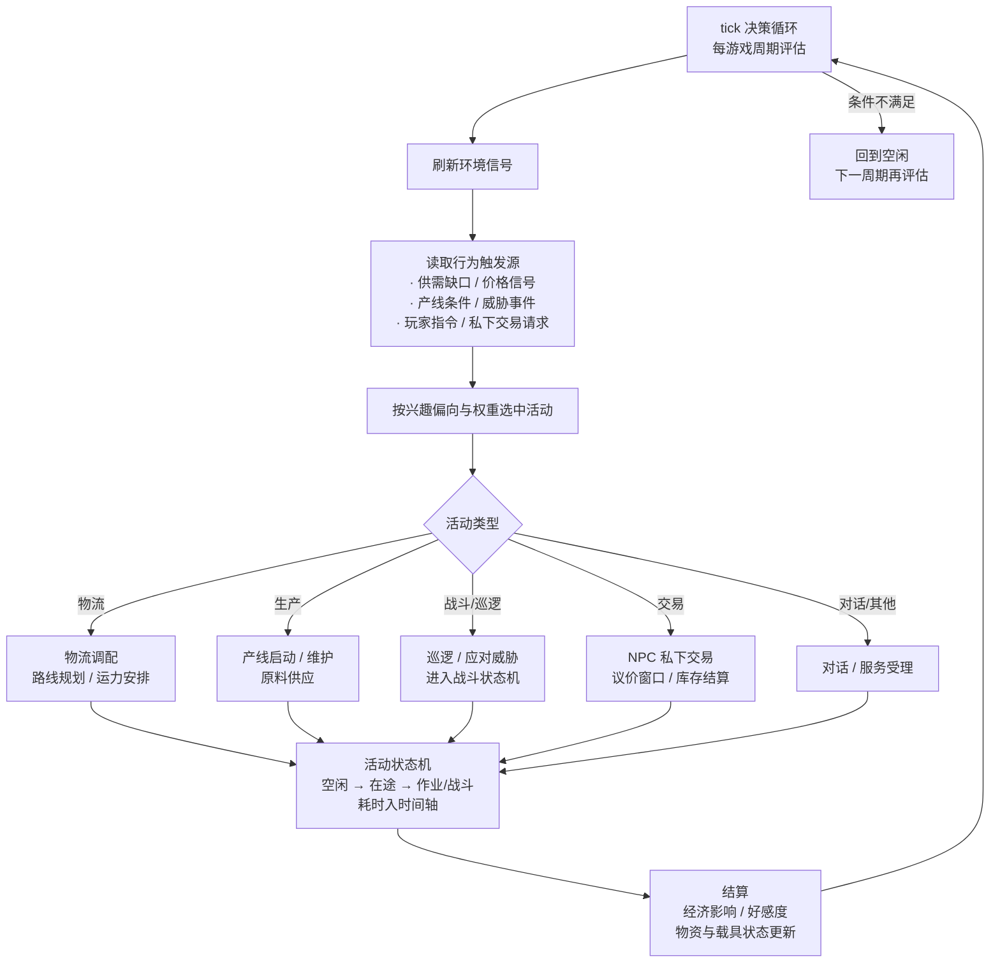

# NPC 系统设计书 · 大纲（待细化）

> **状态**：大纲定稿（2026-08-31），正文细化待用户确认；2026-09-04 修订——基地服务与 NPC 服务分离、兴趣偏向替代类型区分、可交易 NPC 改为私下交易、状态机改 mermaid
> **原则**：**不参考现行代码实现**，回归设计文档中已出现的 NPC 动态活动与行为引用（物流、经济行为、自动生产、队友、好感度、组织归属）
> **范围**：NPC 构成、动态活动、行为机制、动态运行逻辑、指令、联动；附录为组织系统初步概念设计

## §1 概述

- **设计目标**：把散落在 [经济系统设计书](../设计文档/经济系统设计书.md)、[制造生产系统设计书](../设计文档/制造生产系统设计书.md)、[战斗系统设计书](../设计文档/战斗系统设计书.md)、[世界场景设计书](../设计文档/世界场景设计书.md) 中的 NPC 行为引用收拢成统一体系，支撑物流运输、自动生产、NPC 私下交易与 NPC 好感度等机制的运行。
- **设计原则**：NPC 不是静态数据而是**动态运行的角色**；行为由时间轴 tick 驱动；不引入"寿命"，NPC 状态仅含活动状态与载具/资源状态。

## §2 NPC 构成：基地服务与兴趣偏向

### 2.1 基地服务 ≠ NPC 服务

- **明确分工**：市场、维修、军需、存储等**服务是基地的指令功能**，由基地服务层指令承载（场景指令 `shop`／`repair` 等，任务接取/交付同样归入基地服务层），**不是 NPC 的功能**。
- NPC 是**角色**而非设施：它们不负责也不替代基地设施运转；NPC 能提供的是**角色性交互**——对话、私下交易、任务受理、好感度、情报、随行等活动。
- 因此**取消"服务型 NPC"概念**，不再存在"站桩商店 NPC"；正文细化时同步清理 [世界场景设计书](../设计文档/世界场景设计书.md) 中把基地服务挂在 NPC 上的表述。

### 2.2 兴趣偏向（替代类型区分）

参照 [玩家成长设计书 §2 五维技能](../设计文档/玩家成长设计书.md#L89-L160) 的知识/操作/导航/工艺/社会五维，为每个 NPC 配置**兴趣偏向分布**（各维度权重），**同时通过职业来进行一定程度的类型区分**：

| 偏向维度 | 对应行为与活动 | 典型角色样本（仅示例，非分类） |
|----------|----------------|--------------------------------|
| 知识（战斗认知） | 巡逻、侦察、护卫、战斗、战术支援 | 前线侦察员、战友、哨兵 |
| 操作（工程·回收·工业） | 采矿、回收、损管、野外作业 | 矿工、拾荒者、机械师 |
| 导航（机动·行军·货运） | 运输、跑商、路线维护、物流走货 | 运输司机、信使 |
| 工艺（制造机制） | 产线维护、工匠制造、修理 | 工匠、产线技工 |
| 社会（市场·组织·NPC） | 交易、情报、组织事务、任务发布 | 情报贩子、联络人、组织专员 |

- **偏向决定**：NPC 的兴趣偏向决定其**自发行为、活动内容与可接受的交互类型**（对话话题、交易意愿、任务受理、队友属性等），角色定位由偏向**自然涌现**而非标签指定——如"高导航 + 中操作"者表现为常跑运输、偶尔野外回收。
- **偏向 vs 类型的关系**：旧大纲中的物流/生产/战斗 NPC 等描述退化为**角色样本**（说明性示例），不作为系统分类字段；正文细化时按偏向重新刻画各基地 NPC。
- **不可见性（预留）**：NPC 兴趣偏向初始不显式展示给玩家，通过对话/交易/好感度逐步揭示（细化正文时决定）。

### 2.3 可交易 NPC（私下交易）

- **定位修正**：可交易 NPC **不是市场订单主要来源（相当于散户）**。市场订单（自由订单）是交易中心/市场机制，主要由组织发布；可交易 NPC 指与玩家进行**私下交易**的角色——一对一讨价还价、以物易物、情报/稀缺物资交换（如拾荒者出手捡到的好货、情报贩子以情报换物资）。
- **与市场订单的区别**（正文细化展开）：市场订单=基地市场机制、明牌挂单、价格由供需系统计算；NPC 私下交易=个人行为、议价空间大、价格带个人差异、受 NPC 库存与意愿影响、重复交易积累信任。
- **关联同步**：此定位与 [经济系统设计书 §4.6](../设计文档/经济系统设计书.md#L653-L699)（可交易 NPC 为市场订单来源）**不一致**，正文细化时双向同步修正经济书表述（见待定要点）。

## §3 动态活动系统

- 3.1 **活动表与调度框架**：活动类型 / 触发条件 / 周期 / 参与者 / 耗时 / 结算。
- 3.2 **物流运输活动**：供需缺口 → 调配路线 → 运力（NPC 载具）→ 影响储备与价格。
- 3.3 **经济行为活动**：囤积（收购并持有）、抛售（事件/恐慌触发）、影响供需状态与价格波动（[经济示例：运输司机囤积/矿工抛售](../设计文档/经济系统设计书.md#L641-L647)）。
- 3.4 **自动化生产活动**：NPC 建立产线、维护原料供应、产品进入经济系统（[制造 §2.4](../设计文档/制造生产系统设计书.md#L161-L165)）。
- 3.5 **巡逻与保卫活动**：据点/矿区/补给线威胁响应，防虫群袭扰（对应 H5 采矿站清剿需求）。
- 3.6 **NPC 私下交易活动**（可交易 NPC，§2.3）：
  - **触发**：玩家主动接触（对话切入"交易"）或 NPC 随机场景邂逅（如拾荒者在野外交谈）；由 NPC 兴趣偏向（社会/操作）与当前库存决定是否开启交易。
  - **形式**：一对一议价交易——货币买卖、以物易物、情报/服务交换（情报贩子以线索换物资，工匠接受"带料加工"等）。
  - **价格逻辑**：自由议价，参考市场价带个人差异；NPC 意愿受好感度、供需状态、稀缺度影响（急用高价收、富余低价出）。
  - **库存与信誉**：NPC 个人库存上限（个人携带量而非市场仓库）；重复交易积累信任（好感度 + 交易折扣/解锁更多货品）。
  - **边界**：不产生市场订单、不进入交易中心挂单；正文细化时给出 NPC 交易条目字段与数值草案，并同步 [经济系统设计书 §4.6](../设计文档/经济系统设计书.md#L653-L699)。

## §4 行为机制

- 4.1 **决策权重**：按 NPC **兴趣偏向**（§2.2）与情境的行为概率表（如社会/效率/好奇/避险等行为个性参数，供 §5 决策循环使用）。
- 4.2 **事件响应**：供需事件、环境事件、虫群/叛军威胁事件对当前活动的打断或转向。
- 4.3 **好感度系统**：亲密度数值、互动渠道（对话/交易/护卫/任务）、奖励与解锁（支撑玩家成长"沟通技巧"，[玩家成长 §2.6](../设计文档/玩家成长设计书.md#L164-L177)）。
- 4.4 **状态管理**（不含寿命）：活动状态（空闲/在途/作业/战斗）；载具与资源独立（[战斗 §1.5.2 资源独立](../设计文档/战斗系统设计书.md#L141)）；损毁后的恢复或替换规则。

## §5 动态运行逻辑（核心章节）

- 5.1 **决策循环**：按游戏时间固定周期 tick 驱动——刷新环境信号 → 读取行为触发源 → 按兴趣偏向与权重选中活动 → 进入状态机执行 → 结算 → 返回空闲。
- 5.2 **状态机（流程图）**：

- 5.3 **活动耗时与时间轴**：所有活动耗时推进世界时间（[时间轴系统设计书](../设计文档/时间轴系统设计书.md)），与会话/战斗事件（如 [npc_call 事件](../设计文档/时间轴系统设计书.md#L281)）衔接。
- 5.4 **异常与中断处理**：事件打断（威胁/环境）、载具损毁、目的地失效后活动回退与补偿规则。

## §6 指令设计

> 玩家与 NPC 的交互统一通过对话/信息指令入口（战斗/探索层，[世界场景 §4.7.1](../设计文档/世界场景设计书.md#L556-L566)），与基地服务层指令（`shop`／`trade` 交易中心等，§2.1 已分离）**不混用**。

- `call <npc>` **通信（已有，增强）**：与 NPC 对话，展示其**在岗活动/状态**；话题菜单随兴趣偏向与好感度展开（闲聊 / 交易 / 任务受理 / 招募咨询 / 情报）。
- `look <npc>` **观察（沿用 `look` 增强）**：观察 NPC 外观、装备、随行载具与当前活动；是读取兴趣偏向线索的渠道之一（结合 §2.2 不可见性：偏向初始不直接显示，通过观察/互动逐步揭示）。
- `交易 <npc>` **私下交易（新增，§2.3 / §3.6）**：向可交易 NPC 发起**一对一私下议价**——查看其个人库存与出价 → `出价 / 还价 / 接受 / 拒绝`；价格受好感度与供需状态影响，重复交易积累**交易信誉**（折扣/解锁货品）；**不进入交易中心挂单**，与 `trade`（市场订单）严格区分。
- `查询 <npc>` **信息查询（新增，§4.3 好感度）**：查看 NPC 已揭示的性格信息——好感度数值、交易信誉、关系状态与已解锁话题/互动（未揭示的兴趣偏向不可见）。
- `招募 <npc>` **招募/邀请队友（新增，§2.2 知识偏向 + §4.4）**：邀请 NPC 加入队伍或随行，需满足**好感度门槛 + 兴趣偏向匹配 + 队伍带宽条件**；队友行为沿用 [战斗 §1.5.2](../设计文档/战斗系统设计书.md#L134-L142)（指令响应/自主决策/阵型约束/资源独立）。
- 预留：好感度批量查询、NPC 间关系网络展示（待好感度与组织系统细化，见待定要点）。

## §7 与其他系统联动

| 关联系统 | 联动点 |
|----------|--------|
| 物流（制造 §4） | 物流机制本体归属本设计书，制造仅保留影响视角 |
| 经济系统 | 供需数据驱动、囤积/抛售；**NPC 私下交易**独立于市场订单（非订单来源，见 §2.3，正文细化时同步修订 [经济 §4.6](../设计文档/经济系统设计书.md#L653-L699)） |
| 任务系统 | 护卫/护送类任务受理（对应任务大纲 §5.4） |
| 战斗系统 | 队友行为框架、卫戍、带宽限制 |
| 制造生产 | NPC 自动生产路径、设施归属（见附录） |
| 玩家成长 | 好感度（沟通技巧）、组织任务（组织信任）；兴趣偏向参照五维技能（见 §2.2） |

## §8 附录：组织系统初步概念设计（B6，仅概念层）

- 8.1 **组织实体**：组织 / 基地 / 玩家三类归属（基地初始设施归基地，玩家设施归玩家，未来组织）。
- 8.2 **成员与权限**：组织可与 NPC 组织互动；"组织任务"类目由玩家成长"组织信任"解锁。
- 8.3 **组织资源与设施归属**：落地 [制造 §3.3.4 归属字段](../设计文档/制造生产系统设计书.md#L283-L295)，设施审批机制在此框架下再讨论（暂不设费用与时限）。
- 8.4 **玩家自建组织展望**：阶段规划（成员、资源池、权限），**本轮不实现细节**。
- 8.5 **与现有文档接口**：仅概念框架，不展开为独立设计书；后续如需深化再独立成书。

## 待定要点（细化正文时决定）

1. 兴趣偏向的量化模型与初值（五维权重分布、对行为/交互类型的影响权重表，§2.2）。
2. NPC 私下交易条目字段、议价规则与数值草案（§2.3 / §3.6），并**同步修订 [经济系统设计书 §4.6](../设计文档/经济系统设计书.md#L653-L699)**（可交易 NPC 从"市场订单来源"改为"私下交易"）。
3. 行为触发源的完整清单与权重初值（§4.1 决策权重表骨架）。
4. 活动表字段细节与各活动数值节奏（物流运力、生产窗口概率）。
5. 好感度数值模型与奖励档位。
6. 组织系统的阶段拆分（概念 → 目标 → 实现）。