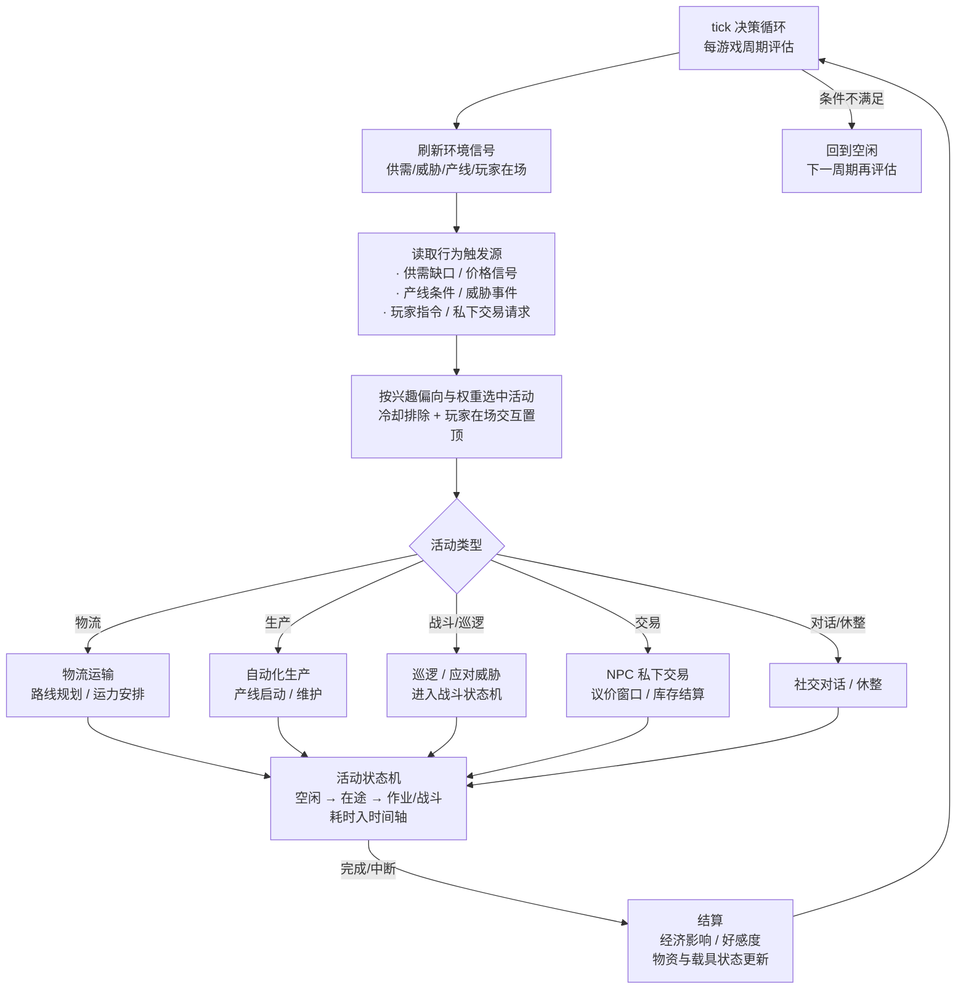

# NPC 系统设计书

> **目录**
>
> - [1 概述](#1-概述)
>
>   - [1.1 设计目标](#11-设计目标)
>
>   - [1.2 设计原则](#12-设计原则)
>
>   - [1.3 与其他系统的关系](#13-与其他系统的关系)
>
> - [2 NPC 构成](#2-npc-构成)
>
>   - [2.1 基地服务与 NPC 服务的边界](#21-基地服务与-npc-服务的边界)
>
>   - [2.2 兴趣偏向体系](#22-兴趣偏向体系)
>
>   - [2.3 职业与角色样本](#23-职业与角色样本)
>
>   - [2.4 可交易 NPC（散户与私下交易）](#24-可交易-npc散户与私下交易)
>
> - [3 动态活动系统](#3-动态活动系统)
>
>   - [3.1 活动表与调度框架](#31-活动表与调度框架)
>
>   - [3.2 物流运输活动](#32-物流运输活动)
>
>   - [3.3 经济行为活动](#33-经济行为活动)
>
>   - [3.4 自动化生产活动](#34-自动化生产活动)
>
>   - [3.5 巡逻与保卫活动](#35-巡逻与保卫活动)
>
>   - [3.6 NPC 私下交易活动](#36-npc-私下交易活动)
>
> - [4 行为机制](#4-行为机制)
>
>   - [4.1 决策权重](#41-决策权重)
>
>   - [4.2 事件响应](#42-事件响应)
>
>   - [4.3 好感度系统](#43-好感度系统)
>
>   - [4.4 状态管理](#44-状态管理)
>
> - [5 动态运行逻辑](#5-动态运行逻辑)
>
>   - [5.1 决策循环](#51-决策循环)
>
>   - [5.2 状态机](#52-状态机)
>
>   - [5.3 活动耗时与时间轴](#53-活动耗时与时间轴)
>
>   - [5.4 异常与中断处理](#54-异常与中断处理)
>
> - [6 指令设计](#6-指令设计)
>
> - [7 与其他系统联动](#7-与其他系统联动)
>
> - [8 附录：组织系统初步概念设计](#8-附录组织系统初步概念设计)
>
>   - [8.1 组织实体与归属](#81-组织实体与归属)
>
>   - [8.2 成员与权限](#82-成员与权限)
>
>   - [8.3 组织资源与设施归属](#83-组织资源与设施归属)
>
>   - [8.4 玩家自建组织展望](#84-玩家自建组织展望)
>
>   - [8.5 与现有文档接口](#85-与现有文档接口)
>
> - [9 暂不实现与待定事项](#9-暂不实现与待定事项)

## 1 概述

### 1.1 设计目标

NPC 系统是织女-7 先遣星球上**所有非玩家角色的统一行为体系**。其目标是把散落在 [世界场景设计书](file:///workspace/设计文档/世界场景设计书.md)、[经济系统设计书](file:///workspace/设计文档/经济系统设计书.md)、[制造生产系统设计书](file:///workspace/设计文档/制造生产系统设计书.md)、[战斗系统设计书](file:///workspace/设计文档/战斗系统设计书.md) 中的 NPC 行为引用收拢为单一体系，使基地与野外呈现"有人生活、有人奔波"的运行感，同时为以下机制提供执行者：

- **物流运输**：供需缺口 → NPC 调配运力，物资在基地与产地之间流动（[制造 §4](file:///workspace/设计文档/制造生产系统设计书.md#L356-L378)）。
- **经济行为**：NPC 作为市场散户参与囤积、抛售，影响供需状态与价格波动。
- **自动化生产**：开发树节点经 NPC 自动运行路径解锁，产线由 NPC 建立与维护（[制造 §6.2.1](file:///workspace/设计文档/制造生产系统设计书.md#L500-L513)）。
- **NPC 私下交易**：玩家与特定 NPC 进行一对一交易、议价与以物易物（§3.6）。
- **好感度**：NPC 与玩家的关系成长，支撑玩家成长"沟通技巧"等玩法。
- **队友与卫戍**：NPC 数字生命可随行作战或驻守据点，承接 [战斗 §1.5.2](file:///workspace/设计文档/战斗系统设计书.md#L134-L142) 的队友行为框架。

> **统一原则（基地服务 vs NPC）**：市场、维修、军需、存储与任务接取/交付等**服务是基地的指令功能**（基地服务层，[世界场景 §4.7](/workspace/设计文档/世界场景设计书.md#L548-L586)），由场景指令清单承载，**不由 NPC 承担**。NPC 是"角色"而非"设施"，其价值在于角色性交互与动态行为（详见 [2.1](#21-基地服务与-npc-服务的边界)）。

### 1.2 设计原则

- **动态运行而非静态数据**：NPC 不是挂在房间里的文本标记，而是拥有活动状态、载具与资源、行为选择的动态角色，由时间轴 tick 驱动其生命周期。
- **兴趣驱动而非类型标签**：NPC 的身份由其**兴趣偏向**（五维，见 §2.2）自然涌现，行为与交互由偏向决定；不设硬性"类型"字段。
- **无寿命、有状态**：不引入 NPC 生死循环（数字生命备份设定下无生物性死亡），状态仅含活动状态、载具/资源状态与关系状态。
- **低负载可运行**：NPC 决策与结算频率受控（定点 tick + 事件驱动），不进行逐帧模拟，避免对 MUD 架构造成不必要开销。
- **不参考现行代码实现**：本设计书从设计文档回推行为体系，仅在世界场景"指令衔接"处沿用现有指令名（`call`、`look`）。

### 1.3 与其他系统的关系

| 关联系统 | 关系说明 |
|----------|----------|
| [世界场景设计书](file:///workspace/设计文档/世界场景设计书.md) | NPC 出现在特殊地点与据点；玩家与 NPC 交互经战斗/探索层指令（`call`/`look`）；基地服务层指令与 NPC 无关（§2.1） |
| [经济系统设计书](file:///workspace/设计文档/经济系统设计书.md) | NPC 的囤积/抛售影响供需与价格；NPC 私下交易独立于交易中心订单（§2.4 / §3.6）；NPC 不构成市场订单主要来源 |
| [制造生产系统设计书](file:///workspace/设计文档/制造生产系统设计书.md) | NPC 自动运行路径解锁开发树节点；物流机制本体归属本设计书（制造仅保留影响视角）；设施归属字段见附录 §8.3 |
| [战斗系统设计书](file:///workspace/设计文档/战斗系统设计书.md) | 队友行为框架（指令响应/自主决策/阵型约束/资源独立/带宽限制）；卫戍与巡逻的战斗表现 |
| [任务系统设计书](file:///workspace/设计文档/任务系统设计书.md) | NPC 受理护卫/护送、组织类任务（对应任务设计书 §5.4）；任务奖励渠道支撑好感度 |
| [玩家成长设计书](file:///workspace/设计文档/玩家成长设计书.md) | 好感度支撑"沟通技巧"；"组织信任"解锁组织任务类目；兴趣偏向参照玩家五维技能（§2.2） |
| [时间轴系统设计书](file:///workspace/设计文档/时间轴系统设计书.md) | 所有 NPC 活动耗时推进世界时间；聊天/事件作为时间轴事件结算（§5.3） |

## 2 NPC 构成

### 2.1 基地服务与 NPC 服务的边界

**基地服务是"设施功能"，NPC 是"角色"**，两者在玩法上明确分工：

| 能力归属 | 内容 | 实现方式 |
|----------|------|----------|
| 基地服务层（设施功能） | 商店（装备库）、交易中心（供需/市场订单）、维修、仓库/机库、制造设施、任务接取/交付、配额补给、意识备份 | 安全区场景指令清单（`shop`、`trade`、`仓库`、`任务`、`备份` 等，[世界场景 §4.7](/workspace/设计文档/世界场景设计书.md#L548-L586)） |
| NPC（角色职能） | 对话与情报、私下交易、任务受理（护卫/护送等）、好感度互动、队友/随行、巡逻与卫戍 | 战斗/探索层指令 + NPC 动态活动（`call`/`look`/`交易`/`查询`/`招募`，§6） |

推论与边界：

- **不制作"站桩商店 NPC"**：没有站在柜台后的服务型 NPC；玩家购买装备走 `shop`，买卖订单走 `trade`，均不需与 NPC 交涉。
- **NPC 锦上添花而非必要设施**：市场、维修等不依赖 NPC 存活可知性；NPC 的消失/外出不影响基地基本功能，只影响角色性玩法。
- **NPC 承载"人味"**：基地的运转由玩家与 NPC 各自承担——玩家行使设施功能，NPC 提供对话、流转、守卫与私下交易等角色体验。

### 2.2 兴趣偏向体系

参照 [玩家成长设计书 §2 五维技能](/workspace/设计文档/玩家成长设计书.md#L89-L160) 的**知识 / 操作 / 导航 / 工艺 / 社会**五个维度，为每个 NPC 配置**兴趣偏向分布**（各维度档位 0–5），作为其行为、活动与可接受交互的统一驱动源。**不再以"类型"作为 NPC 的系统分类字段**。

| 偏向维度 | 对应行为与活动 | 典型角色样本（示例，非分类） |
|----------|----------------|------------------------------|
| 知识（战斗认知） | 巡逻、侦察、护卫、战斗、战术支援 | 侦察兵、战友、哨兵 |
| 操作（工程·回收·工业） | 采矿、回收、损管、野外作业 | 矿工、拾荒者、机械师 |
| 导航（机动·行军·货运） | 运输、跑商、路线维护、物流走货 | 货运司机、信使 |
| 工艺（制造机制） | 产线维护、工匠制造、修理 | 工匠、产线技工 |
| 社会（市场·组织·NPC） | 交易、情报、组织事务、任务发布 | 情报贩子、联络人、组织专员 |

**兴趣偏向的语义**：

- **偏向决定行为**：NPC 的自发活动（§3）从偏向中采样——高导航者常被分派运输，高知识者可承担巡逻/护卫，高社会者参与交易与情报。
- **偏向决定交互**：对话话题、交易意愿、任务受理、随行倾向均由偏向定权（§4.1）。
- **偏向决定角色涌现**：一个 NPC 不必是"物流 NPC"或"战斗 NPC"，其"高导航 + 中操作"之类的组合自然表现为"常跑运输、偶尔野外回收"。两块或以上高偏向叠加时行为更立体。
- **不可见性**：偏向数值初始不直接对玩家显示；通过观察（`look`）、对话（`call`）与交易逐步揭示（§4.3 好感度揭示机制）。玩家成长"沟通技巧"可加速揭示（[玩家成长 §2.6](/workspace/设计文档/玩家成长设计书.md#L164-L177)）。

**数值草案（初值，待平衡）**：

- 档位：**0–5**，0 = 无兴趣，5 = 主要志趣；NPC 主偏向（最高维）通常 ≥ 4。
- 分布：据点 NPC 主偏向近似均匀覆盖五维；野外 NPC 主偏向更集中于操作/导航（生产与运力需求）。
- 玩家可见呈现：不暴露数字，而以短语/倾向描述（如"他总在聊矿区那些事"）随好感度揭示。

### 2.3 职业与角色样本

偏向刻画"志趣"，**职业刻画"岗位"**（基地/据点的功能分工），二者配合构成 NPC 的完整身份。职业提供：对话口吻与职业话题、任务受理范围、可交易货品倾向；兴趣偏向提供：行为活跃度与额外活动选择。

| 职业（示例） | 岗位职能 | 关联偏向 | 提供玩法 |
|--------------|----------|----------|----------|
| 矿工 | 参与采矿作业 | 操作高 | 私下交易矿石/回收物 |
| 货运司机 | 参与物流运输 | 导航高 | 物流活动、护卫/护送任务受理 |
| 侦察兵 | 巡逻与威胁预警 | 知识高 | 情报、随行队友 |
| 工匠/产线技工 | 产线维护与制造 | 工艺高 | 带料加工、部件维修 |
| 情报贩子 | 信息流转 | 社会高 | 情报买卖、线索交换 |
| 联络人 | 组织事务协调 | 社会高 + 组织归属 | 组织任务受理、组织情报 |

> 角色样本为**示例性刻画**，正文后续各基地 NPC 名单按"职业 + 偏向"两栏定义；职业与偏向仅是描述素材，不构成系统分类枚举约束。

### 2.4 可交易 NPC（散户与私下交易）

**定位修正**：可交易 NPC **不是市场订单的主要来源**。交易中心的市场订单（自由订单）是**基地市场机制**，由经济系统与组织发布/撮合；可交易 NPC 相当于市场中的**散户**——以个体身份存在，少量参与市场（如矿工挂一小单矿石），但核心玩法是**与玩家的一对一私下交易**。

| 维度 | 市场订单（交易中心） | NPC 私下交易（§3.6） |
|------|---------------------|----------------------|
| 性质 | 基地市场机制、明牌挂单 | 个体行为、洽谈式交易 |
| 下单方 | 经济系统/组织（组织订单）与散户 NPC（少量） | 玩家 ↔ 具体 NPC |
| 价格 | 供需系统结算，公开透明 | 自由议价、带个人化差异（§3.6 价格逻辑） |
| 库存 | 市场仓库容量 | NPC 个人携带库存（上限低） |
| 关系影响 | 无 | 交易信誉与好感度累积（§4.3） |
| 形式 | 货币交易 | 货币、以物易物、情报/服务交换 |

**私下交易的定位**：可交易 NPC 是星球上各类身份的角色（矿工、拾荒者、工匠、情报贩子等），私下交易是其**角色功能之一**——拾荒者出手捡到的好货，情报贩子以线索换物资，工匠接受带料加工。交易不仅是经济行为，也是**社交与关系培养**的途径。

> **一致性说明**：本设计书将"可交易 NPC 为市场订单主要来源"修正为"散户 + 私下交易"。此表述与 [经济系统设计书 §4.6](/workspace/设计文档/经济系统设计书.md#L653-L703) 原描述存在差异，已记录为同步修订项（见 §9 待定事项），经济书相关段落将按本设计书口径更新。

## 3 动态活动系统

### 3.1 活动表与调度框架

NPC 的一切行为表达为**活动（Activity）**。活动是"一段时间内执行的可结算行为单元"，由调度框架统一管理。

**活动属性（字段）**：

| 字段 | 说明 |
|------|------|
| 活动类型 | 物流运输 / 经济行为 / 自动化生产 / 巡逻保卫 / 私下交易 / 社交对话（§3.2–3.6） |
| 触发条件 | 环境信号（供需缺口、价格信号、产线条件、威胁事件）或玩家请求 |
| 参与者 | 单个或多个 NPC + 载具；部分活动需玩家参与 |
| 周期 | 活动可重复触发的最小间隔（冷却），防空转 |
| 耗时 | 活动入时间轴的时长（段位/公式，§5.3） |
| 结算 | 活动结束时的经济/成长/关系影响（§4.3） |

**调度规则**：

- NPC 同一时刻只执行**一个主要活动**，可被事件中断（§5.4）或叠加"短活动"（如途中对话）。
- 活动按**冷却**避免高频空转；冷却由活动类型与 NPC 所在场景共同决定。
- NPC 处于玩家场景内且玩家在场时，活动**让位于交互**——优先响应 `call`/`交易` 等玩家行为，玩家离开后按 tick 恢复活动。

### 3.2 物流运输活动

**目标**：把供需缺口转化为实际运输行为，保障基地原料供应并平抑价格（[制造 §4.1](/workspace/设计文档/制造生产系统设计书.md#L356-L369)）。

**流程**：供需缺口 → 调度中心拟定调配路线 → NPC 运力（载具）执行运输 → 到货结算（影响储备与价格）。

| 环节 | 说明 |
|------|------|
| 触发信号 | 经济系统供需状态出现缺口（某物资短缺/过剩）；开发树解锁新产地 |
| 任务分配 | 基地调度在空闲且高导航偏好的 NPC 中分配（按偏向定权，§4.1） |
| 路线 | 产地 ↔ 基地/交易中心；途中经过地图房间（可遭遇事件的真实路径） |
| 运力 | NPC 载具容量决定单趟最大运量；容量不足自动拆分为多趟 |
| 结算 | 物资入基地储备、供需缺口回补、执行 NPC 按趟支付报酬（信用点）；运费反映到价格波动（经济书 §4.5 物流修正） |

**数值草案（初值，待平衡）**：

| 项 | 初值 |
|----|------|
| NPC 载具基准运力 | 普通货运车 200 单位/趟，重载车 500 单位/趟 |
| 运输频率 | 同路线冷却 ≥ 4 游戏小时 |
| 运费系数 | 基准 2% 货物价值，随路线危险度上调至 ≤ 10% |
| 运输中断（风险事件） | 沿用制造 §4.3.2 事件表（叛军袭击/虫群阻断/设备故障/气候异常） |

### 3.3 经济行为活动

**目标**：NPC 作为市场参与者表达经济行为，使市场存在"人感"（呼应 [经济示例 4/5](/workspace/设计文档/经济系统设计书.md#L640-L651)）。

| 行为 | 条件 | 表现 | 影响 |
|------|------|------|------|
| 囤积 | 某物资价格低位、预期上涨、NPC 相关职业（如货运司机囤铁矿石） | 主动以市场价格收购并持有 | 基地储备下降 → 触发偏紧状态 → 价格上调 |
| 抛售 | 事件/恐慌触发（威胁事件、产能过剩、现金需求） | 低价批量卖出 | 市场价下调，供需偏宽松 |
| 扫货 | 发现玩家/市场超低价货品 | 小额多单 | 平抑极端价格 |

**约束**：经济行为受 NPC **个人资金与库存上限**约束（非市场仓库容量）；行为频率受冷却控制，避免市场失真。

**数值草案（初值，待平衡）**：囤积/抛售触发评估每游戏日一次；单 NPC 可动用资金为月均收入的 ≤ 30%；行为影响按经济书价格波动公式的"供需修正"通道计入。

### 3.4 自动化生产活动

**目标**：承担开发树节点的 **NPC 自动运行路径**（[制造 §6.2.1](/workspace/设计文档/制造生产系统设计书.md#L500-L513)）：产线由 NPC 建立、维护原料供应、产品进入经济系统。

**运行规则**：

1. **前置检查**（每游戏日）：产品生产前置条件（原料供应达标 + 生产线就绪）是否满足。
2. **概率判定**：满足前置后，每日随机判定是否触发"解锁供应"事件，时间窗口 **5–30 游戏日**（每日判定概率 ≈ 1/剩余窗口天数）。
3. **执行**：判定成功后，NPC 建立产线并投入生产，产品进入经济系统，节点标记解锁。
4. **维护**：产线运行期间的原料补充由物流活动与产线技工（工艺偏向 NPC）维护产线运作；原料断供则产线暂停（机制见制造 §6.2.2）。

**数值草案（初值，待平衡）**：判定窗口 5–30 日；产线停机恢复 = 原料补齐后当天恢复；NPC 维护频率随产线规模（1 名技工 ≤ 3 条产线）。

### 3.5 巡逻与保卫活动

**目标**：据点/矿区/补给线威胁响应，防虫群袭扰与叛军袭击（对应清剿类任务需求）。

| 任务 | 内容 | 参与者 |
|------|------|--------|
| 据点巡逻 | 在据点周围路径点循环巡视 | 知识偏向 NPC（侦察兵/哨兵） |
| 矿区/产地驻守 | 关键资源点附近驻防 | 卫戍 NPC |
| 补给线巡视 | 沿物流干线巡逻，预警风险事件 | 机动小队 |
| 威胁响应 | 触发敌袭时集结、接战或撤离 | 片区所有 NPC |

**表现**：巡逻即 [战斗 §1.5.1](/workspace/设计文档/战斗系统设计书.md#L123-L132) 的敌人分布之外的"友好单位巡逻"——NPC 按路径点移动，遇敌进入战斗状态机（§5.2）。威胁事件会**打断其他活动**（§4.2）并调度接战，战斗能力由 NPC 载具/装备（资源独立）决定。

### 3.6 NPC 私下交易活动

**目标**：兑现 §2.4 的"私下交易"定位——玩家与可交易 NPC 之间的一对一洽谈式交易。

| 要素 | 说明 |
|------|------|
| 触发 | 玩家主动（`交易 <npc>`）或 NPC 场景邂逅（野外 NPC 主动攀谈）；NPC 由其兴趣偏向（社会/操作）与当前库存决定是否开启交易 |
| 交易对象 | 仅在场 NPC；NPC 外出/异地时不可交易（以角色存在为前提） |
| 形式 | 货币买卖、以物易物、情报/服务交换（拾荒者卖好货、情报贩子换线索、工匠带料加工） |
| 库存 | NPC 个人携带库存，上限低（见数值草案）；卖空后等待补给（刷新） |
| 价格逻辑 | 基准参考市场价 ×（1 ± 个人化差异系数）；受好感度与供需状态影响——急用高价收、富余低价出；玩家可议价（`出价/还价/接受/拒绝`） |
| 信誉 | 重复交易积累交易信誉：提高 NPC 让步幅度、解锁更多货品（§4.3） |
| 边界 | **不产生市场订单、不进入交易中心挂单**；与 `trade`（交易中心）机制严格区分 |

**NPC 交易条目数据结构（字段）**：

| 字段 | 说明 |
|------|------|
| 货品表 | 可售/可收物品种类，随职业与偏向（如工匠倾向部件与矿石） |
| 个人库存 | 当前携带量，上限 ~10–30 单位/单品 |
| 个人资金 | 议价/收购的资金池，随经济行为变动 |
| 个人化差异系数 | ±10%–30% 的个体价格偏移，随交易信誉收窄 |
| 刷新规则 | 库存随 NPC 活动补充（回收、采购、生产产物）而非定时凭空刷新 |
| 交易信誉档 | 陌生 → 熟客 → 老交情（影响让步幅度与货品解锁） |

**数值草案（初值，待平衡）**：单 NPC 平均货品种数 3–5；个人库存上限 10–30 单位/单品；差异系数 ±10%–30%，老交情档收窄至 ±5%；议价回合上限 3（超过即锁价）。

## 4 行为机制

### 4.1 决策权重

**用途**：为 §5 决策循环提供"当前选哪个活动"的概率来源。权重 = **基础活动权重 × 兴趣偏向修正 × 情境修正**。

**基础活动权重（初值，待平衡）**：

| 活动 | 基础权重 | 主要修正维度 |
|------|----------|--------------|
| 物流运输 | 25 | 导航 |
| 经济行为（囤积/抛售） | 15 | 社会 |
| 自动化生产维护 | 20 | 工艺/操作 |
| 巡逻与保卫 | 25 | 知识 |
| 私下交易（离线） | 10 | 社会/操作 |
| 社交对话/休整 | 5 | 社会 |

**修正规则**：

- 主导偏向 ≥ 4 的活动权重 ×1.5；次偏向 = 3 的活动权重 ×1.25；无关活动（偏向 ≤ 1）×0.5。
- 情境修正：供需缺口时物流 ×2；威胁事件时巡逻 ×3、其他活动 ×0.5；产线待维护时生产 ×2；玩家在场时交互类权重置顶（让位于玩家）。
- 加权后归一化抽样；被冷却锁定的活动排除在抽样池外。

**行为个性参数**：除偏向外，每个 NPC 有少量性格参数，微调同一活动内的执行风格（不改变活动选择）：

| 参数 | 影响 |
|------|------|
| 谨慎/激进 | 对威胁事件的响应方式（先撤/先战） |
| 好奇/守成 | 遇新开放产地/新配方的探索倾向 |
| 慷慨/精打细算 | 私下交易让步幅度、好感度敏感度 |

### 4.2 事件响应

事件会**打断或转向** NPC 当前活动。事件源与响应策略：

| 事件源 | 示例 | 响应 |
|--------|------|------|
| 供需事件 | 某物资短缺/过剩 | 囤积/抛售，或触发物流调配 |
| 环境事件 | 气候异常、沙暴 | 暂停运输，就近避护 |
| 威胁事件 | 虫群袭扰、叛军袭击 | 打断当前活动 → 集结/接战/撤离（§3.5） |
| 产线事件 | 原料断供、设备故障 | 暂停生产 → 触发采购/维修活动 |
| 玩家事件 | 玩家触发任务、请求随行 | 切换为交互响应（§3.1 让位规则） |

**响应规则**：事件优先级 > 常规活动；中断的活动记录断点，事件解除后按剩余进度恢复或返回空闲；中断补偿（如运输折半计酬）避免 NPC 损失不公。

### 4.3 好感度系统

**定位**：NPC 与玩家之间的关系数值，是私密交易、招募、任务受理与信息揭示的统一门槛（支撑玩家成长"沟通技巧"）。

**数值模型（初值，待平衡）**：

| 档位 | 数值区间 | 解锁内容（示例） |
|------|----------|------------------|
| 陌生 | 0–19 | 基础对话、公开话题 |
| 相识 | 20–39 | 私下交易开启、兴趣偏向首条揭示 |
| 信任 | 40–64 | 交易让步提高、任务优先受理、第二维偏向揭示 |
| 亲近 | 65–84 | 特殊货品/情报、带料加工、随行/队友意向 |
| 知己 | 85–100 | 专属任务链、专属折扣、完整画像 |

**好感度增减来源（初值）**：

| 来源 | 增量示例 |
|------|----------|
| 对话（闲聊中投其所好，沟通技巧加成） | +1 ~ +3 |
| 私下交易（成交、高价让利） | +2 ~ +5 |
| 护卫/护送任务（受理并完成） | +5 ~ +10 |
| 组织任务（组织信任渠道） | +5 ~ +8 |
| 负面（爽约、压价过狠、攻击其友方） | −3 ~ −10 |

**机制要点**：

- 好感度按 NPC 单独记录，属玩家存档数据（不属 NPC 本体，多玩家视角各自独立）。
- **揭示机制**：兴趣偏向按好感度档位逐步揭示为可读描述；揭示后 `look`/`查询` 可查看。
- 沟通技巧技能提升好感度获取效率与揭示速度（玩家成长 §2.6"沟通技巧"）。
- 好感度最高档开放招募条件（与 §4.4 带宽条件叠加，见 §6 指令设计"招募"）。

### 4.4 状态管理

**NPC 状态不含"寿命"**（数字生命无生物性死亡，备份可恢复），只维护以下有限状态：

| 状态组 | 取值 | 说明 |
|--------|------|------|
| 活动状态 | 空闲 / 在途 / 作业 / 战斗 / 交互 | 决定是否可被派发新活动（§5.1） |
| 载具/资源状态 | 完好 / 受损 / 损毁；资源点数；个人库存 | 独立于玩家，不共享（战斗 §1.5.2 资源独立） |
| 关系状态 | 好感度档位、交易信誉、随行状态 | 见 §4.3 |
| 位置状态 | 所在场景/房间、执行中路线 | 决定可交互性与调度可达性 |

**载具损毁恢复**：损毁后回基地维修窗口恢复（默认 1 游戏日），或由玩家提供部件加速；损毁期间该 NPC 不参与运输/战斗类活动，只执行无载具活动（对话、交易、情报）。

**随行/队友状态**：仅处于"亲近"以上且玩家发起 `招募` 后进入；沿用 [战斗 §1.5.2](/workspace/设计文档/战斗系统设计书.md#L134-L142)（指令响应/自主决策/阵型约束/资源独立/带宽限制）。

## 5 动态运行逻辑

### 5.1 决策循环

NPC 行为由**时间轴 tick 驱动**，按游戏时间固定周期（默认每游戏小时一次评估，玩家在场场景内每 10 分钟一次以便感知"人味"）执行决策循环：

1. **刷新环境信号**：读取场景内供需、威胁、产线、玩家在场等信号（§4.2）。
2. **读取行为触发源**：汇总供需缺口、价格信号、产线条件、威胁事件、玩家请求。
3. **选活动**：按 §4.1 决策权重抽样（排除冷却中的活动；玩家在场时交互类置顶）。
4. **执行**：进入活动状态机（§5.2），活动耗时入时间轴（§5.3）。
5. **结算**：活动结束或中断时结算经济/成长/关系影响（§4.3）。
6. **返回空闲**：等待下一周期评估。

**负载控制**：非玩家在场场景的 NPC 以"事件驱动 + 低频 tick"推进（每游戏日快照一次），避免全地图逐帧模拟。

### 5.2 状态机

### 5.3 活动耗时与时间轴

- 所有活动耗时为**世界时间**的一部分，入 [时间轴系统设计书](/workspace/设计文档/时间轴系统设计书.md) 统一推进；玩家可见的 NPC 事件（对话、交易、随行互动）以时间轴事件结算（如 [npc_call 事件](/workspace/设计文档/时间轴系统设计书.md#L281)）。
- 耗时规则：
  - 物流/巡逻等在途活动：耗时 = 路线距离 / 载具速度（同 [战斗 §1.5.3](/workspace/设计文档/战斗系统设计书.md#L144-L150) 移动公式）；
  - 生产/维修等作业活动：按作业量换算（产线维护 1–4 游戏小时）；
  - 交易/对话：短活动，只影响玩家本次操作（不计长耗时）。
- 玩家与 NPC 交互时，NPC 入"交互"状态，不执行新活动；玩家离开后恢复。

### 5.4 异常与中断处理

| 异常 | 处理 |
|------|------|
| 事件打断 | 记录活动断点；事件解除后按剩余进度恢复，或返回空闲（事件优先级规则见 §4.2） |
| 载具损毁 | 中断涉及载具的活动；NPC 落入"受损/损毁"状态，就近维修或回基地恢复（§4.4） |
| 目的地失效 | 产地关闭/被占领时路线重规划；无替代路线则返回空闲并上报调度 |
| 玩家中断 | 玩家在场时交互让位（§3.1），活动挂起；玩家离开后从断点恢复 |
| 结算补偿 | 中断的运输按已完成比例折半计酬；生产按已完成进度保留产物 |

## 6 指令设计

> 玩家与 NPC 的交互统一走**对话/信息指令入口**（战斗/探索层，[世界场景 §4.7.1](/workspace/设计文档/世界场景设计书.md#L556-L566)），与基地服务层指令（`shop`／`trade` 交易中心等，§2.1 已分离）**不混用**。

| 指令 | 定位 | 说明 |
|------|------|------|
| `call <npc>` | 通信（已有，增强） | 与 NPC 对话，展示其在岗活动/状态；话题菜单随兴趣偏向与好感度展开（闲聊 / 交易 / 任务受理 / 招募咨询 / 情报） |
| `look <npc>` | 观察（沿用 `look` 增强） | 观察 NPC 外观、装备、随行载具与当前活动；兴趣偏向线索的读取渠道之一（结合 §2.2 不可见性与 §4.3 揭示机制） |
| `交易 <npc>` | 私下交易（新增） | 向可交易 NPC 发起一对一私下议价——查看个人库存与出价 → `出价 / 还价 / 接受 / 拒绝`；价格受好感度与供需状态影响，重复交易积累交易信誉（§3.6）；**不进交易中心挂单**，与 `trade` 严格区分 |
| `查询 <npc>` | 信息查询（新增） | 查看 NPC 已揭示信息——好感度数值、交易信誉、关系状态与已解锁话题/互动（未揭示的兴趣偏向不可见，§4.3） |
| `招募 <npc>` | 招募/邀请队友（新增） | 邀请 NPC 加入队伍或随行，需满足**好感度亲近以上 + 兴趣偏向适合随行 + 队伍带宽条件**（战斗 §1.5.2 带宽限制）；队友行为沿用指令响应/自主决策/阵型约束/资源独立框架 |

**指令细节约定**：

- 所有 NPC 指令仅在**交互范围内**（同一房间/场景，NPC 在场）可用；NPC 外出时显示其在岗状态（`查询`）但不可 `交易`/`招募`。
- 对话/交易是有耗时与冷却的互动：同一 NPC 的重复交易按 §3.6 冷却；对话受好感度档位约束话题范围。
- 预留（待细化）：好感度批量查询、NPC 间关系网络展示（见 §9）。

## 7 与其他系统联动

| 关联系统 | 联动点 |
|----------|--------|
| [世界场景设计书](file:///workspace/设计文档/世界场景设计书.md) | 基地服务层与 NPC 职责分离（§2.1）；NPC 指令入口与交互范围；据点 NPC 名单安放 |
| [经济系统设计书](file:///workspace/设计文档/经济系统设计书.md) | 供需数据驱动物流/囤积/抛售（§3.2–3.3）；NPC 私下交易独立于市场订单（§2.4）；**待同步修订经济书 §4.6 口径**（§9） |
| [制造生产系统设计书](file:///workspace/设计文档/制造生产系统设计书.md) | NPC 自动运行路径解锁开发树（§3.4）；物流机制本体归属本设计书，制造仅保留影响视角；设施归属见附录 §8.3 |
| [战斗系统设计书](file:///workspace/设计文档/战斗系统设计书.md) | 队友行为框架、卫戍、带宽限制（§4.4 / §6 招募）；友好单位巡逻表现（§3.5） |
| [任务系统设计书](file:///workspace/设计文档/任务系统设计书.md) | NPC 受理护卫/护送、组织任务；任务奖励渠道支撑好感度（§4.3） |
| [玩家成长设计书](file:///workspace/设计文档/玩家成长设计书.md) | 好感度支撑"沟通技巧"（§4.3）；"组织信任"解锁组织任务；兴趣偏向参照五维技能（§2.2） |
| [时间轴系统设计书](file:///workspace/设计文档/时间轴系统设计书.md) | 活动耗时入世界时间；对话/事件以时间轴事件结算（§5.3） |

## 8 附录：组织系统初步概念设计

> 仅概念层框架，为 NPC 组织归属预留结构；本轮不展开为独立设计书（B6）。

### 8.1 组织实体与归属

- **三类归属**：组织 / 基地 / 玩家。基地初始设施归基地；玩家设施归玩家；未来组织设施归组织。
- **归属语义**：设施归属决定"谁能使用、谁产出归谁、谁维护"，落地 [制造 §3.3.4 归属字段](/workspace/设计文档/制造生产系统设计书.md#L283-L295)。
- **NPC 组织归属**：NPC 隶属基地或组织，决定其任务受理范围与情报倾向（§2.3 联络人样本）。

### 8.2 成员与权限

- 组织可与 NPC 组织互动（物资调拨、任务互托）。
- "组织任务"类目由玩家成长"组织信任"技能解锁（[玩家成长 §2.6](/workspace/设计文档/玩家成长设计书.md#L164-L177)）。
- 权限分级（概念）：成员 / 管理 / 领导，对应设施使用与资源支配范围。

### 8.3 组织资源与设施归属

- 设施归属字段与审批机制在组织框架下再讨论；**本轮不设费用与时限**。
- 玩家建造设施归玩家；组织出现后按归属字段迁移。

### 8.4 玩家自建组织展望

- 阶段规划（概念 → 目标 → 实现）：成员、资源池、权限逐步落地；**本轮不实现细节**。

### 8.5 与现有文档接口

- 仅为概念框架，不展开为独立设计书；后续如需深化再独立成书（挂接制造 §3.3.4 归属字段与玩家成长"组织信任"）。

## 9 暂不实现与待定事项

**待同步其他设计书**：

1. **[经济系统设计书 §4.6](/workspace/设计文档/经济系统设计书.md#L653-L703) 口径修订**：将"可交易 NPC 为市场订单主要来源"改为"散户少量挂单 + 主要承担私下交易"（§2.4 / §3.6）；同步检查 §4.2.2 市场订单来源表述与 §4.6.4 与 NPC 系统的关系。
2. **世界场景设计书"基地服务"表述清理**：去掉把基地服务（shop/repair 等）挂在 NPC 服务上的表述（§2.1），明确服务指令与 NPC 无关。

**本设计书内部待定（数值初值待平衡）**：

3. 兴趣偏向初值分布与玩家可见描述语料（§2.2）。
4. 物流运力/频率/运费数值平衡（§3.2）；经济行为资金与频率（§3.3）；生产判定窗口与维护规模（§3.4）。
5. NPC 私下交易条目数值（库存上限、差异系数、议价回合、刷新规则，§3.6）。
6. 好感度增减数值与档位解锁内容的最终定档（§4.3）。
7. 决策权重表与情境修正系数的数值平衡（§4.1）。
8. 指令细节（对话冷却、议价交互流程）与 `call` 话题菜单的落地（§6）。
9. 各基地/据点 NPC 名单（职业 + 偏向两栏）与最小可运行 NPC 集。