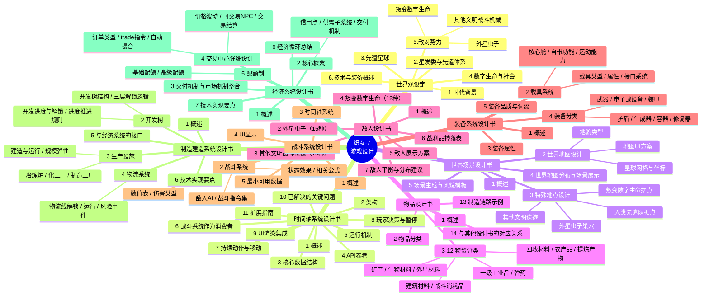
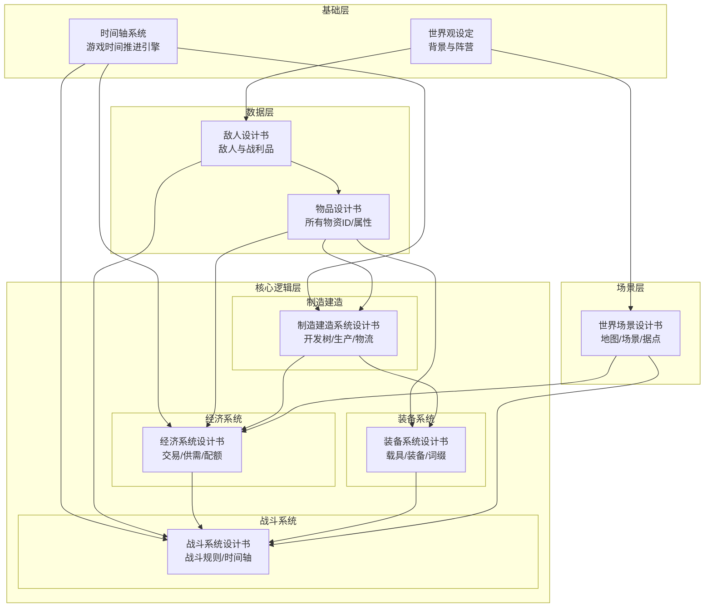

# 织女-7 游戏设计架构总览

> 本文档为所有设计书的目录总索引，使用 Mermaid 思维导图呈现各模块的层级关系，方便快速定位和跳转。

## 一、系统总览

## 二、模块依赖关系

## 三、各设计书目录

- [世界观设定](file:///workspace/设计文档/世界观设定.md)
- [时间轴系统设计书](file:///workspace/设计文档/时间轴系统设计书.md)
- [世界场景设计书](file:///workspace/设计文档/世界场景设计书.md)
- [物品设计书](file:///workspace/设计文档/物品设计书.md)
- [敌人设计书](file:///workspace/设计文档/敌人设计书.md)
- [装备系统设计书](file:///workspace/设计文档/装备系统设计书.md)
- [战斗系统设计书](file:///workspace/设计文档/战斗系统设计书.md)
- [制造建造系统设计书](file:///workspace/设计文档/制造建造系统设计书.md)
- [经济系统设计书](file:///workspace/设计文档/经济系统设计书.md)