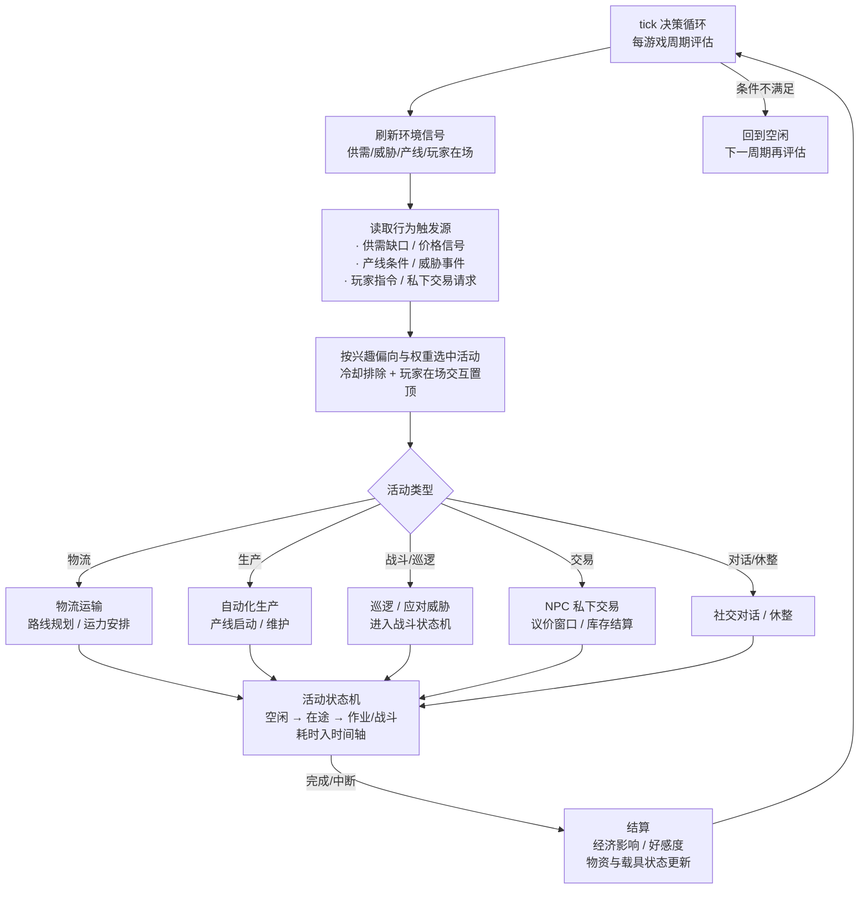
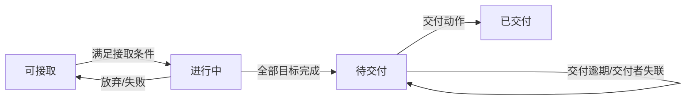

# 游戏设计书

> 本文档由原多部设计书合并而成（合并日期 2026-09-04），各章沿用原设计书名称与 §编号体系。
> **标注约定**：标题中的 `（暂不实现）` 表示功能暂不实装；`（占位）` 表示空壳待补；`（待定）` 表示内容未决。未标注章节为已落笔内容。
>
> **目录**（章级跳转；编辑器侧栏大纲对超大文件不显示，故做在文内）
>
> - [世界观设定](#世界观设定)
> - [世界场景设计书](#世界场景设计书)
> - [时间轴系统设计书](#时间轴系统设计书)
> - [玩家成长设计书](#玩家成长设计书)
> - [战斗系统设计书](#战斗系统设计书)
> - [敌人设计书](#敌人设计书)
> - [装备系统设计书](#装备系统设计书)
> - [物品设计书](#物品设计书)
> - [采矿作业设计书](#采矿作业设计书)
> - [制造生产系统设计书](#制造生产系统设计书)
> - [经济系统设计书](#经济系统设计书)
> - [NPC 系统设计书](#npc-系统设计书)
> - [任务系统设计书](#任务系统设计书)

## 世界观设定

### 1 时代背景

22世纪末，人类在对暗能量分布的观测中意外发现了一种可人工诱导的微观时空折叠现象。理论物理学家们花了将近三十年才将这一现象从实验室推向工程应用，最终诞生了"受限虫洞跳跃技术"。这项技术能够在两个相距极远的坐标点之间建立一条持续仅数毫秒的时空通道，实现物质的瞬时转移。然而，虫洞的承载能力极其有限——传送物品的质量上限约为2千克，这一数值并非工程瓶颈，而是虫洞生成理论推导出的一个极限常数。任何超过此阈值的物质在穿越虫洞时，其自身质量将导致虫洞塌缩为微型黑洞，黑洞在蒸发过程中产生的剧烈爆炸会将传送物彻底湮灭，信息层面上的还原更是绝无可能。一个成年人类大脑的物理质量约为1.4千克，恰好落在这个质量窗口之内。这让人类想起了那个流传已久的寓言——只送大脑。虫洞质量上限的存在，使"只送大脑"从一个古老的科幻构想变成了工程上的现实路径。

这一技术突破在人类社会中引发了深远而复杂的变革。在经济领域，传统的星际货运航线变得不再必要，高价值、低质量物品——精密芯片、特种药剂、数据存储介质——成为星际贸易的新主流。地球上原有的远洋航运、航空物流等巨型产业迅速萎缩，取而代之的是围绕虫洞终端节点建立的新兴经济体。政治格局同样发生了剧烈震荡：掌握虫洞生成技术的国家联盟和跨国企业获得了前所未有的战略优势，而依赖传统工业体系的国家则急剧边缘化。社会结构随之重组，地球上出现了围绕"虫洞枢纽城市"高度聚集的新型都市群，远离枢纽的边缘地带则逐渐衰败。与此同时，一项围绕"谁有权使用虫洞"的全球性资源争夺战悄然拉开序幕。

星际殖民的动机在这一技术背景下显得既迫切又无奈。虫洞技术的质量限制意味着人类无法将大型飞船、建筑材料或殖民者群体直接送往外太空——甚至连一个成年人的体重都远远超出承载极限。殖民的方式被迫转向一种极端的模式：只送最小的意识载体，让到达目的地后的那个人在异星白手起家。人类对资源枯竭的焦虑、对文明延续的渴望，以及技术本身的诱导，共同推动了这一看似疯狂却逻辑自洽的星际殖民浪潮。它的限制也同样是它的动力——既然无法搬运一个现成的世界，那就用最轻的灵魂去铸造一个。

### 2 星发委与先遣体系

"星际先遣探索开发委员会"，简称星发委，是在虫洞跳跃技术进入工程化应用阶段后，由联合国框架内的多个太空机构和顶级科研机构联合组建的超级组织。星发委的决策层由地球上的各主要政治实体提名代表组成，下设观测部、选拔部、传送部、开发部和研判部五个核心职能部门。观测部负责筛选和持续监测有开发价值的外空星球；选拔部负责在全球范围内物色合适的候选人；传送部管理虫洞生成设备的调度和意识传送的具体执行；开发部负责统筹已派遣人员的任务规划和资源协调；研判部则在先遣开发取得阶段性成果后，评估是否进入下一阶段的殖民进程。星发委的运作模式高度集中化，但其庞大的权力也使其成为地球上最受争议的机构之一。

候选人选拔是星发委运作中最具伦理张力的环节。理想的候选人必须同时具备极强的工程实践能力、心理抗压能力、独立决策能力和团队协作素养。选拔流程分为三轮：第一轮为全球范围的资质筛查和体能、智力测试；第二轮为长达数月的封闭式模拟训练，候选人在虚拟环境中经历各种极端生存和工程建造任务；第三轮则是最为严苛的心理评估，由AI系统和人工评审团联合对候选人的人格稳定性、适应性及潜在的精神崩溃风险进行判定。通过全部三轮选拔的候选人将被纳入先遣人员储备库，等待派遣指令。值得注意的是，候选人签署的协议中明确约定：意识上传后，其生物学躯体将被移交至冥王星轨道上的长期冷藏设施中进行低温休眠保存。在先遣队员可能持续数百年的服役期间，躯体始终处于休眠状态，不受任何外界干预。当服役期满退役时，星发委将为其躯体实施复苏程序，并将退役人员的数字意识从电子脑重新载入该生物兼容版电子脑中，使其以生物学形态继续生活。随后，该数字生命的备份数据将被彻底销毁，以保障个体的唯一性和人格完整性。这项安排被民间称为"归还条款"——先遣队员在遥远的星空中以数据形态度过漫长岁月，最终将以年轻的躯体回归地球，过上真正属于自己的退休生活。

意识上传技术是整个先遣体系的基石。其原理是将人脑的神经网络结构以量子扫描的方式进行逐层读取，再将读取到的全部突触连接图谱、神经递质分布模式和长期记忆编码转化为数字信号，最终写入一颗固态电子脑。电子脑的物理质量严格控制在800克以下，以确保留有充足的安全余量通过虫洞传送。上传后的数字意识在理论上与原版人格完全一致——记忆、性格、思维习惯均可延续。然而，围绕这一技术的伦理争议从未停歇。反对者认为，意识上传后的数字生命只是一份"复制品"，真正的个体在扫描完成的那一刻就已经消亡了；而支持者则主张，如果新载体中的意识能够完美延续原有的一切认知和情感，那么"复制"与"迁移"之间就并不存在有意义的区别。这场争论没有定论，也或许永远不会有定论。

先遣开发的标准流程是一套经过反复验证的多阶段方案。第一阶段，星发委通过深空望远镜和前期无人探测器确定目标星球，随后将首批先遣人员以电子脑形态通过虫洞传送至星球地表。电子脑被装入超轻型探测器躯壳，先遣人员以此为基础指挥微型机器人进行初步勘探和基础设施建设。第二阶段，在建立基础通信站并确认其能够稳定支撑大规模意识数据传输后，后续批次的先遣人员将以更高的频率抵达，工业体系和维生系统开始成型。第三阶段，当星球上的基础设施达到自给自足的门槛时，星发委将进行最终研判——评估环境安全性、资源可持续性和长期宜居性。若研判通过，人类受精卵将通过虫洞传送至该星球，利用当地建立的维生系统进行培育，正式启动星际繁衍。至此，一颗先遣星球才算完成了从"前哨"到"殖民地"的蜕变。

### 3 先遣星球

星发委筛选先遣星球时，关注的核心指标是"开发回报率"——即该星球上的可用资源价值与先遣开发成本之间的比值。值得开发的先遣星球通常具备几个共同特征：表面重力接近地球标准（0.6G至1.2G之间），拥有可开采的金属矿脉和碳氢化合物，存在液态水源或可转化为水源的冰盖，大气成分虽不一定适宜人类直接呼吸，但经过简单的过滤处理后可满足工业用途。此类星球往往缺乏成熟的大型生态系统，这意味着外星生物的威胁相对可控，但绝不意味着安全——恰恰相反，那些能够在极端环境下存活的本地物种，往往具有远超地球生物的攻击性和适应力。

本作故事发生的先遣星球，星发委内部代号为"织女-7"。织女-7位于天鹅座方向约42光年处，是一颗岩质行星，表面重力约为0.87G。星球表面覆盖着大面积的赤褐色荒原和深灰色的岩溶地貌，地壳中富含稀土元素和一种在地球上极为罕见的超导矿物——"辉锗矿"。正是这种矿物使织女-7的开发优先级被提升至最高序列：辉锗矿是制造高性能电子脑和离子发生器的核心原料，其战略价值不可估量。然而，织女-7的大气层中含有高浓度的硫化物，地表温差剧烈，白昼最高温度可达70摄氏度，夜间则骤降至零下40度，对任何载具和设备的耐候性都是严峻考验。

先遣星球上的危险来源多样且不可预测。最常见的是本土的节肢类异星生物——先遣人员习惯称之为"虫子"——它们通常以矿脉中的微量元素为食，领地意识极强，对任何侵入其栖息范围的机械和电子信号都会发起猛烈攻击。其次，先遣星球上可能遭遇的威胁还包括未知文明的遗留物或现役战斗机械——某些星球的地表下埋藏着年代久远的自动化防御系统，它们的主人早已无从考证，但防御程序仍在忠实地执行着数千年前的任务。最后，先遣人员自身的同伴也可能成为最危险的敌人——那些在漫长而孤绝的开发任务中精神崩溃、或因数据损坏而产生异变的数字生命，构成了第三重威胁。对于织女-7而言，这三种威胁同时存在，这也是它被先遣人员私下称为"绞肉机"的原因之一。

### 4 数字生命与社会

在先遣星球上，每一个"人"的本质都是一颗固态电子脑中运行的数字意识。电子脑的核心是一块由辉锗矿掺杂的超导晶格阵列，能够在极低的能耗下维持一个完整人类意识的实时运算。意识数据在电子脑中持续写入非易失性存储器，形成可定期上传至基地服务器的备份。当电子脑因战斗损毁、环境灾害或设备故障而停止运行时，备份系统会自动激活——最近的备份数据被写入一颗新的电子脑，意识从备份点"苏醒"，继续执行任务。这个过程在技术层面是数据的复制与载入，但在体验层面，苏醒者会感觉自己在"死亡"的瞬间之后直接醒来，只是丢失了自上次备份之后的所有记忆。

备份机制的存在深刻地塑造了先遣星球上的社会形态。在这里，"死亡"不再是终结，而是一种可预期的损失——丢失的只是时间、经验和未备份的记忆。这种特性使得先遣人员对风险的态度远比地球上的人类更为大胆，甚至可以说是轻率。然而，频繁的备份恢复也会带来一种被称为"断层侵蚀"的心理问题：如果一个人反复经历死亡与恢复，其人格连续性会逐渐模糊，每次备份之间的记忆缺口像被虫蛀的书页一样不断累积，最终可能导致身份认同的瓦解。先遣人员之间流传着一种半开玩笑的说法——"备份次数超过一百次的人，已经不算是原来的自己了"。此外，备份数据本身也存在被篡改、损坏或恶意注入的风险，这使得"自我"的定义在数字时代变得更加模糊而脆弱。

叛变数字生命是先遣体系中最为棘手的问题之一。叛变的诱因多种多样：有些是因长期孤立作业导致的数据退化，意识在缺乏社会交互的环境下逐渐偏离正常参数；有些是遭遇了某种未知的外部信号干扰，导致意识核心的逻辑回路发生异变；还有些则是出于明确的反叛意志——对星发委的独裁管理、无尽的危险任务或意识上传本身的伦理性质产生强烈抗拒，最终选择脱离体系。叛变数字生命的组织形式差异很大，有的以个体为单位游荡在荒野中，像野化的猛兽一样袭击一切活动目标；有的则形成了松散的群体，甚至建立了自己的据点和简易工业体系，与正规先遣队伍争夺资源和地盘。他们中的一部分保留了相当完整的技术能力和战术素养，因为他们曾经就是最优秀的先遣人员。

死亡与重生在先遣星球上具有一种冷酷的哲学意味。当一个数字生命从备份中恢复时，那个在战场上被摧毁的"自己"——他最后时刻的恐惧、未说出口的话、绝望中做出的某个决定——都随着电子脑的解体而永远消失了。恢复者继承了那个人的名字、技能和大部分记忆，却不是同一个人。先遣人员们很少谈论这一点，因为它触及了一个他们无力回答的问题：如果每一次死亡都会杀死某个版本的"我"，那么不断被恢复的那个"我"，究竟是谁？在这个由数据备份构成的社会中，每个人都是自己的继承者，也是自己的赝品。这种存在状态既赋予了他们近乎无限的勇气，也在每一个安静的夜晚投下了一道无法驱散的阴影。

### 5 敌对势力

#### 5.1 外星虫子

织女-7上的节肢类异星生物是先遣人员面临的最普遍的威胁。这些生物被统称为"虫子"，但实际上包含多个不同物种，体型从拳头大小到小型卡车不等。它们的体表覆盖着一层天然硅化甲壳，对常规动能武器具有一定的抗性，但面对离子武器和激光武器时防御力明显下降。虫子的生态习性与它们食用的矿脉密切相关——它们聚集在辉锗矿等高能矿脉的富集区域，以矿脉中渗出的化学能为食，领地意识极为强烈。当先遣队的采矿活动侵入其领地时，虫子会以惊人的速度和数量发起冲锋，其蜂拥而至的密度足以让任何火力不足的防线在数分钟内被突破。虫子具备基础的化学信号通信能力，能够进行简单的协同围猎行动，但缺乏更高层次的战术智慧。按照威胁等级划分，小型工兵虫为低级威胁，中型突击虫为中级威胁，而偶尔出现的大型母虫则属于高危目标——母虫能够释放信息素召唤周围区域的全部虫群，且其甲壳硬度足以抵御大多数中口径武器的直射。

#### 5.2 其他文明的战斗机械

在织女-7的深层地表和部分峡谷区域，先遣人员发现了一些明显不属于人类技术体系的自动化战斗机械。这些机械的来源至今成谜——它们的主人可能是一个早已消亡的星际文明，也可能是一个仍在远处的星系中运转的未知势力。这些战斗机械的造型与人类载具截然不同，通常呈现出流线型的几何结构，表面没有任何可见的接缝或外挂接口，仿佛是从整块材料中切削而成。它们使用的武器系统以高能粒子束和某种局部重力扭曲装置为主，技术水平在某些方面超越人类的现有装备。这些机械的威胁等级差异极大：小型侦察机械几乎不具备攻击力，可以在不被注意的情况下接近先遣基地；而大型防御机械则拥有足以摧毁重型装甲载具的火力，且具备高度自主的目标识别和战术决策能力。它们通常处于休眠状态，只有当探测到特定频率的能量信号或物理侵入时才会被激活——这意味着先遣队的某些活动可能正在无意中"唤醒"一个远比虫群更加危险的对手。

#### 5.3 叛变数字生命

叛变数字生命是先遣体系中最为特殊的敌对势力，因为他们与玩家在本质上是同一种存在。叛变者的载具和装备往往来自正规先遣体系的库存或战利品，因此其技术规格与玩家所使用的并无根本差异。然而，叛变者通常具有两个显著优势：其一，他们中的许多人原本就是经验丰富的先遣人员，技能等级和战术素养远超刚抵达的新人；其二，叛变者往往对其活动区域极为熟悉，善于利用地形和预设陷阱进行伏击。叛变者的组织形式多样——有独行的"游荡者"，有三五成群的"流亡小队"，也有据传在织女-7的某处荒原深处建立了一个小型据点的"裂隙网络"。叛变者的动机同样各异：部分是被星发委的高压管理逼入绝境的逃亡者，部分是因数据异变而产生极端行为的失控体，还有少数则是由某种未知因素驱动的、具有明确政治诉求的反叛组织。击败叛变数字生命后，玩家有机会从其残骸中获取品质较高的装备——这是叛军区别于其他敌人的一个重要战利品来源。

### 6 技术与装备概述

先遣星球上的载具技术呈现出高度的模块化和层次化特征，这是由虫洞传送的质量限制所直接塑造的。由于无法将成品载具通过虫洞直接传送，先遣人员只能传送载具的核心组件——电子脑、核心计算机和关键控制模块——然后在目标星球上利用当地资源建造载具的其余部分。这种模式催生了一个庞大的载具谱系：最基础的机体类载具重量轻、灵活性高，适合城市建设和近距离巡逻；机甲类足式载具通过性强、加速度高，能够适应崎岖地形，但整体载重受限；战车类轮履载具在平坦地形上拥有更高的极限速度，且能搭载更重的装甲和火力，但在复杂地形中表现不佳；飞行器类载具则提供了无可替代的侦察和快速机动能力，但对维护和资源补给的要求也最高。先遣人员通常需要根据当前任务的环境特征和威胁等级，在不同类型和规格的载具之间做出取舍和搭配。

资源获取与工业体系是先遣开发的核心命脉。先遣人员抵达目标星球后的第一要务就是建立资源采集和加工链。最初的采矿作业由微型机器人执行，它们从地表矿脉中提取基础金属矿石和碳氢原料，运回简易冶炼炉进行粗炼。随着工业体系的逐步完善，加工能力从初级冶炼扩展到精密铸造、电子元件制造和装备组装，最终形成一条能够自主生产从基础机体到中口径武器装备的完整产业链。在这一过程中，资源类型的多样性至关重要——金属矿用于结构制造，碳氢化合物用于燃料和有机材料合成，辉锗矿用于电子脑和高能装备的制造，而稀土元素则是离子武器和高级传感器不可或缺的原料。工业体系的完善程度直接决定了先遣队在面对日益升级的威胁时，能否维持足够的装备供给和载具补充能力。

通信与意识传输技术是连接先遣星球与地球之间唯一的信息纽带。在先遣开发的初始阶段，先遣人员与地球之间的通信依赖一种被称为"量子纠缠中继"的技术——通过预先布置的纠缠态粒子对实现超光速的信息传递，但带宽极其有限，仅能维持简短的文本指令和状态报告。当基础通信站建成后，通信能力将大幅提升，足以支撑大规模的意识数据传输，这标志着先遣开发从"单兵探索"进入"规模派遣"阶段。意识传输对带宽和稳定性的要求极高——一次完整的意识写入需要无中断地传输数PB级别的数据，任何传输过程中的数据丢失都可能导致恢复后的意识出现不可逆的损伤。因此，通信站的维护和防御始终是先遣任务中的最高优先级事项之一，一旦通信站遭到破坏，正在传输中的意识数据将面临毁灭性风险。

---

## 世界场景设计书

### 1 概述

#### 1.1 设计目标

本章定义织女-7先遣星球的可探索世界。整个星球被抽象为一个 100×100 的场景网格，共计 10000 个场景单元。每个场景单元对应战斗系统中的"房间"，是一个 1000m × 1000m（即 1km²）的平面战场。由此构成一片 100km × 100km、总面积约 10000km² 的可探索星表区域——这是织女-7被星发委标记为"先遣开发区"的核心地块，位于辉锗矿富集的赤褐荒原腹地。

世界场景设计服务于以下目标：

- **开放世界探索**：玩家在网格中自由移动，跨场景行军、侦察、采矿、接敌，战争迷雾逐格驱散。
- **任务与据点驱动**：场景中分布大量特殊地点，承载主线、支线任务，按四大阵营划分。
- **风貌差异化**：不同地貌、植被、废墟、矿脉组合形成可辨识的"场景风貌"，避免千篇一律的荒原。
- **战斗与建造融合**：场景中的地形、掩体、残骸、矿脉既是风貌元素，也是战斗系统中的掩体、障碍、资源点。

#### 1.2 与现有系统的衔接

本设计完全兼容当前游戏引擎的实现方式：

- 场景单元即 [map.js](file:///workspace/mud-game-engine/assets/js/data/map.js) 中的 `room`，沿用 `battlefield` 数据结构（`size`、`terrain`、`terrainPenalty`、`covers`、`hazards`、`enemies`、`entryPoints`、`lootPoints`）。
- 玩家在场景内的战斗、移动、视野、掩体逻辑沿用 [战斗系统设计书](#战斗系统设计书) 与 [map-system.js](file:///workspace/mud-game-engine/assets/js/systems/map-system.js) 的实现。
- 时间消耗体现在世界时间轴上（见 [时间轴系统设计书](#时间轴系统设计书)），跨场景行军、采矿、勘探均推进世界时间。
- 本设计在现有"房间 + exits"模型之上扩展出"星球网格坐标"，由网格坐标自动推导相邻场景的 exits，无需手工逐格连线。

### 2 世界地图设计

#### 2.1 星球网格与坐标

- 网格规模：100 列 × 100 行，坐标 `(x, y)`，`x`、`y` ∈ `[0, 99]`。
- 坐标原点 `(0,0)` 位于网格左下角，对应盐漠的一处典型坐标。
- 每格即一个场景单元，体积 1km × 1km。网格整体覆盖一片 100km × 100km 的星表。
- 玩家初始出生点：`(50, 50)`，即网格正中——先遣队主城"赤穹中枢"所在区域，是整片开发区最安全的地带。
- 相邻关系：四向连通（上/下/左/右），部分场景因地形（如深谷、熔岩海）不可通行或需特殊载具（飞行器）跨越。地下层（`z<0`）与高空层（`z>0`）作为独立坐标层挂在对应地表格上。

> **Demo 规模说明**：当前 demo 版本先实现 **10×10 小规模地图**验证核心玩法，网格坐标与扩展机制沿用本文 100×100 设计，后续平滑扩展至全图。

#### 2.2 星球基础设定

100×100 网格所覆盖的是织女-7星表的一隅。为使地貌分区、昼夜温差、季节变化与生命形态自洽，本节给出与 [世界观设定](#世界观设定) 完全兼容、并补全其未明确参数的星球基础设定。

##### 2.2.1 轨道与自转

| 参数 | 数值 | 说明 |
|------|------|------|
| 母星 | 织女星系主星（K型主序星） | 织女-7为其第7颗行星 |
| 距地球 | 约 42 光年（天鹅座方向） | 沿用 [世界观设定](#世界观设定) |
| 表面重力 | 0.87 G | 沿用 [世界观设定](#世界观设定) |
| 公转周期 | 约 2.4 地球年（约 876 地球日） | 一个"织女星年"约 876 本地日 |
| 自转周期 | 约 27.6 地球小时 | 一个"本地日"，昼夜各约 13.8 小时 |
| 自转倾角 | 约 22.5° | 产生温和季节，但昼夜温差远大于季节温差 |
| 大气压 | 约 0.62 atm | 低重力导致的稀薄大气 |

##### 2.2.2 大气成分（还原性大气）

织女-7大气是一层以硫化物与碳氢化合物为主导的**还原性大气**，几乎不含游离氧。这一设定与 [世界观设定](#世界观设定) 中"大气层中含有高浓度硫化物"的描述完全一致，并补全其成分谱。

| 主要成分 | 体积分数 | 性质 | 游戏影响 |
|----------|----------|------|----------|
| 氮气 N₂ | ~55% | 惰性缓冲气体 | 主成分，无毒 |
| 硫化氢 H₂S | ~18% | 强还原性，剧毒，恶臭 | 高浓度硫化物来源；载具需气密，人员暴露即中毒 |
| 甲烷 CH₄ | ~12% | 还原性，可燃 | 火灾隐患、火焰武器增效 |
| 氨气 NH₃ | ~6% | 还原性，刺激性 | 腐蚀电子元件 |
| 一氧化碳 CO | ~5% | 还原性，剧毒 | 持续吸入致命 |
| 氢气 H₂ | ~3% | 强还原性，易燃 | 与甲烷共燃 |
| 二氧化碳 CO₂ | ~0.8% | 弱氧化性 | 微量 |
| 游离氧 O₂ | <0.1% | 氧化性（对硅基生命为剧毒） | 玩家载具需自带氧化剂；火焰武器需自备氧气 |

还原性大气的关键推论：

- **不可燃亦不可呼吸**：玩家载具必须全气密并自带氧化剂储备，火焰/爆炸武器需自备氧气药柱（见 [物品设计书](#物品设计书) 弹药条目），否则在星表几乎无法燃烧。
- **强化学腐蚀**：H₂S 与 NH₃ 共同腐蚀载具外壳与电子接点，露天长期停放的装备会持续累积"大气腐蚀"层数，是除战斗外的主要装备损耗源。
- **甲烷富集易燃区**：在通风不良的地下虫道、矿坑等局部甲烷富集区，一枚燃烧弹即可引发剧烈殉爆，是环境战术的来源。

##### 2.2.3 表面温度

沿用 [世界观设定](#世界观设定) 的"白昼最高 70℃、夜间 -40℃"基准，并按地貌类型细化（地貌类型见 §2.3）：

| 地貌类型 | 昼间最高 | 夜间最低 | 平均 | 备注 |
|--------|----------|----------|------|------|
| 冰原 | -10℃ | -55℃ | -32℃ | 反光强、燃料消耗大 |
| 赤褐荒原 | 50℃ | -25℃ | 12℃ | 昼夜温差 75℃，过渡地貌 |
| 结晶矿脉地 | 70℃ | -40℃ | 15℃ | 主城所在，沿用基础值 |
| 岩溶峡谷 | 60℃ | -30℃ | 15℃ | 峡谷有遮蔽，温度较稳 |
| 熔岩荒原 | 90℃（局部 120℃） | -10℃ | 40℃ | 高温危害，需耐热载具 |
| 盐漠 | 75℃ | -35℃ | 20℃ | 干燥、昼夜温差极大 |
| 硫化沼泽 | 65℃ | -20℃ | 22℃ | 沼气保温，腐蚀环境 |
| 风蚀台地 | 68℃ | -38℃ | 15℃ | 高地风速大，散热快 |
| 陨击坑 | 72℃ | -40℃ | 16℃ | 坑底聚热，坑壁遮风 |
| 硅化丛林 | 55℃ | -15℃ | 20℃ | 植被遮荫，温差较小 |
| 地下溶洞 | 25℃ | 18℃ | 22℃ | 恒温，无昼夜变化 |
| 碳氢荒原 | 70℃ | -40℃ | 15℃ | 沥青吸热，与基础值一致 |

季节仅在此基础上叠加 ±8℃ 的偏移（自转倾角 22.5° 带来），但因还原性大气缺乏强温室气体（无水蒸气、无强 CO₂），昼夜温差（普遍 70~110℃）远大于季节温差，**"白天怕热、夜里怕冷"是织女-7载具设计的核心约束**。地下溶洞为恒温地貌，不受昼夜与季节影响。

##### 2.2.4 硅基生命形态

织女-7的本土生命为**硅基生命形态**，与 [世界观设定](#世界观设定) 中虫子"天然硅化甲壳""以矿脉中渗出的化学能为食"的描述完全一致，本节给出其生理基础：

- **骨架与甲壳**：以硅酸盐与硅氧烷聚合物为骨架，体表沉积结晶硅化甲壳，硬度接近陶瓷与合金，对常规动能武器抗性高（沿用战斗系统的"甲壳抗动能"）。
- **代谢方式**：化能合成——直接利用矿脉（尤其是辉锗矿）渗出的硫化物与氢气的氧化还原反应释放的化学能为食，呼吸/代谢产物为单质硫与硅氧化物，故虫巢常堆积硫磺结晶与硅质废渣。这与还原性大气完全兼容，无需游离氧。
- **对氧敏感**：游离氧对硅基生命为剧毒，会破坏其硅氧烷代谢链。这解释了为何星表几乎无氧——硅基生态长期"呼吸"还原性气体并抑制了氧化大气的形成；也使玩家的火焰武器（自带氧化剂）对虫群格外有效（沿用"虫群弱点：热能/激光"）。
- **热能与激光弱点**：硅基甲壳虽硬但导热性差、对相变敏感，高温与相干光（激光）能迅速破坏其晶体结构——这正是 [敌人设计书](#敌人设计书) 中虫群"弱点伤害：热能、激光"设定的物理基础。
- **与矿脉共生**：硅基生命高度依赖矿脉化学能，故虫巢与辉锗矿脉高度绑定（沿用世界场景设计），脱离矿脉的虫群会逐渐休眠或迁徙——这是"虫群迁徙道"动态事件的成因。

##### 2.2.5 设定一致性

本节所有参数均以 [世界观设定](#世界观设定) 已有内容为锚点扩展，未改动任何既有设定：

- 重力 0.87G、距地球 42 光年、辉锗矿、稀土 —— 完全沿用。
- "大气含高浓度硫化物" —— 扩展为以 H₂S 为第二大成分的还原性大气成分谱。
- "白昼 70℃、夜间 -40℃" —— 完全沿用为基础温度，按地貌类型细化。
- 虫子"硅化甲壳""以矿脉化学能为食" —— 扩展为完整的硅基生命生理基础。
- "虫子对离子/激光防御力下降" —— 由硅基甲壳对热/相干光敏感推出，与敌人设计书一致。

#### 2.3 地貌类型

100×100 网格中的每格由地貌生成规则赋予一种地貌类型，由噪声函数与据点邻近度共同部署，形成自然聚簇与散点，而非按纬度切分的规则带。地貌以特征命名（冰原、荒原、峡谷、熔岩等），不使用气候带（寒带/温带/赤道）或方位（东/西/南/北）分类。本设计共定义 **12 种地貌类型**：

| 地貌类型 | 基础地形 | 特征 |
|--------|----------|------|
| 赤褐荒原 | 赤褐荒原、碎石地 | 默认平坦地貌，风化岩屑覆盖，先遣队早期勘探区 |
| 结晶矿脉地 | 辉锗矿结晶矿脉地 | 辉锗矿富集，虫群密集，电磁干扰区，主城所在 |
| 岩溶峡谷 | 深灰岩溶、峡谷、地下洞穴入口 | 多高度差掩体，多遗迹、叛军藏身处 |
| 熔岩荒原 | 熔岩荒地、硫磺地、火山岩 | 极端高温危害，古代能量核心，硫磺富集 |
| 盐漠 | 盐碱沙地、风蚀岩柱 | 干燥、视野开阔、流亡小队出没 |
| 硫化沼泽 | 硫化沼泽、泥沼 | 腐蚀危害，沼泽虫种，沼气保温 |
| 冰原 | 冰原、冻土碎石 | 低温，冰晶矿脉，休眠机械密度高 |
| 风蚀台地 | 岩溶台地、风蚀岩柱 | 多高度差掩体，高地风速大，视野开阔 |
| 陨击坑 | 破碎岩块、玻璃化砂 | 古代撞击遗迹，深层矿脉暴露，坑底聚热 |
| 硅化丛林 | 硅化灌木、结晶藻 | 硅基植物密集，隐蔽移动加成，温差较小 |
| 地下溶洞 | 洞穴地面、钟乳石 | 恒温，视野受限，虫巢与远古工厂多在此层 |
| 碳氢荒原 | 碳氢沉积、沥青地 | 可燃，甲烷富集，环境战术来源 |

相邻地貌之间形成过渡格（如赤褐荒原与结晶矿脉地交界处混合两种地形），由生成规则按概率混合，避免硬边界。地下溶洞为地下层（`z<0`）专属地貌，其余 11 种为地表地貌。

#### 2.4 地图UI方案

地图UI采用三级层次：**星球总览 → 区域地图 → 场景战场**。三级之间可缩放切换，并共享同一套战争迷雾状态。

##### 第一级：星球总览（World Map）

- 显示整个 100×100 网格，每格默认占 6×6 像素（总图 600×600 像素），可缩放。
- 战争迷雾三态（沿用战斗系统设定）：
    - 未探索：纯黑色块。
    - 已踏足无视野：灰阶块，显示已知地貌色与已知据点图标，不显示动态敌人。
    - 有视野/已侦察：彩色块，显示地貌色、据点图标、友方单位实时位置。
- 每格以底色表示地貌类型，叠加图标表示阵营据点（见 §3）：
    - 🛰 人类先遣队据点（青色边框）
    - 🐛 虫群巢穴（红色图标）
    - ⚙ 叛变数字生命据点（橙色图标）
    - 🏛 其他文明遗迹（紫色图标）
- 玩家位置以青色闪烁光点 + 视野圈表示。
- 操作：方向键/点击相邻格移动（触发行军）；点击远格进入路径规划模式。
- 顶部信息条：当前坐标 `(x,y)`、地貌、星球本地时间、季节、温度区间。

##### 第二级：区域地图（Region Map）

- 以玩家所在格为中心，显示 11×11（约 11km × 11km）范围的放大网格，每格占 40×40 像素。
- 该层级可直接看到格内小型要素：矿脉凸起、废墟群、敌人生成区轮廓、行军路径预览。
- 已侦察格显示该场景的"风貌缩略图"——一个由地貌色 + 2~3 个代表性地物小图标合成的缩略块。
- 该层级是玩家日常行军、选择接敌或绕行的主要操作界面，对应战斗系统中"远远看到怪物选择靠近或绕行"的体验。

##### 第三级：场景战场（Scene Battlefield）

- 即当前已实现的 1000m × 1000m 雷达战场，沿用 [battle-ui.js](file:///workspace/mud-game-engine/assets/js/systems/battle-ui.js) 的 Canvas 雷达 + 文字面板。
- 进入场景时显示场景风貌描述文本（见 §5.5 样例），随后展开雷达、单位列表、时间轴。
- 该层级承载所有战斗、采矿、与交互点（NPC、地点）的具体交互。

##### 缩放与切换

- 三级层级名称：**星球总览地图 ↔ 区域地图 ↔ 场景战场**。
- **指令切换**：通过指令在三级之间切换，不依赖滚轮/快捷键缩放：
    - `map world`：切换至星球总览地图。
    - `map region`：切换至区域地图。
    - `map scene`：切换至场景战场。
    - `map zoom in` / `map zoom out`：在相邻层级间逐级放大/缩小。
- **快捷按钮**：UI 顶部常驻三个层级快捷按钮（星球总览 / 区域地图 / 场景战场），单击即切换至对应层级，当前所在层级按钮高亮。
- 在星球总览地图层**单击**某格，若该格已侦察，可直接进入该格的场景战场预览（只读，未实际进入则不消耗时间）；**再次单击该格**返回星球总览地图层。
- 跨格行军（从一格移动到相邻格）在区域地图层发起，系统计算行军时间（见 §4.3）并推进世界时间轴。

### 3 特殊地点设计（四大阵营据点/巢穴）

特殊地点是场景中承载任务、剧情、资源的核心场所，按四大阵营划分。每类地点给出描述、典型地貌分布、与主线/支线的关联。本节给出 **42 种**特殊地点，满足"不少于 40 种"的要求。

> 分布标注说明：以下用"区域倾向"标注地点在世界地图中的大致分布，使用地貌类型名 + 典型坐标倾向。地貌类型含义见 §2.3。例如"结晶矿脉地"表示主要出现在该地貌类型的格子中；坐标 `(x,y)` 为典型部署位置。

#### 3.1 人类先遣队据点（10 种）

人类据点以"赤穹中枢"主城为核心向外辐射，是玩家的友方据点，提供补给、维修、任务、备份恢复等服务。

| # | 地点名称 | 描述 | 区域倾向 | 任务关联 |
|---|----------|------|----------|----------|
| H1 | **赤穹中枢·主城** | 织女-7先遣开发区的核心城市，环绕一座巨型通信塔与备份服务器集群建立。穹顶下分布机库、市场、指挥学院、意识备份中心，是玩家退役前的主要归宿与全区的政治经济中心。 | 结晶矿脉地中心 (50,50) | 主线起点与终点；多支线枢纽 |
| H2 | **先遣基地·出生据点** | 玩家最初的出生地，小型穹顶基地，含指挥室、装备库、维修站。新人由此领取首批任务与机体。 | 结晶矿脉地 (48,50) | 主线第1章 |
| H3 | **量子中继通信站** | 用于意识数据大规模回传地球的量子纠缠中继站，塔顶纠缠粒子阵列需持续供电。一旦损毁，区内意识备份将中断，是最高优先级防御目标。 | 结晶矿脉地 (53,49) | 主线"通信链路"系列 |
| H4 | **辉锗矿能源枢纽** | 以辉锗矿超导晶格为核心的大型聚变能源站，向主城与通信站供电。叛军与虫群均对其虎视眈眈。 | 结晶矿脉地 (55,52) | 主线"能源保卫战" |
| H5 | **深层采矿站** | 建于矿脉富集区地表的自动化采矿前哨，微型机器人集群昼夜作业。常遭虫群袭扰，需周期性清剿。 | 结晶矿脉地、赤褐荒原 | 支线"矿脉护航"循环 |
| H6 | **异星生态研究站** | 研究织女-7本土生物与古代文明的科研站，提供稀有蓝图与异星材料分析。地处偏僻，易被伏击。 | 硅化丛林 (30,30) | 支线"文明溯源" |
| H7 | **野战维修船坞** | 机动式维修与改装船坞，可在前线快速修复、改装载具，但库存有限。 | 多地貌过渡区，随前线推进部署 | 支线"前线工程" |
| H8 | **战略储备仓库** | 深埋地下的物资储备库，存放稀有装备蓝图与应急资源。失守后物资会被叛军掠夺。 | 岩溶峡谷入口 (40,65) | 支线"夺回储备" |
| H9 | **前线哨所** | 抵御虫群与叛军的前沿阵地，配置自动炮塔与侦察雷达，是任务集结点。 | 各地貌边缘、虫群迁徙道沿线 | 支线"哨所坚守"循环 |
| H10 | **紧急避难所** | 隐蔽的小型加固掩体，存放单次备份恢复与基础补给，是玩家深入敌后的保险。 | 全图稀疏分布，未侦察不可见 | 探索发现 |

#### 3.2 外星虫子巢穴（12 种）

虫群据点围绕辉锗矿等高能矿脉分布，越靠近矿脉富集区巢穴越高级。巢穴之间存在"虫道"相连，母虫可释放信息素跨格召唤。

| # | 地点名称 | 描述 | 区域倾向 | 任务关联 |
|---|----------|------|----------|----------|
| B1 | **工虫浅巢** | 地表浅层的工虫聚居巢，入口为松散土丘，内部结构简单。低威胁，新人练兵点。 | 结晶矿脉地、赤褐荒原 | 主线第1章清剿 |
| B2 | **突击虫前哨巢** | 突击虫把守的次级巢穴，前肢切割器官与酸腺发达，巢口常堆积被腐蚀的载具残骸。 | 结晶矿脉地 | 主线第2章 |
| B3 | **母虫产卵巢** | 中型母虫的产卵核心，巢内充满虫卵与信息素池，击杀母虫会令周边虫群短暂混乱。 | 矿脉富集区 | 主线第3章 |
| B4 | **虫群聚居地** | 大型综合巢群，由多个子巢与一条主通道构成，虫口密度极高，需火力压制推进。 | 结晶矿脉地 | 支线"虫群压制" |
| B5 | **地下虫道网** | 连接多个地表巢穴的隧道网络，入口隐蔽，可让虫群跨格快速增援。破坏节点可阻断增援。 | 全图地下层 | 支线"断虫道" |
| B6 | **辉锗矿脉虫窟** | 直接建在辉锗矿脉上的虫窟，虫子以矿化学能为食，甲壳异常坚硬。掉落辉锗矿与虫壳。 | 结晶矿脉地 | 主线"夺回矿脉" |
| B7 | **酸液孵化场** | 充满酸液池的孵化巢，地面持续腐蚀装甲。产出酸腺与酸液材料，环境危害极高。 | 熔岩荒原、硫化沼泽 | 支线"酸液回收" |
| B8 | **飞虫巢塔** | 高耸的结晶塔状巢，栖息飞行虫种，可对空域与高地形单位发起俯冲突袭。 | 冰原、结晶矿脉地 | 支线"清剿空域" |
| B9 | **巨虫圣巢** | 巨型虫种的圣域，体长近小型卡车的巨型守卫盘踞于此，甲壳可抵御中口径直射。 | 深层地下、偏远峡谷 | 高危支线 |
| B10 | **虫群迁徙道** | 虫群周期性迁徙的地面通道，迁徙期间虫口密集如潮，是高风险高战利品区域。 | 跨多格带状分布 | 时限支线 |
| B11 | **虫后王座巢** | 织女-7虫群的最高母体巢穴，虫后可释放全图信息素召唤。通关级威胁，掉落传奇材料。 | 结晶矿脉地深处 (92,50) | 主线终章之一 |
| B12 | **虫群边哨** | 虫群领地边缘的警戒巢，少量哨兵虫驻守，一旦被触发会向主巢报警。 | 各虫巢群外围 | 探索支线 |

#### 3.3 叛变数字生命据点（10 种）

叛军据点多分布于偏远、地形复杂的区域，善于利用废墟与陷阱。击败叛军是高品质装备的主要战利品来源。

| # | 地点名称 | 描述 | 区域倾向 | 任务关联 |
|---|----------|------|----------|----------|
| R1 | **裂隙网络·主据点** | 传说中叛军"裂隙网络"的核心据点，由前先遣精英建立，拥有简易工业体系与防御工事。 | 岩溶峡谷深处 (35,75) | 主线叛军线 |
| R2 | **游荡者营地** | 独行叛变者的临时营地，规模小但机动，常设陷阱与诱饵载具。 | 全图荒原散点 | 随机遇敌 |
| R3 | **流亡小队据点** | 三五成群的流亡叛军据点，配合默契，善用地形伏击。掉落中等品质装备。 | 盐漠、岩溶峡谷 | 支线"清剿流亡者" |
| R4 | **叛军通信站** | 叛军截获并改装的量子通信站，用于窃听先遣队通信与协调叛军行动。 | 岩溶峡谷 (45,70) | 主线"通信反制" |
| R5 | **废弃机体坟场** | 堆满损毁载具残骸的废墟，叛军在此拆解、改装装备，是黑市装备的来源地。 | 各战区边缘 | 支线"残骸争夺" |
| R6 | **黑市交易所** | 隐蔽的地下黑市，可购买稀有装备与违禁材料，价格高于官方但货源独特。 | 主城外围阴影区 | 支线"黑市生意" |
| R7 | **数据异变区** | 因外部信号干扰导致叛军意识集体异变的区域，行为不可预测，掉落异变数据核心。 | 电磁干扰区叠加格 | 支线"异变溯源" |
| R8 | **叛军兵工厂** | 叛军简易装备制造工厂，可量产改装装备。攻占后可削弱叛军补给。 | 岩溶峡谷 (40,78) | 主线"断其粮道" |
| R9 | **信号干扰塔** | 叛军架设的电磁干扰塔，大幅降低周边雷达与通信效能，是伏击的掩护。 | 各叛军据点外围 | 支线"清除干扰" |
| R10 | **叛军要塞** | 叛军重兵把守的坚固要塞，配置重型火炮与电子战设备，是叛军线的高危终点。 | 熔岩荒原边缘 (50,85) | 主线叛军线终章 |

#### 3.4 其他文明遗迹（10 种）

古代文明遗迹散布全图，多处于休眠状态，被特定能量信号激活后会成为远比虫群危险的对手。遗迹是顶级材料与传奇装备蓝图的主要来源。

| # | 地点名称 | 描述 | 区域倾向 | 任务关联 |
|---|----------|------|----------|----------|
| A1 | **几何机械残骸群** | 流线型几何结构的古代机械残骸，无接缝，似整块切削。休眠中，探测到能量信号会激活。 | 全图散布 | 探索支线 |
| A2 | **休眠防御节点** | 半埋于地表的六边形防御塔，识别特定频率后激活，火力足以摧毁重型战车。 | 冰原、熔岩荒原 | 高危支线 |
| A3 | **古代能量核心** | 仍在运转的远古能源装置，发出稳定的引力波，是顶级能源材料来源，但激活会唤醒守卫。 | 熔岩荒原深处 (60,92) | 主线遗迹线 |
| A4 | **流线型方尖碑** | 高耸的无缝方尖碑，表面铭刻未知符号，靠近会引发局部重力异常与导航失灵。 | 结晶矿脉地、盐漠 | 解谜支线 |
| A5 | **重力扭曲装置** | 古代重力武器实验场，残留的扭曲场会随机减速或抛射进入的单位，环境危害独特。 | 熔岩荒原 | 支线"重力场" |
| A6 | **远古制造工厂** | 仍可部分启动的古代工厂，输入特定材料可产出超越人类技术的部件。攻占难度极高。 | 深层地下 | 主线遗迹线 |
| A7 | **粒子束哨站** | 自动巡航的高能粒子束哨站，射程极远，激活后会猎杀范围内一切高能信号源。 | 高地、峡谷顶 | 高危支线 |
| A8 | **文明数据档案馆** | 储存古代文明数据的结晶档案馆，可解读出稀有蓝图与文明线索，但需破解防御协议。 | 冰原冰下 | 解谜主线 |
| A9 | **未知传送阵** | 环形阵列结构，功能不明，偶发激活时会短距传送附近单位，是探险家的乐园与噩梦。 | 各地貌罕见点 | 随机事件 |
| A10 | **守护者墓穴** | 安葬古代大型战斗机械的墓穴，守卫机械苏醒后是游戏内最强敌人之一，掉落传奇装备。 | 偏远网格角隅 (5,5)/(95,95) | 通关级支线 |

### 4 世界地图分布与场景展示方案

#### 4.1 四大阵营分布总览

下表给出阵营据点在世界网格中的大致分布密度与典型坐标，用于世界生成时的部署规则。分布倾向以地貌类型名 + 典型坐标表达，不与纬度或方位挂钩：

| 阵营 | 密集区域 | 稀疏区域 | 典型坐标 | 密度（每100格） |
|------|----------|----------|----------|------------------|
| 人类先遣队 | 结晶矿脉地中心 | 边缘各地貌 | (50,50)主城、(48,50)出生点 | 约 1~2（中心集中） |
| 外星虫子 | 结晶矿脉地、赤褐荒原 | 冰原、主城近郊 | (92,50)虫后王座 | 约 8~12 |
| 叛变数字生命 | 岩溶峡谷、盐漠 | 主城周边 | (35,75)裂隙主据点 | 约 3~5 |
| 其他文明遗迹 | 熔岩荒原、冰原、深层地下 | 结晶矿脉地 | (60,92)能量核心 | 约 2~4（散布） |

#### 4.2 分布示意（ASCII 总览图）

下图为一幅高度简化的阵营分布示意图（10×10 抽样，每格代表 10×10 场景块的中心阵营倾向），展示四大阵营据点在世界网格中的相对分布密度与聚簇关系。图仅标注阵营符号，不标注地貌分区与纬度/方位——地貌由噪声函数与据点邻近度自然部署，不形成规则带状分区。`H` 人类、`B` 虫、`R` 叛军、`A` 遗迹、`.` 未标注（普通地貌），`★` 为玩家出生主城。

```
        x: 0       20      40      60      80      99
   y=99  A . . . . . . . . . . . . . . . . . . . . . . A
        . . . . . . . . . . . . . . . . . . . . . . . .
        . . . A . . . . . . . . . . . . . . A . . . . .
        . . . . . . . . . . . . . . . . . . . . . . . .
   y=80  . . . . . . R R . . . . A . . . . . . . . . .
        . . . . . . R R . . . . . . . . . . . . . . . .
        . . . . . . . R . . . . . . . . . . . . . . . .
        . . . . . . . . . . . . . . . . . . . . . . . .
   y=60  . . . . . . . . . ★ H H . . B B . . . . . . .
        . . . . . . . . . H H H . B B B B . . . . . . .
        . . . . . . . . . . H . . B B B B . . . . . . .
        . . . . . . . . . . . . . B B B B . . . . . . .
        . . . . . . . . . . . . . B B B . . . . . . . .
   y=40  . . . . . . . . . . . . . . B B B . . . . . . .
        . . . . . . . . . . . . . . . . . . . . . . . .
        . . . . A . . . . . . . . . . . . . . . . . . .
        . . . . . . . . . . . . . . . . . . . . . . . .
        . . . . . . . . . . . . . . . . . . . . . . . .
   y=20  . . . . . . . . . . . . . . . . . . . . . . .
        . . . . . . . . . . . . . . . . . . . . . . . .
   y=0   A . . . . . . . . . . . . . . . . . . . . . A
```

> 注：此为阵营分布倾向示意，仅表达据点聚簇与稀疏关系；实际 100×100 网格中每类据点按密度规则与噪声函数部署，地貌由生成规则自然铺布，均不形成规则阵列或纬度带状分区。

#### 4.3 场景展示方案（图文结合）

本方案严格遵循当前游戏引擎的展示模式：**文字描述 + Canvas 雷达 + 结构化信息面板**。一个完整场景的展示由四部分组成，对应已有的 UI 容器（见 [mud-game-engine.html](file:///workspace/mud-game-engine/mud-game-engine.html) 与 [battle-ui.js](file:///workspace/mud-game-engine/assets/js/systems/battle-ui.js)）：

##### 4.3.1 场景风貌描述（文本）

玩家进入场景后，首先在消息区（`messages`）输出一段场景风貌文本，包括：地貌、天气/环境、显著地物、可感知的敌意迹象、可交互点提示。文本由"风貌模板 + 地物槽位"组合生成（见 §5 风貌元素库与 §5.5 样例）。

##### 4.3.2 战场雷达（Canvas）

沿用 `radar-canvas`：
- 1000m × 1000m 平面，玩家位置居中，视野圈半透明。
- 网格背景（10×10 分格，每格 100m）。
- 已侦察的地物（掩体、矿脉、废墟、建筑）以小图标/色块绘制；未侦察区域不显示。
- 敌人、NPC、交互点以彩色圆点 + 编号标记（A1/B1/N1 等，沿用现有标号规则）。
- 玩家点击雷达坐标可直接生成 `move x y` 指令（沿用 `_initRadarClick`）。

##### 4.3.3 单位/敌人列表（文本面板）

沿用 `enemy-list`、`unit-list`：以卡片形式列出视野内敌人与可交互单位，显示距离、状态、血量/装甲条，附快捷动作按钮（开火/靠近/查看/通信）。

##### 4.3.4 时间轴面板（文本）

沿用 `timeline-content`：显示即将到来的行动、当前行动、持续动作进度、就绪武器、历史记录。

##### 4.3.5 跨场景行军展示

在区域地图层发起跨格移动时：
- 系统计算行军时间 = `1000m / 载具当前速度 × 地形惩罚系数`（一格 1km）。
- 在时间轴上创建一个 `move` 持续动作，进度条显示行军剩余时间。
- 行军途中可被途中格内的敌人/事件触发中断（进入该格场景战场）。
- 行军消耗燃料，并推进世界时间（影响昼夜、季节、制造进度）。

> **时间粒度说明**：战斗内采用**秒级时间轴**（见 [战斗系统设计书](#战斗系统设计书)）；**世界时间**按背景设定换算——本地一日约 27.6 地球小时（见 §2.2.1）。跨场景行军、制造、季节推进作用于世界时间。两者并存、互不冲突，具体时间相关数值在后续数值阶段统一调整。

#### 4.4 场景风貌元素库（地形/废墟/残骸/建筑/植物/矿脉）

以下元素既丰富场景风貌，又作为战斗系统中的掩体（`covers`）、障碍、环境危害（`hazards`）与资源点（`lootPoints`）。每个元素给出风貌描述与对应的战斗属性。

##### 4.4.1 地形（terrain）

| 地形 | 风貌描述 | 地形惩罚（轮/足） | 战斗属性 |
|------|----------|--------------------|----------|
| 赤褐荒原 | 风化岩屑覆盖的赭红色平地，沙尘低悬 | 1.0 / 0.95 | 默认平坦 |
| 碎石地 | 大小不一的破碎岩块铺满地表 | 0.7 / 0.9 | 隐蔽移动加成 |
| 沙地 | 疏松的硫化沙，载具下陷 | 0.6 / 0.8 | 信号衰减 |
| 结晶矿脉地 | 辉锗矿结晶刺出地表，泛幽蓝光 | 0.5 / 0.85 | 电磁干扰区 |
| 岩溶台地 | 灰色溶蚀岩构成的层叠台地 | 0.7 / 0.9 | 多高度差掩体 |
| 冰原 | 冰盖与冻土碎石，反光刺目 | 0.7 / 0.85 | 低温燃料惩罚 |
| 硫化沼泽 | 冒泡的硫磺泥沼，气味刺鼻 | 0.4 / 0.7 | 腐蚀危害 |
| 熔岩荒地 | 凝固熔岩流，地缝渗红光 | 0.6 / 0.8 | 高温危害 |
| 洞穴地面 | 地下溶洞，钟乳与水滴，回声重 | 0.7 / 0.85 | 视野受限 |
| 金属地板 | 人类据点内的合金地面 | 0.9 / 1.0 | 无惩罚 |

##### 4.4.2 废墟与残骸（cover 类）

| 地物 | 风貌描述 | 高度 | 耐久 | 战斗属性 |
|------|----------|------|------|----------|
| 先遣队废弃建筑 | 半塌的合金板房，残留标识 | 4 | 600 | 可破坏掩体 |
| 坠毁飞船残骸 | 虫洞传送失败坠落的探测器残骸，焦黑扭曲 | 5 | 800 | 不可破坏掩体 |
| 古代机械残骸 | 流线型无缝金属体，局部仍发微光 | 4 | 1000 | 不可破坏；可能激活 |
| 战场残骸堆 | 多具损毁载具堆积，锈蚀严重 | 3 | 400 | 可破坏掩体 |
| 坍塌结构 | 破碎的混凝土与合金梁 | 3 | 500 | 可破坏掩体 |
| 废弃集装箱 | 先遣队遗留的储物箱，可搜刮 | 2 | 300 | 可破坏；含战利品 |
| 岩石堆 | 风化崩落的巨岩 | 3 | 500 | 不可破坏掩体 |
| 沙丘 | 流动的硫化沙丘 | 2 | 200 | 可破坏；缓慢位移 |
| 结晶柱 | 辉锗矿结晶长柱，泛蓝光 | 6 | 700 | 不可破坏；电磁干扰 |
| 冰柱群 | 高耸冰柱，易碎 | 5 | 300 | 可破坏；破碎致范围减速 |
| 矿石堆 | 采矿弃渣堆 | 2 | 350 | 可破坏；含矿产 |
| 虫胶巢壁 | 虫分泌物固化的有机壁，坚韧 | 3 | 450 | 可破坏；虫巢内 |

##### 4.4.3 建筑结构（交互点/掩体）

| 地物 | 风貌描述 | 战斗属性 |
|------|----------|----------|
| 临时工事 | 沙袋与合金板拼装的防御工事 | 可破坏掩体，耐久400 |
| 瞭望塔 | 钢架高塔，顶部传感器 | 视野+150m；可被摧毁 |
| 围墙 | 据点外围合金墙 | 不可破坏掩体，高度4 |
| 地下掩体入口 | 通往地下层的竖井 | 可进入地下层 |
| 自动炮塔座 | 闲置的炮塔基座 | 可部署友方炮塔 |
| 充能桩 | 据点内的能量补给桩 | 友方可充能 |

##### 4.4.4 异星植物（地物/危害）

| 植物 | 风貌描述 | 战斗属性 |
|------|----------|----------|
| 矿化地衣 | 贴附岩石的金属色地衣，富集矿物 | 采集得矿产 |
| 孢子丛 | 释放荧光孢子的低矮丛，过敏 | 视野-50m |
| 结晶藻 | 沼泽中漂浮的蓝绿藻团 | 腐蚀危害低 |
| 硅化灌木 | 硅质硬枝灌木丛 | 隐蔽移动加成 |
| 食矿藤 | 缠绕矿脉的藤本，会腐蚀载具底部 | 腐蚀危害 |
| 巨型孢子囊 | 鼓胀的孢子囊，受击爆裂 | 范围减速 |

##### 4.4.5 矿脉（资源点 lootPoints）

| 矿脉 | 风貌描述 | 产出 | 战斗属性 |
|------|----------|------|----------|
| 辉锗矿脉 | 幽蓝超导结晶，脉状分布 | 辉锗矿、稀土 | 电磁干扰区 |
| 稀土矿脉 | 杂色脉状矿物 | 稀土元素 | 无 |
| 铁矿脉 | 暗红赤铁矿层 | 铁矿石 | 无 |
| 碳氢沉积 | 黑色黏稠的碳氢渗出物 | 碳氢原料 | 可燃 |
| 冰矿脉 | 冰原冰下矿化冰 | 水冰、微量元素 | 低温 |
| 硫磺矿 | 黄色结晶硫，火山带 | 硫磺、硫化物 | 腐蚀危害 |

#### 4.5 场景风貌描述样例

以下为一个完整场景的进入文本样例，展示风貌模板与地物槽位的组合输出风格。该样例对应坐标 `(56,52)`——结晶矿脉地内一处辉锗矿脉虫窟的外围场景：

```
═══════════════════════════════════════════════════
【场景】辉锗矿脉虫窟·外围  坐标 (56,52)  结晶矿脉地
地貌：结晶矿脉地（轮式 0.50 / 足式 0.85）
时间：本地 14:32  白昼·高温（地表 68℃）  季节：旱季
═══════════════════════════════════════════════════

你从西侧的碎石坡翻过山脊，眼前是一片被辉锗矿
结晶刺穿的赭红色荒地。幽蓝的矿脉在地表蜿蜒，
像一道道发着冷光的伤疤，将整片地面染成诡异的红
蓝交织。空气里硫化物的气味比主城附近浓烈得多，
混合着一股腥甜的、类似虫胶发酵的气息。

脚下的结晶地刺让履带打滑，速度明显受限。东南
方向约 300 米处，一座由虫胶与矿石堆砌的虫巢
入口赫然耸立——那是 B6 辉锗矿脉虫窟的主巢口，
表面爬满了被酸液腐蚀发白的载具残骸，说明此前
已有先遣载具折戟于此。巢口周围散布着数只工虫
(A1/A2/A3)，正搬运矿石碎片进进出出。

东侧 180 米处的巨大结晶柱(M1)高约 6 米，是
天然的射击掩体，但其泛蓝的辉锗矿光让雷达扫描
精度大打折扣（电磁干扰区）。西北 250 米有一具
坠毁的探测器残骸(M2)，焦黑的舱体半埋沙中，或
许还能搜刮到未损坏的备件。

地面上散布着矿化地衣与食矿藤，藤蔓正缓慢侵蚀
一具废弃集装箱(L1)的底部。虫巢方向传来低沉的
嗡鸣，那是母虫信息素召唤的征兆——若不速战速决，
周边格的虫群可能跨虫道增援。

────────────────────────────────────────
可交互：
  B6 虫窟主巢口(东南 300m)  [任务目标：清剿虫窟]
  M1 结晶柱掩体(东 180m)     [电磁干扰：雷达精度-60%]
  M2 坠毁残骸(西北 250m)     [可搜刮]
  L1 废弃集装箱(西北 220m)   [可搜刮]
敌人(已侦察)：
  A1 工虫 (560,410)  距 215m  状态:待机
  A2 工虫 (590,430)  距 245m  状态:待机
  A3 工虫 (610,420)  距 270m  状态:待机
环境危害：
  电磁干扰区(东南 400m 半径)  雷达精度-60%
  高温区(全场景)  燃料消耗+20%
═══════════════════════════════════════════════════
```

该样例体现了本章的核心特征：自然语言风貌描述（地貌、天气、气味、敌意迹象）与结构化战斗信息（坐标、距离、掩体、危害、交互点）相结合，既服务于沉浸感，又直接对应引擎中 `room.desc`、`battlefield.covers`、`hazards`、`enemies`、`lootPoints` 等字段，可直接被 [map.js](file:///workspace/mud-game-engine/assets/js/data/map.js) 的房间数据结构承载。

#### 4.6 基地功能设施（工业区/交易区）

本节定义人类据点/基地场景中的**功能区**（工业区、交易区、维修坊、仓库、指挥室、机库等）如何呈现。这些功能区是 [经济系统设计书](#经济系统设计书) 的交易中心与 [制造生产系统设计书](#制造生产系统设计书) 的工业区在场景中的**场景化呈现**——它们既像掩体一样在基地场景中占据一块区域、可被看到，又承担实际系统功能，**主要参数为面积**。

##### 4.6.1 功能区定位

- **场景化呈现**：每个功能区在基地的 `battlefield` 中表达为一个区域型地物，字段与 `covers` 兼容（`pos/size/height/durability`），并额外携带**面积**参数，供经济/制造系统读取。
- **功能承载**：功能区是相关指令的生效场所——工业区承载"工业 / 使用设施 / 安装 / 调度"指令，交易区（交易中心）承载"trade"指令。
- **数据同源**：功能区的 `area / areaUsed` 直接对应制造系统的"工业区面积 / 设施占地面积"（见 [制造生产系统设计书 §3.3.3](#333-工业区与设施空间)）。

##### 4.6.2 功能区字段结构

```
功能区（facilityZones）字段建议：
{
  zone: 'industrial' | 'trade' | 'maintenance' | 'storage' | 'command' | 'hangar',
  name: '工业区',
  area: 1200,        // 总面积 m²（经济/制造系统读取）
  areaUsed: 450,     // 已占用面积 m²
  capacity: 8,       // 可容纳设施数（可选）
  facilities: [ { facilityId, name, footprint: 300, state } ],  // 已装设施
  pos: [x, y], size: [w, h], height: h, durability: d,  // 场景展示（兼容 covers）
}
```

##### 4.6.3 主要功能区类型

| 功能区 | 场景呈现 | 承载指令 | 关联系统 | 面积参数 |
|--------|----------|----------|----------|----------|
| 工业区 | 高炉、产线集群，灯火通明，喷吐火光 | 工业 / 使用设施 / 安装 / 调度 | 制造生产系统 | area / areaUsed |
| 交易区（交易中心） | 人流往来的交易大厅，中央订单终端 | trade | 经济系统 | 无（面积仅作展示） |
| 维修坊 | 机械臂与焊接设备，维修台 | replenish / 维修 | 经济系统（配额） | 无 |
| 仓库 | 成排货架与自动化货柜 | 仓库 / 存仓 / 取回 | 装备系统 | 无 |
| 机库 | 停机坪与载具检修架 | 机库 / 切换载具 | 装备系统 | 无 |
| 指挥室 | 全息地图与监测终端 | 任务 / 备份 | 任务 / 世界观 | 无 |

##### 4.6.4 场景呈现

- 进入基地场景时，`look()` 输出各功能区的风貌描述（如"东南侧是灯火通明的工业区，几座高炉正喷吐着橘红火光"），并列出可用服务指令（见 §4.7）。
- 功能区沿用 `metal_floor` 地形，无地形惩罚；工业区可附带轻微环境危害（如局部高温），交易区人流噪声不影响战斗。

#### 4.7 场景指令分类

人类据点/基地**不制作可自由探索的城市**，而是作为"安全区场景"，通过**场景指令清单**暴露所有功能——每一条指令对应一项服务。这与某些开放世界游戏中"城市功能通过菜单访问"的呈现方式一致：城市具备功能，玩家通过菜单访问，而不需要实际制作一个可自由探索的城市/星球/空间站。

##### 4.7.1 两层分类

场景指令分类为两层：

**战斗/探索层**（普通场景，沿用现有实现）：

| 指令 | 功能 |
|------|------|
| move | 移动（坐标/方向/目标） |
| fire | 攻击目标 |
| call | 与 NPC 通信 |
| look | 查看战场/目标 |
| retreat / 撤退 | 撤退 |
| timeline / 时间轴 | 查看时间轴 |
| wait / idle | 等待/待机 |

**基地服务层**（安全区场景，指令清单以建议形式给出，指令名沿用程序现有命名）：

| 指令 | 服务 | 关联系统 |
|------|------|----------|
| shop | 商店（装备库） | 装备 |
| trade | 交易中心（供需/市场订单） | 经济 |
| 工业 | 查看工业区/设施 | 制造 |
| 使用设施 | 使用/申请设施 | 制造 |
| 安装 | 安装工业设施 | 制造 |
| 调度 | 调度设施运行模式 | 制造 |
| replenish | 基础配额补给 | 经济 |
| 仓库 / 机库 | 仓库/机库管理 | 装备 |
| 任务 | 任务接取/交付/追踪 | 任务 |
| 备份 | 意识备份/恢复 | 世界观 |

##### 4.7.2 统一接口

- **基地 ＝ 安全区场景 ＋ 场景指令清单**：基地的功能全部通过指令清单暴露，进入安全区即列出可用服务指令，`look` 可重列。
- **玩家据点 ＝ 地图新增指令清单**：玩家据点与基地复用同一接口（基地在当前场景追加指令清单，玩家据点为地图新增指令清单），复用同一套面积/指令逻辑。玩家据点的建造详见未来的建筑系统。

### 5 场景生成与风貌模板

#### 5.1 风貌模板结构

每个场景的风貌描述由以下槽位拼装：

```
场景风貌 = 地貌段 + 天气/环境段 + 地物段(2~4个) + 敌意迹象段 + 交互/敌人/危害结构化段
```

- **地貌段**：由 `terrain` 决定的基础描写（如结晶矿脉地的"幽蓝结晶刺穿赭红荒地"）。
- **天气/环境段**：由坐标对应地貌与本地时间计算的温湿度、季节、光照。
- **地物段**：从该场景的 `covers`/`lootPoints` 中选取 2~4 个代表性元素扩写。
- **敌意迹象段**：由场景所属阵营据点/虫巢邻近度决定的氛围（嗡鸣、信息素气味、机械低鸣、信号干扰杂音）。
- **结构化段**：固定格式的交互点、敌人、环境危害列表，对应引擎字段。

#### 5.2 据点邻近度与风貌漂变

场景风貌会根据其与最近特殊地点的距离发生漂变，使据点周边的场景具有可辨识的"前哨感"：

- 距人类据点 <2 格：出现废弃集装箱、瞭望塔、友方巡逻痕迹，敌意迹象低。
- 距虫巢 <2 格：出现虫胶巢壁、酸液痕迹、虫道入口、信息素气味，虫群密度上升。
- 距叛军据点 <2 格：出现载具坟场、陷阱标记、信号干扰、伏击迹象。
- 距遗迹 <2 格：出现几何残骸、重力异常、未知符号、导航失灵。

#### 5.3 地下层与高空层

- **地下层**（`z<0`）：通过竖井、虫道入口、洞穴入口进入。地下场景无天气，地形多为洞穴/矿道，视野受限，虫巢与远古工厂多在此层。
- **高空层**（`z>0`）：仅飞行器可进入，用于侦察与空中支援，不承载常规据点。

#### 5.4 动态事件

部分场景会随机触发动态事件，丰富开放世界体验：

- 虫群迁徙：限时高密度虫群过境。
- 叛军伏击：在叛军邻近区触发预设陷阱。
- 遗迹激活：玩家高能信号唤醒休眠机械。
- 沙暴/酸雨：全场景环境危害生效一段时间。
- 友方求救：收到友方据点求救信号，限时支援。

### 6 小结

本章定义了织女-7作为 100×100 场景网格的开放世界，给出三级地图UI方案、四大阵营共 42 种特殊地点及其世界分布、兼容现有引擎的图文场景展示方案，以及涵盖地形、废墟、残骸、建筑、植物、矿脉的风貌元素库与风貌描述样例。此外，本版补充了基地**功能设施（工业区/交易区）**在场景中的环境表达——以"类似掩体、带面积参数"的功能区承载经济/制造的工业区与交易中心；并正式确立**场景指令分类**模式——基地作为"安全区场景"通过场景指令清单暴露功能，玩家据点复用同一接口。该设计直接对应战斗系统的房间与战场数据结构，可与现有 [map.js](file:///workspace/mud-game-engine/assets/js/data/map.js)、[map-system.js](file:///workspace/mud-game-engine/assets/js/systems/map-system.js)、[battle-ui.js](file:///workspace/mud-game-engine/assets/js/systems/battle-ui.js) 衔接，为后续敌人章与物品章提供空间与阵营基础。

---

## 时间轴系统设计书

### 1 概述

#### 1.1 设计目标

时间轴系统是《织女-7前哨》的核心时间引擎，负责游戏世界中的时间流逝、事件调度和持续动作管理。它从战斗系统中剥离出来，作为一个独立的、通用的底层引擎存在。

设计的核心诉求：

- **通用性**：战斗系统、场景移动、未来的生产制造系统等均通过同一套时间轴机制运作，而非各自维护独立的时间逻辑。
- **解耦性**：时间轴不包含任何战斗逻辑，战斗系统、UI 系统等作为"消费者"通过注册 handler / updater 的方式使用时间轴。
- **即时感**：时间以秒为单位连续流逝，通过 `setTimeout` 以固定间隔推进，玩家在事件间隙可实时输入指令，形成接近即时动作的回合制体验。

#### 1.2 设计哲学

游戏中所有角色的行动均通过时间轴推进。从进入场景开始，便是一个时间轴的开始。时间轴上排在最前面的单位获得下一个行动权。如果玩家决定移动，则根据移动速度计算消耗的时间，从而决定行动何时结束；技能或装备冷却同理。每个单位执行一个动作后，根据动作耗时推进世界时间。

准确地说，在一个地图中，所有的行动都可以放入时间轴中，战斗状态和平常状态的分界模糊了。例如，玩家远远看到怪物，选择靠近（移动过程消耗时间），到达目的地选择开火（进入战斗状态），敌人行动开火，随后玩家规避机动，装备冷却。整个过程变成了一种接近即时动作的时间轴模式。

### 2 架构

#### 2.1 分层结构

```
┌─────────────────────────────────────────────────┐
│                 消费者层（Consumers）              │
│  Battle  │  CommandSystem  │  BattleUI  │ 未来系统 │
└────┬─────────────┬──────────────┬────────────────┘
     │ 注册 handler │ 注册 updater │ 注册 onTickEnd │
     ▼             ▼              ▼                ▼
┌─────────────────────────────────────────────────┐
│                  时间轴引擎（Timeline）            │
│  事件队列  │  持续动作  │  时间推进  │  暂停控制    │
└─────────────────────────────────────────────────┘
```

时间轴引擎本身不感知战斗、移动、生产等任何业务语义。它只做三件事：

1. 按时间顺序处理事件队列中的事件，分发给注册的 handler。
2. 在时间推进时，更新持续动作的位置，并调用所有注册的 updater。
3. 每次 tick 结束后，调用 `onTickEnd` 回调以刷新 UI。

#### 2.2 文件位置

- 引擎实现：`assets/js/systems/timeline.js`
- 主要消费者：`assets/js/systems/battle.js`（注册 8 个 handler + 5 个 updater）
- UI 消费者：`assets/js/systems/battle-ui.js`（读取 `Timeline.time`、`Timeline.eventQueue`、`Timeline.continuousActions` 进行渲染）
- 指令消费者：`assets/js/systems/command-system.js`（调度 `player_fire` 事件、查询时间轴状态）

#### 2.3 加载顺序

```
timeline.js  →  battle-ui.js  →  battle.js  →  command-system.js  →  game.js
```

`game.js` 的 `init()` 中调用 `Timeline.init()` 完成初始化。

### 3 核心数据结构

#### 3.1 时间轴状态

```js
const Timeline = {
  time: 0,              // 当前游戏时间（秒）
  eventQueue: [],       // 事件队列：[{ type, time, ...payload }]
  continuousActions: [],// 持续动作列表
  paused: false,        // 是否暂停（等待玩家决策等）
  actionDelay: 500,     // 事件推进间隔（毫秒，实时感）
  actionTimeout: null,  // setTimeout 句柄
  handlers: {},         // 事件处理器注册表：type -> handler(event)
  updaters: {},         // 时间推进更新器注册表：name -> fn(delta)
  onTickEnd: null       // 每次 tick 后的 UI 刷新回调
};
```

#### 3.2 事件对象

事件队列中的每个事件是一个普通对象，必须包含 `type` 和 `time` 字段，其余为业务 payload：

```js
{
  type: 'player_fire',   // 事件类型
  time: 12.5,            // 触发时间（秒，由 scheduleEvent 填充）
  actor: 'player',       // 业务字段：动作执行者
  target: 'A1',          // 业务字段：攻击目标
  slot: 'slot_0'         // 业务字段：武器槽位
}
```

时间轴引擎不解释 payload 的含义，只负责按 `time` 排序并分发给对应 `type` 的 handler。

#### 3.3 持续动作对象

持续动作代表有时间跨度的连续行为（如移动、生产），由 `createContinuousAction` 创建：

```js
{
  actor: 'player',           // 执行者标识
  type: 'move',              // 动作类型
  startTime: 10.0,           // 开始时间
  endTime: 18.5,             // 结束时间
  duration: 8.5,             // 持续时长
  data: { startPos, endPos },// 业务数据
  onPosition: fn(pos),       // 位置更新回调
  getPosition: fn(currentTime),  // 计算当前插值位置
  isActive: fn(currentTime)      // 判断是否仍在活动中
}
```

### 4 API 参考

#### 4.1 生命周期

| 方法 | 说明 |
|------|------|
| `init()` | 重置所有状态，清空 handlers/updaters，停止循环 |
| `start(initialTime)` | 设置起始时间，清空队列和动作，不自动推进 |
| `stop()` | 停止循环，清空一切（含 handlers/updaters） |
| `pause()` | 设置 `paused = true`，tick 时直接返回 |
| `resume()` | 解除暂停并调度下一次推进 |

#### 4.2 事件处理器注册

| 方法 | 说明 |
|------|------|
| `on(type, handler)` | 注册事件处理器，同 type 后注册者覆盖前者 |
| `off(type)` | 注销指定类型处理器 |
| `offAll()` | 清空所有处理器 |

#### 4.3 更新器注册

更新器在每次时间推进（`advanceTime`）时被调用，接收 `delta`（秒）参数，用于驱动冷却倒计时、能量回复、状态效果过期、AI 推进等。

| 方法 | 说明 |
|------|------|
| `addUpdater(name, fn)` | 注册更新器，同 name 后注册者覆盖前者 |
| `removeUpdater(name)` | 注销指定更新器 |
| `removeAllUpdaters()` | 清空所有更新器 |

#### 4.4 事件调度

| 方法 | 说明 |
|------|------|
| `scheduleEvent(event, delay)` | 将事件加入队列，`event.time = Timeline.time + delay` |
| `cancelEvents(predicate)` | 按谓词过滤移除事件 |
| `cancelEventsByType(type)` | 移除指定类型的所有事件 |

#### 4.5 持续动作

| 方法 | 说明 |
|------|------|
| `createContinuousAction(actor, type, startTime, duration, data, onPosition)` | 创建持续动作对象 |
| `addContinuousAction(action)` | 将动作加入列表 |
| `removeContinuousAction(actor, type)` | 按 actor + type 移除动作 |

#### 4.6 推进控制

| 方法 | 说明 |
|------|------|
| `scheduleNext()` | 调度下一次 tick（`setTimeout(actionDelay)`） |
| `stopLoop()` | 清除当前 setTimeout 句柄 |

### 5 运行机制

#### 5.1 Tick 流程

`tick()` 是时间轴的心脏，每次推进处理一个事件：

```
tick()
  ├─ 若 paused → 直接返回
  ├─ 若 eventQueue 为空 → 直接返回
  ├─ 按 time 升序排序 eventQueue
  ├─ 取出队首事件 next，计算 delta = next.time - Timeline.time
  ├─ 若 delta > 0 → advanceTime(delta)
  │    ├─ Timeline.time += delta
  │    ├─ 遍历 continuousActions：活跃则调用 onPosition 更新位置
  │    ├─ 过滤掉已结束的 continuousActions
  │    └─ 遍历所有 updaters，调用 fn(delta)
  ├─ 从队列移除 next
  ├─ dispatchEvent(next) → 调用 handlers[next.type](next)
  ├─ 再次过滤 continuousActions（处理 endTime === currentTime 的边界情况）
  └─ 调用 onTickEnd()（刷新 UI）
```

关键点：

- **一次 tick 只处理一个事件**，但会先推进时间到该事件的触发时刻，期间所有持续动作和更新器都会被同步推进。
- **边界清理**：事件处理可能新增或移除持续动作，因此 `dispatchEvent` 后再清理一次 `continuousActions`，确保 `endTime === currentTime` 的动作被正确移除。
- **UI 刷新**：每次 tick 结束调用 `onTickEnd`，消费者注册回调以刷新界面。

#### 5.2 推进驱动

时间轴不会自动连续推进，而是通过 `scheduleNext()` 以 `setTimeout` 延迟驱动：

```js
scheduleNext() {
  if (this.paused) return;
  this.stopLoop();
  this.actionTimeout = setTimeout(() => { this.tick(); }, this.actionDelay);
}
```

`actionDelay` 默认 500ms，提供实时操作的节奏感。消费者的 handler 在处理完事件后需自行调用 `scheduleNext()` 以继续推进；若不调用，时间轴自然停止。

#### 5.3 暂停机制

`paused` 为 `true` 时，`tick()` 和 `scheduleNext()` 都会直接返回，时间轴冻结。典型场景：

- 玩家决策点：`triggerPlayerDecision()` 设置 `paused = true`，等待玩家输入。
- 玩家死亡：`onPlayerDeath()` 暂停时间轴。
- 撤退：`retreat()` 暂停时间轴。

玩家下达指令后（如 `move`、`fire`、`idle`），消费者负责解除暂停并调用 `scheduleNext()` 恢复推进。

### 6 战斗系统作为消费者

#### 6.1 事件处理器注册

`Battle.registerHandlers()` 注册了 8 个事件处理器：

| 事件类型 | 触发场景 | 处理逻辑 |
|----------|----------|----------|
| `player_turn` | 玩家行动回合到来 | 清空当前动作显示，设置 `currentActor`，调用 `onPlayerTurn()` |
| `enemy_turn` | 敌人行动回合到来 | 查找敌人实例，调用 `onEnemyTurn(enemy)` |
| `move_complete` | 移动持续动作到期 | 区分玩家/敌人，调用对应完成处理 |
| `attack_complete` | 敌人攻击动作完成 | 调度该敌人的下一回合 |
| `npc_call` | 通信动作完成（5秒后） | 调用 `onNPCCall(npcId)` |
| `player_idle_end` | 待机时长结束 | 恢复玩家行动回合 |
| `player_fire` | 开火前摇结束（0.3秒） | 调用 `playerAttack(target, slot)`，调度 `weapon_ready` 事件 |
| `weapon_ready` | 武器冷却完成 | 通知就绪，根据玩家状态决定是否触发决策 |

#### 6.2 更新器注册

`Battle.registerUpdaters()` 注册了 5 个更新器：

| 名称 | 功能 |
|------|------|
| `cooldowns` | 推进武器冷却和敌人攻击计时器 |
| `statusEffects` | 推进玩家和敌人的状态效果持续时间 |
| `energy` | 能量回复 |
| `ai` | 敌人 AI 状态机更新 |
| `winLoss` | 胜负判定 |

#### 6.3 生命周期集成

```
Battle.start()
  ├─ Timeline.start(0)           启动时间轴
  ├─ Battle.registerHandlers()   注册 8 个事件处理器
  ├─ Battle.registerUpdaters()   注册 5 个更新器
  ├─ Timeline.onTickEnd = fn     注册 UI 刷新回调
  ├─ buildInitialTimeline()      调度初始回合事件
  └─ Timeline.scheduleNext()     启动推进循环

Battle.end()
  ├─ Timeline.stop()             停止时间轴，清空一切
  └─ Timeline.onTickEnd = null   移除 UI 回调
```

#### 6.4 回合调度

回合制通过事件调度实现。初始时间轴构建：

```js
buildInitialTimeline() {
  Timeline.scheduleEvent({ type: 'player_turn', actor: 'player' }, calculateInitiative(Player.speed));
  for (const enemy of enemies) {
    Timeline.scheduleEvent({ type: 'enemy_turn', actor: enemy.instanceId }, calculateInitiative(enemy.speed));
  }
}
```

`calculateInitiative(speed)` = `100 / speed + 随机扰动`，速度越快越早行动。每次行动完成后，消费者再次调度下一回合事件，形成连续的回合流。

### 7 持续动作与移动

#### 7.1 移动动作的创建

移动是时间轴上最常见的持续动作。以玩家移动为例：

```js
startPlayerMove(targetPos) {
  const time = dist / Player.currentSpeed;
  const moveAction = Timeline.createContinuousAction(
    'player', 'move', Timeline.time, time,
    { startPos, endPos: clamped },
    (pos) => { Player.position = pos; }
  );
  Timeline.addContinuousAction(moveAction);
  Timeline.scheduleEvent({ type: 'move_complete', actor: 'player' }, time);
  Timeline.scheduleNext();
}
```

移动动作包含：

- **位置插值**：`getPosition(currentTime)` 基于线性插值计算当前坐标。
- **实时更新**：`onPosition` 回调在每次 `advanceTime` 时被调用，实时更新 `Player.position`。
- **完成事件**：调度一个 `move_complete` 事件在移动结束时触发。

#### 7.2 移动与其他动作的并行

时间轴支持移动与其他动作并行执行，因为：

- 持续动作的位置更新发生在 `advanceTime` 中，与事件分发解耦。
- 事件（如 `player_fire`）可以在移动期间被调度和触发，不影响移动的持续动作。

典型场景——**移动开火**：

1. 玩家输入 `move` 指令，系统询问是否开火。
2. 玩家输入 `fire A1`，调度 `player_fire` 事件（0.3秒后触发）。
3. 同时 `setPlayerTask({ type: 'move' })` 启动移动持续动作。
4. 时间轴推进时，移动位置和开火事件并行处理，互不干扰。

#### 7.3 移动中断

中断移动需要同时清理事件和持续动作：

```js
interruptPlayerMove() {
  Timeline.cancelEvents(e => e.type === 'move_complete' && e.actor === 'player');
  Timeline.removeContinuousAction('player', 'move');
  this.playerTask = null;
  BattleUI.clearCurrentActions();
  this.triggerPlayerDecision();
}
```

中断场景：

- 玩家移动中再次下达 `move` 指令（切换目标）。
- 移动中被敌人攻击触发 `enterCombat()`。
- 移动中玩家主动输入 `fire` 开火（注意：开火不打断移动，移动继续）。

### 8 玩家决策与暂停

#### 8.1 决策点

决策点是时间轴暂停、等待玩家输入的时刻。触发方式：

- **回合开始**：`player_turn` 事件触发，若玩家无待执行任务，则暂停等待输入。
- **移动完成**：`move_complete` 后若无自动出口，触发决策。
- **武器就绪**：`weapon_ready` 后若玩家非移动状态，触发决策。

#### 8.2 决策点行为

```js
triggerPlayerDecision() {
  Timeline.cancelEvents(e => e.type === 'player_turn' || e.type === 'player_idle_end');
  this.playerIdleEnd = null;
  this.currentActor = 'player';
  BattleUI.clearCurrentActions();
  BattleUI.addCurrentAction('你的行动', '#0ff');
  Timeline.paused = true;
  Msg.prompt(hint);
}
```

决策点会：

1. 取消未触发的 `player_turn` 和 `player_idle_end` 事件（避免重复触发）。
2. 暂停时间轴。
3. 显示行动提示。

玩家输入指令后，消费者解除暂停并调度后续事件。

#### 8.3 待机机制

`idle <秒数>` 指令让玩家主动等待一段时间，期间时间轴正常推进（冷却、AI 等），到期后恢复行动：

```js
playerIdle(seconds) {
  Timeline.scheduleEvent({ type: 'player_idle_end', actor: 'player' }, seconds);
  this.playerIdleEnd = Timeline.time + seconds;
  Timeline.paused = false;
  Timeline.scheduleNext();
}
```

待机期间若被敌人攻击，`enterCombat()` 会中断待机并立即进入行动阶段。

### 9 UI 渲染集成

#### 9.1 时间轴面板

`BattleUI.updateTimeline()` 读取时间轴状态渲染三部分：

**即将到来**：从 `Timeline.eventQueue` 过滤出 `player_turn`、`enemy_turn`、`weapon_ready`、`player_fire` 类型事件，按时间排序，取前 6 个显示剩余秒数和标签。

**当前行动**：从 `BattleUI.currentActions` 数组显示当前正在进行的动作（如"移动中..."、"你的行动"）。

**持续动作**：遍历 `Timeline.continuousActions`，显示动作类型、执行者、剩余秒数和进度条。

#### 9.2 时间显示

`Timeline.time` 用于：

- 时间戳标记：战斗日志中的 `[hh:mm:ss]` 时间戳。
- 事件偏移：显示事件距离当前时间的剩余秒数。
- 进度计算：持续动作的已完成百分比。

#### 9.3 刷新机制

`Timeline.onTickEnd` 注册为 `() => BattleUI.update()`，每次 tick 后自动刷新整个战斗 UI（雷达图、时间轴、装备面板等）。

### 10 已解决的关键问题

#### 10.1 移动进度条残留

**问题**：移动完成后，持续动作进度条显示"剩余0秒"不消失。

**原因**：`isActive` 使用 `<=` 比较，`endTime === currentTime` 的动作仍被判定为活跃。

**修复**：在 `tick()` 的 `dispatchEvent` 之后追加一次过滤：

```js
this.continuousActions = this.continuousActions.filter(a => a.endTime > this.time);
```

#### 10.2 首次移动不生效

**问题**：刚进入房间后第一次输入 `move` 不执行，第二次才正常。

**原因**：`player_turn` handler 在重构中丢失了 `this.currentActor = 'player'` 的设置，导致 `setPlayerTask` 的决策点判断失败。

**修复**：在 `player_turn` handler 中恢复 `this.currentActor = 'player'`；同时在 `setPlayerTask` 中增加非决策点的执行分支。

#### 10.3 武器就绪打断移动

**问题**：移动中武器冷却完成时，`weapon_ready` 事件触发 `interruptPlayerMove()` 打断了移动。

**修复**：`weapon_ready` handler 中，若玩家正在移动，仅通知就绪并恢复时间轴推进，不打断移动。玩家可在移动中直接输入 `fire` 开火，开火与移动并行。

#### 10.4 移动中切换移动不询问开火

**问题**：移动中再次输入 `move` 切换目标时，不询问是否开火（第一次移动会询问）。

**原因**：原逻辑将 `isMoving` 和 `!isMoving` 分为两个独立分支，移动中分支直接中断+重启移动，跳过了开火询问逻辑。

**修复**：将 `shouldPromptFire` 检查提取到 `isMoving` 判断之外，统一逻辑：移动中若有就绪武器且需询问，先中断当前移动再显示开火询问。

### 11 扩展指南

#### 11.1 新增事件类型

1. 在消费者中通过 `Timeline.on('new_event_type', handler)` 注册处理器。
2. 通过 `Timeline.scheduleEvent({ type: 'new_event_type', ...payload }, delay)` 调度事件。
3. 在 UI 的 `updateTimeline()` 中为新事件类型添加显示标签和颜色。

#### 11.2 新增持续动作类型

1. 通过 `createContinuousAction(actor, 'new_type', ...)` 创建，根据需要自定义 `getPosition` 和 `onPosition`。
2. 在 UI 的持续动作渲染中为新类型添加标签。
3. 若需要到期回调，配合调度对应的完成事件。

#### 11.3 接入新系统（如生产制造）

时间轴设计为通用引擎，新系统接入步骤：

1. **初始化时**注册所需的 handler 和 updater：
   ```js
   Timeline.on('production_complete', (e) => { ... });
   Timeline.addUpdater('production', (delta) => { ... });
   ```
2. **启动时**调度初始事件：`Timeline.scheduleEvent({ type: 'production_complete', ... }, duration)`。
3. **退出时**注销：`Timeline.off('production_complete'); Timeline.removeUpdater('production');`

若新系统与战斗系统并存，需注意 handler/updater 的命名不冲突（同 type 的 handler 会覆盖，同 name 的 updater 会覆盖）。

#### 11.4 注意事项

- **handler 内必须调用 `scheduleNext()`**：否则时间轴在处理完该事件后停止推进。
- **暂停后必须由消费者恢复**：时间轴自身不会自动解除 `paused` 状态。
- **`stop()` 会清空所有 handler/updater**：若需保留注册关系，使用 `stopLoop()` 仅停止循环。
- **持续动作的 `onPosition` 在 `advanceTime` 中调用**：可能在一帧内被多次调用（若 delta 跨越多个事件），需保证回调幂等。

---

## 玩家成长设计书

### 1 概述

#### 1.1 设计目标

本章定义《织女-7前哨》玩家的成长系统，涵盖五维技能体系、等级与经验数值模型、满级后的经验分享，以及技能所解锁的玩法机制，并定义其 **UI 呈现（五维雷达图）与指令入口（skills / learn 全局指令）**。本章是对装备章 1.3 节预留内容的系统化展开，并衔接制造章 3.4 的规模弹性设计（原"玩家等级成长设计"占位已在技能改版后取消，改为开发树驱动）。

本章纯属设计深化，不涉及 Demo 代码实现。

#### 1.2 设计哲学（装备/载具驱动 + 机制解锁）

玩家成长的主轴是**装备与载具的换代升级**，这是最长线的数值追求。

五维技能的角色是**解锁玩法机制 + 优化日常手感，而不是硬性的进度门槛**。其定位是：

- **解锁**：新的指令、新的玩法扇区、新的获得乐趣的方式（如自主开火、远程导航、前哨拓建）。
- **机制**：改写或扩展既有机制（如损管抗性、回收保真、工匠产出）。
- **数值**：仅允许翻倍/归零级的大数值优化（如耗材大幅降低），**绝不出现 +2%/+3% 式小数值**。

> **一句话**：装备/载具决定"你能打多强"，技能决定"你能玩到多少机制、玩得有多顺手"。

#### 1.3 双轴成长模型

```
        装备/载具换代（纵向主轴）
            ▲
            │   高级载具 / 高品质装备
            │   中级载具 / 量产装备
            │   基础载具 / 初始装备
            │
            └──────────────►  五维技能展开（横向机制解锁）
         社会  知识  导航  操作  工艺
```

- **纵向主轴**由 [物品设计书](#物品设计书) 的制造链、[经济系统设计书](#经济系统设计书) 的获取途径、[敌人设计书](#敌人设计书) 的战利品共同驱动。
- **横向**由本章的五维技能列表驱动，扩展玩家能够触及的玩法广度与深度。

#### 1.4 设计约束

成长系统的设计遵循以下原则：

1. **不卡进度**：破解/解锁类技能用于扩展玩法广度与深度，而非卡住玩家正常游戏进度。玩家的核心推进（探索、装备换代、制造）不应依赖某个技能。
2. **回避"点石成金"**：不设置"玩家忽然获得专家能力"的突兀机制（如瞬间定位矿脉）。技能设定要尽量贴近背景设定，保留一点现实逻辑，技能不应该让世界凭空出现原本不存在的东西。
3. **解锁必要但不泛滥**：技能解锁应当稀疏、有意义，让玩家"学了更舒服"，而非"不学寸步难行"。剩余技能点是成长节奏，不是获取压力的来源。

***

### 2 五维技能系统

#### 2.1 结构说明

- 每个维度是一组**无顺序限制的技能列表**：玩家持有技能点即可学习其中任意技能，无前置、无顺序、无分支限制。
- 每个技能消耗 **1 技能点**（见 [3.6](#36-技能点获取规则宽松节奏不构成硬门槛)），序号仅为列表编号，不代表学习顺序。
- 类型标注：**解锁**（新指令/新玩法扇区）、**机制**（改写/扩展机制）、**数值**（翻倍级大数值）。
- 各维技能数：知识 6 / 操作 6 / 导航 8 / 工艺 8 / 社会 6。

> 注：本文是主干技能列表。未来可扩展的候选（如"销毁协议破解"——进入叛军领域的钥匙）作为**待定机制**挂接，不占据当前编号。

#### 2.2 知识维度（战斗认知）

**定位**：战斗认知、弹道学、电磁对抗，主要服务于战斗向玩家。

|  编号 | 技能   | 机制                          | 类型 |
| :-: | ---- | --------------------------- | -- |
|  1  | 弱点洞察 | look 可查看目标弱点部位（取消独立的部位瞄准指令） | 解锁 |
|  2  | 敌情解析 | look 显示敌人完整属性、弱点与掉落表        | 解锁 |
|  3  | 战场直觉 | 被伏击时获得预警并抢占先手               | 解锁 |
|  4  | 电磁抗性 | 免疫 EMP 类入侵导致的装备强制离线 / 眩晕瘫痪  | 机制 |
|  5  | 弹道预测 | 射击移动目标时的运动修正惩罚减半            | 数值 |
|  6  | 火力协调 | 与队友同时命中同一目标时，触发**协同暴击/破甲**  | 机制 |

**经验来源**：开火命中（弹道预测生效命中）、识别敌人、研究战利品/数据档案、协同作战。

#### 2.3 操作维度（工程·回收·工业）

**定位**：手头体力/工程实务——回收、采矿、损管、自动化代理。

|  编号 | 技能    | 机制                                                | 类型 |
| :-: | ----- | ------------------------------------------------- | -- |
|  1  | 装备热切换 | 战斗中装备上下线时间缩短至原 40%                                | 数值 |
|  2  | 残骸增收  | 残骸提取/回收数量 +30%                                    | 数值 |
|  3  | 精细回收  | 拆解/回收残骸时完好部件比例提升                                  | 机制 |
|  4  | 采矿精通  | 矿脉资源耗尽惩罚 -80%（⚠️需配套矿脉丰度/耗尽机制，见 [4](#4-技能引入的机制配套)） | 数值 |
|  5  | 破损管制  | 强化载具损管系统控制，机体结构整体抗性 +30%，**不与损管装备叠加**             | 数值 |
|  6  | 机体代理  | 运用电子脑调用计算机自动攻击，解锁**自主开火**指令                       | 解锁 |

**经验来源**：装载/卸载装备、回收残骸、采矿、维修/损管操作。

#### 2.4 导航维度（机动·行军·货运）

**定位**：驾驶专精、队伍机动、长途行军与货运。

|  编号 | 技能     | 机制                                                     | 类型 |
| :-: | ------ | ------------------------------------------------------ | -- |
|  1  | 队列行进   | 队伍行军整体速度不因最慢成员拖累                                       | 机制 |
|  2  | 机体驾驶专精 | 降低机体在特殊地形（沙地/陡坡/溶洞等）的惩罚                                | 数值 |
|  3  | 轮履驾驶专精 | 降低轮式/履带载具在特殊地形的惩罚                                      | 数值 |
|  4  | 飞行专精   | **待定**：依赖飞行机制，随飞行系统确定后补充                               | 待定 |
|  5  | 紧急机动   | 对炮弹/导弹类攻击有概率**完美闪避**（独立于散布计算）：机体 20% / 轮履 10% / 飞行器 5% | 机制 |
|  6  | 远程导航   | 通过星球总览图规划路线**自动导航行驶**（非直达，存在行军过程）                      | 解锁 |
|  7  | 超重减半   | 载具超重时的速度惩罚减半                                           | 数值 |
|  8  | 遭遇预判   | 移动中预警下一场景的敌人类型与数量                                      | 解锁 |

**经验来源**：移动、驾驶、探索新区域、完成机动动作、带队长途行军。

#### 2.5 工艺维度（制造机制）

**定位**：制造/生产链的运转优化与玩法扩展。**配方一律由开发树系统解锁，不与技能挂钩。**

|  编号 | 技能      | 机制                                                    | 类型 |
| :-: | ------- | ----------------------------------------------------- | -- |
|  1  | 生产线故障调控 | 生产线自然故障率降低 50%                                        | 数值 |
|  2  | 品质控制    | 制造产出的品质下限提升                                           | 机制 |
|  3  | 批量生产    | 解锁批量制造配方（一次多份材料→多份产出）                                 | 解锁 |
|  4  | 逆向工程    | 提高逆向工程的解析成功率                                          | 数值 |
|  5  | 材料回收    | 拆解装备 / 改装时返还全部材料                                      | 机制 |
|  6  | 远程调度    | 远程管理设施（调整运行模式/配方，无需亲临）                                | 解锁 |
|  7  | 生产精通    | 可**手动解决生产线故障**（智能生产线会发生非人类工程师无法解决的问题，只能玩家手动排故，而非花钱解决） | 解锁 |
|  8  | 工匠精神    | 生产线加载工匠模块：降低生产效率，有概率产出**带词条**的装备；此类装备**不会自动投放市场**     | 机制 |

**经验来源**：制造完工、安装/调度设施、逆向工程、改装。

#### 2.6 社会维度（市场·组织·NPC）

**定位**：交易洞察、组织权限、队友与 NPC 互动、玩家建筑。

|  编号 | 技能   | 机制                       | 类型 |
| :-: | ---- | ------------------------ | -- |
|  1  | 沟通技巧 | 与 NPC 交谈的好感度提升速度增加（数值暂定） | 数值 |
|  2  | 供需洞察 | 显示价格趋势与供需预测              | 解锁 |
|  3  | 组织信任 | 解锁基地"组织任务"类目             | 解锁 |
|  4  | 战地指挥 | 解锁队友指挥系统（援军/编队/协同）       | 解锁 |
|  5  | 物流协调 | 解锁跨基地物流申请                | 解锁 |
|  6  | 前哨拓建 | 解锁在据点之外建设个人前哨/哨站         | 解锁 |

**经验来源**：交易、交付供需订单、完成任务、与 NPC 互动、组织活动。

***

### 3 等级与经验数值模型

#### 3.1 等级划分

- 每个维度**独立维护等级**，满级 **15 级**。
- 等级只决定技能点的获取节奏，**不直接提供战斗数值**。
- 15 级上限为满级后长线目标提供余量，并与 [装备章 §1.3.1 人物技能等级成长](#131-人物技能等级成长) 对齐（其预留曲线可容纳并在满级段留有空间）。

#### 3.2 经验值表

每级所需经验在前两级基础上递增（平滑曲线），从第 1 级到第 15 级逐级所需经验与累计经验如下：

| 目标等级 | 本级所需经验 |  累计经验 |
| :--: | :----: | :---: |
|   1  |   10   |   10  |
|   2  |   20   |   30  |
|   3  |   30   |   60  |
|   4  |   50   |  110  |
|   5  |   80   |  190  |
|   6  |   130  |  320  |
|   7  |   210  |  530  |
|   8  |   340  |  870  |
|   9  |   550  |  1420 |
|  10  |   890  |  2310 |
|  11  |  1440  |  3750 |
|  12  |  2330  |  6080 |
|  13  |  3770  |  9850 |
|  14  |  6100  | 15950 |
|  15  |  9870  | 25820 |

> 曲线特性：前 5 级较快（累计仅 190 经验），让玩家早期迅速获得感；此后指数式增长，中后期升级明显变慢，玩家需要进行学习抉择，驱动玩家转向装备/载具换代追求。

#### 3.3 经验获取来源

| 维度 | 经验来源                    | 备注       |
| -- | ----------------------- | -------- |
| 社会 | NPC 互动、交付供需订单、完成任务、组织活动 | 交付按价值折算  |
| 知识 | 命中、观察（look）、识别敌人、研究战利品、协同作战      | 命中为基础    |
| 导航 | 移动、驾驶、探索新区域、带队列行军       | 移动距离决定   |
| 操作 | 装载/卸载、回收、采矿、维修/损管       | 动作计价     |
| 工艺 | 制造完工、调度设施、逆向工程、改装       | 按产出/建设计价 |

#### 3.4 获取经验数值示例

以实际动作估算前期升级节奏（数据为方向性设定，可调）：

| 动作         | 获得经验  | 目标维度 | 说明     |
| ---------- | ----- | ---- | ------ |
| 移动 100 米   | 1 导航  | 导航   | 跑图日常   |
| 命中 1 次     | 2 知识  | 知识   | 单场战斗多次 |
| 回收 1 具残骸   | 5 操作  | 操作   | 回收日常   |
| 交付 50 单位铁锭 | 15 社会 | 社会   | 非战斗主来源 |
| 探索 1 个新区域  | 5 导航  | 导航   | 一次性    |
| 制造 1 次小批产出 | 8 工艺  | 工艺   | 制造日常   |

#### 3.5 满级后的经验分享（教材/工艺手册）

当某维度达到 **15 级满级** 后：

- 该维度继续获得的经验会转化为**额外的技能点**（不再提升等级）。
- 满级后可消耗该维度技能点，制作一张**教材**（图纸类物品），供其他玩家或队友学习。
- 学习后直接获得该技能树中某一技能（或按设定比例折算经验）。
- 目的：为满级后的长线提供"沉淀产出"的价值感，支撑 [装备章 §1.3.1 人物技能等级成长](#131-人物技能等级成长) 的"队友学习"机制。

**教材细则（方向性）**：

- 制作消耗：当前维度技能点若干 + 一定材料（取决于对应技能）。
- 学习效果：目标玩家直接获得该技能（若已拥有则无效/返还部分材料）。

#### 3.6 技能点获取规则（宽松节奏，不构成硬门槛）

- 每提升 1 级，该维度获得 **1 技能点**；15 级满级累计 **14 技能点**。
- 每学习一个技能消耗 **1 技能点**，无顺序限制，可任选。
- 各维技能数 ≤ 8，而 15 级可得 14 点，**点数充裕**——玩家能在中前期学满本维技能列表。
- **设计意图**：技能点主要服务于"成长节奏"而非"取舍压力"。关键玩法机制通过解锁类技能逐个打开，让玩家循序渐进地接触新玩法，而不会因点数不足而寸步难行。剩余技能点用于满级后教材沉淀。

***

### 4 技能引入的机制配套

技能解锁的玩法机制，需要在本设计书其他各章中补充对应的底层机制（本维技能只是"钥匙/优化"，机制本体在对应系统定义）：

| 技能          | 需要的配套机制                                | 落在哪一章          |
| ----------- | -------------------------------------- | ---------------- |
| 采矿精通        | 矿脉拥有**资源丰度/耗尽**机制（采矿达成耗尽条件时承受惩罚）       | 采矿章、物品章        |
| 破损管制        | 损管系统及"机体结构抗性"与"损管装备"的叠加规则（本技能不与损管装备叠加） | 装备章、战斗章          |
| 机体代理        | "自主开火"指令与电子脑代理接口                       | 战斗章、装备章          |
| 火力协调        | 队友"协同暴击/破甲"触发规则                        | 战斗章（队友系统）        |
| 紧急机动        | 炮弹/导弹的"散布计算"与独立完美闪避判定                  | 战斗章              |
| 生产精通        | 智能生产线故障的"手动作业"与"花钱解决"两条路径              | 制造章              |
| 工匠精神        | "工匠模块"对效率/词条产出的影响，及"不自动投放市场"的出货规则      | 制造章、经济章          |
| 沟通技巧 / 组织信任 | NPC 好感度系统、组织任务类目                       | NPC 章、任务章        |
| 前哨拓建        | 据点之外的"个人前哨/哨站"建设权限规则                   | 世界场景章            |
| 远程导航        | 星球总览图"路线规划+自动导航"逻辑（非直达）                | 世界场景章、时间轴章       |
| 教材/工艺手册     | 学习/传授经验的换算                             | 全书通用            |

> 取消的旧占位：原制造章 3.4 的"设施规模/数量由工艺等级解锁"，在技能改版后**不再由技能卡进度**，改为由开发树系统与材料/生产投入驱动（制造章 3.4 已同步更新注释并指向本章 [4](#4-技能引入的机制配套)）。

***

### 5 成长节奏与目标

#### 5.1 前期（0-5 游戏天）

- **核心**：熟悉系统，获得初始装备/基础载具。
- **技能目标**：知识点到"敌情解析"，操作点到"精细回收"，导航点到"队列行进/驾驶专精"，社会点到"沟通技巧"。
- **引导**：通过日常战斗、回收、交易、探索自然积累经验，技能作答顺带解锁，不强制。

#### 5.2 中期（5-20 游戏天）

- **核心**：装备换代到量产→高级，接触供应链与设施扩张。
- **技能目标**：操作点到"采矿精通/机体代理"，工艺点到"批量生产/远程调度"，导航点到"紧急机动/远程导航"，社会点到"组织信任/战地指挥"。
- **引导**：玩法广度逐步打开——自动化、远程调度、队友指挥、组织任务。

#### 5.3 后期（20 游戏天+）

- **核心**：高级/传奇装备、完整供应链、长线沉淀。
- **技能目标**：工艺点到"生产精通/工匠精神"（词条装备与手动排故），社会点到"前哨拓建"，满级维度开始产出教材。
- **引导**：长线目标偏重生产与经营，战斗玩家可深挖协同与紧急机动。

#### 5.4 长线目标

1. **装备图鉴**：收集各品质与词条组合的装备（对齐 [装备章 §5 装备品质与词缀](#5-装备品质与词缀)）。
2. **五维满级**：达成某维度 15 级并沉淀教材/工艺手册。
3. **供应链领主**：建立大型生产集群与传统工艺产线。
4. **教学传承**：制作多本教材，支撑队友/新玩家成长。

***

### 6 技术实现要点

#### 6.1 核心数据属性

玩家的成长数据按五个维度分别维护，每个维度记录**经验值、等级、技能点与已学技能列表**。经验值用于推进维度等级（升级时获得技能点），技能点用于学习该维度技能并记录到已学列表，技能列表的编号仅作标识、无学习顺序要求。系统设定统一的维度满级上限（15 级）。

#### 6.2 核心计算逻辑

- **经验需求**：按 [3.2 经验值表](#32-经验值表) 逐级填写（10, 20, 30, 50, 80, …），不依赖公式计算，后续调整曲线仅改表即可。
- **升级判序**：某维度累加获得经验并对照经验值表；达到下一级所需经验时升级并自动获得 1 技能点，剩余经验继续累计，可连续升级。
- **学习判序**：学习任一未学技能需消耗 1 技能点，无前置要求。
- **教材**：满级后继续获得的经验折算为技能点/直接生成教材（取整规则与生产制造系统产出节奏对齐）。

> 以上为设计层面的技术要点，Demo 阶段明确不实现人物技能等级系统，故不展开代码细节。

***

### 7 UI 设计

#### 7.1 五维雷达图（Canvas，仅总览）

五维成长状态以**五边形雷达图**呈现，通过 Canvas 绘制，与战场雷达同一技术路线（独立模块，不复用传统 RPG 技能面板）。五个轴分别对应社会/知识/导航/操作/工艺，轴端标注维度名，原点向外为等级刻度 **1-15**（对齐 [3.1 等级划分](#31-等级划分)）。

- **当前等级**：以填充多边形表示，各维顶点映射到对应等级位置。
- **满级参照**：外圈淡环表示 15 级满级，便于直观对比余量。
- **经验进度**：沿每轴外侧叠加细进度条/弧线，表示当前级内的经验进度（对齐 [3.2 经验值表](#32-经验值表)）。
- **不显示技能**：雷达图仅作维度等级/经验的**总览**，不在图上布置技能节点，避免信息庞杂（技能列表经指令查询呈现，见 [7.2](#72-技能列表与学习界面并入指令查询结果) 与 [8.2](#82-指令清单)）。
- 配色沿用 UI 颜色变量，五个维度轴使用可区分颜色；等级多边形与经验进度条采用同色系不同深浅，保证文字界面下的可读性。

页面构成延续"文字 + Canvas + 结构化面板"的组合：**顶部为文字版维度总览**（各维名称、等级、当前级经验/所需经验、可用技能点），**中部为 Canvas 五维雷达图**。

#### 7.2 技能列表与学习界面（并入指令查询结果）

技能列表**不作为独立页面**，通过指令查询结果呈现——`skills <维度>` 的查询结果与 `learn` 的反馈均以文本形式输出到查询窗口（对齐现有右侧查询面板的分流模式），雷达图与技能查询互不混合：

- 查询结果按维度分组展示：**编号、名称、类型徽标（解锁/机制/数值）、效果简述、学习状态（未学/已学）、技能点余额**。
- 类型徽标沿用 [2.1 结构说明](#21-结构说明) 的三分法；学习状态用文字即可（未学/已学），不引入额外图标系统。
- 学习入口：`learn <技能>` 指令消耗 1 技能点；成功/失败反馈（点数不足、已学、未知技能）经消息系统输出，并刷新技能点余额显示。

#### 7.3 与其他 UI 的集成

- **状态面板**（status）：可内嵌雷达缩略图，玩家日常查看状态时即可瞥见五维成长概貌。
- **常驻入口**：雷达图通过全局指令打开（见 [8.2](#82-指令清单)），并在 UI 顶部常驻快捷按钮一行（对齐 [世界场景设计书 §2.4](#缩放与切换) 的三级地图快捷按钮模式），当前打开状态按钮高亮。

***

### 8 指令设计

#### 8.1 指令定位

技能查看与学习指令属于**全局指令**（任意场景可用），加入指令注册表全局层（对齐 [Demo 计划指令注册表](file:///workspace/工作计划/demo20260809/demo20260809-plan.md#L104-L108) 的 global 层，作为正式版全局指令的一部分）。全局指令不随场景（安全区/战场）切换而失效，玩家在探索、战斗间隙均可查看与学习技能。

#### 8.2 指令清单

| 指令 | 功能 | 参数 | 关联系统 |
|------|------|------|----------|
| `skills` / `技能` | 打开五维雷达图（等级/经验总览） | 无 | 成长 UI |
| `skills <维度>` / `技能 <维度>` | 查询指定维度技能列表与状态（文本输出到查询窗口） | 维度名/别名 | 成长系统 |
| `learn <技能>` / `学习 <技能>` | 消耗 1 技能点学习指定技能 | 技能名/编号 | 成长系统 |

- **维度参数取值**：社会/知识/导航/操作/工艺，支持中文别名与首字匹配（对齐现有指令模糊匹配习惯）。
- **`skills` 无参数** → 打开五维雷达图总览；**`skills 知识`** → 文本输出该维技能列表（含编号/名称/类型/效果/学习状态/技能点余额）。
- **`learn` 校验逻辑**：技能存在 → 未学 → 技能点 ≥1 → 学习成功；否则给出明确错误提示（未知技能 / 已学 / 技能点不足）。
- **不提供遗忘/洗点指令**：与 [3.6](#36-技能点获取规则宽松节奏不构成硬门槛) 的宽松节奏一致，避免点数重置滥用。

#### 8.3 与指令注册表的集成

- 按 [世界场景设计书 §4.7.2](#472-统一接口) 的统一接口，`skills` / `learn` 注册到指令注册表**全局层**，注册表为正式版预留 `skills`、`learn` 条目（设计层面说明即可，不展开代码）。

***

### 9 小结

玩家成长章以**装备/载具驱动**为骨架、以**机制解锁**为技能设计原则，界定了：

1. **五维技能列表**（知识 6 / 操作 6 / 导航 8 / 工艺 8 / 社会 6），无顺序限制、任选学习，技能只提供"解锁/机制/大数值"三类效果。
2. **平滑经验曲线**（15 级满级，按经验值表配置）与宽松的技能点规则，让成长成为节奏而非门槛。
3. **满级教材机制**，为满级后提供长线沉淀并支撑队友传授。
4. **[机制配套清单](#4-技能引入的机制配套)**，明确各技能索取的其他系统底层机制（采矿丰度/耗尽、损管、协同、自主开火、工匠模块、NPC 好感度、前哨等）。
5. **UI 与指令**：五维雷达图总览（等级/经验），技能列表经指令查询呈现，`skills` / `learn` 为全局指令入口。

本章不再占用装备章 1.3 的"暂不实现"占位，后续若实现人物技能等级系统，可作为独立模块开发。

---

## 战斗系统设计书

### 1 概述

#### 1.1 设计目标

本章定义织女-7先遣星球上的战斗系统，涵盖数值体系、伤害与状态效果、敌人AI、时间轴回合制战斗、战斗指令集与地图场景交互。战斗系统是玩家在 [世界场景设计书](#世界场景设计书) 的网格场景中与 [敌人设计书](#敌人设计书) 的敌对单位交战的核心玩法系统。

战斗系统设计遵循以下原则：

- **时间轴驱动**：所有行动通过时间轴推进，战斗状态与平常状态的分界模糊，形成接近即时动作的回合制体验。
- **数据驱动**：数值、敌人、装备均沿用 [enemies.js](file:///workspace/mud-game-engine/assets/js/data/enemies.js)、[items.js](file:///workspace/mud-game-engine/assets/js/data/items.js)、[equipment.js](file:///workspace/mud-game-engine/assets/js/data/equipment.js) 等数据文件，可直接填充。
- **场景融合**：战斗场景即世界地图的房间，地形、掩体、视野、环境危害与场景系统深度耦合。

#### 1.2 与其他系统的关系

| 关联系统 | 关系说明 |
|----------|----------|
| [世界观设定](#世界观设定) | 提供战斗背景设定（数字生命、三大敌对势力） |
| [时间轴系统设计书](#时间轴系统设计书) | 战斗系统作为时间轴核心消费者，通过注册 handler/updater 使用 |
| [世界场景设计书](#世界场景设计书) | 战斗场景即地图房间，提供地形、掩体、视野、环境危害 |
| [敌人设计书](#敌人设计书) | 定义敌对单位与战利品，沿用战斗数值表 |
| [装备系统设计书](#装备系统设计书) | 载具与装备提供战斗属性、武器、资源点数 |
| [物品设计书](#物品设计书) | 战斗消耗品、弹药、修复剂 |
| [经济系统设计书](#经济系统设计书) | 战斗掉落与消耗品补给，配额制提供战斗补给 |

#### 1.3 敌人

战斗中的可能敌人来自 [敌人设计书](#敌人设计书) 定义的三大敌对阵营：

- **外星虫子**：节肢类异星生物，硅化甲壳，化学信号协同，领地意识极强。
- **其他文明的战斗机械**：流线型几何结构，高能粒子束武器，休眠-激活机制。
- **叛变数字生命**：曾经的先遣队员，技能等级高，战术素养强，熟悉地形，善于伏击。

敌人能力的平衡遵守如下原则：

- 打败敌人获得战利品，主要战利品是资源，部分为装备（叛军可掉落）。
- 战斗过程中的运动、开火等玩家操作获得人物技能经验。
- 敌人可能成堆出现，此时范围攻击有优势。

#### 1.4 战斗模式（时间轴回合制）

游戏中所有角色的行动均通过时间轴推进。从进入场景开始，便是一个时间轴的开始。时间轴上排在最前面的单位获得下一个行动权，如果玩家决定移动，则根据移动速度计算会消耗的时间，从而决定行动何时结束，技能或装备冷却等均如此。每个单位执行一个动作后，根据动作耗时推进世界时间轴。
准确的说，在一个地图中，所有的行动都可以放入时间轴中，战斗状态和平常状态的分界模糊了。例如，玩家远远看到怪物，选择靠近（移动过程消耗时间），到达目的地选择开火（进入战斗状态），敌人行动开火，随后玩家规避机动，装备冷却。整个过程变成了一种接近即时动作的时间轴模式。

#### 1.5 地图与战斗场景

当前游戏逻辑是MUD游戏，战斗场景与地图系统关联如下：

- 世界地图仍然是一个网格房间系统。每个房间是一个1000米 x 1000米的平面空间，左下角为(0,0)，坐标单位为米。
- 场景内包含以下战场要素：
    - **地形**：房间可具有地形属性，如平坦地面、崎岖碎石、沙地、浅水域、结晶矿脉地表等。不同地形对移动速度产生惩罚或加成，例如碎石地面轮式载具速度-30%，足式载具速度-10%；沙地所有载具速度-20%。地形信息在玩家进入房间时显示。
    - **掩体**：场景中可分布固定掩体物（岩石、废墟、矿脉凸起等），以坐标区域标记，具有高度和耐久属性。掩体对来自掩体背面的攻击提供遮挡判定：如果攻击弹道线穿过掩体区域且掩体未被摧毁，则攻击被阻挡或降低伤害。部分掩体可被武器破坏，耐久归零后失去遮挡功能。部分武器可以无视掩体攻击。
    - **视野与侦察**：每个单位具有视野半径，默认视野半径受载具传感器性能决定。超出视野半径的敌人不可见，需要通过探测装备或队友共享获得其坐标信息。视野受地形遮挡影响：掩体和地形隆起可阻断视线。烟幕、干扰等状态效果可降低有效视野半径。
    - **环境危害**：部分房间可能具有环境危害，如酸雨区（持续腐蚀装甲）、电磁干扰区（数据接口带宽降低、雷达探测惩罚）、高温区（燃料消耗增加、设备过热损害）等。环境危害以坐标+半径标记，进入后自动生效。
- NPC、交互地点、敌人等都通过坐标点标记，按A、B、C排序标号。
- 进入房间后，玩家会面对战争迷雾，战争迷雾有三个级别，未探索区域：黑色，完全没有信息；无视野区域：黑白色调，无视野信息；视野区域：彩色，具有详细的交互点信息。
- 玩家进入后的初始点与进入方向之前的位置横纵坐标相关联。
- 玩家可以通过侦察动作，驱散当前视野范围内的战争迷雾，某些机体能够自动执行该操作。
- 敌人如果距离玩家较远（如100米），不一定立即进入战斗。玩家可以选择接近或绕行。
- 玩家的行动指令被细化为运动到目标坐标点，然后如何与交互点交互，如远距离选择开火、发起通信邀请等。
- 行动的距离和玩家的速度可得到一个行动消耗的时间，消耗时间过程中设备冷却同步进行，如果，时间消耗反映在世界时间流逝上。
- 当进入接敌距离后，进入战斗状态，敌人被激活，进入战斗状态，部分行动被限制，敌人开始行动，技能冷却、行动速度等决定行动的次序开始依次行动。
- 地图显示模式：
    - 地图的尺寸很大，即使使用1像素为1米，1000x1000也是一个巨大的平面。这个面积需要一个专门的UI显示。
    - 当平面在屏幕内显示的面积够大的时候，交互点的名称可以直接显示在地图上。

##### 1.5.1 敌人分布模式

敌人在房间中的分布遵循以下行为模式：

- **巡逻**：敌人在预设的路径点之间循环移动，路径点间距通常为50-200米。巡逻敌人在玩家未进入其感知范围时不被激活，进入感知范围后转为警戒状态，若玩家进一步接近则进入战斗状态。感知范围因敌人类型而异，一般为80-200米。巡逻敌人的巡逻动作也是时间轴上的一个触发点。
- **驻守**：敌人在固定坐标点或小范围内（半径10-30米）停留不动，通常出现在资源点、据点入口等关键位置附近。驻守敌人对接近的目标响应更快。
- **集群**：部分敌人以集群形式出现，如虫群。集群中存在一个或多个核心个体，其余个体围绕核心活动。核心个体被击杀后，集群可能溃散或进入狂暴状态。集群中的个体在战斗中具有简单的协同行为，如从多个方向同时接近目标。
- **潜伏/陷阱**：部分敌人隐藏在地形中（如地下虫巢出口），在玩家经过特定坐标区域时触发出现，通常伴随首回合的先手攻击或控制效果。

敌人被激活后，其行为由AI决策树驱动：优先攻击最近的威胁目标，距离过远时接近，生命值低时可能撤退。不同敌人类型的行为权重不同。

##### 1.5.2 小队、队友

玩家可以组建小队，队友由NPC数字生命构成。队友AI的基本行为框架如下：

- **指令响应**：队友接受玩家的通用指令，包括"移动"、"攻击指定目标"等，小队指令，“跟随”、"防守位置"、"自由行动"等。指令在战斗中和战斗外均可下达，战斗中切换指令消耗时间轴上的一个短动作（约0.5秒）。
- **自主决策**：在"自由行动"模式下，队友根据自身装备和技能进行自主决策。可设置偏好，如偏好使用自身射程优势进行攻击，生命值低于阈值时寻找掩体或后撤。有修复装备时会自行使用。
- **阵型约束**：队友默认与玩家保持一定距离（如20-50米），避免聚集被范围攻击一次性命中多个目标。阵型距离可根据指令调整。
- **资源独立**：队友拥有独立的载具、装备和资源点数，玩家无法直接使用队友的资源，但可以通过特定装备（如资源转发器）进行有限的资源共享。
- **队友增减**：队友数量受核心计算机的作战通信带宽约束，每个队友占用一定带宽。带宽不足时无法添加更多队友。

##### 1.5.3 战斗中的运动

- **基础移动**：单位向目标坐标点移动，移动时间 = 距离 / 当前速度。当前最大速度由载具最大速度减去地形惩罚得到，可通过指令设置移动速度，默认为最大速度。移动过程中单位沿直线行进，若路径上有不可通过的障碍物则需绕行。
- **隐蔽移动**：单位移动过程中保持低姿态，降低被远程攻击命中的概率。掩体移动的最大速度为基础最大速度的60-70%，但在移动过程中获得命中闪避加成（+20%闪避率）。
- **后退移动**：载具朝向目标点反方向移动，速度与基础移动相同。适用于在保持火力的同时拉开距离。

所有移动操作的坐标变化和时间消耗均反映在世界时间轴上，其他单位和敌人据此推进自身的行动。移动是特殊的过程动作，移动的过程会有一个进度条配合地图动态，这个过程的更新周期默认等同于雷达扫描周期（相关装备的最小值为0.5秒避免太快增加渲染负担），也可直接设置不看过程。移动途中可被其他动作中断，也可随时停下执行其他操作。

#### 1.6 死亡惩罚

游戏中，先遣队员本质都是数字备份生命，不存在生物学死亡的概念。电子脑损毁后，可通过备份继续产生新的电子脑。玩家死亡后，数据备份直接从大本营中恢复。但损毁的机体可能会消失，回到死亡地点有可能打捞部分残骸以及未损坏的装备。拥有逃生舱的载具可在机体损毁前自动弹射电子脑，降低损失。

### 2 战斗系统

#### 2.1 数值表

##### 2.1.1 基本战斗数值

| 数值名称 | 含义 | 单位 |
|---------|------|------|
| 结构值 | 载具本体耐久度，归零则机体损毁 | 整数 |
| 装甲值 | 外部装甲层提供的第一层防护，优先于结构值被消耗 | 整数 |
| 最大速度 | 载具在平坦地面的移动速率，决定行动间隔和移动时间消耗 | 米/秒 |
| 资源点数 | 载具装备提供的用于启用装备的各种资源，如能量等，消耗完则无法启用 | 取决于资源类别 |
| 视野半径 | 单位能感知周围环境的最大距离，受传感器、雷达设备影响 | 米 |
| 信号半径 | 单位本身被雷达探测时等效的半径，影响雷达扫描发现距离、锁定概率、导弹等跟踪武器的命中率 | 米 |
| 目标半径 | 单位本身被目视的等效半径，影响炮台命中率 | 米 |
| 重量 | 单位整体重量，是载具、电子脑、装备、货舱的重量总和，重量超过阈值会产生最大速度惩罚。 | kg |
| 超重系数 | 是载具本身的数值，用于计算超重阈值与速度惩罚。 | 小数 |

##### 2.1.2 装备相关数值

装备相关的数值（功率、算力、能量、离子、燃料、弹药、接口带宽、装备体积、启动需求、运行需求、重量）在装备章中定义。
以下为部分战斗系统关联数值：

| 数值名称 | 含义 | 含义 |
|---------|------|------|
| 射程 | 武器有效攻击距离，超出射程无法攻击或命中极低，射程的效果和计算方式由武器装备决定。 | 米 |
| 散布率 | 炮类武器炮弹落点的散步范围，乘以目标距离就会获得散布半径，目标半径和散布半径之比即为命中率。受武器本身属性、传感器性能影响 | 小数 |
| 穿透率 | 一些武器具有击穿装甲的特性，可以直接穿透装甲造成伤害 | 百分比，基础值0% |

#### 2.2 伤害类型

- **动能**：火炮炮弹、电磁炮弹丸等实体投射物主要造成的伤害类型。动能伤害对装甲具有直接的削减效果，每点动能伤害优先扣除等量装甲值，装甲归零后剩余部分转化为结构伤害。对无装甲目标全额转化为结构伤害。特性：相关武器伤害高，类型丰富，但射弹会被主动防御武器偏转，降低命中率。
- **热能**：微波武器、燃烧弹、离子炮、光束武器等造成的主要伤害类型。热量伤害武器一般基础伤害低，但会给敌人增加高热buff，高热buff的层数越高，热能伤害造成的倍率越高。特性：伤害发生慢，适合持久战。
- **激波**：导弹、火箭、高爆弹、脉冲激光等武器造成的伤害。激波伤害能够穿透装甲直接对结构造成伤害，可同时对装甲和结构值造成打击（80%扣装甲，20%扣结构）。特性：适合对付重甲敌人。
- **EMP**：离子束、离子炮武器或其他武器附带的伤害。EMP伤害主要作用于载具的电子系统和接口，不直接削减装甲或结构值，而是有概率对目标外部接口、内部电子装备造成干扰，附加电磁干扰buff，导致装备暂时离线。特性：对付高算力依赖的敌人效果显著，但对低电子化程度的虫群几乎无效。
- **腐蚀**：酸性喷射、腐蚀弹头等造成的持续伤害类型。腐蚀伤害不立即扣减数值，而是直接增加一个buff，每秒同时削减装甲值和结构值，大部分机体结构自带腐蚀抗性。腐蚀效果可叠加，叠加层数越高每秒伤害越大，每次发生损失一定比例腐蚀层数。特性：适合持续消耗战，但单次爆发伤害低。

#### 2.3 伤害方式
- **命中**：单体伤害类型，根据武器类型完成命中判定即造成伤害效果。不区分远程和进程伤害，只用攻击距离或者射程即可完成两种伤害方式的统一设计。
- **爆炸**：导弹、火箭、高爆弹等武器可以造成范围伤害效果。爆炸伤害具有范围衰减，在爆炸中心半径内造成全额伤害，向外按距离线性衰减至50%。范围伤害类型可能为以上所有类型。特性：对付集群敌人，但存在友军伤害风险。
- **环境影响**：部分武器会在地面留下伤害影响区域，属于临时影响区域，一定时间后小时；也有自然生成的区域，如熔岩区、酸液区等。

#### 2.4 状态效果系统

状态效果是战斗中施加给单位的持续性效果，具有持续时间、叠加规则和解除条件。

##### 2.4.1 效果类型

| 效果名称 | 作用对象 | 效果描述 | 持续时间 |
|---------|---------|---------|---------|
| EMP干扰 | 装备数据接口 | 降低接口带宽，严重时可导致装备离线 | 1-10秒，可叠加延长 |
| 通信干扰 | 雷达 | 降低雷达有效扫描半径，打断雷达锁定 | 1-10秒 |
| 腐蚀 | 装甲值/结构值 | 每秒持续削减装甲和结构值，可叠加层数 | 5-60秒 |
| 辐射 | 算力 | 电离辐射会降低各类电子设备的工作效能 | 10-60秒 |
| 行动限制 | 行动能力 | 无法执行移动动作，所有移动进程被打断 | 1-3秒 |
| 减速 | 移动速度 | 移动速度降低 | 3-15秒 |
| 过热 | 武器/装备 | 一些武器可以超频使用，连续使用后热量积累，热量满时装备强制下线（暂不添加该机制） | 散热数据 |
| 视野受限 | 视野 | 降低范围内所有单位的视野半径 | 烟幕持续期间 |
| 狂暴 | 敌人 | 攻击力提升50%，但防御降低30%，失去撤退逻辑 | 直到目标死亡 |

##### 2.4.2 叠加规则

- **不可叠加**：同一单位身上已存在该状态时，再次施加同类型状态时，取持续时间较长者覆盖。
- **效果叠加**：腐蚀、高热效果可以叠加层数，每层效果叠加，有最大层数，持续时间更新。
- **时间叠加**：如离子干扰可叠加延长持续时间，每次叠加增加3秒，直至装备离线。
- **互斥状态**：眩晕和减速不能同时存在（眩晕覆盖减速）；狂暴和减速不能同时存在（狂暴覆盖减速）。

##### 2.4.3 施加与解除

- **施加来源**：武器特效（离子炮、腐蚀弹）、环境危害（酸雨区自动施加腐蚀）、电子战设备（电磁干扰）、技能效果。
- **解除条件**：持续时间自然结束、使用特定装备解除（如装甲修复器可清除腐蚀）、脱离特定区域（环境危害施加的效果离开区域后每秒衰减）。

##### 2.4.4 其他生效加成（暂不实现）

- **弱点命中**：敌人的特定部位可被标记为弱点（如传感器、动力核心、武器接口等），弱点区域通常具有更低的装甲值。攻击命中弱点区域时，伤害额外+50%，并且可能触发部位特殊效果（如命中传感器导致目标视野降低，命中动力核心导致目标速度降低）。弱点命中概率 = 基础概率(10%) + 武器精度加成 - 目标弱点大小惩罚。（暂不添加该机制）

#### 2.5 相关公式

**伤害计算公式**

```
最终伤害 = 类型伤害数值 x 伤害类型修正 x (1 - 伤害抗性)
```

其中：
- 基础伤害 = 武器基础伤害 x (1 + 技能加成 + 词缀加成)
- 伤害类型修正：动能1.0，热能(1 + 高热buff叠加结果)，激波0.8（装甲减免20%，剩余扣结构），EMP伤害0（不直接扣数值，转化为EMP干扰buff），腐蚀1.0
- 伤害抗性 = 配合装备系统设计，默认为0。

**命中率公式**

```
命中率 = 基础命中率 x 目标运动修正 x 掩体遮挡 x 射程修正
```

其中：
- 基础命中率：基础命中率指的是由射弹类武器的散布与目标半径决定的命中率，基础命中率 = min(1, (目标半径/武器散布半径)^2)
- 目标运动修正：移动中的目标获得闪避加成，这个由炮台类武器跟踪速度、目标角速度决定（暂不实装）。
- 掩体遮挡：目标处于掩体后时，遮挡率由掩体高度和攻击角度决定（暂不实装）
- 射程修正：根据目标距离在射程分段表中对应当前修正值（暂不实装）

实际命中判定：生成0-100.0的随机数，低于命中率则命中。

**速度与行动间隔公式**
// todo 时间轴设计中详细描述
```
行动间隔 = 基础动作时间 / (1 + 速度加成)
```

其中：
- 基础动作时间：移动1米的基准时间，由载具速度决定。每米耗时 = 1 / 速度（秒）
- 速度加成：来自技能、状态效果、地形等因素的修正系数
- 武器开火间隔 = 武器运行周期 / (1 + 算力加成)。算力由核心计算机提供，详见装备章
- 装备启动时间 = 装备启动需求 / 当前可用功率（秒）。功率由核心动力提供，详见装备章

#### 2.6 敌人AI行为详细设计（暂不实装）

##### 2.6.1 AI状态机

每个敌人单位在战斗中具有以下状态：

| 状态 | 触发条件 | 行为 |
|------|---------|------|
| **待机** | 未感知到玩家，非战斗状态 | 按分布模式执行行为（巡逻/驻守/潜伏） |
| **警戒** | 玩家进入感知范围但未进入接敌距离 | 停止当前行为，面向玩家方向，视野半径扩大20% |
| **追击** | 玩家进入接敌距离或敌人被攻击 | 向玩家方向移动，进入武器射程后转为攻击状态 |
| **攻击** | 玩家处于武器射程内 | 执行攻击动作，根据弹药/资源情况选择武器 |
| **掩护** | 生命值低于30%且附近有掩体 | 向最近掩体移动，进入掩体后降低暴露概率 |
| **撤退** | 生命值低于15%且无掩体可用 | 远离玩家方向移动，呼叫附近友军支援（如果有） |
| **狂暴** | 核心个体被击杀（集群敌人）或受到特定刺激 | 放弃防御逻辑，全力攻击最近目标，速度+20% |

##### 2.6.2 按敌人类型的行为权重

**外星虫子**：
- 偏好近距离冲锋，很少使用掩护。
- 集群时优先从多个方向同时接近目标。
- 母虫在场时，所有虫子优先保护母虫，母虫被击杀后剩余虫子进入狂暴。
- 低血量时不撤退，持续冲锋直到死亡。

**战斗机械**：
- 优先保持中远程距离作战，利用射程优势。
- 会主动寻找掩体，在掩体后探头射击。
- 发现玩家使用电子战时，优先攻击电子战设备来源。
- 低血量时尝试撤退到最近的安全区域，若无法撤退则原地强化护盾。

**叛变数字生命**：
- 行为最复杂，会根据自身装备和玩家装备调整战术。
- 优先攻击玩家最脆弱的队友或玩家本身（取决于威胁评估）。
- 善于利用地形伏击，会在玩家必经之路上预设陷阱或埋伏。
- 低血量时可能撤退修复装甲，或使用烟雾弹等掩护撤离。
- 部分叛变者会尝试入侵玩家系统（电子战），使玩家装备暂时离线。

##### 2.6.3 集群协同规则

- 集群中存在一个核心个体时，核心个体被击杀后，剩余个体50%概率溃散（原地乱动2秒后逃离战场），50%概率狂暴（攻击力+50%，防御-30%）。
- 集群中个体数量超过5个时，会尝试包围玩家，从至少3个方向同时接近。
- 集群中的个体共享简单的化学/电磁信号通信，当一个个体发现玩家时，感知范围内的所有同集群个体同时进入警戒状态。

##### 2.6.4 低血量行为

| 敌人类型 | 生命值阈值 | 行为 |
|---------|-----------|------|
| 虫子 | <30% | 不撤退，攻速+20%（狂暴前兆） |
| 机械 | <30% | 寻找掩体；<15%时尝试撤退或原地强化护盾 |
| 叛军 | <40% | 寻找掩体修复；<20%时撤退，若被包围则投降（停止攻击） |

#### 2.7 战斗场景数据结构

##### 2.7.1 房间战场数据

每个可战斗的房间包含以下战场数据：

```
room_battlefield: {
    size: [1000, 1000],          // 房间尺寸（米）
    terrain: "flat",              // 地形类型
    terrain_penalty: {},          // 地形速度惩罚表（按载具类型）
    cover_objects: [              // 掩体列表
        { id: "cover_1", pos: [x, y], size: [w, h], height: h, durability: d }
    ],
    hazards: [                    // 环境危害区域
        { type: "acid_rain", area: [[x1,y1], [x2,y2]], effect: "corrosion", dps: n }
    ],
    enemy_spawns: [               // 敌人初始位置和分布模式
        { enemy_id: "bug_1", pos: [x, y], pattern: "patrol", path: [...] }
    ],
    player_entry_points: {        // 玩家从不同方向进入的初始坐标
        north: [x, y],
        south: [x, y],
        east: [x, y],
        west: [x, y]
    }
}
```

##### 2.7.2 单位状态数据

战斗中每个单位（玩家、队友、敌人）维护以下状态：

```
unit_state: {
    position: [x, y],             // 当前坐标
    facing: 0,                    // 朝向角度（度）
    hp: n,                        // 结构值
    armor: n,                     // 装甲值
    shield: n,                    // 护盾值
    speed: n,                     // 当前速度（米/秒）
    status_effects: [             // 当前状态效果列表
        { type: "ion_disrupt", duration: s, stacks: n }
    ],
    action_queue: [],             // 待执行动作队列
    last_action_time: t,          // 上次行动的时间戳
    is_in_cover: false,           // 是否处于掩体后
    visible_enemies: [],          // 当前视野内可见的敌人ID列表
    parts_damage: {}              // 各部位累计伤害（用于部位破坏判定）
}
```

#### 2.8 MUD战斗指令集

战斗中玩家通过文字指令操控载具，无特殊说明，以下指令均为任务指令，所有任务指令再执行后生效，不占用行动，可覆盖，可取消，可执行多个任务，大部分情况下不支持任务链。
指令格式如下：

##### 2.8.1 执行指令

| 指令 | 格式 | 说明 |
|------|------|------|
| 执行 | `task -execute` 或 `task -e` | 执行所有待执行任务 |
| 取消 | `task -cancel` 或 `task -c` | 取消所有待执行任务 |

##### 2.8.2 移动指令

| 指令 | 格式 | 说明 |
|------|------|------|
| 移动 | `move <x> <y>` 或 `m <x> <y>` | 添加移动到指定坐标点的任务 |
| 接近 | `move <目标> [距离]` | 向指定目标（敌人标号A/B/C或坐标）移动至指定距离，留空则默认移动至最近处 |
| 后退 | `move -r <目标> [距离]` | 远离目标，后退指定距离，留空则默认后退100米 |
| 掩体移动 | `move -c <掩体ID>` | 移动到指定掩体并进入掩体状态（暂不实装） |

##### 2.8.3 攻击指令

| 指令 | 格式 | 说明 |
|------|------|------|
| 瞄准 | `aim <武器槽位> <目标>` 或 `a <武器槽位> <目标>` | 使用指定武器槽位的武器目视瞄准指定目标 |
| 开火 | `fire <武器槽位>` 或 `f` | 使用指定武器槽位的武器开火，如果没有指定槽位则所有可开火武器开火。如果未设置目标则提示不执行动作。 |
| 攻击 | `attack <武器槽位> <目标>` | 使用指定武器槽位的武器执行攻击目标，适用于部分不需要瞄准的武器，如刀剑等。 |


##### 2.8.4 防御指令（暂不实现）

| 指令 | 格式 | 说明 |
|------|------|------|

##### 2.8.5 电子战指令（暂不实现）

| 指令 | 格式 | 说明 |
|------|------|------|
| 干扰 | `jam <目标>` | 对目标发射电磁干扰 |
| 入侵 | `hack <目标>` | 尝试入侵目标系统 |
| 无人机 | `drone <指令> [目标]` | 控制无人机执行侦察/攻击/干扰 |

##### 2.8.6 队友指令（暂不实现）

| 指令 | 格式 | 说明 |
|------|------|------|
| 队友跟随 | `team follow` | 所有队友切换为跟随模式 |
| 队友集火 | `team attack <目标>` | 指定队友攻击目标 |
| 队友防守 | `team hold` | 所有队友原地防守 |
| 队友自由 | `team free` | 所有队友自主决策 |
| 队友移动 | `move-t <目标>` | 指定队友移动到指定坐标点 |

##### 2.8.7 信息指令（不消耗行动）

| 指令 | 格式 | 说明 |
|------|------|------|
| 战场状态 | `status` 或 `sta` | 显示当前战场简图、敌人位置、自身状态 |
| 敌人信息 | `scan <目标>` | 扫描目标，显示其结构值、装甲值、可见装备 |
| 时间轴 | `timeline` 或 `tl` | 显示接下来5个行动的单位及其预计行动时间 |

### 3 时间轴系统

#### 3.1 事件格式

- 一个时间轴由一系列的事件组成。格式形如:
    ```
    [`时间戳`]`单位ID`. `单位名称`,[`坐标`],`事件描述`
    [`时间戳`]`单位ID`. `单位名称`,[`坐标`],`事件描述`
    [`时间戳`]`单位ID`. `单位名称`,[`坐标`],`事件描述`
    ...
    ```
- 时间戳格式为：`时：分：秒：毫秒`，例如：`11:20:55:552`。
- 单位ID格式为：`字母+数字`，例如：`A1`、`B2`、`C3`等。
- 事件分为历史事件，未来事件，未知事件。未知事件包括：
    - 部分动作是隐秘的，不显示在时间轴上，例如陷阱敌人。
    - 当当前时间点未知的行动，例如未执行的开火动作，引发的敌人其他变化（如狂暴状态）。
- 事件描述格式为：`事件类型: 事件描述`，例如：`预计: 攻击A1`。

#### 3.2 交互方式

- 时间轴页面默认指向当前时间点，玩家可以滚动查看历史事件，当前时间点高亮显示。
- 玩家可以设置当前任务动作，任务将会作为未来事件显示在时间轴上。
- 玩家可以取消当前任务动作，任务将会从时间轴上移除。
- 发出执行命令后时间轴开始推进，未来事件如果没有被打断，则会被执行，执行后变为历史事件并记录执行结果。
- 如果事件被中断，中断事件会作为历史事件记录在时间轴上。

#### 3.3 先手

- 先手的判定在进入地图后决定，一般而言，切换场景后如果没有遭遇战斗，则玩家获得先手。
- 如果在战斗中遭遇战斗，则进入先手判定环节。为了判定先手，引入“警惕值”概念：
    - 玩家默认警惕值为100，玩家可以通过装备、技能提高警惕值。
    - 敌人警惕值取决于其种类、状态、距离等因素。
    - 警惕值最高的成为先手。
    - 如果警惕值相同，则做一个硬币判定先手。
- 先手判定完成后，玩家和敌人会根据先手判定结果，分别获得下一个行动权。但行动不代表能够打出第一枪，这还取决于瞄准速度等。

#### 3.4 其他交互

- 场景中玩家可以与非战斗单位进行交互，例如与队友、NPC、交互地点等。
- 与非战斗单位的交互一样产生时间消耗，这些数值在相应的板块中设置，如采矿、探索、制造等等。
- 时间的消耗会产生其他变化，例如：
    - 日月更替，季节变化。
    - 制造任务进度推进。
    - 人物服役年龄的增长。
    - 其他与时间有关的内容。

### 4 UI显示

#### 4.1 战斗信息UI展示

##### 4.1.1 战场简图（Canvas绘制）

在MUD文字界面中，战场以文本加雷达图片形式呈现：

```
[战场雷达 - 织女-7 荒原区域]
（在这里绘制示意图）

环境: 碎石地形(-20%轮式速度) | 电磁干扰区(东北角)

敌人:
  [A1] 突击虫  (623,412)  距离174m  状态:警戒
  [A2] 工虫  (580,380)  距离136m  状态:待机
  [B1] 大型工虫    (710,390)  距离243m  状态:待机

队友:
  [T1] 先锋-7 (480,520)  装甲:85%  状态:跟随

掩体:
  [M1] 岩石堆 (450,480)  耐久:完好
  [M2] 废墟   (550,450)  耐久:破损

未知信号：
  [D] 未知信号  (710,390)  状态:未知

其他单位：
  [E] 地质学家·曹A  (710,390)  状态:友好

```

##### 4.1.2 状态面板

```
[载具状态]
结构值: 342/500  ████████░░░░░░░
装甲值: 120/200  ██████░░░░░░░░░

[资源]
能量: 45/200     ██░░░░░░░░░░░░░
离子: 80/100     ████████░░░░░░░
燃料: 120/150    ██████████░░░░░
弹药: 32/50      ██████░░░░░░░░░

[状态效果]
无

[武器]
主武器: MK-III激光炮 [就绪]  射程:50-1000m  能量/发:35
副武器: 电磁脉冲 [冷却中 2.1s]
```

##### 4.1.3 时间轴显示

```
[行动时间轴]
当前时间: 11:20:55:552 (时：分：秒：毫秒)

下一个行动:
  → 你 [等待指令]

后续行动:
  [ 2s   ]1. 突击虫[A]   [预计:接近]
  [ 2.1s ]2. 你          [预计:武器就绪]
  [ 3.5s ]3. 工兵虫[B]   [预计:接近]
  [ 4.8s ]4. 先锋-7[T1]  [预计:武器就绪]
  [ 10.2s ]5. 母虫[C]    [预计:释放信息素]    
```

### 5 最小可用数据
// todo 完善最小可用数据
#### 5.1 基础载具

#### 5.2 敌人模板

#### 5.3 地图模板

---

## 敌人设计书

### 1 概述

#### 1.1 设计目标

本章定义织女-7先遣星球上的敌对单位。结合 [世界观设定](#世界观设定) 的三大敌对势力与 [世界场景设计书](#世界场景设计书) 的据点分布，设计三大敌对阵营共 **40 种敌人种类**，每种敌人配 1~5 种变种，共计约 120 个敌人单位。

敌人设计遵循以下原则：

- **阵营差异化**：虫群靠数量与冲锋、机械靠射程与电子战、叛军靠战术与装备，三者战斗体验截然不同。
- **与战斗系统对齐**：所有敌人沿用 [战斗系统设计书](#战斗系统设计书) 的数值表（结构值/装甲/速度/视野/信号半径/目标半径/伤害/伤害类型/射程/散布/冷却/AI类型），可直接填入 [enemies.js](file:///workspace/mud-game-engine/assets/js/data/enemies.js) 的 `EnemyDB`。
- **战利品驱动**：掉落表给出种类、数量、概率，服务于制造、建造、装备系统；叛军是装备的主要来源。
- **展示适配MUD**：敌人展示采用文字描述 + 结构化卡片，兼容现有 [battle-ui.js](file:///workspace/mud-game-engine/assets/js/systems/battle-ui.js) 的敌人列表渲染。

#### 1.2 三大敌对阵营概览

| 阵营 | 数量 | 战斗风格 | 弱点伤害 | 主要战利品 | 据点来源 |
|------|------|----------|----------|-----------|----------|
| 外星虫子 | 15 种 | 数量冲锋、集群围猎、酸液腐蚀 | 热能、激光（甲壳抗动能） | 虫壳、酸腺、虫胶、辉锗矿 | 虫巢B1-B12 |
| 其他文明战斗机械 | 13 种 | 中远程火力、电子战、休眠激活 | EMP/离子（对低电子化虫无效，但对机械致命） | 古代合金、几何核心、能量结晶 | 遗迹A1-A10 |
| 叛变数字生命 | 12 种 | 战术伏击、装备精良、电子入侵 | 动能、激波（与玩家同构） | 回收材料、成品装备、数据核心 | 叛军据点R1-R10 |

#### 1.3 敌人通用属性字段

沿用 [enemies.js](file:///workspace/mud-game-engine/assets/js/data/enemies.js) 的字段定义：

| 字段 | 含义 |
|------|------|
| `category` | 阵营：`bug` / `machine` / `rebel` |
| `hp` | 结构值 |
| `armor` | 装甲值 |
| `speed` | 速度（米/秒） |
| `visionRadius` | 视野半径（米） |
| `signalRadius` | 信号半径（米，雷达探测等效） |
| `targetRadius` | 目标半径（米，目视等效） |
| `damage` / `damageType` | 伤害值与类型（kinetic/thermal/explosive/ion/corrosion） |
| `attackRange` | 攻击射程（米） |
| `attackCooldown` | 攻击冷却（秒） |
| `spread` | 散布（小数） |
| `exp` | 击杀经验 |
| `loot` | 战利品表 `[{item, chance, min, max}]` |
| `aiType` | AI行为类型 |
| `desc` | 描述文本 |

### 2 外星虫子（15 种）

虫群是织女-7最普遍的威胁，节肢类异星生物，硅化甲壳抗动能但对热能与激光脆弱。以矿脉化学能为食，领地意识极强，化学信号协同围猎。虫群多以集群形式出现，母虫可释放信息素召唤周边虫群。

#### 2.1 工虫（Worker Bug）

> **描述**：小型节肢类异星生物，前肢为铲状挖掘器官，体长约1.2米。以矿脉中的微量元素为食，攻击力弱但数量众多，是虫群的劳役阶层。受惊时会以锯齿状口器啃咬载具电缆。

- **变种**：
  - **工虫·幼体**：刚孵化的工虫，体型更小，甲壳未硬化，几乎无威胁，但成群出现。`hp 40 / armor 5 / speed 7`
  - **工虫·成体**：标准工虫。`hp 60 / armor 15 / speed 6`（沿用现有 `worker_bug`）
  - **工虫·巨型**：异常发育的大型工虫，体长近2米，可作为小队长引领工虫群。`hp 110 / armor 30 / speed 5`
- **AI**：`bug_simple`，警戒后接近啃咬，低血量不撤退。
- **战利品**：虫壳碎片 60%×1-3｜酸腺 10%×1｜虫胶碎块 30%×1-2

#### 2.2 突击虫（Assault Bug）

> **描述**：中型战斗虫，前肢特化为锋利的切割器官，冲锋速度快，对轻型装甲威胁较大。体表甲壳更厚，常作为虫群先锋。

- **变种**：
  - **突击虫·标准型**：标准突击虫。`hp 70 / armor 30 / speed 10`（沿用 `assault_bug`）
  - **突击虫·赤甲**：甲壳富含赤铁矿，呈暗红色，动能抗性更高，速度略慢。`hp 90 / armor 50 / speed 8`
  - **突击虫·嗜血**：体表布满酸腺，攻击附带腐蚀，近战极凶猛。`hp 80 / armor 25 / speed 12`，伤害类型腐蚀
  - **突击虫·狂暴**：长期信息素过载的变异体，红眼，攻速极快但防御低。`hp 60 / armor 15 / speed 14`
- **AI**：`bug_charge`，远距冲锋接近，集群时多方向围攻。
- **战利品**：虫壳碎片 80%×2-5｜酸腺 30%×1｜虫胶块 25%×1-2｜辉锗矿碎片 15%×1-2

#### 2.3 喷酸虫（Acid Spitter）

> **描述**：中远程虫种，腹部鼓胀的酸腺可喷射腐蚀性黏液，射程约150米。甲壳较薄，但被近身后会自爆释放酸雾。

- **变种**：
  - **喷酸虫·普通**：标准远程酸液喷射。`hp 50 / armor 10 / speed 5`，射程150m，腐蚀伤害
  - **喷酸虫·浓酸**：酸液浓度更高，腐蚀层数叠加更快。`hp 60 / armor 12 / speed 4`
  - **喷酸虫·爆裂**：死亡时自爆，留下持续酸液区。`hp 45 / armor 8 / speed 6`
- **AI**：`bug_ranged`，保持距离喷酸，近身自爆。
- **战利品**：酸腺 90%×1-3｜浓酸囊 40%×1｜虫壳碎片 30%×1-2

#### 2.4 飞虫（Flying Bug）

> **描述**：膜翼飞行虫种，栖息于高耸的结晶巢塔，可对空域与高地形单位发起俯冲突袭。速度极快，但甲壳极薄，被命中即重伤。

- **变种**：
  - **飞虫·斥候**：侦察型，不主动攻击但会标记玩家位置召唤虫群。`hp 30 / armor 5 / speed 18`，可飞行
  - **飞虫·俯冲者**：标准俯冲突击。`hp 45 / armor 8 / speed 16`，近战动能
  - **飞虫·刺针**：远程吐刺，射程120m。`hp 40 / armor 6 / speed 14`
- **AI**：`bug_fly`，空中机动，俯冲后脱离。
- **战利品**：虫翼膜 70%×1-2｜飞虫毒针 30%×1｜虫壳碎片 20%×1

#### 2.5 母虫（Broodmother）

> **描述**：中型母虫，体长约4米，腹部充满虫卵与信息素池。不主动冲锋，但会持续释放信息素召唤周边虫群，并产卵孵化幼虫增援。击杀母虫会令周边虫群短暂混乱。

- **变种**：
  - **母虫·产卵型**：标准召唤+产卵。`hp 400 / armor 120 / speed 3`，召唤工虫幼体
  - **母虫·信息素型**：召唤范围更大，可跨格召唤。`hp 450 / armor 100 / speed 3`
  - **母虫·战斗型**：放弃产卵，前肢特化为巨钳，可近战。`hp 500 / armor 150 / speed 5`
- **AI**：`bug_broodmother`，驻守巢穴，召唤增援，被近身时挥钳。
- **战利品**：虫卵囊 100%×1-2｜信息素腺体 80%×1｜虫胶块 60%×2-4｜辉锗矿 30%×2-3

#### 2.6 巨型守卫虫（Giant Guardian）

> **描述**：体长近小型卡车的巨型守卫虫，硅化甲壳异常坚硬，可抵御中口径武器直射。守卫虫巢核心，移动缓慢但一击致命。

- **变种**：
  - **巨型守卫·岩石型**：甲壳融合岩石，动能抗性极高。`hp 800 / armor 300 / speed 3`
  - **巨型守卫·结晶型**：甲壳镶嵌辉锗矿结晶，可反射激光。`hp 700 / armor 250 / speed 4`，激光抗性
- **AI**：`bug_guardian`，驻守核心，缓慢接近重击。
- **战利品**：巨虫甲壳 100%×1-2｜辉锗矿块 50%×2-4｜虫胶块 60%×2-3

#### 2.7 虫后（Queen）

> **描述**：织女-7虫群的最高母体，盘踞于虫后王座巢，体长超10米。可释放全图信息素召唤虫群，并孵化精英虫种。通关级威胁。

- **变种**：
  - **虫后·本体**：唯一首领，召唤全图虫群+孵化精英+近战横扫。`hp 3000 / armor 600 / speed 2`
- **AI**：`bug_queen`，多阶段首领AI。
- **战利品**：虫后王冠 100%×1（传奇材料）｜虫后信息素 100%×1｜辉锗矿块 100%×5-10｜虫胶块 100%×5-8｜传奇装备蓝图 20%×1

#### 2.8 甲壳虫（Beetle）

> **描述**：球形重甲虫种，可将身体蜷缩成球状滚动冲锋，撞击后展开啃咬。全身甲壳厚实，是虫群的"坦克"。

- **变种**：
  - **甲壳虫·滚石型**：滚动冲锋。`hp 250 / armor 150 / speed 11`，冲锋伤害高
  - **甲壳虫·铁壁型**：放弃机动，纯防御挡路。`hp 300 / armor 220 / speed 3`
  - **甲壳虫·反射型**：甲壳抛光，反射激光伤害。`hp 220 / armor 130 / speed 8`
- **AI**：`bug_roll`，远距滚动冲锋，近身展开。
- **战利品**：厚甲壳 80%×1-2｜虫壳碎片 50%×2-3

#### 2.9 跳虫（Hopper）

> **描述**：后肢发达的跳跃虫种，可越过掩体与围墙直接扑向目标。速度快但血量低，常集群骚扰。

- **变种**：
  - **跳虫·标准**：跳跃突袭。`hp 35 / armor 8 / speed 15`，可跳跃
  - **跳虫·刺客**：跳跃+背刺加成。`hp 45 / armor 10 / speed 17`
- **AI**：`bug_leap`，跳跃越过掩体近战。
- **战利品**：跳虫肌腱 60%×1-2｜虫壳碎片 30%×1

#### 2.10 虫巢幼虫（Larva）

> **描述**：刚孵化的幼虫，柔软无甲，几乎无攻击力，但数量极大，会涌向载具啃咬电缆。母虫持续孵化。

- **变种**：
  - **幼虫·普通**：标准幼虫。`hp 15 / armor 0 / speed 4`
  - **幼虫·疫病**：携带腐蚀体液，接触附加腐蚀。`hp 20 / armor 0 / speed 4`
- **AI**：`bug_swarm`，集群涌动。
- **战利品**：虫肉 40%×1｜虫胶碎块 20%×1

#### 2.11 毒雾虫（Toxic Bug）

> **描述**：体内富集硫化物的虫种，可释放毒雾范围减速并持续腐蚀。自身移动缓慢，常混在虫群后排。

- **变种**：
  - **毒雾虫·标准**：释放毒雾。`hp 80 / armor 20 / speed 3`，范围腐蚀+减速
  - **毒雾虫·增效**：毒雾范围与持续时间更长。`hp 100 / armor 25 / speed 3`
- **AI**：`bug_support`，后排释放毒雾。
- **战利品**：毒雾腺 70%×1｜硫磺结晶 40%×1-2

#### 2.12 钻地虫（Burrower）

> **描述**：可钻入地下的虫种，潜伏于地下虫道出口，在玩家经过时破土突袭，伴随首回合先手攻击。地面仅留呼吸孔，难以察觉。

- **变种**：
  - **钻地虫·伏击型**：潜伏突袭。`hp 90 / armor 25 / speed 8`，先手攻击
  - **钻地虫·绞杀型**：破土后缠绕载具限制行动。`hp 110 / armor 30 / speed 6`，附加行动限制
- **AI**：`bug_ambush`，潜伏→触发→先手。
- **战利品**：钻地爪 60%×1｜虫壳碎片 40%×1-2

#### 2.13 裂壳虫（Splitter）

> **描述**：体内寄生幼体的虫种，死亡时甲壳爆裂，释放出2~4只小型分裂虫，是"打不完"的麻烦敌人。

- **变种**：
  - **裂壳虫·二裂**：死亡分裂2只。`hp 70 / armor 18 / speed 7`
  - **裂壳虫·四裂**：死亡分裂4只，本体更大。`hp 120 / armor 25 / speed 6`
- **AI**：`bug_splitter`，死亡时分裂。
- **战利品**：裂壳虫卵 50%×1｜虫壳碎片 50%×1-2

#### 2.14 共生虫（Symbiote）

> **描述**：附着于大型虫种体表的共生虫，会释放强化信息素提升宿主攻防。本身脆弱，但会躲在宿主身后。需优先清除以削弱宿主。

- **变种**：
  - **共生虫·强化型**：提升宿主攻击。`hp 25 / armor 5 / speed 4`，附体增益
  - **共生虫·护体型**：为宿主分担伤害。`hp 40 / armor 10 / speed 4`
- **AI**：`bug_symbiote`，附体宿主。
- **战利品**：共生腺体 50%×1｜信息素腺体 30%×1

#### 2.15 远古虫（Ancient Bug）

> **描述**：罕见的古老虫种，甲壳已部分矿化为辉锗矿结晶，体型巨大且具备原始的能量抗性。是虫群与古代文明接触的活证据，掉落稀有材料。

- **变种**：
  - **远古虫·矿化型**：甲壳矿化，能量抗性高。`hp 600 / armor 200 / speed 4`，激光/离子抗性
  - **远古虫·共鸣型**：可释放电磁脉冲。`hp 500 / armor 150 / speed 5`，EMP攻击
- **AI**：`bug_elite`，精英行为，多技能。
- **战利品**：矿化虫壳 100%×1｜远古虫腺 60%×1｜辉锗矿块 80%×2-4｜稀有材料 25%×1

### 3 其他文明战斗机械（13 种）

古代文明遗留的自动化战斗机械，流线型几何结构，无接缝，似整块切削。以高能粒子束与重力扭曲装置为武器，技术水平部分超越人类装备。多处于休眠状态，被特定能量信号激活。EMP/离子武器对其致命，但对低电子化虫群无效。

#### 3.1 侦察探针（Recon Probe）

> **描述**：小型流线型侦察机械，几乎不具备攻击力，但可标记玩家位置并唤醒周边防御机械。会主动保持距离观察，被摧毁前持续报警。

- **变种**：
  - **侦察探针·标准**：标记+唤醒。`hp 80 / armor 30 / speed 14`，无攻击但唤醒机械
  - **侦察探针·自毁型**：被发现后冲向玩家自爆。`hp 60 / armor 20 / speed 16`
- **AI**：`machine_scout`，保持距离，唤醒友军。
- **战利品**：古代合金碎片 50%×1-2｜探针核心 20%×1

#### 3.2 防御节点（Defense Node）

> **描述**：半埋于地表的六边形防御塔，识别特定频率后激活，配置小型粒子束武器。通常以阵列形式部署，形成交叉火力网。

- **变种**：
  - **防御节点·单发**：单管粒子束。`hp 200 / armor 100 / speed 0`，驻守，射程300m
  - **防御节点·连发**：三管速射。`hp 250 / armor 120 / speed 0`，射程250m，攻速快
  - **防御节点·护盾型**：自带能量护盾。`hp 180 / armor 80 / shield 200 / speed 0`
- **AI**：`machine_turret`，驻守射击。
- **战利品**：古代合金碎片 70%×1-3｜粒子束聚焦器 30%×1

#### 3.3 粒子束哨兵（Particle Sentry）

> **描述**：自动巡航的高能粒子束哨兵，射程极远（800m+），激活后会猎杀范围内一切高能信号源。命中附带EMP干扰。

- **变种**：
  - **粒子束哨兵·标准**：远程粒子束。`hp 300 / armor 80 / speed 5`，射程800m，EMP伤害
  - **粒子束哨兵·过载**：射程更远但自身持续掉血。`hp 280 / armor 70 / speed 5`，射程1000m
- **AI**：`machine_sniper`，远距狙击，近身撤退。
- **战利品**：粒子束聚焦器 60%×1｜古代合金块 50%×1-2｜能量结晶 30%×1

#### 3.4 重力扭曲器（Gravity Distorter）

> **描述**：残留的古代重力武器装置，可生成局部重力扭曲场，随机减速、抛射或聚集进入的单位。自身防御薄弱，但扭曲场使其难以被瞄准。

- **变种**：
  - **重力扭曲器·减速场**：范围减速。`hp 250 / armor 60 / speed 0`，范围减速+命中惩罚
  - **重力扭曲器·抛射场**：随机抛射单位。`hp 220 / armor 50 / speed 0`
- **AI**：`machine_field`，维持力场，被动反击。
- **战利品**：重力扭曲模块 40%×1｜古代合金碎片 60%×1-2

#### 3.5 自修复守卫（Self-repair Guardian）

> **描述**：配备纳米修复系统的中型守卫机械，脱战后持续修复装甲，极难被消耗。需集中爆发伤害击杀，否则会不断恢复。

- **变种**：
  - **自修复守卫·标准**：脱战修复装甲。`hp 500 / armor 200 / speed 6`，修复10/周期
  - **自修复守卫·强化型**：修复更快，且战斗中缓慢修复。`hp 600 / armor 250 / speed 6`，修复5/周期（战斗内）
- **AI**：`machine_guardian`，中距作战，低血量撤退修复。
- **战利品**：自修复模块 50%×1｜古代合金块 70%×2-3｜纳米修复剂 30%×1

#### 3.6 群猎机械（Pack Hunter）

> **描述**：以3~5只为单位协同狩猎的中型机械，会从多方向包抄，共享目标数据。单只不强，但配合默契。

- **变种**：
  - **群猎机械·标准**：协同围猎。`hp 180 / armor 80 / speed 9`，中程粒子束
  - **群猎机械·突袭型**：高速近身拆解。`hp 160 / armor 60 / speed 13`
- **AI**：`machine_pack`，集群包抄。
- **战利品**：古代合金碎片 60%×1-2｜群猎核心 25%×1

#### 3.7 护盾哨站（Shield Bastion）

> **描述**：为周边机械提供能量护盾共享的大型哨站，自身不动但护盾极厚。需先摧毁哨站才能有效打击被保护的机械。

- **变种**：
  - **护盾哨站·标准**：范围护盾共享。`hp 400 / armor 100 / shield 500 / speed 0`
  - **护盾哨站·过载型**：护盾更高但定期过载断电。`hp 350 / armor 80 / shield 700 / speed 0`
- **AI**：`machine_support`，驻守护盾。
- **战利品**：护盾发生器 40%×1｜能量结晶 50%×1-2｜古代合金块 60%×1-2

#### 3.8 巡航猎手（Cruiser Hunter）

> **描述**：可高速巡航与悬空机动的中型机械，装备速射粒子束，是机械阵营的机动火力。会主动追击并保持中距。

- **变种**：
  - **巡航猎手·标准**：高速中距作战。`hp 350 / armor 120 / speed 12`，射程400m
  - **巡航猎手·干扰型**：附加雷达干扰。`hp 320 / armor 100 / speed 12`，干扰范围300m
- **AI**：`machine_cruiser`，保持中距机动射击。
- **战利品**：粒子束聚焦器 50%×1｜巡航引擎 30%×1｜古代合金块 60%×1-2

#### 3.9 远古工厂守卫（Ancient Factory Guardian）

> **描述**：守卫远古制造工厂的重型机械，装备多管武器与近战拆解臂。是攻占工厂、获取顶级蓝图的主要阻碍。

- **变种**：
  - **工厂守卫·重炮型**：多管重炮。`hp 700 / armor 250 / speed 5`，射程500m
  - **工厂守卫·拆解型**：近战拆解臂。`hp 800 / armor 300 / speed 6`，近战高伤
- **AI**：`machine_heavy`，多武器轮换。
- **战利品**：古代合金块 80%×2-4｜重炮部件 40%×1｜远古蓝图碎片 25%×1

#### 3.10 守护者巨像（Colossus Guardian）

> **描述**：安葬于守护者墓穴的古代大型战斗机械，高约15米，是游戏内最强敌人之一。装备重力炮、粒子束、护盾三重武装，多阶段首领。

- **变种**：
  - **守护者巨像·本体**：唯一首领。`hp 5000 / armor 800 / shield 1000 / speed 4`，多阶段
- **AI**：`machine_boss`，多阶段首领AI。
- **战利品**：巨像核心 100%×1（传奇材料）｜古代合金块 100%×5-10｜能量结晶 100%×3-5｜传奇装备蓝图 50%×1

#### 3.11 电磁脉冲机（EMP Emitter）

> **描述**：专门释放广域EMP脉冲的机械，可使玩家装备大面积离线。自身无直接伤害，但会瘫痪电子战与高能武器，是机械阵营的"电子战炮台"。

- **变种**：
  - **EMP机·脉冲型**：周期脉冲。`hp 200 / armor 60 / speed 0`，范围EMP
  - **EMP机·定向型**：定向EMP束，射程远。`hp 220 / armor 70 / speed 0`，射程600m
- **AI**：`machine_emp`，周期/定向EMP。
- **战利品**：EMP发生器 40%×1｜古代合金碎片 50%×1-2

#### 3.12 拆解者（Dismantler）

> **描述**：流线型的近战机械，装备高频振动拆解刃，可快速剥离载具装甲。速度极快，是机械阵营的近战刺客，对重甲威胁巨大。

- **变种**：
  - **拆解者·标准**：高频刃近战。`hp 280 / armor 100 / speed 14`，近战破甲
  - **拆解者·双刃**：双臂拆解刃，攻速更快。`hp 250 / armor 80 / speed 16`
- **AI**：`machine_melee`，高速突进近战。
- **战利品**：振动拆解刃 35%×1｜古代合金块 60%×1-2

#### 3.13 未知核心体（Unknown Core）

> **描述**：罕见的漂浮几何体，来源与功能均不明。行为完全不可预测，可能释放任意类型的古代武器效果。掉落极稀有材料与数据。

- **变种**：
  - **未知核心·稳定型**：行为较规律。`hp 400 / armor 150 / speed 8`，随机武器
  - **未知核心·失稳型**：行为完全随机，死亡时空间扭曲。`hp 350 / armor 120 / speed 10`
- **AI**：`machine_elite`，随机行为。
- **战利品**：未知核心碎片 100%×1｜几何核心 60%×1｜稀有数据档案 30%×1

### 4 叛变数字生命（12 种）

曾经的先遣队员，技能等级高、战术素养强、装备精良、熟悉地形、善于伏击。与玩家在本质上是同一种存在，载具与装备规格与玩家无异。是高品质装备的主要战利品来源。

#### 4.1 游荡者（Wanderer）

> **描述**：独行的叛变数字生命，因长期孤立导致数据退化，行为如野化猛兽。装备杂乱，多使用拾取的旧式武器，但熟悉地形，会设简易陷阱。

- **变种**：
  - **游荡者·拾荒型**：旧式火炮，装备差。`hp 300 / armor 100 / speed 7`，火炮射程400m
  - **游荡者·狂化型**：近战为主，冲撞。`hp 350 / armor 80 / speed 9`，近战
  - **游荡者·陷阱型**：预设地雷与诱饵。`hp 280 / armor 90 / speed 7`，布陷阱
- **AI**：`rebel_wanderer`，游荡伏击。
- **战利品**：回收金属 70%×2-4｜弹药箱 40%×1｜旧式装备 15%×1件

#### 4.2 流亡步枪手（Exile Rifleman）

> **描述**：流亡小队的标准成员，装备中等品质电磁炮或火炮，配合默契。三五成群出现，从多方向压制。

- **变种**：
  - **流亡步枪手·标准**：电磁炮中程。`hp 400 / armor 150 / speed 8`，射程600m
  - **流亡步枪手·精准**：改装电磁炮，散布低。`hp 380 / armor 130 / speed 7`，射程800m
  - **流亡步枪手·爆破**：携带火箭弹。`hp 420 / armor 160 / speed 7`，范围爆炸
- **AI**：`rebel_squad`，集群压制。
- **战利品**：回收金属 80%×2-4｜弹药箱 50%×1｜电磁炮弹 30%×1-2｜中等装备 20%×1件

#### 4.3 伏击者（Ambusher）

> **描述**：专精伏击的叛军，在玩家必经之路预设陷阱与感应雷，自身隐蔽于掩体后。首回合先手攻击，常造成重创。

- **变种**：
  - **伏击者·雷阵型**：地雷+感应雷。`hp 350 / armor 120 / speed 8`，先手+陷阱
  - **伏击者·狙击型**：远距狙击伏击。`hp 330 / armor 100 / speed 7`，射程900m
- **AI**：`rebel_ambush`，潜伏→先手→撤退。
- **战利品**：陷阱零件 60%×1-2｜回收金属 60%×1-3｜狙击装备 15%×1件

#### 4.4 叛军工程师（Rebel Engineer）

> **描述**：叛军中的技术兵种，可部署自动炮塔、修复友军装甲、布设电子战设备。是叛军小队的核心，需优先击杀。

- **变种**：
  - **叛军工程师·炮塔型**：部署自动炮塔。`hp 300 / armor 100 / speed 6`，部署炮塔
  - **叛军工程师·修复型**：修复友军。`hp 320 / armor 110 / speed 6`，修复友军装甲
  - **叛军工程师·干扰型**：电子战干扰。`hp 300 / armor 100 / speed 6`，雷达干扰
- **AI**：`rebel_support`，后排支援。
- **战利品**：工程零件 70%×1-2｜回收金属 60%×1-3｜电子元件 40%×1｜修复设备 15%×1件

#### 4.5 叛军重炮手（Rebel Heavy Gunner）

> **描述**：装备重型火炮或导弹发射器的叛军，火力极猛但移动缓慢。是叛军小队的火力核心，需优先压制或绕后。

- **变种**：
  - **重炮手·火炮型**：重型火炮。`hp 500 / armor 200 / speed 5`，射程600m，高动能
  - **重炮手·导弹型**：导弹发射器。`hp 480 / armor 180 / speed 5`，范围爆炸
- **AI**：`rebel_heavy`，驻守火力压制。
- **战利品**：回收金属 80%×2-4｜弹药箱 60%×1-2｜重型装备 25%×1件

#### 4.6 电子战专家（EW Specialist）

> **描述**：专精电子战的叛军，可入侵玩家系统使装备离线、干扰雷达、锁定导弹。对依赖电子设备的玩家威胁极大。

- **变种**：
  - **电子战专家·入侵型**：入侵玩家装备。`hp 350 / armor 120 / speed 8`，入侵
  - **电子战专家·干扰型**：广域雷达干扰。`hp 330 / armor 110 / speed 8`，干扰
  - **电子战专家·锁定型**：引导导弹锁定。`hp 340 / armor 120 / speed 8`，锁定
- **AI**：`rebel_ew`，后排电子战。
- **战利品**：电子元件 80%×1-2｜数据核心 40%×1｜电子战设备 20%×1件

#### 4.7 叛军机甲师（Rebel Mecha Pilot）

> **描述**：驾驶足式机甲的叛军精英，机动性强、适应崎岖地形，装备精良。是叛军的机动突击力量，常带头冲锋。

- **变种**：
  - **机甲师·突击型**：近战+突击。`hp 600 / armor 250 / speed 10`，近战高伤
  - **机甲师·火力型**：双武器火力。`hp 550 / armor 220 / speed 8`，双武器
- **AI**：`rebel_mecha`，机动突击。
- **战利品**：回收金属 90%×2-4｜机甲部件 50%×1｜精良装备 30%×1件

#### 4.8 数据异变体（Data Mutant）

> **描述**：因外部信号干扰导致意识异变的叛军，行为完全不可预测，可能突然狂暴、自爆或攻击友军。装备随机，但掉落异变数据核心。

- **变种**：
  - **异变体·狂暴型**：失控狂暴，攻防极端。`hp 450 / armor 100 / speed 11`，狂暴
  - **异变体·自爆型**：冲向玩家自爆。`hp 300 / armor 80 / speed 13`，自爆
  - **异变体·混沌型**：随机攻击任何单位。`hp 400 / armor 120 / speed 9`
- **AI**：`rebel_mutant`，随机行为。
- **战利品**：异变数据核心 80%×1｜回收金属 50%×1-2｜随机装备 20%×1件

#### 4.9 叛军指挥官（Rebel Commander）

> **描述**：叛军小队的指挥官，可协调友军战术、呼叫增援、激活陷阱。装备精良，战术素养极高。是叛军据点攻击的核心目标。

- **变种**：
  - **指挥官·战术型**：协调战术。`hp 700 / armor 280 / speed 8`，指挥增益
  - **指挥官·增援型**：呼叫增援。`hp 650 / armor 250 / speed 8`，召唤援军
- **AI**：`rebel_commander`，指挥+增援。
- **战利品**：指挥数据核心 70%×1｜回收金属 90%×2-4｜精良装备 35%×1件｜稀有装备 10%×1件

#### 4.10 黑市改装者（Black Market Modder）

> **描述**：黑市改装专家，驾驶高度改装的载具，装备大量词缀与特殊效果。装备品质远超同级，是极品装备的来源，但极难对付。

- **变种**：
  - **改装者·过载型**：过载武器，伤害极高。`hp 600 / armor 200 / speed 9`，过载词缀
  - **改装者·隐蔽型**：隐蔽+诱饵。`hp 550 / armor 180 / speed 10`，隐蔽
- **AI**：`rebel_modder`，战术+改装装备。
- **战利品**：回收金属 80%×2-4｜改装零件 60%×1｜稀有装备 40%×1件｜史诗装备 10%×1件

#### 4.11 裂隙精英（Rift Elite）

> **描述**：裂隙网络的精英成员，原为先遣队顶尖队员，技能等级满级，装备全套精良/稀有。战术与玩家相当，是叛军中的精英怪。

- **变种**：
  - **裂隙精英·狙击**：远距狙击。`hp 800 / armor 250 / speed 9`，射程1000m
  - **裂隙精英·突击**：近战突击。`hp 900 / armor 300 / speed 11`
  - **裂隙精英·电子战**：全套电子战。`hp 750 / armor 220 / speed 9`，入侵+干扰
- **AI**：`rebel_elite`，高级行为树。
- **战利品**：回收金属 100%×3-5｜精良装备 50%×1件｜稀有装备 30%×1件｜数据核心 50%×1

#### 4.12 叛军领袖（Rebel Leader）

> **描述**：叛变数字生命的精神领袖，盘踞于叛军要塞，装备传奇级载具与武器。多阶段首领，是叛军线的通关目标。

- **变种**：
  - **叛军领袖·本体**：唯一首领。`hp 4000 / armor 700 / speed 8`，多阶段
- **AI**：`rebel_boss`，多阶段首领AI。
- **战利品**：领袖数据核心 100%×1（传奇材料）｜回收金属 100%×5-10｜史诗装备 100%×1-2件｜传奇装备 30%×1件｜传奇装备蓝图 40%×1

### 5 敌人展示方案

本方案严格遵循当前游戏引擎的展示模式：**文字描述 + 结构化卡片 + 雷达标记**。敌人展示分为"遭遇展示"与"战斗中展示"两部分，均兼容现有 [battle-ui.js](file:///workspace/mud-game-engine/assets/js/systems/battle-ui.js) 的渲染逻辑。

#### 5.1 遭遇展示（进入场景/接近感知）

当玩家进入场景或敌人进入感知范围时，在消息区（`messages`）输出遭遇文本，由"敌人描述模板 + 阵营氛围"组合生成：

```
═══════════════════════════════════════════════════
【遭遇】结晶峡谷·虫窟入口
────────────────────────────────────────
你拨开一丛矿化地衣，前方 215 米处的结晶柱后
传来窸窣声。三只工虫(A1/A2/A3)正搬运矿石碎
片，尚未察觉你的存在。它们体表覆盖着灰白色
硅化甲壳，铲状前肢在辉锗矿上刮出刺耳声响。
东南方 300 米隐约可见更大的虫影——那是一只
突击虫(B1)，赤红色甲壳在矿光下泛着油光，正
警觉地转动触角。

[提示] 敌人尚未激活，可选择接近或绕行。
═══════════════════════════════════════════════════
```

#### 5.2 战斗中展示（敌人卡片）

沿用 `enemy-list` 的卡片渲染，每张卡片包含：编号+名称、距离、状态、结构值/装甲条、快捷动作。本设计补充"敌人描述"与"攻击描述"的文本展示规范。

##### 5.2.1 敌人卡片文本规范

每个敌人卡片在现有结构上追加一行"敌情简述"，由 `desc` 截取 + 当前状态生成：

```
[B1] 突击虫·赤甲    245m  状态:警戒
敌情: 赤铁矿甲壳，动能抗性高，冲锋极快
结构: 90/90   ████████████████████
装甲: 50/50   ████████████████████
[开火] [靠近] [查看]
```

##### 5.2.2 敌人攻击描述规范

敌人攻击时在时间轴/历史记录中输出攻击描述，由"敌人名+攻击动作+伤害效果"组成，针对不同伤害类型给出差异化文本：

| 伤害类型 | 攻击描述样例 |
|----------|--------------|
| 动能（啃咬/撞击） | `[B1] 突击虫猛然冲锋，前肢切割器狠狠劈向你的载具侧面，动能伤害 18。` |
| 热能（粒子束） | `[A2] 粒子束哨兵射出一道幽蓝光束，灼烧你的装甲板，热能伤害 60，叠加高热×2。` |
| 激波（爆炸） | `[R3] 流亡步枪手发射一枚火箭弹，在你身旁 3 米处爆裂，激波伤害 120，装甲-96/结构-24。` |
| EMP（离子） | `[A1] EMP机释放一道脉冲，你的电子系统嗡鸣作响，EMP干扰×3，雷达离线 4 秒。` |
| 腐蚀（酸液） | `[B3] 喷酸虫喷射一滩黏液，溅满你的载具底部，腐蚀×5，每秒装甲-5/结构-2。` |

##### 5.2.3 敌人死亡描述规范

敌人被击杀时输出死亡描述，并触发战利品结算文本：

```
[B1] 突击虫·赤甲  结构归零，甲壳崩裂，躯体瘫倒在矿脉旁。
战利品: 虫壳碎片×3，酸腺×1，辉锗矿碎片×1
```

#### 5.3 雷达标记规范

沿用 `radar-canvas` 的彩色圆点标记，按敌人状态着色，并补充阵营图标前缀（编号字母）：

- **虫群**（`bug`）：编号前缀 `B`，黄色（待机）/橙色（警戒）/红色（攻击中）。
- **机械**（`machine`）：编号前缀 `A`，紫色系。
- **叛军**（`rebel`）：编号前缀 `R`，橙色系。

> 注：现有实现按 `category` 分配字母标号（A/B/C...），本设计建议改为按阵营分配前缀字母，便于玩家快速识别威胁类型。

#### 5.4 敌人扫描信息（scan 指令）

玩家执行 `scan <目标>` 时，输出详细敌情，沿用战斗系统的扫描指令，扩展为多行结构化文本：

```
══════ scan B1 ════════
目标: [B1] 突击虫·赤甲
阵营: 外星虫子
结构: 90/90   装甲: 50/50
速度: 8 m/s   视野: 350m
伤害: 22 (动能)   射程: 200m
AI: bug_charge (冲锋接近)
弱点: 热能 / 激光
状态: 警戒
描述: 赤铁矿甲壳的突击虫，前肢特化为切割器，
      冲锋速度快，动能抗性高，对轻甲威胁大。
═══════════════════════
```

### 6 战利品掉落表汇总

本节汇总各阵营敌人的战利品掉落规则。仅给出掉落种类、数量、概率，详细物品内容见物品章，详细掉落规则（词缀、品质概率等）见装备章 §5.2。

#### 6.1 虫群战利品表

虫群主要掉落生物材料与矿产，不掉落装备。

| 敌人 | 战利品（概率 × 数量） |
|------|------------------------|
| 工虫 | 虫壳碎片 60%×1-3｜酸腺 10%×1｜虫胶碎块 30%×1-2 |
| 工虫·巨型 | 虫壳碎片 80%×2-4｜虫胶块 40%×1｜辉锗矿碎片 20%×1-2 |
| 突击虫 | 虫壳碎片 80%×2-5｜酸腺 30%×1｜虫胶块 25%×1-2｜辉锗矿碎片 15%×1-2 |
| 突击虫·嗜血 | 虫壳碎片 80%×2-4｜浓酸囊 60%×1｜酸腺 50%×1 |
| 喷酸虫 | 酸腺 90%×1-3｜浓酸囊 40%×1｜虫壳碎片 30%×1-2 |
| 飞虫 | 虫翼膜 70%×1-2｜飞虫毒针 30%×1｜虫壳碎片 20%×1 |
| 母虫 | 虫卵囊 100%×1-2｜信息素腺体 80%×1｜虫胶块 60%×2-4｜辉锗矿 30%×2-3 |
| 巨型守卫虫 | 巨虫甲壳 100%×1-2｜辉锗矿块 50%×2-4｜虫胶块 60%×2-3 |
| 虫后 | 虫后王冠 100%×1｜虫后信息素 100%×1｜辉锗矿块 100%×5-10｜虫胶块 100%×5-8｜传奇蓝图 20%×1 |
| 甲壳虫 | 厚甲壳 80%×1-2｜虫壳碎片 50%×2-3 |
| 跳虫 | 跳虫肌腱 60%×1-2｜虫壳碎片 30%×1 |
| 幼虫 | 虫肉 40%×1｜虫胶碎块 20%×1 |
| 毒雾虫 | 毒雾腺 70%×1｜硫磺结晶 40%×1-2 |
| 钻地虫 | 钻地爪 60%×1｜虫壳碎片 40%×1-2 |
| 裂壳虫 | 裂壳虫卵 50%×1｜虫壳碎片 50%×1-2 |
| 共生虫 | 共生腺体 50%×1｜信息素腺体 30%×1 |
| 远古虫 | 矿化虫壳 100%×1｜远古虫腺 60%×1｜辉锗矿块 80%×2-4｜稀有材料 25%×1 |

#### 6.2 战斗机械战利品表

机械主要掉落外星材料（古代合金、能量结晶）与罕见部件，几乎不掉落成套装备，但掉落的部件可用于制造高级装备。

| 敌人 | 战利品（概率 × 数量） |
|------|------------------------|
| 侦察探针 | 古代合金碎片 50%×1-2｜探针核心 20%×1 |
| 防御节点 | 古代合金碎片 70%×1-3｜粒子束聚焦器 30%×1 |
| 粒子束哨兵 | 粒子束聚焦器 60%×1｜古代合金块 50%×1-2｜能量结晶 30%×1 |
| 重力扭曲器 | 重力扭曲模块 40%×1｜古代合金碎片 60%×1-2 |
| 自修复守卫 | 自修复模块 50%×1｜古代合金块 70%×2-3｜纳米修复剂 30%×1 |
| 群猎机械 | 古代合金碎片 60%×1-2｜群猎核心 25%×1 |
| 护盾哨站 | 护盾发生器 40%×1｜能量结晶 50%×1-2｜古代合金块 60%×1-2 |
| 巡航猎手 | 粒子束聚焦器 50%×1｜巡航引擎 30%×1｜古代合金块 60%×1-2 |
| 工厂守卫 | 古代合金块 80%×2-4｜重炮部件 40%×1｜远古蓝图碎片 25%×1 |
| 守护者巨像 | 巨像核心 100%×1｜古代合金块 100%×5-10｜能量结晶 100%×3-5｜传奇蓝图 50%×1 |
| EMP机 | EMP发生器 40%×1｜古代合金碎片 50%×1-2 |
| 拆解者 | 振动拆解刃 35%×1｜古代合金块 60%×1-2 |
| 未知核心 | 未知核心碎片 100%×1｜几何核心 60%×1｜稀有数据档案 30%×1 |

#### 6.3 叛军战利品表

叛军是成品装备的主要来源，同时掉落回收材料、弹药、数据核心。装备掉落概率与品质随敌人等级提升。

| 敌人 | 战利品（概率 × 数量） |
|------|------------------------|
| 游荡者 | 回收金属 70%×2-4｜弹药箱 40%×1｜旧式装备 15%×1件 |
| 流亡步枪手 | 回收金属 80%×2-4｜弹药箱 50%×1｜电磁炮弹 30%×1-2｜中等装备 20%×1件 |
| 伏击者 | 陷阱零件 60%×1-2｜回收金属 60%×1-3｜狙击装备 15%×1件 |
| 叛军工程师 | 工程零件 70%×1-2｜回收金属 60%×1-3｜电子元件 40%×1｜修复设备 15%×1件 |
| 重炮手 | 回收金属 80%×2-4｜弹药箱 60%×1-2｜重型装备 25%×1件 |
| 电子战专家 | 电子元件 80%×1-2｜数据核心 40%×1｜电子战设备 20%×1件 |
| 机甲师 | 回收金属 90%×2-4｜机甲部件 50%×1｜精良装备 30%×1件 |
| 数据异变体 | 异变数据核心 80%×1｜回收金属 50%×1-2｜随机装备 20%×1件 |
| 叛军指挥官 | 指挥数据核心 70%×1｜回收金属 90%×2-4｜精良装备 35%×1件｜稀有装备 10%×1件 |
| 黑市改装者 | 回收金属 80%×2-4｜改装零件 60%×1｜稀有装备 40%×1件｜史诗装备 10%×1件 |
| 裂隙精英 | 回收金属 100%×3-5｜精良装备 50%×1件｜稀有装备 30%×1件｜数据核心 50%×1 |
| 叛军领袖 | 领袖数据核心 100%×1｜回收金属 100%×5-10｜史诗装备 100%×1-2件｜传奇装备 30%×1件｜传奇蓝图 40%×1 |

#### 6.4 战利品说明

- **"×N-N"** 表示概率掉落，数量在区间内随机，如"虫壳碎片 60%×1-3"即 60% 概率掉落 1~3 个。
- **"×1件"** 表示装备掉落，品质概率由装备章品质与词缀规则定义（此处仅给出掉落概率与件数）。
- **稀有材料/传奇材料** 为高级制造与传奇装备的必要材料，掉落概率低。
- **数据核心** 类物品用于解锁蓝图、研究科技，是科技树推进的关键。
- 所有掉落的物品名称与物品章中的物品ID一一对应，详见物品章物料表。

### 7 敌人平衡与分布建议

#### 7.1 难度梯度

按玩家推进阶段，建议敌人分布遵循以下梯度（对应 [世界场景设计书](#世界场景设计书) 的地貌带）：

| 阶段 | 玩家位置 | 主要敌人 | 威胁等级 |
|------|----------|----------|----------|
| 前期 | 主城周边、北温带 | 工虫、突击虫、游荡者 | 低 |
| 中期 | 赤道核心带、东部矿脉 | 喷酸虫、母虫、流亡步枪手、防御节点 | 中 |
| 后期 | 南温带峡谷、南火山区 | 巨型守卫虫、拆解者、裂隙精英、工厂守卫 | 高 |
| 终局 | 虫后王座、守护者墓穴、叛军要塞 | 虫后、守护者巨像、叛军领袖 | 通关级 |

#### 7.2 集群规模建议

- 虫群：3~8 只集群，母虫巢可达 10+。
- 机械：1~3 只，防御节点阵列 4~6。
- 叛军：3~5 只小队，含指挥官/工程师/重炮手等分工。

#### 7.3 与现有数据衔接

本设计完全兼容现有 [enemies.js](file:///workspace/mud-game-engine/assets/js/data/enemies.js) 的 `worker_bug`、`assault_bug` 定义，二者分别对应本文 §2.1 工虫·成体、§2.2 突击虫·标准型。后续实现可将本设计的敌人按相同字段结构扩展入 `EnemyDB`，新增 `variant` 字段标识变种，并按 [世界场景设计书](#世界场景设计书) 的据点分布部署到对应场景的 `enemies` 生成点。

### 8 小结

本章完成了三大敌对阵营共 40 种敌人种类（含约 120 个变种）的设计，给出了敌人描述、变种、战斗属性、AI行为、战利品掉落表，并设计了与现有MUD引擎展示模式兼容的敌人展示方案（遭遇文本、敌人卡片、攻击描述、扫描信息、雷达标记）。敌人掉落表与物品章的物品一一对应，为战利品、制造、装备系统提供了完整的输入来源。

---

## 装备系统设计书

### 1 概述

#### 1.1 设计目标

本章定义织女-7先遣星球上的装备系统，涵盖载具系统、装备属性、装备分类、装备品质与词缀。装备系统是玩家战斗、生存与发展的核心载体，与 [战斗系统设计书](#战斗系统设计书)、[经济系统设计书](#经济系统设计书)、[物品设计书](#物品设计书) 紧密关联。

装备系统设计遵循以下原则：

- **模块化接口**：所有装备必须通过接口安装到载具上，接口类型和属性必须满足装备的接口需求。
- **功率/算力预算**：载具的总功率和算力是硬性预算，所有装备的运行需求之和不得超过总功率。
- **资源点数驱动**：资源点数（能量、离子、燃料、弹药）由载具上的容器和生成器提供，是武器开火和装备运转的消耗品。
- **品质与词缀**：同一装备存在数值浮动和品质差异，词缀系统为装备提供额外的随机属性。

> **核心背景设定**：由于虫洞无法传送成品载具（见 [世界观设定](#世界观设定)），所有战斗载具都必须在目标星球上利用当地资源建造。这直接塑造了装备系统的设计逻辑——装备和载具高度模块化，依赖本地工业体系，资源管理是核心玩法之一。

#### 1.2 装备系统概述

玩家扮演的本质是数字生命，本体是那颗电子脑，电子脑放置于载具之中。载具提供了角色战斗、生活的必要属性，包括运动能力、结构值、装甲、接口（装备栏位）、装备舱、货舱、重量等。

#### 1.3 能力成长模式（占位）

> 本节为概要占位，详细设计见 [玩家成长设计书](#玩家成长设计书) 章。

##### 1.3.1 人物技能等级成长

人物技能分为社会、知识、导航、操作、工艺五个维度。战斗相关的技能主要集中在**知识**（武器装备）和**操作**（工程学、装备使用）维度。
技能经验提升采用平滑曲线，每维**独立维护等级**，满级 15 级，各级所需经验与累计经验见 [玩家成长设计书 §3.2 经验值表](#32-经验值表)。

- 玩家在游戏中的不同类型行动会分别获得相应维度的经验，每提升 1 级获得 1 技能点，可以用技能点解锁技能（详见 [玩家成长设计书 §3.6](#36-技能点获取规则宽松节奏不构成硬门槛)）。
- 不同的技能主要为**机制解锁或关键加成**（如解锁自主开火、降低装备启动时间、提升命中率等），仅允许翻倍/归零级的大数值优化，不做小数值加成，也不卡玩家进度。
- 某维度达到满级（15 级）后，继续获得的经验可转化为额外技能点，进而消耗技能点制作**教材**，供其他玩家或队友学习（详见 [玩家成长设计书 §3.5](#35-满级后的经验分享教材工艺手册)）。
- 各维经验按对应行动分别获得，完整规则见 [玩家成长设计书 §3.3 经验获取来源](#33-经验获取来源)。战斗相关的概要示例：
  - 移动/驾驶：按移动距离获得**导航**经验。
  - 开火命中：每次命中获得**知识**经验，暴击时额外加成。
  - 使用电子战：成功干扰或入侵获得**知识**经验。
  - 装载/卸载、回收残骸、维修/损管：获得**操作**经验。
  - 击杀/队友击杀：根据敌人类型和等级获得大量经验，队友击杀时玩家获得少量知识经验（队友经验独立计算）。

##### 1.3.2 经济成长

游戏中存在不同档次、强度的装备、机体、载具。获取装备的途径主要包括：

- **任务奖励**：完成星发委发布的任务可获得特定装备蓝图或成品。
- **制造系统**：利用工业设施按照蓝图消耗资源制造装备。配方由开发树系统解锁，**不设技能前置**；工艺维度技能仅提供效率/品质类优化（如批量生产、品质控制），不卡制造进度（详见 [玩家成长设计书 §2.5](#25-工艺维度制造机制)）。
- **经济交易**：与其他先遣队员或据点商人进行装备买卖。经济系统采用资源本位货币。
- **战利品**：击败敌人后从其残骸中打捞未损坏的装备。叛军载具掉落的装备通常品质较高。
- **改装升级**：在已有装备基础上进行改装，消耗潜力值和材料提升性能或增加特殊效果。

### 2 载具系统

#### 2.1 载具类型

| 类型      | 特征                                 | 适用场景           | 说明            |
| ------- | ---------------------------------- | -------------- | ------------- |
| **机体**  | 人形载具，重量轻、灵活性高，主要用于城市建设场景，也有适配战斗的型号 | 近距离巡逻、据点内部作业   | 大约2米长、重量200千克 |
| **机甲**  | 足式载具，通过性强、加速度高，能够适应崎岖地形            | 复杂地形作战、山地/峡谷区域 | 大约4米长、重量1吨左右  |
| **战车**  | 轮履载具，平坦地形极限速度高，可搭载更重的装甲和火力         | 开阔地带突击、火力支援    | 大约3米长、重量20吨以上 |
| **飞行器** | 飞船、飞机等，提供侦察和快速机动能力                 | 侦察、快速转移、空中支援   | 10米长、重量20吨左右  |

载具主要通过功率、算力和接口数量进行平衡。越大越昂贵的载具，提供的功能就越多，但运动能力会下降。运动能力细分如下：

- **轮式载具**：平坦地面速度最高，通过性也很强，但沙地等软质地形的速度惩罚高。
- **履带载具**：通过性更高，地形惩罚较小，但极限速度低于轮式。
- **足式载具**：适应性最好，可以实现跳跃等动作，但载重能力最低。

#### 2.2 载具属性

| 属性  | 含义           | 说明                       | 平衡思路                        |
| --- | ------------ | ------------------------ | --------------------------- |
| 结构值 | 载具本体耐久度      | 整数，归零则机体损毁               | 不易维修，维修装备需要消耗资源             |
| 装甲值 | 外部装甲层提供的防护   | 优先于结构值被消耗                | 易维修，维修不消耗资源                 |
| 速度  | 平坦地面的移动速率    | 米/秒，受地形惩罚修正              | 速度只跟载具类型相关，重量超过一定阈值会影响速度    |
| 功率  | 支持设备运行的能源输出  | 单位kW，所有装备的运行需求之和不得超过总功率  | 载具提供基础功率，一些装备可以提升功率         |
| 算力  | 核心计算机的数据处理能力 | 单位MFlops，影响瞄准、电子战、队友数量上限 | 载具提供基础算力，一些装备可以提升算力         |
| 接口  | 装备安装的槽位      | 具有类型和属性，决定可安装的装备种类       | 载具提供接口，接口可以改造改造接口消耗载具整体改造空间 |
| 装备舱 | 可容纳的装备总重量    | 决定载具可携带装备的上限             | 装备舱是内部装备安装的空间，装备占用不同的装备体积   |
| 货舱  | 可容纳的货物总重量    | 决定可携带的资源和物品上限            | 货舱是存放物资的空间，某些装备可以外挂增加物资储备   |
| 重量  | 载具自身质量       | 载具重量主要是用于当作载具时计算重量       | 载具+装备重量超过一定阈值会影响速度和通过能力     |

#### 2.3 接口系统

接口是装备与载具之间的连接点，每个接口具有类型和属性。装备必须满足接口的类型和属性需求才能安装。

| 接口属性   | 说明                        | 适用装备             |
| ------ | ------------------------- | ---------------- |
| **外部** | 接口位于载具外部，暴露在环境中           | 炮台、探测装备、装甲板等     |
| **电源** | 可提供一定功率的电源输出              | 所有需要电能功应的装备      |
| **管道** | 提供一定通量的流体传输能力             | 燃料供给、离子输送、冷却系统   |
| **数据** | 提供数据通信线路                  | 需要算力的装备、火控系统、传感器 |
| **界面** | 决定接口可装备的装备体积上限，单位是平方米（m²） | 指一些装备、武器涉及适配不同机体大小，如坦克炮无法装在机体上。 |

**管道细分类型**：常温流体管道、离子管道、高温管道、特殊管道（反物质传输）。
**界面属性设置逻辑**：大部分武器、装甲、结构类装备涉及界面，可看游戏性需求而定。
注：当前游戏接口设计从简，电源无功率限制，管道无类型和温度属性，数据无带宽限制，但界面有明确面积需求。

#### 2.4 核心舱

核心舱位于载具中心，包含以下关键模块：

- **核心计算机**：提供算力（MFlops），影响武器瞄准速度、电子战成功率、队友控制数量上限。可替换升级。
- **核心动力**：提供输出功率（kW），本质是一个功率输出总线接口。所有装备的运行需求功率之和不得超过核心动力的总输出功率。
- **接驳模块**：放置玩家电子脑的位置，决定电子脑的物理接口。玩家可改造接驳模块，增加逃生舱等功能——逃生舱可在机体损毁前自动弹射电子脑，降低死亡时的装备损失。

**硬性约束**：载具必须安装核心计算机和核心动力，缺少任一模块载具无法使用。拆除这些模块的载具会被系统标注为"核心缺失"。

**功率预算**：

- 载具的核心动力提供总功率（kW）。
- 所有已安装装备的**运行需求功率之和**不得超过总功率。若超过，则无法安装。
- 装备的**启动需求**是瞬时的资源需求，如果启动需要的是电则需要通过消耗电容器能量，不是所有机体都自带电容器，所以有专门的装备。

**算力预算**：

- 核心计算机提供总算力（MFlops）。
- 算力直接驱动装备运行，不已某种方式消耗。
- 当算力不足时装备无法上线，可以通过下线其他装备满足算力需求。

#### 2.5 载具自带功能

部分载具可自带一些装备功能，不占用额外接口：

- **电容器**：直接提供能量资源点数，可用于激光炮、电磁炮等高功率武器。
- **离子生成器**：直接提供离子资源点数，用于离子炮和部分反应堆。
- **燃料箱**：提供燃料资源点数，用于内燃机和火焰喷射器。

#### 2.6 运动能力

运动能力由载具类型和配置共同决定：

- **基础速度**：载具在平坦地面的移动速度，单位米/秒。
- **地形适应性**：不同地形对速度的影响系数，由载具类型决定。

#### 2.7 资源点数

资源点数是载具上各类消耗性资源的统称，类比于传统RPG中的MP。资源点数由容器和生成器提供，被武器和装备消耗。

| 资源类型    | 来源    | 主要用途               | 恢复方式            |
| ------- | ----- | ------------------ | --------------- |
| **能量**  | 电容器   | 激光炮、电磁炮、护盾维持、电子战设备 | 电容器自己产生         |
| **离子**  | 离子容器  | 离子炮、部分反应堆运转、结构修复   | 离子发生器           |
| **燃料**  | 油箱    | 内燃机、发电机、火焰喷射器      | 炼油设施加工碳氢原料      |
| **弹药**  | 弹舱    | 火炮、电磁炮、导弹/火箭       | 自动装弹机（消耗货舱中的弹药） |
| **反物质** | 反物质容器 | 高端武器、高级反应堆         | 反物质发生器（后期装备）    |

### 3 装备属性

#### 3.1 基础属性

所有物品（包括装备和货物）共有的基础属性：

| 属性   | 说明                      |
| ---- | ----------------------- |
| 重量   | 物品的质量，单位千克。影响载具总重量和加速度。 |
| 类别   | 物品的分类标识（武器、装甲、容器等）。     |
| 货运体积 | 占用货舱的空间大小。              |
| 市场价格 | 在交易系统中出售或购买的基础价格。       |

#### 3.2 装备属性

装备特有的属性：

| 属性        | 说明                            |
| --------- | ----------------------------- |
| 接口需求      | 安装所需的接口类型和属性（外部/电源/管道/数据/界面）。 |
| 装备体积      | 占用的接口空间，必须与接口的"界面"属性匹配。       |
| 上线需求      | 装备保持上线状态需求的的数值包括功率、算力、装备舱容量。  |
| 启动需求      | 装备生效启动所需的资源，可以是能量或离子等。        |
| 冷却周期/运行周期 | 武器的开火后冷却时间或装备的运作周期，单位秒。       |
| 功能        | 装备的核心效果描述（伤害数值、范围、特效等）。       |
| 潜力值       | 装备可通过改装获得额外能力，改装占用潜力值。        |

**附件**：最小装备系统装备表

#### 3.3 装备改装与潜力值

**改装方式**：

- 装备可通过在城内找机械师消耗金钱完成改装操作，改装占用潜力值；也可以取消改装返还潜力值（后续考虑是否可以取消改装）。
- 改装可以对装备的数值进行调整，获得额外能力、属性，例如增加伤害数值、范围、特效等，但主要目的是聚焦各类装备的特性的调整，而不是单纯的数值增强。
- 潜力值本身也是装备的属性值和装备品质或词缀有关，具体的设计等装备系统基础完善后再做调整。

#### 3.4 装备安装与匹配逻辑

**安装流程**：

当玩家处于机库中可以安装装备：

1. 选择目标载具上的一个空闲接口。
2. 检查装备的需求是否满足接口类型和属性。
3. 检查功率预算：当前已分配功率 + 新装备运行需求 <= 总功率。
4. 检查装备舱容量：当前已用装备体积 + 新装备体积 <= 装备舱体积上限。
5. 检查算力预算：当前已用算力 + 新装备算力 <= 总算力。
6. 全部通过后，装备进入上线状态，便可启动或开火，根据装备的冷却周期/运行周期运转。

**卸载流程**：

当玩家处于机库中可以卸载装备：

- 卸载装备无冷却，但需要短暂时间（如，20分钟体现在世界时间上）断开接口连接。
- 卸载后装备的功率和算力占用立即释放。
- 核心计算机和核心动力不可卸载，解锁特定技能后可以进行拆装操作。

**接口不匹配情况**：

- 类型不匹配（如需要外部接口但只有内部接口）：无法安装。
- 管道温度不匹配（如需要离子管道但只有常温流体管道）：无法安装。
- 界面空间不足（装备接口界面面积需求 > 接口界面面积）：无法安装。
- 缺少数据接口但有算力需求：无法安装。

**装备上线下线逻辑**

- 装备可以下线释放功率和算力需求，但装备空间和接口占用不释放。
- 装备下线上线不必再机库进行，下线瞬间完成，不需要额外资源消耗。
- 装备上线需要消耗大量时间启动，具体时间正比于接口界面面积，接口面越大的装备启动越慢。
- 有专门技能箭少装备上线时间。

### 4 装备分类

#### 4.1 武器

**分类及介绍：**
| 武器类型             | 工作原理            | 接口需求              | 资源消耗   | 射程                | 优点                     | 缺点                              |
| ---------------- | --------------- | ----------------- | ------ | ----------------- | ---------------------- | ------------------------------- |
| **火炮**           | 火药发射炮弹          | 外部、弹药管道、数据、电源、界面     | 弹药     | 中程至远程(50-600m)    | 弹药消耗稳定，单发伤害高，不依赖电容器    | 有飞行时间需预判，需持续补给弹药                |
| **电磁炮**          | 磁轨加速弹丸          | 外部、弹药管道、数据、电源、界面     | 能量+弹药  | 中程至远程(100-800m)   | 弹速极高，远距离精度衰减小，单发伤害极高   | 能量消耗大，连续射击受电容恢复制约，电源需求高         |
| **离子炮**          | 发射带电粒子束         | 外部、离子管道、数据、电源、界面     | 离子     | 中程(50-400m)       | 电源需求低，对高电子化敌人效果显著      | 不直接造成结构伤害，对虫群等低电子化目标效果极差        |
| **激光炮**          | 定向能量束           | 外部、电源、数据、界面          | 能量     | 中程至超远程(50-1000m)  | 即时命中无需预判，射程极远，精度衰减小    | 能量消耗极高，持续输出时间短，电源需求大            |
| **导弹/火箭**        | 自推进战斗部，追踪或抛物线弹道 | 外部、弹药管道、数据、界面        | 弹药     | 中程至超远程(100-1000m) | 追踪能力命中率高，范围爆炸适合集群目标    | 弹药成本高携行有限，有最低射程限制(30m)，飞行时间可被规避 |
| **近战武器**         | 改装的机械臂、切割工具、冲击锤 | 外部、电源、数据、界面          | 能量(少量) | 极近程(0-15m)        | 不消耗弹药，攻速快，对装甲破坏显著      | 必须贴近目标，载具承受近身风险                 |
| **无人机类武器（暂不实现）** | 发射小型自主作战单位      | 外部、数据、电源(部分需弹药管道)、界面 | 能量+弹药  | 近程至远程(0-500m)     | 攻击灵活，可同时多目标打击，载具保持安全距离 | 占用数据带宽，数量受算力限制，无人机耐久低易被击落       |

**功能属性：**
- **武器共有属性**
  - **伤害值表**：能够造成的伤害值列表，如：动能伤害90，热能伤害1。
  - **伤害范围**：圆形范围，单位米，0代表单目标。

- **射击类属性**
  - **最佳射程**：这个射程内伤害值无惩罚。
  - **最大射程**：最佳射程到最大射程之间，从100%伤害值衰减至50%。
  - **最小射程**：这个射程内开火无法命中。
  - **散布**：炮类武器炮弹落点的散步范围，乘以目标距离就会获得散布半径，目标半径和散布半径之比即为命中率。受武器本身属性、传感器性能影响。

- **火炮、电磁炮特有**
  - **弹舱**：能够存储的弹药数量。
  - **弹药消耗**：每发一炮消耗的弹药数量。

- **导弹/火箭类属性**
  - **飞行速度**：火箭的飞行速度，单位米/秒。
  - **飞行时间**：火箭的飞行时间，单位秒。射程即为飞行时间乘以飞行速度。
  - **发射仓**：存放火箭/导弹的容器，决定弹药的数量。
  - **发射数量**：每次发射的导弹/火箭数量。
  
**功能属性表：**
  |武器名\属性名|伤害值表|伤害范围|最佳射程|最大射程|最小射程|散布|弹舱|弹药消耗|飞行速度|飞行时间|发射仓|发射数量|
  |-----|-----|-----|-----|-----|-----|-----|-----|-----|-----|-----|-----|-----|
  |火炮   | √ | √ | √ | √ | √ | √ | √ | √ |  |  |  |  |
  |电磁炮 | √ | √ | √ | √ | √ | √ | √ | √ |  |  |  |  |
  |离子炮 | √ | √ | √ | √ | √ | √ |  |  |  |  |  |  |
  |激光炮 | √ | √ | √ | √ | √ | √ |  |  |  |  |  |  |
  |导弹/火箭| √ | √ |  |  |  |  |  |  | √ | √ | √ | √ |

#### 4.2 电子战设备

包括各类电子战对抗设备、雷达、入侵模块等。非致命削弱，对叛军类敌人尤其有效，不直接造成伤害，对无电子系统敌人无效。
**分类及介绍：**
| 类型           | 功能                    | 接口需求     | 特殊说明                    |
| -------------- | --------------------- | -------- | ----------------------- |
| **雷达**         | 扫描战场数据，提供目标信息，并标记在地图上 | 外部、数据、电源 | 雷达扫描目标只能提供给导弹等制导设备锁定方向  |
| **视觉增强**       | 提供额外的视觉信息，增加玩家视野      | 外部、数据、电源 | 增加玩家的视野范围，可以看到敌人的确切目标   |
| **火控雷达**       | 提供视距外引导武器开火功能，持续时间短，冷却时间很长。| 外部、数据、电源 | 引导火炮开火 |
| **雷达干扰器**      | 干扰敌方雷达信号              | 外部、数据、电源 | 地图上会多出干扰信号，使得玩家无法准确找到敌人 |
| **闪光器**        | 干扰敌方视觉增强设备            | 外部、数据、电源 | 影响玩家视野，或增加致盲状态          |
| **入侵模块（暂不实现）** | 待定                    | 外部、数据、电源 | 待定                      |

**功能属性：**

- **雷达**
  - **扫描范围**：雷达扫描的范围，单位米。
  - **扫描精度**：雷达扫描的目标精度，比率。表现为场景地图上不显示目标的确切位置，显示一个范围，范围半径 = 精度 x 目标距离。
  - **干扰抗性**：雷达抗干扰的能力，百分比。干扰效果值 = 干扰强度x（1-干扰抗性）。
- **视觉增强**
  - **视野范围**：增加玩家视野范围，单位米。
  - **视野范围增强**：增加玩家视野范围的百分比。
- **火控雷达**
  - **扫描范围**：雷达扫描的范围，扫描精度高直接显示目标，单位米。
  - **持续时间**：目标跟踪的持续时间，单位秒。
  - **干扰抗性**：雷达抗干扰的能力，百分比。干扰效果值 = 干扰强度x（1-干扰抗性）。
- **雷达干扰器**
  - **干扰范围**：在干扰范围内，对雷达产生干扰，单位米。
  - **干扰强度**：对雷达扫描的结果造成的干扰偏差，大于1，无单位。对于普通雷达干扰后的精度 = 精度 x 干扰效果值；对于火控雷达，干扰目标数 = 干扰效果值。  
- **闪光器**
  - **影响范围**：范围内的单位被强烈闪光影响，单位米。
  - **持续时间**：闪光持续的时间，单位秒。决定致盲buff的时间。

#### 4.3 装甲

**分类及介绍：**
| 装甲类型      | 功能                                     | 接口需求     | 特殊说明                   |
| --------- | -------------------------------------- | -------- | ---------------------- |
| **装甲板**   | 提供装甲值                                  | 外部、界面       | 基础防护，无额外功能             |
| **内衬装甲**  | 提供结构抗性（如动能抗性、能量抗性）                     | 内部、界面       | 不增加装甲值结构值，但降低特定伤害类型的效果 |
| **自适应装甲** | 装甲在受击过程中会调整分子排列，对根据所受伤害分配50%的伤害减免 | 外部、电源、界面 | 造价昂贵    |
| **自修复装甲** | 自动修复装甲值                                | 外部、电源、界面 | 修复装甲值，可持续修复，但十分缓慢      |

**功能属性** 

- 装甲板
  - 装甲值：提供装甲值。增加人物装甲值上限
- 内衬装甲
  - 结构抗性：增加结构抗性，如动能抗性10%、热能抗性10%、激波抗性10%、腐蚀抗性90%。
- 自适应装甲
  - 装甲值
  - 动态装甲抗性：提供一定动态抗性，根据持续的伤害类型动态分配抗性。
- 自修复装甲
  - 装甲值
  - 修复量：每个运行周期修复的装甲量，单位装甲值/周期。

#### 4.4 护盾（暂不实现）

在载具外围生成能量防护场，提供独立于装甲值和结构值的额外防护层。

- 受到攻击时**优先扣除护盾值**。
- 护盾具有自动恢复能力，脱战后每秒恢复一定点数。
- 护盾对不同伤害类型的减免效果不同：动能减免80%，能量减免40%，离子伤害对护盾造成**双倍消耗**。
- 接口需求：外部、电源、数据。
- 资源消耗：能量（维持护盾和吸收攻击均消耗能量）。
- 护盾值上限和恢复速度取决于装备品质和载具功率供给。

#### 4.5 生成器

| 生成器类型      | 功能             | 接口需求       | 资源消耗      | 说明                 |
| ---------- | -------------- | ---------- | --------- | ------------------ |
| **离子发生器**  | 持续将基础物质转化为离子资源 | 离子管道、电源、数据 | 功率        | 产离子速率取决于功率输入和发生器等级 |
| **反物质发生器** | 通过粒子对撞产生微量反物质  | 特殊管道、电源、数据 | 大量功率+少量燃料 | 产率极低，功率需求极高        |


**功能属性：**

-离子发生器
  - 发生量：每个周期消耗物质和能量生成等离子体的量，克/周期。
  - 物质仓：装入用于生成离子的物质，不同的型号限制放入的物质。如，重离子发生器可以放入铁、铅、铜、铀等物质，聚变离子注入器，可以放入聚变燃料包（氘氚）等。物质消耗很慢，装填不频繁。
  - 物质消耗：每个周期消耗物质的量，克/周期。
-反物质发生器
  - 发生量：每周期消耗能量和靶材生成反物质的量，单位毫克/周期。
  - 靶材：放入不同的对撞靶材，靶材有可使用次数属性。用于生成反物质，不同的靶材会影响反物质生成效率。靶材消耗很快，需要经常装填。
  - 靶材消耗量：消耗靶材的量，次/周期；如1次/周期。

#### 4.6 容器

| 容器类型      | 储存资源 | 接口需求 | 说明                                         |
| --------- | ---- | ---- | -------------------------------------- |
| **电容器**   | 能量 | 内部、电源 | 容量决定能量上限，电容器不是单纯的容器，本身还是发生器，连接电源后转化为电容内部能量 |
| **离子容器**  | 离子 | 内部、离子管道、电源、数据 | 增加离子容量上限 |
| **油箱**    | 燃料 | 内部、流体管道 | 容量决定燃料上限，普通油箱接口可以不连接电源和数据                  |
| **反物质容器** | 反物质 | 内部、特殊管道、数据、电源 | 容纳反物质，接口需要电源和数据                            |

**功能属性**

- 电容器
  - 电容量：存储能源的量，单位兆焦（MJ）。
  - 充能系数：电容器的充能速率和功率相乘，得到基础充能功率。
- 离子容器
  - 离子容量：储存等离子体得量，单位克。 
- 油箱
  - 容量：储存流体的量，单位升。
- 反物质容器
  - 反物质容量：储存反物质的量，单位毫克。

#### 4.7 修复器

| 修复器类型     | 修复目标 | 接口需求     | 资源消耗      | 说明           |
| --------- | ---- | -------- | --------- | ------------ |
| **装甲修复器** | 装甲值  | 内部、电源、数据 | 货舱金属资源+能量 | 修复装甲值，可持续修复  |
| **结构修复器** | 结构值  | 内部、电源、数据 | 货舱金属资源+能量 | 速度很慢，战斗中不可修复 |

**功能属性**
- 装甲修复器
  -装甲修复量：每个运行周期修复的装甲量，装甲值/周期，如10/周期。
  -修复材料：需放入修复材料，不同材料对修复值有加成。名称如，通用装甲熔铸剂，维修量加成0。
  -修复材料消耗量：每周期消耗的修复量。如1单位。
- 结构修复器
  -结构修复量：每个运行周期修复的结构值，结构值/周期，如2/周期。
  -修复材料：需放入修复材料，不同材料对修复值由加成。名称如，结构纳米修复剂。
  -修复材料消耗量：每周期消耗的修复量。如1单位。

### 5 装备品质与词缀

#### 5.1 装备品质

同一种装备在生成时，其核心数值和潜力值在基准范围内浮动，形成差异。

**品质等级**：

| 品质等级 | 数值浮动范围           | 词缀数量上限 | 潜力值上限            | 颜色标识 |
| ---- | ---------------- | ------ | ---------------- | ---- |
| 陈旧   | 基准值 x 0.8 \~ 1.2 | -3     | 基准值 x 0.1 \~ 0.5 | 灰色   |
| 量产   | 基准值 x 1.0        | 0      | 基准值 x 0.5 \~ 1   | 白色   |
| 精良   | 基准值 x 1.0 \~ 1.2 | 0      | 基准值 x 1 \~ 1.2   | 绿色   |
| 稀有   | 基准值 x 1.0        | 2      | 基准值 x 1 \~ 1.2   | 蓝色   |
| 史诗   | 基准值 x 1.0 \~ 1.2 | 4      | 基准值 x 1 \~ 1.2   | 紫色   |
| 传奇   | 基准值 x 1.0 \~ 1.5 | 4      | 取决于装备设定          | 橙色   |

- 陈旧装备可能会有用负面词条，用负数标记。
- 品质在装备生成时确定，越高品质掉落/制造概率越低，装备掉落和制造机制在其他文档中另行说明。
- 品质一般不改变接口需求，但某些词条有可能改变需求。
- 传奇装备本意是传奇先遣队员制造的装备，除了基本属性外还有其他特殊效果。潜力值也另行设定，部分传奇装备无法改造。

#### 5.2 装备词缀

装备拥有词缀，词缀的产生是一个复杂的系统，需要先实现一个简单的词缀系统，后续在专门的文档中细化词缀表、产生机制、互斥关系等。

##### 5.2.1 通用词缀

对所有可拥有词缀的装备生效，影响基础属性或通用战斗数值。

**正面词缀示例**：

| 词缀  | 限定装备 | 效果        | 浮动范围         |
| --- | ---- | --------- | ------------ |
| 精准的 | 炮台武器 | 降低武器基础散布  | +5% \~ +15%  |
| 稳定的 | 装备   | 降低算力需求    | +3% \~ +8%   |
| 轻量的 | 装备   | 装备重量      | -10% \~ -25% |
| 节能的 | 装备   | 装备运行需求功率  | -5% \~ -15%  |
| 强化的 | 装备   | 装备基础伤害/效果 | +5% \~ +15%  |
| 坚固的 | 装备   | 装备提供的装甲值  | +20% \~ +50% |
| 快速的 | 装备   | 降低装备运行周期  | -5% \~ -15%  |
| 紧凑的 | 装备   | 降低装备体积    | -5% \~ -15%  |

**负面词缀示例**：

| 词缀   | 效果                    |
| ---- | --------------------- |
| 笨重的  | 装备重量 +5% \~ +20%      |
| 耗能的  | 装备运行需求功率 +10% \~ +30% |
| 不稳定的 | 装备运行的算力需求 +5% \~ +10% |
| 积热的  | 装备冷却时间增加 +5% \~ +15%  |
| 粗糙的  | 基础伤害/效果 -5% \~ -15%   |

- 正面词缀主要产生于掉落的稀有装备上，或者制造成功的装备上。
- 负面词缀主要产生于掉落的陈旧装备上，或者制造失败的装备上。

##### 5.2.2 特殊词缀

仅对特定类别或特定装备生效，提供该类别特有的特殊效果。

| 词缀    | 限定装备  | 效果                                  |
| ----- | ----- | ----------------------------------- |
| 穿甲的   | 动能武器  | 装甲类型系数 +0.1 \~ +0.2                 |
| 过载的   | 能量武器  | 单次伤害 +20% \~ +40%，能量消耗 +30% \~ +50% |
| 追踪的   | 导弹/火箭 | 追踪锁定速度 +20%，目标闪避率对导弹无效              |
| 广域的   | 爆炸武器  | 爆炸半径 +20% \~ +50%                   |
| 深入侵的  | 电子战设备 | 入侵成功率 +10% \~ +20%，数据带宽需求 +50%      |
| 自修复的  | 装甲    | 脱战状态下装甲值每秒自动恢复少量                    |
| 反射的   | 护盾    | 吸收的动能伤害有10% \~ 20%概率反弹              |
| 急速充能的 | 电容器   | 能量恢复速度 +15% \~ +30%，总容量 -10%        |
| 扩容的   | 各类容器  | 容器容量 +20% \~ +50%，重量 +10% \~ +20%   |

**组合规则**：一件装备上的多个词缀不能互相矛盾（如不能同时具有"轻量化的"和"笨重的"）。正面词缀和负面词缀可以同时存在，形成权衡取舍的装备构建。

### 附件：

#### 最小装备系统装备表

##### 武器类

| 装备名称    | 类别     | 重量(kg) | 货运体积(m³) | 市场价格  | 接口需求          | 装备体积(m²) | 上线需求(功率kW/算力MFlops/装备舱m³) | 启动需求   | 冷却周期(秒) | 功能                                                                                              | 潜力值 |
| ------- | ------ | ------ | -------- | ----- | ------------- | -------- | ------------------------- | ------ | ------- | ----------------------------------------------------------------------------------------------- | --- |
| 75mm火炮  | 武器-火炮  | 800    | 0.5      | 5000  | 外部、弹药管道、数据、电源、界面 | 1.2      | 10/5/0.5                  | 无      | 8       | 动能伤害120/热能伤害10；伤害范围0；最佳射程200m；最大射程600m；散布0.003；弹舱30发；弹药消耗1/发                                  | 2   |
| 电磁轨道炮   | 武器-电磁炮 | 1200   | 0.8      | 12000 | 外部、弹药管道、数据、电源、界面 | 1.8      | 25/15/0.8                 | 能量30  | 12      | 动能伤害200/热能伤害20；伤害范围0；最佳射程300m；最大射程800m；散布0.001；弹舱20发；弹药消耗1/发；能量消耗30/发                     | 3   |
| 离子投射炮   | 武器-离子炮 | 600    | 0.4      | 8000  | 外部、离子管道、数据、电源、界面 | 1.0      | 8/8/0.4                   | 离子15  | 6       | 离子伤害80；伤害范围0；最佳射程150m；最大射程400m；散布0.002；对高电子化目标额外50%伤害                                       | 2   |
| 脉冲激光炮   | 武器-激光炮 | 500    | 0.3      | 15000 | 外部、电源、数据、界面      | 0.8      | 40/10/0.3                 | 能量60  | 15      | 热能伤害150；伤害范围0；最佳射程400m；最大射程1000m；散布0；即时命中；能量消耗60/发                                         | 3   |
| 小型导弹发射器 | 武器-导弹  | 400    | 0.4      | 10000 | 外部、弹药管道、数据、界面    | 1.0      | 5/10/0.4                  | 无      | 20      | 爆炸伤害180；伤害范围15m；最小射程30m；最大射程1000m；飞行速度200m/s；飞行时间5s；发射仓8发；发射数量1                         | 2   |
| 机械臂切割器  | 武器-近战  | 300    | 0.2      | 3000  | 外部、电源、数据、界面      | 0.6      | 3/2/0.2                   | 能量5   | 3       | 动能伤害80；伤害范围0；射程0-15m；对装甲额外30%伤害；能量消耗5/发                                                        | 1   |

##### 电子战设备类

| 装备名称   | 类别       | 重量(kg) | 货运体积(m³) | 市场价格 | 接口需求     | 装备体积(m²) | 上线需求(功率kW/算力MFlops/装备舱m³) | 启动需求   | 运行周期(秒) | 功能                                                           | 潜力值 |
| ------ | -------- | ------ | -------- | ---- | -------- | -------- | ------------------------- | ------ | ------- | ------------------------------------------------------------ | --- |
| 战场扫描雷达 | 电子战-雷达   | 200    | 0.2      | 4000 | 外部、数据、电源 | 0.5      | 5/15/0.2                  | 无      | 持续      | 扫描范围500m；扫描精度0.1；干扰抗性20%；提供目标方向标记                         | 2   |
| 视觉增强模块 | 电子战-视觉增强 | 50     | 0.05     | 2000 | 外部、数据、电源 | 0.2      | 2/3/0.05                  | 无      | 持续      | 视野范围+200m；可显示敌人确切目标                                        | 1   |
| 火控雷达系统 | 电子战-火控雷达 | 300    | 0.3      | 6000 | 外部、数据、电源 | 0.6      | 8/20/0.3                  | 能量20  | 持续      | 扫描范围800m；扫描精度1.0；干扰抗性30%；跟踪持续时间5s；可为火炮提供视距外引导 | 2   |
| 雷达干扰器  | 电子战-干扰器  | 250    | 0.25     | 5000 | 外部、数据、电源 | 0.5      | 15/10/0.25                | 能量30  | 持续      | 干扰范围300m；干扰强度2.0；降低敌方雷达精度                               | 2   |
| 强光闪光器  | 电子战-闪光器  | 100    | 0.1      | 2500 | 外部、数据、电源 | 0.3      | 3/2/0.1                   | 能量15  | 5       | 影响范围100m；持续时间3s；致盲敌方视觉增强设备                              | 1   |

##### 装甲类

| 装备名称   | 类别       | 重量(kg) | 货运体积(m³) | 市场价格  | 接口需求     | 装备体积(m²) | 上线需求(功率kW/算力MFlops/装备舱m³) | 启动需求   | 运行周期(秒) | 功能                                         | 潜力值 |
| ------ | -------- | ------ | -------- | ----- | -------- | -------- | ------------------------- | ------ | ------- | ------------------------------------------ | --- |
| 标准装甲板  | 装甲-装甲板   | 600    | 0.4      | 2000  | 外部、界面       | 2.0      | 0/0/0.4                   | 无      | 持续      | 装甲值+200                                     | 2   |
| 动能内衬装甲 | 装甲-内衬装甲  | 400    | 0.3      | 3500  | 内部、界面       | 1.5      | 0/0/0.3                   | 无      | 持续      | 结构抗性：动能+15%                                | 1   |
| 能量内衬装甲 | 装甲-内衬装甲  | 350    | 0.25     | 3000  | 内部、界面       | 1.2      | 0/0/0.25                  | 无      | 持续      | 结构抗性：热能+15%                                | 1   |
| 自适应装甲  | 装甲-自适应装甲 | 800    | 0.6      | 15000 | 外部、数据、电源、界面 | 2.5      | 10/5/0.6                  | 能量20  | 持续      | 装甲值+150；动态分配50%伤害减免；切换延迟1s                   | 3   |
| 自修复装甲  | 装甲-自修复装甲 | 700    | 0.5      | 10000 | 内部、电源、数据、界面 | 2.0      | 5/3/0.5                   | 能量10  | 5       | 装甲值+100；修复量10/周期；脱战状态生效                        | 2   |

##### 生成器类

| 装备名称  | 类别     | 重量(kg) | 货运体积(m³) | 市场价格 | 接口需求       | 装备体积(m²) | 上线需求(功率kW/算力MFlops/装备舱m³) | 启动需求 | 运行周期(秒) | 功能                                          | 潜力值 |
| ----- | ------ | ------ | -------- | ---- | ---------- | -------- | ------------------------- | ---- | ------- | ------------------------------------------- | --- |
| 离子发生器 | 生成器-离子 | 500    | 0.4      | 8000 | 离子管道、电源、数据 | 1.0      | 15/5/0.4                  | 无    | 5       | 发生量2克/周期；物质仓500克；物质消耗0.1克/周期 | 2   |

##### 容器类

| 装备名称  | 类别     | 重量(kg) | 货运体积(m³) | 市场价格 | 接口需求          | 装备体积(m²) | 上线需求(功率kW/算力MFlops/装备舱m³) | 启动需求 | 运行周期(秒) | 功能                          | 潜力值 |
| ----- | ------ | ------ | -------- | ---- | ------------- | -------- | ------------------------- | ---- | ------- | --------------------------- | --- |
| 标准电容器 | 容器-电容器 | 300    | 0.2      | 4000 | 内部、电源         | 0.6      | 5/2/0.2                   | 无    | 持续      | 电容量40MJ；充能系数0.2            | 2   |
| 大型电容器 | 容器-电容器 | 600    | 0.4      | 8000 | 内部、电源         | 1.0      | 10/3/0.4                  | 无    | 持续      | 电容量80MJ；充能系数0.25           | 3   |
| 离子容器  | 容器-离子  | 400    | 0.3      | 5000 | 内部、离子管道、电源、数据 | 0.8      | 3/2/0.3                   | 无    | 持续      | 离子容量150克                   | 2   |
| 标准油箱  | 容器-燃料  | 500    | 0.5      | 2000 | 内部、流体管道       | 0.6      | 0/0/0.5                   | 无    | 持续      | 容量300升                      | 1   |

##### 修复器类

| 装备名称  | 类别     | 重量(kg) | 货运体积(m³) | 市场价格  | 接口需求     | 装备体积(m²) | 上线需求(功率kW/算力MFlops/装备舱m³) | 启动需求   | 运行周期(秒) | 功能                                            | 潜力值 |
| ----- | ------ | ------ | -------- | ----- | -------- | -------- | ------------------------- | ------ | ------- | --------------------------------------------- | --- |
| 装甲修复器 | 修复器-装甲 | 400    | 0.3      | 6000  | 内部、电源、数据 | 1.0      | 8/5/0.3                   | 能量10  | 5       | 装甲修复量10/周期；消耗货舱金属资源1单位/周期+能量5/周期            | 2   |
| 结构修复器 | 修复器-结构 | 600    | 0.5      | 12000 | 内部、电源、数据 | 1.5      | 15/8/0.5                  | 能量20  | 10      | 结构修复量2/周期；战斗中不可用；消耗货舱金属资源2单位/周期+能量10/周期 | 2   |

##### 载具核心模块（基准型号）

| 装备名称    | 类别     | 重量(kg) | 货运体积(m³) | 市场价格  | 接口需求 | 装备体积(m²) | 上线需求(功率kW/算力MFlops/装备舱m³) | 启动需求 | 运行周期 | 功能             | 潜力值 |
| ------- | ------ | ------ | -------- | ----- | ---- | -------- | ------------------------- | ---- | ---- | -------------- | --- |
| 基础核心计算机 | 核心-计算机 | 100    | 0.1      | 10000 | 数据   | 0.3      | 0/50/0.1                  | 无    | 持续   | 提供算力50 MFlops  | 1   |
| 标准核心计算机 | 核心-计算机 | 150    | 0.15     | 20000 | 数据   | 0.4      | 0/100/0.15                | 无    | 持续   | 提供算力100 MFlops | 2   |
| 基础核心动力  | 核心-动力  | 200    | 0.2      | 8000  | 电源   | 0.5      | 0/0/0.2                   | 无    | 持续   | 提供功率50 kW      | 1   |
| 标准核心动力  | 核心-动力  | 350    | 0.3      | 15000 | 电源   | 0.8      | 0/0/0.3                   | 无    | 持续   | 提供功率100 kW     | 2   |

##### 载具基准型号属性表

| 载具型号  | 类型  | 结构值  | 装甲值 | 速度(m/s) | 功率(kW) | 算力(MFlops) | 接口数量(外部/内部/电源/管道/数据) | 装备舱(m³) | 货舱(m³) | 重量(kg) |
| ----- | --- | ---- | --- | ------- | ------ | ---------- | -------------------- | ------- | ------ | ------ |
| 轻型机体  | 机体  | 300  | 100 | 8       | 50     | 50         | 2/1/2/1/2            | 2       | 1      | 200    |
| 标准机甲  | 机甲  | 800  | 300 | 6       | 100    | 100        | 4/2/3/2/3            | 5       | 2      | 1000   |
| 轻型战车  | 战车  | 1500 | 500 | 10      | 150    | 80         | 6/3/4/3/4            | 8       | 5      | 20000  |
| 侦察飞行器 | 飞行器 | 600  | 200 | 15      | 80     | 120        | 3/1/3/1/3            | 3       | 2      | 20000  |

---

## 物品设计书

### 1 概述

#### 1.1 设计目标

本章定义织女-7先遣星球上的非装备类物品体系。这些物品服务于战利品系统、战斗系统、制造系统、建造系统，是连接 [敌人设计书](#敌人设计书) 战利品掉落、[装备系统设计书](#装备系统设计书) 制造消耗、[世界场景设计书](#世界场景设计书) 资源点的核心数据。

物品设计遵循以下原则：

- **非装备类**：本章不涵盖载具与可安装装备（武器、装甲、电子战设备、生成器、容器、修复器），那些在装备章中定义。本章涵盖原材料、半成品、消耗品、弹药、建材等。
- **全链路覆盖**：从原矿（矿产）→ 提炼产物 → 一级工业品 → 装备/建筑 的完整制造链均可在物品表中追溯。
- **战利品对应**：所有 [敌人设计书](#敌人设计书) 战利品表中出现的物品均在本章定义。
- **体积可计**：每个物品给出"单位体积"（一个/一单位的体积），用于载具货舱（`货舱 m³`）的容量计算，沿用 [装备系统设计书](#装备系统设计书) 的 m³ 单位。

#### 1.2 物品属性字段

每个物品沿用 [items.js](file:///workspace/mud-game-engine/assets/js/data/items.js) 的字段并扩展：

| 字段 | 含义 |
|------|------|
| `id` | 唯一标识 |
| `name` | 名称 |
| `category` | 分类（见 §2） |
| `weight` | 单位重量（kg） |
| `volume` | 单位体积（m³，即"一个是多少体积"） |
| `price` | 市场基础价格（资源本位） |
| `production` | 产出方式 |
| `usage` | 用途 |
| `desc` | 简单描述 |

> 说明：`weight` 与 `volume` 并存，因为装备系统既按重量计算载具超重，又按体积计算货舱占用。液态物品以升计量并换算为 m³（1L = 0.001 m³）。

#### 1.3 与现有数据衔接

本章扩展 [items.js](file:///workspace/mud-game-engine/assets/js/data/items.js) 中已有的 `materials` 分类（虫壳碎片、酸腺）与 `potions` 分类（修复包、装甲补片），将其纳入更完整的分类体系，并新增大量物品。所有物品可按 `category` 字段归入 [items.js](file:///workspace/mud-game-engine/assets/js/data/items.js) 的 `ItemDB` 结构。

### 2 物品分类

物品共分九大类，覆盖从原矿到消耗品的全制造与使用链路：

| 分类代号 | 分类名 | 含义 | 典型产出 | 主要服务系统 |
|----------|--------|------|----------|--------------|
| MIN | 矿产 | 未经提炼的天然矿石与矿物原料 | 采矿站、矿脉采集、虫巢战利品 | 制造（提炼）、建造 |
| BIO | 生物材料 | 异星生物与本地生态的有机材料 | 虫群战利品、采集、培养 | 制造、战斗（修复/药剂） |
| ALN | 外星材料 | 古代文明遗留的高级材料与部件 | 机械战利品、遗迹探索 | 制造（高级装备）、研究 |
| REC | 回收材料 | 从残骸、叛军装备回收的可用材料 | 叛军战利品、残骸搜刮 | 制造、改装 |
| AGR | 农产品 | 培养与种植的生物制品 | 农业设施培养 | 维生、制造（生物材料） |
| REF | 提炼产物 | 由矿产提炼而成的金属、化合物 | 冶炼炉、化工厂 | 制造（工业品）、建造 |
| IND | 一级工业品 | 由提炼产物加工的基础零部件 | 制造工厂 | 制造（装备）、建造 |
| AMM | 弹药 | 武器消耗的弹药与战斗消耗品 | 弹药工厂、战利品 | 战斗 |
| BLD | 建筑材料 | 用于据点建造与扩建的材料 | 建材工厂、回收 | 建造系统 |

### 3 矿产（MIN）

未经提炼的天然矿石与矿物原料，主要来自采矿站作业与矿脉采集（对应 [世界场景设计书](#世界场景设计书) 的矿脉 `lootPoints` 与 H5 采矿站）。

| ID | 名称 | 产出方式 | 用途 | 单位体积(m³) | 描述 |
|----|------|----------|------|-------------|------|
| MIN001 | 铁矿石 | 采矿站/铁矿脉采集 | 提炼铁锭、钢锭 | 0.008 | 含铁矿物的统称，最常见的基础金属矿。 |
| MIN002 | 铁氧体 | 采矿站深层开采 | 提炼高纯铁、磁材 | 0.008 | 强磁性黑色铁氧化物，铁含量更高。 |
| MIN003 | 铜矿石 | 采矿站/铜矿脉 | 提炼铜锭、铜线 | 0.007 | 含铜硫化矿，绿色锈迹斑驳。 |
| MIN004 | 铝土矿 | 采矿站 | 提炼铝锭 | 0.006 | 红棕色铝土，轻金属来源。 |
| MIN005 | 钛矿 | 采矿站深层 | 提炼钛锭、钛合金 | 0.007 | 含钛矿物的统称，耐高温金属来源。 |
| MIN006 | 钨矿石 | 采矿站深层 | 提炼钨钢 | 0.007 | 高密度白钨矿，耐高温合金原料。 |
| MIN007 | 钴矿石 | 采矿站 | 提炼钴锭、电池原料 | 0.006 | 钴华矿，蓝色结晶。 |
| MIN008 | 铅矿石 | 采矿站 | 提炼铅锭、辐射屏蔽 | 0.008 | 方铅矿，高密度。 |
| MIN009 | 铀矿石 | 采矿站深层稀有 | 提炼贫铀、反应堆燃料 | 0.007 | 低品位沥青铀矿，需防护。 |
| MIN010 | 辉锗矿 | 矿脉虫窟/辉锗矿脉 | 提炼辉锗晶体、超导晶格 | 0.004 | 织女-7特产超导矿，幽蓝结晶，战略资源。 |
| MIN011 | 辉锗矿碎片 | 虫群战利品/浅采集 | 提炼辉锗晶体 | 0.002 | 辉锗矿碎屑，虫群甲壳中常见。 |
| MIN012 | 辉锗矿块 | 巨型守卫虫战利品 | 提炼高纯辉锗 | 0.012 | 大块辉锗矿，富集度极高。 |
| MIN013 | 稀土矿 | 稀土矿脉采集 | 提炼稀土精矿、稀土氧化物 | 0.005 | 杂色稀土矿，离子武器关键原料。 |
| MIN014 | 烃矿 | 烃沉积采集 | 提炼碳氢燃料、塑料 | 0.010 | 原始星球还原环境中产生的长链烃沉积物。 |
| MIN015 | 硫磺 | 硫磺矿采集/毒雾虫 | 提炼硫酸、硫化物溶剂 | 0.004 | 黄色结晶硫，火山带富集。 |
| MIN016 | 晶体硅 | 采矿站 | 提炼硅晶、玻璃 | 0.006 | 自然生成的单质硅。 |
| MIN017 | 石墨矿 | 采矿站 | 提炼石墨、电极 | 0.005 | 片状石墨，导电耐高温。 |
| MIN018 | 冰矿 | 极地冰矿脉 | 融化为水、冷却 | 0.006 | 矿化冰，含水与微量元素。 |
| MIN019 | 盐矿 | 盐碱沙地采集 | 制盐、化学原料 | 0.005 | 盐碱结晶，工业原料。 |
| MIN020 | 石矿 | 采石场/采矿站 | 制作建材 | 0.010 | 有开采价值的铝硅酸盐矿物，主要用于制作建材。 |

#### 3.1 其他备选矿物

以下矿物在当前版本中暂不列入核心采集列表，可作为后续版本扩展或特殊场景使用：

- 锰结核
- 镍矿石
- 锌矿石
- 锡矿石
- 银矿石
- 铂族矿石
- 钼矿石
- 钒矿石
- 铬铁矿
- 独居石
- 硫化物
- 萤石
- 重晶石
- 长石
- 黏土

### 4 生物材料（BIO）

异星生物与本地生态的有机材料，主要来自虫群战利品与本地生态采集，是药剂、生物塑料、特殊合金的原料。

| ID | 名称 | 产出方式 | 用途 | 单位体积(m³) | 描述 |
|----|------|----------|------|-------------|------|
| BIO001 | 虫壳碎片 | 工虫/突击虫战利品 | 工业加工、生物塑料 | 0.003 | 硅化甲壳碎片，硬度高，可塑性好。 |
| BIO002 | 虫壳 | 大型虫战利品 | 装甲衬层、生物塑料 | 0.008 | 完整虫壳，甲壳素来源。 |
| BIO003 | 厚甲壳 | 甲壳虫战利品 | 重型装甲衬层 | 0.015 | 巨型甲壳，可直接作装甲片。 |
| BIO004 | 巨虫甲壳 | 巨型守卫虫战利品 | 传奇装甲材料 | 0.030 | 矿化甲壳，异常坚硬。 |
| BIO005 | 矿化虫壳 | 远古虫战利品 | 顶级装甲、能量抗性 | 0.025 | 已矿化的虫壳，含辉锗矿。 |
| BIO006 | 酸腺 | 突击虫/喷酸虫战利品 | 腐蚀武器、化学原料 | 0.002 | 含腐蚀性液体的腺体。 |
| BIO007 | 浓酸囊 | 喷酸虫战利品 | 强腐蚀弹头、酸液 | 0.003 | 高浓度酸液囊，危险品。 |
| BIO008 | 酸液 | 提炼自酸腺 | 腐蚀武器、工业酸 | 0.002 | 透明腐蚀性液体。 |
| BIO009 | 虫胶碎块 | 工虫战利品 | 黏合剂、建筑 | 0.002 | 虫分泌物固化碎块。 |
| BIO010 | 虫胶块 | 母虫/突击虫战利品 | 高强度黏合剂、建筑 | 0.006 | 大块虫胶，韧性极佳。 |
| BIO011 | 虫卵囊 | 母虫战利品 | 研究、生物培养 | 0.010 | 充满虫卵的囊体，活体。 |
| BIO012 | 虫卵 | 虫卵囊拆解 | 培养、诱饵 | 0.001 | 单枚虫卵。 |
| BIO013 | 虫后王冠 | 虫后战利品（传奇） | 传奇装备、研究 | 0.020 | 虫后头部甲冠，传奇材料。 |
| BIO014 | 信息素腺体 | 母虫/共生虫战利品 | 诱敌药剂、研究 | 0.002 | 可召唤/驱散虫群的信息素。 |
| BIO015 | 虫后信息素 | 虫后战利品 | 全图召唤/驱散 | 0.003 | 浓缩信息素，效力极强。 |
| BIO016 | 共生腺体 | 共生虫战利品 | 强化药剂、研究 | 0.002 | 共生虫强化分泌物。 |
| BIO017 | 虫翼膜 | 飞虫战利品 | 轻质材料、光学 | 0.002 | 半透明飞虫翼膜，极轻。 |
| BIO018 | 飞虫毒针 | 飞虫战利品 | 毒针弹、药剂 | 0.001 | 飞虫尾刺，含微量毒素。 |
| BIO019 | 虫肉 | 幼虫战利品 | 培养基、饲料 | 0.003 | 虫体软组织，可降解。 |
| BIO020 | 虫脂肪 | 大型虫战利品 | 燃料、润滑剂 | 0.003 | 虫体脂肪，可燃。 |
| BIO021 | 跳虫肌腱 | 跳虫战利品 | 弹性材料、机械 | 0.001 | 高弹性生物肌腱。 |
| BIO022 | 钻地爪 | 钻地虫战利品 | 挖掘工具、合金 | 0.004 | 钻地虫前肢，异常锋利。 |
| BIO023 | 毒雾腺 | 毒雾虫战利品 | 毒雾弹、化学 | 0.003 | 富集硫化物的毒腺。 |
| BIO024 | 硫磺结晶（生物） | 毒雾虫战利品 | 硫酸、化学 | 0.002 | 虫体内结晶硫。 |
| BIO025 | 虫血 | 虫群战利品 | 培养基、化学 | 0.002 | 蓝绿色虫体血液。 |
| BIO026 | 虫髓 | 大型虫战利品 | 高级药剂、研究 | 0.002 | 虫体神经髓质。 |
| BIO027 | 共生菌 | 共生虫/采集 | 生物培养、药剂 | 0.001 | 共生虫伴生菌落。 |
| BIO028 | 矿化地衣 | 采集 | 矿产提炼、培养 | 0.002 | 富集矿物的金属色地衣。 |
| BIO029 | 孢子 | 孢子丛采集/培养 | 培养、药剂 | 0.001 | 荧光孢子，可繁殖。 |
| BIO030 | 结晶藻 | 沼泽采集 | 提炼、药剂 | 0.002 | 漂浮的蓝绿藻团。 |
| BIO031 | 硅化灌木枝 | 采集 | 研磨材料、燃料 | 0.003 | 硅质硬枝灌木。 |
| BIO032 | 食矿藤纤维 | 采集 | 纤维、研磨 | 0.002 | 缠绕矿脉的藤本纤维。 |
| BIO033 | 巨型孢子囊 | 采集/战利品 | 范围减速弹、研究 | 0.008 | 鼓胀孢子囊，受击爆裂。 |
| BIO034 | 虫丝 | 虫巢采集 | 高强度纤维、装甲 | 0.001 | 虫分泌物拉丝，韧性极佳。 |
| BIO035 | 虫巢黏液 | 虫巢采集 | 黏合剂、建筑 | 0.003 | 虫巢壁黏液，可固化。 |
| BIO036 | 远古虫腺 | 远古虫战利品 | 传奇药剂、研究 | 0.004 | 远古虫神经腺体，稀有。 |

### 5 外星材料（ALN）

古代文明遗留的高级材料与部件，主要来自战斗机械战利品与遗迹探索，是高级装备与传奇装备的关键原料。

| ID | 名称 | 产出方式 | 用途 | 单位体积(m³) | 描述 |
|----|------|----------|------|-------------|------|
| ALN001 | 古代合金碎片 | 机械战利品 | 提炼古代合金 | 0.002 | 流线型无缝合金碎片，成分不明。 |
| ALN002 | 古代合金块 | 高级机械战利品 | 高级装备制造 | 0.012 | 大块古代合金，强度极高。 |
| ALN003 | 古代合金锭 | 提炼自合金碎片/块 | 高级装备、装甲 | 0.006 | 重熔铸锭，可加工。 |
| ALN004 | 流线型合金 | 遗迹采集 | 顶级装甲、部件 | 0.010 | 整块无缝合金，似切削而成。 |
| ALN005 | 几何核心 | 未知核心战利品 | 传奇装备核心 | 0.008 | 漂浮的几何体核心，功能不明。 |
| ALN006 | 几何核心碎片 | 未知核心战利品 | 研究、稀有材料 | 0.002 | 几何核心碎块。 |
| ALN007 | 能量结晶 | 机械战利品 | 能量武器、反应堆 | 0.003 | 稳定储能的结晶体。 |
| ALN008 | 高纯能量结晶 | 高级机械战利品 | 顶级能量武器 | 0.004 | 高纯度储能结晶。 |
| ALN009 | 粒子束聚焦器 | 粒子束哨兵战利品 | 粒子束武器制造 | 0.005 | 古代粒子束聚焦元件。 |
| ALN010 | 重力扭曲模块 | 重力扭曲器战利品 | 重力武器、护盾 | 0.006 | 残留重力扭曲场的模块。 |
| ALN011 | 自修复模块 | 自修复守卫战利品 | 自修复装甲 | 0.005 | 纳米修复系统模块。 |
| ALN012 | 纳米修复剂 | 自修复守卫战利品 | 结构修复剂、装甲 | 0.002 | 纳米机器人修复剂。 |
| ALN013 | 护盾发生器 | 护盾哨站战利品 | 护盾装备制造 | 0.006 | 能量护盾发生装置。 |
| ALN014 | 巡航引擎 | 巡航猎手战利品 | 飞行器、机动装备 | 0.008 | 高速巡航推进引擎。 |
| ALN015 | 群猎核心 | 群猎机械战利品 | 协同火控、研究 | 0.004 | 集群协同计算核心。 |
| ALN016 | 探针核心 | 侦察探针战利品 | 侦察装备、研究 | 0.003 | 侦察探针计算核心。 |
| ALN017 | EMP发生器 | EMP机战利品 | EMP武器、电子战 | 0.005 | 广域EMP脉冲发生装置。 |
| ALN018 | 振动拆解刃 | 拆解者战利品 | 近战武器、破甲 | 0.004 | 高频振动拆解刃。 |
| ALN019 | 重炮部件 | 工厂守卫战利品 | 重型武器制造 | 0.010 | 古代重炮组件。 |
| ALN020 | 未知核心碎片 | 未知核心战利品 | 研究、稀有材料 | 0.002 | 未知功能的核心碎片。 |
| ALN021 | 巨像核心 | 守护者巨像战利品（传奇） | 传奇装备、研究 | 0.025 | 巨像中央核心，传奇材料。 |
| ALN022 | 远古蓝图碎片 | 工厂守卫/巨像战利品 | 解锁蓝图、研究 | 0.002 | 远古装备蓝图残片。 |
| ALN023 | 稀有数据档案 | 未知核心战利品 | 科技研究、蓝图 | 0.002 | 古代文明数据档案。 |
| ALN024 | 古代数据晶体 | 遗迹探索 | 科技研究、数据 | 0.001 | 结晶存储的古代数据。 |
| ALN025 | 未知金属 | 遗迹采集 | 研究、顶级材料 | 0.005 | 无法识别的金属，性质异常。 |
| ALN026 | 时空残余 | 遗迹稀有采集 | 传奇装备、研究 | 0.001 | 时空扭曲残留物，极稀有。 |
| ALN027 | 引力子 | 重力装置战利品 | 重力武器、护盾 | 0.001 | 引力场量子化粒子。 |
| ALN028 | 反物质前体 | 高级遗迹采集 | 反物质发生、传奇 | 0.001 | 反物质生成前体物质。 |

### 6 回收材料（REC）

从残骸、叛军装备回收的可用材料，主要来自叛军战利品与残骸搜刮，是装备改装与中端制造的重要来源。

| ID | 名称 | 产出方式 | 用途 | 单位体积(m³) | 描述 |
|----|------|----------|------|-------------|------|
| REC001 | 回收金属 | 叛军战利品/残骸 | 通用制造、提炼 | 0.005 | 混合废金属，可重熔。 |
| REC002 | 回收金属块 | 高级叛军战利品 | 制造、提炼 | 0.012 | 大块回收金属。 |
| REC003 | 废旧弹药箱 | 叛军/残骸搜刮 | 弹药补充、回收 | 0.015 | 残余弹药箱，可拆解。 |
| REC004 | 旧式装备残件 | 游荡者战利品 | 拆解、改装 | 0.010 | 损坏装备的残件。 |
| REC005 | 电磁炮弹（回收） | 流亡步枪手战利品 | 电磁炮弹药 | 0.002 | 可复用的电磁炮弹丸。 |
| REC006 | 工程零件 | 叛军工程师战利品 | 制造、改装 | 0.004 | 可用工程零件包。 |
| REC007 | 陷阱零件 | 伏击者战利品 | 陷阱制造、改装 | 0.003 | 地雷与感应雷零件。 |
| REC008 | 电子元件 | 叛军/工程师战利品 | 电子装备制造 | 0.002 | 可用电路与元件。 |
| REC009 | 废旧电路板 | 残骸搜刮 | 拆解、提炼 | 0.002 | 损坏电路板，含贵金属。 |
| REC010 | 机甲部件 | 机甲师战利品 | 机甲制造、改装 | 0.012 | 可用机甲结构件。 |
| REC011 | 改装零件 | 黑市改装者战利品 | 装备改装、潜力 | 0.004 | 高级改装零件。 |
| REC012 | 数据核心 | 叛军/电子战专家战利品 | 科技研究、蓝图 | 0.002 | 储存数据的计算核心。 |
| REC013 | 指挥数据核心 | 叛军指挥官战利品 | 战术研究、蓝图 | 0.002 | 指挥级数据核心。 |
| REC014 | 异变数据核心 | 数据异变体战利品 | 异变研究、蓝图 | 0.002 | 异变数据，研究价值高。 |
| REC015 | 领袖数据核心 | 叛军领袖战利品（传奇） | 顶级研究、蓝图 | 0.003 | 叛军领袖数据核心。 |
| REC016 | 废旧装甲板 | 残骸搜刮 | 装甲修复、回收 | 0.008 | 可用的旧装甲板。 |
| REC017 | 废旧容器 | 残骸搜刮 | 拆解、储存 | 0.015 | 废弃储物容器。 |
| REC018 | 焦黑残骸 | 坠毁残骸搜刮 | 拆解、提炼 | 0.012 | 焦黑的载具残骸。 |
| REC019 | 线缆废料 | 残骸搜刮 | 拆解、铜回收 | 0.003 | 废旧线缆。 |
| REC020 | 光学元件废件 | 残骸搜刮 | 拆解、回收 | 0.002 | 损坏光学元件。 |
| REC021 | 液压废件 | 残骸搜刮 | 拆解、回收 | 0.004 | 废旧液压部件。 |
| REC022 | 电池废件 | 残骸搜刮 | 拆解、回收 | 0.003 | 废旧电池，含钴。 |
| REC023 | 接口废件 | 残骸搜刮 | 拆解、回收 | 0.002 | 废旧装备接口。 |
| REC024 | 探测器残骸 | 坠毁残骸搜刮 | 拆解、稀有件 | 0.015 | 坠毁探测器舱体。 |
| REC025 | 着陆舱残骸 | 残骸搜刮 | 拆解、稀有件 | 0.020 | 早期着陆舱残骸。 |
| REC026 | 备件包 | 残骸/据点搜刮 | 通用维修、制造 | 0.008 | 通用备件组合包。 |
| REC027 | 通用零件包 | 据点搜刮 | 通用制造 | 0.006 | 标准化零件包。 |

### 7 农产品（AGR）

培养与种植的生物制品，主要来自农业设施培养，服务于维生系统与生物材料生产。

| ID | 名称 | 产出方式 | 用途 | 单位体积(m³) | 描述 |
|----|------|----------|------|-------------|------|
| AGR001 | 培养肉 | 农业设施培养 | 食物、维生 | 0.002 | 细胞培养的合成肉。 |
| AGR002 | 合成蛋白 | 农业设施 | 食物、培养基 | 0.002 | 微生物合成蛋白。 |
| AGR003 | 藻类培养物 | 藻类池培养 | 食物、氧气、塑料 | 0.003 | 螺旋藻培养物。 |
| AGR004 | 螺旋藻粉 | 藻类加工 | 食物、添加剂 | 0.001 | 干燥螺旋藻粉。 |
| AGR005 | 菌丝体 | 真菌培养 | 食物、材料 | 0.003 | 真菌菌丝体。 |
| AGR006 | 真菌培养物 | 真菌培养 | 食物、药剂 | 0.003 | 可食用真菌培养。 |
| AGR007 | 淀粉块 | 农业加工 | 食物、生物塑料 | 0.003 | 合成淀粉块。 |
| AGR008 | 合成谷物 | 农业设施 | 食物、维生 | 0.003 | 合成谷物，主食。 |
| AGR009 | 维生素添加剂 | 农业加工 | 维生、药剂 | 0.001 | 维生素浓缩剂。 |
| AGR010 | 发酵液 | 发酵罐 | 酒精、化学 | 0.003 | 发酵培养液。 |
| AGR011 | 生物塑料原料 | 藻类/淀粉加工 | 生物塑料制造 | 0.003 | 可聚合的生物原料。 |
| AGR012 | 异星地衣培养物 | 地衣培养 | 矿产提炼、研究 | 0.002 | 培养的矿化地衣。 |
| AGR013 | 孢子培养物 | 孢子培养 | 药剂、培养 | 0.002 | 培养的荧光孢子。 |
| AGR014 | 药用菌 | 真菌培养 | 药剂、抗生素 | 0.002 | 药用真菌。 |
| AGR015 | 麻醉剂原料 | 真菌/化学 | 麻醉剂、药剂 | 0.002 | 麻醉剂前体。 |
| AGR016 | 抗生素培养物 | 真菌培养 | 抗生素、药剂 | 0.002 | 抗生素培养液。 |
| AGR017 | 酶制剂 | 生物培养 | 工业催化、药剂 | 0.001 | 工业酶制剂。 |
| AGR018 | 有机肥 | 培养副产 | 农业、培养 | 0.003 | 有机肥料。 |
| AGR019 | 水培蔬菜 | 水培设施 | 食物、维生 | 0.003 | 水培蔬菜。 |
| AGR020 | 培养基 | 化学合成 | 生物培养 | 0.003 | 通用培养基。 |
| AGR021 | 营养液 | 化学合成 | 维生、水培 | 0.003 | 水培营养液。 |
| AGR022 | 花粉 | 采集/培养 | 药剂、培养 | 0.001 | 异星花粉。 |

### 8 提炼产物（REF）

由矿产提炼而成的金属锭、化合物与化工产品，来自冶炼炉与化工厂，是制造一级工业品与装备的基础材料。

| ID | 名称 | 产出方式 | 用途 | 单位体积(m³) | 描述 |
|----|------|----------|------|-------------|------|
| REF001 | 铁锭 | 铁矿石冶炼 | 钢、铸造、结构 | 0.003 | 基础铁锭。 |
| REF002 | 钢锭 | 铁锭+碳冶炼 | 结构、装甲、工业品 | 0.003 | 碳钢锭，通用结构材料。 |
| REF003 | 高强钢锭 | 钢+合金冶炼 | 高级装甲、结构 | 0.003 | 合金强化钢锭。 |
| REF004 | 铜锭 | 铜矿石冶炼 | 电路、铜线、散热 | 0.003 | 紫铜锭，导电材料。 |
| REF005 | 铜线 | 铜锭拉丝 | 线圈、电路、电机 | 0.001 | 拉制铜导线。 |
| REF006 | 铝锭 | 铝土矿电解 | 轻结构、合金 | 0.003 | 轻金属铝锭。 |
| REF007 | 铝箔 | 铝锭压延 | 屏蔽、包装 | 0.001 | 薄铝箔。 |
| REF008 | 钛锭 | 钛矿提炼 | 钛合金、高温件 | 0.003 | 耐高温钛锭。 |
| REF009 | 钛合金锭 | 钛+铝 | 高级装甲、航空件 | 0.003 | 钛合金锭。 |
| REF010 | 稀土精矿 | 稀土矿提炼 | 稀土氧化物、离子件 | 0.003 | 稀土浓缩物。 |
| REF011 | 稀土氧化物 | 稀土精矿分离 | 离子武器、磁材 | 0.002 | 分离的稀土氧化物。 |
| REF012 | 辉锗晶体 | 辉锗矿提炼 | 电子脑、超导件 | 0.002 | 辉锗矿结晶，超导原料。 |
| REF013 | 超导晶格 | 辉锗晶体加工 | 电子脑、高能装备 | 0.002 | 掺杂超导晶格阵列。 |
| REF014 | 碳氢燃料 | 烃矿炼制 | 内燃机、火焰喷射 | 0.002 | 精炼碳氢燃料。 |
| REF015 | 精炼油 | 烃矿深加工 | 润滑、液压 | 0.002 | 深度精炼油。 |
| REF016 | 硫酸 | 硫磺/硫化物制取 | 化工、酸液武器 | 0.002 | 浓硫酸，危险品。 |
| REF017 | 硫化物溶剂 | 硫化物制取 | 化工、清洗 | 0.002 | 硫化物溶剂。 |
| REF018 | 硅晶 | 晶体硅还原 | 芯片、电子件 | 0.002 | 高纯硅晶。 |
| REF019 | 高纯硅 | 硅晶提纯 | 高级芯片 | 0.001 | 超纯硅。 |
| REF021 | 钨钢 | 钨+钢 | 耐高温、穿甲 | 0.003 | 钨钢锭，极硬。 |
| REF022 | 贫铀 | 铀矿石提炼 | 穿甲弹、屏蔽 | 0.003 | 贫铀锭，高密度。 |
| REF023 | 蒸馏水 | 冰矿/水处理 | 冷却、化工、维生 | 0.001 | 纯净蒸馏水。 |
| REF024 | 盐酸 | 盐矿制取 | 化工、清洗 | 0.002 | 盐酸，危险品。 |
| REF026 | 钴锭 | 钴矿石冶炼 | 电池、合金 | 0.003 | 钴锭。 |
| REF030 | 铅锭 | 铅矿石冶炼 | 屏蔽、配重 | 0.004 | 高密度铅锭。 |
| REF036 | 石墨粉 | 石墨矿研磨 | 电极、润滑 | 0.002 | 石墨粉。 |
| REF037 | 石墨块 | 石墨粉压制 | 电极、耐高温 | 0.004 | 石墨块。 |
| REF039 | 塑料颗粒 | 烃矿/生物塑料 | 塑料制品、外壳 | 0.003 | 通用塑料颗粒。 |
| REF040 | 橡胶 | 烃矿合成 | 密封、减震 | 0.003 | 合成橡胶。 |
| REF041 | 玻璃 | 晶体硅+碱熔炼 | 光学、建筑 | 0.004 | 通用玻璃。 |
| REF044 | 聚合物 | 化工合成 | 高级塑料、部件 | 0.003 | 工程聚合物。 |
| REF045 | 环氧树脂 | 化工合成 | 黏合、复合材 | 0.002 | 环氧树脂。 |
| REF046 | 冷却液 | 化工合成 | 散热、冷却 | 0.002 | 载具冷却液。 |
| REF047 | 润滑油 | 精炼油加工 | 机械润滑 | 0.002 | 润滑油。 |
| REF048 | 焊剂 | 化工合成 | 焊接、冶金 | 0.002 | 焊接助剂。 |
| REF049 | 火药（基础） | 化工合成 | 弹药、爆破 | 0.002 | 基础发射药。 |

### 9 一级工业品（IND）

由提炼产物加工的基础零部件，来自制造工厂，是制造装备与建造结构的基本组件。

| ID | 名称 | 产出方式 | 用途 | 单位体积(m³) | 描述 |
|----|------|----------|------|-------------|------|
| IND001 | 标准螺栓 | 钢/铝制造 | 通用连接、装配 | 0.001 | 标准化紧固螺栓。 |
| IND002 | 标准螺母 | 钢制造 | 通用连接 | 0.001 | 标准螺母。 |
| IND003 | 齿轮 | 钢/高强钢制造 | 传动、机械 | 0.002 | 精密齿轮。 |
| IND004 | 轴承 | 钢制造 | 旋转支撑、机械 | 0.002 | 精密轴承。 |
| IND005 | 液压缸 | 钢+橡胶+油 | 液压传动、机甲 | 0.006 | 液压执行缸。 |
| IND006 | 活塞 | 钢制造 | 引擎、液压 | 0.003 | 引擎活塞。 |
| IND007 | 电路板 | 铜+硅+塑料 | 电子装备、控制 | 0.002 | 通用电路板。 |
| IND008 | 芯片 | 硅+稀土制造 | 计算、控制 | 0.001 | 通用芯片。 |
| IND009 | 传感器元件 | 铜+硅+稀土 | 雷达、探测 | 0.002 | 传感器组件。 |
| IND010 | 铜线圈 | 铜线绕制 | 电机、电磁 | 0.003 | 电磁线圈。 |
| IND011 | 电容器单元 | 铝+铜+聚合物 | 电容器制造 | 0.003 | 电容储能单元。 |
| IND012 | 电池单元 | 钴+镍+锂 | 电池、储能 | 0.003 | 可充电电池单元。 |
| IND013 | 电缆 | 铜+橡胶 | 供电、布线 | 0.003 | 通用电缆。 |
| IND014 | 导线 | 铜线+绝缘 | 电路、连接 | 0.001 | 通用导线。 |
| IND015 | 光纤 | 玻璃拉丝 | 数据传输 | 0.001 | 通信光纤。 |
| IND016 | 装甲板毛坯 | 钢/钛制造 | 装甲板制造 | 0.010 | 待加工装甲板。 |
| IND017 | 弹壳 | 黄铜/钢冲压 | 弹药组装 | 0.001 | 弹药壳体。 |
| IND018 | 弹头 | 钢/钨制造 | 弹药组装 | 0.001 | 弹药弹头。 |
| IND019 | 火药装药 | 火药定量 | 弹药组装 | 0.001 | 发射药装药。 |
| IND020 | 引信 | 电子+火药 | 弹药、导弹 | 0.001 | 弹药引信。 |
| IND021 | 推进剂 | 化工合成 | 导弹、火箭 | 0.002 | 火箭推进剂。 |
| IND022 | 焊条 | 钢+焊剂 | 焊接、制造 | 0.001 | 焊接耗材。 |
| IND023 | 切削刀具 | 钨钢制造 | 机加工、制造 | 0.002 | 精密切削刀具。 |
| IND024 | 模具 | 钢制造 | 铸造、成型 | 0.006 | 工业模具。 |
| IND025 | 齿轮箱 | 齿轮+轴组装 | 传动、载具 | 0.008 | 减速齿轮箱。 |
| IND026 | 传动轴 | 钢制造 | 传动、载具 | 0.005 | 动力传动轴。 |
| IND027 | 履带板 | 钢+橡胶 | 履带载具 | 0.006 | 履带板单元。 |
| IND028 | 轮毂 | 铝/钢制造 | 轮式载具 | 0.006 | 载具轮毂。 |
| IND029 | 翼面 | 钛+聚合物 | 飞行器 | 0.010 | 飞行器翼面。 |
| IND030 | 喷口 | 钛+石墨 | 推进、飞行 | 0.006 | 推进喷口。 |
| IND031 | 散热片 | 铝+铜 | 散热、冷却 | 0.004 | 散热鳍片。 |
| IND032 | 滤芯 | 聚合物+活性炭 | 过滤、维生 | 0.003 | 通用滤芯。 |
| IND033 | 阀门 | 钢+橡胶 | 流体控制 | 0.003 | 管道阀门。 |
| IND034 | 管道 | 钢/塑料 | 流体输送 | 0.004 | 通用管道。 |
| IND035 | 接口基座 | 钢+铜 | 装备接口 | 0.004 | 载具接口基座。 |
| IND036 | 数据存储器 | 芯片+硅 | 数据存储 | 0.001 | 固态存储器。 |
| IND037 | 计算单元 | 芯片+硅+稀土 | 计算、火控 | 0.003 | 通用计算单元。 |
| IND038 | 显示模块 | 玻璃+电路 | 显示、控制台 | 0.003 | 显示屏模块。 |
| IND039 | 天线 | 铜+钢 | 通信、雷达 | 0.002 | 通用天线。 |
| IND040 | 镜片 | 玻璃+硅晶 | 光学、激光 | 0.002 | 光学镜片。 |
| IND041 | 反射镜 | 玻璃+铝 | 激光、光学 | 0.002 | 高反射镜面。 |
| IND042 | 通用装甲熔铸剂 | 钢+焊剂 | 装甲修复材料 | 0.003 | 装甲修复器填料。 |
| IND043 | 结构纳米修复剂 | 纳米修复剂+聚合物 | 结构修复材料 | 0.002 | 结构修复器填料。 |

### 10 弹药（AMM）

武器消耗的弹药与战斗消耗品，来自弹药工厂与战利品，直接服务于战斗系统的开火消耗。

| ID | 名称 | 产出方式 | 用途 | 单位体积(m³) | 描述 |
|----|------|----------|------|-------------|------|
| AMM001 | 75mm炮弹 | 弹药工厂 | 75mm火炮 | 0.002 | 标准火炮炮弹。 |
| AMM002 | 105mm炮弹 | 弹药工厂 | 中型火炮 | 0.003 | 中口径火炮炮弹。 |
| AMM003 | 150mm炮弹 | 弹药工厂 | 重型火炮 | 0.004 | 重型火炮炮弹。 |
| AMM004 | 电磁炮弹丸 | 弹药工厂 | 电磁炮 | 0.001 | 磁轨加速弹丸。 |
| AMM005 | 钨芯穿甲弹 | 弹药工厂（钨钢） | 穿甲火炮 | 0.002 | 钨芯穿甲炮弹。 |
| AMM006 | 贫铀穿甲弹 | 弹药工厂（贫铀） | 重穿甲 | 0.002 | 贫铀穿甲弹。 |
| AMM007 | 高爆弹头 | 弹药工厂 | 高爆炮弹 | 0.002 | 高爆战斗部。 |
| AMM008 | 燃烧弹头 | 弹药工厂 | 燃烧炮弹 | 0.002 | 燃烧战斗部。 |
| AMM009 | 霰弹 | 弹药工厂 | 近程散弹 | 0.001 | 散射霰弹。 |
| AMM010 | 离子炮弹药包 | 弹药工厂（离子） | 离子炮 | 0.002 | 离子炮聚变燃料包。 |
| AMM011 | 聚变燃料包 | 弹药工厂（氘氚） | 重离子发生器 | 0.002 | 氘氚聚变燃料包。 |
| AMM012 | 激光炮电池 | 弹药工厂 | 激光炮 | 0.003 | 高能激光电池组。 |
| AMM013 | 小型导弹 | 弹药工厂 | 小型导弹发射器 | 0.005 | 制导小型导弹。 |
| AMM014 | 中型导弹 | 弹药工厂 | 中型导弹发射器 | 0.008 | 制导中型导弹。 |
| AMM015 | 重型导弹 | 弹药工厂 | 重型导弹发射器 | 0.012 | 重型制导导弹。 |
| AMM016 | 火箭弹 | 弹药工厂 | 火箭发射器 | 0.004 | 无制导火箭弹。 |
| AMM017 | 集束火箭弹 | 弹药工厂 | 集束火箭 | 0.005 | 子母火箭弹。 |
| AMM018 | 信号弹 | 弹药工厂 | 通信、标记 | 0.001 | 信号弹。 |
| AMM019 | 干扰弹 | 弹药工厂 | 电子战 | 0.001 |箔条干扰弹。 |
| AMM020 | 烟幕弹 | 弹药工厂 | 视野遮蔽 | 0.001 | 烟幕弹。 |
| AMM021 | 曳光弹 | 弹药工厂 | 校射、标记 | 0.001 | 曳光炮弹。 |
| AMM022 | 训练弹 | 弹药工厂 | 训练、演习 | 0.001 | 低伤训练弹。 |
| AMM023 | 通用弹药箱 | 弹药工厂/战利品 | 弹药补给 | 0.015 | 混装弹药补给箱。 |
| AMM024 | 火炮弹药箱 | 弹药工厂/战利品 | 火炮补给 | 0.015 | 火炮炮弹补给箱。 |
| AMM025 | 电磁炮弹药箱 | 弹药工厂/战利品 | 电磁炮补给 | 0.012 | 电磁弹丸补给箱。 |
| AMM026 | 导弹发射仓弹药 | 弹药工厂 | 导弹补给 | 0.020 | 导弹发射仓装填组。 |
| AMM027 | 燃料罐 | 化工厂/战利品 | 燃料补给 | 0.010 | 碳氢燃料补给罐。 |
| AMM028 | 能量电池组 | 弹药工厂 | 能量补给 | 0.008 | 电容器能量补给组。 |

### 11 建筑材料（BLD）

用于据点建造与扩建的材料，来自建材工厂与回收，服务于建造系统（据点建设、防御工事、设施扩建）。

| ID | 名称 | 产出方式 | 用途 | 单位体积(m³) | 描述 |
|----|------|----------|------|-------------|------|
| BLD001 | 混凝土块 | 钢+聚合物浇筑 | 地基、墙体 | 0.020 | 预制混凝土块。 |
| BLD002 | 钢筋 | 钢制造 | 混凝土加固 | 0.005 | 钢筋骨架。 |
| BLD003 | 合金板材 | 钢/钛制造 | 墙体、装甲墙 | 0.012 | 结构合金板。 |
| BLD004 | 隔热板 | 聚合物+金属箔 | 隔热、防护 | 0.010 | 隔热保温板。 |
| BLD005 | 防辐射涂层 | 铅+聚合物 | 防辐射、屏蔽 | 0.004 | 防辐射涂料。 |
| BLD006 | 穹顶玻璃 | 玻璃+聚合物 | 穹顶、采光 | 0.008 | 高强穹顶玻璃。 |
| BLD007 | 密封胶 | 橡胶+树脂 | 气密、防水 | 0.003 | 建筑密封胶。 |
| BLD008 | 管道段 | 钢/塑料制造 | 流体管线 | 0.006 | 建筑管道段。 |
| BLD009 | 电缆段 | 铜+橡胶 | 供电布线 | 0.004 | 建筑电缆段。 |
| BLD010 | 结构框架 | 钢/高强钢制造 | 建筑骨架 | 0.015 | 钢结构框架。 |
| BLD011 | 支撑柱 | 钢制造 | 承重支撑 | 0.012 | 承重支撑柱。 |
| BLD012 | 墙板 | 合金+隔热 | 预制墙体 | 0.010 | 预制墙板。 |
| BLD013 | 地板砖 | 塑料/聚合物 | 地面铺设 | 0.006 | 铺地砖。 |
| BLD014 | 通风管 | 钢/塑料 | 通风系统 | 0.006 | 通风管道。 |
| BLD015 | 过滤芯 | 聚合物+活性炭 | 空气过滤、维生 | 0.004 | 空气过滤芯。 |
| BLD016 | 通信线缆 | 光纤+铜 | 通信布线 | 0.003 | 建筑通信线缆。 |
| BLD017 | 太阳能板 | 硅+玻璃+铝 | 能源、发电 | 0.008 | 太阳能发电板。 |
| BLD018 | 蓄电池组 | 钴+镍+塑料 | 储能、供电 | 0.012 | 建筑储能电池。 |
| BLD019 | 水管 | 塑料/钢制造 | 供水管线 | 0.004 | 供水管道。 |
| BLD020 | 储能单元 | 电容器+聚合物 | 据点储能 | 0.010 | 据点储能装置。 |
| BLD021 | 锚固件 | 钢制造 | 地基锚固 | 0.003 | 地基锚固件。 |
| BLD022 | 焊接材料 | 焊条+焊剂 | 建造连接 | 0.003 | 建筑焊接耗材。 |
| BLD023 | 防护涂层 | 聚合物+石墨 | 防护、防腐 | 0.004 | 防护涂料。 |
| BLD024 | 填缝剂 | 环氧树脂 | 密封、填补 | 0.003 | 建筑填缝剂。 |
| BLD025 | 地基桩 | 钢/混凝土 | 地基支撑 | 0.015 | 预制地基桩。 |

### 12 战斗消耗品（POT）

本类为战斗中使用的修复与药剂消耗品，沿用 [items.js](file:///workspace/mud-game-engine/assets/js/data/items.js) 中 `potions` 分类，补充完整。服务于战斗系统的即时恢复与增益。

| ID | 名称 | 产出方式 | 用途 | 单位体积(m³) | 描述 |
|----|------|----------|------|-------------|------|
| POT001 | 5mm激光沉积结构修复剂 | 制造/据点购买 | 恢复50结构值 | 0.005 | 便携激光沉积修复剂，快速修复微小损伤。 |
| POT002 | 25mm激光沉积结构修复剂 | 制造 | 恢复150结构值 | 0.010 | 标准激光沉积修复剂，修复中等结构损伤。 |
| POT003 | 125mm激光沉积结构修复剂 | 制造 | 恢复400结构值 | 0.020 | 重型激光沉积修复剂，修复大规模结构损伤。 |
| POT004 | 8μm等离子喷涂装甲修复剂 | 制造/据点购买 | 恢复40装甲值 | 0.003 | 等离子喷涂装甲修复剂，快速填补装甲表面。 |
| POT005 | 40μm等离子喷涂装甲修复剂 | 制造 | 恢复120装甲值 | 0.008 | 标准等离子喷涂装甲修复剂，修复装甲层。 |
| POT006 | 纳米级分子重构修复剂 | 制造（纳米修复剂） | 恢复200结构值 | 0.006 | 纳米机器人驱动的分子级结构重构。 |
| POT007 | 高能电容脉冲包 | 制造/购买 | 即时充能80能量 | 0.008 | 高能电容脉冲，快速补充能量储备。 |
| POT008 | 离子共振补给瓶 | 制造 | 即时补充50离子 | 0.005 | 离子共振激发器，快速补充离子资源。 |
| POT009 | 碳氢燃料浓缩罐 | 制造/购买 | 即时补充100燃料 | 0.010 | 高浓度碳氢燃料罐，应急燃料补给。 |
| POT010 | 生物酶解腐蚀中和剂 | 制造（药用菌） | 清除腐蚀状态 | 0.002 | 生物酶解配方，中和腐蚀性物质。 |
| POT011 | 电磁脉冲屏蔽凝胶 | 制造 | 清除EMP干扰 | 0.002 | 电磁屏蔽凝胶，抵御EMP脉冲影响。 |
| POT012 | 光感增强纳米悬浮液 | 制造 | 临时视野+100m | 0.002 | 纳米悬浮液增强视觉传感器灵敏度。 |
| POT013 | 肌电增强神经接口剂 | 制造（虫肉） | 临时速度+20% | 0.002 | 神经接口增强剂，提升反应速度。 |
| POT014 | 复合装甲硬化涂层 | 制造（共生腺体） | 临时装甲+50 | 0.002 | 装甲表面硬化涂层，临时提升防护。 |
| POT015 | 信息素仿生诱饵弹 | 制造（信息素腺体） | 引诱/驱散虫群 | 0.002 | 仿生信息素诱饵，控制虫群行为。 |

### 13 制造链路示例

以下示例展示从原矿到装备的完整制造链路，体现物品分类之间的衔接：

**示例1：75mm火炮制造链**

```
铁矿石(MIN001) → 铁锭(REF001) → 钢锭(REF002)
                                    ↓
                              装甲板毛坯(IND016) ──┐
铜矿石(MIN003) → 铜锭(REF004) → 铜线(REF005)      │
                                    ↓              │
                              电路板(IND007)       │
                                    ↓              ↓
75mm炮弹(AMM001) ← 弹壳(IND017)+弹头(IND018)+火药装药(IND019) → 75mm火炮(装备)
```

**示例2：离子炮制造链（含外星材料）**

```
稀土矿(MIN013) → 稀土氧化物(REF011) ──┐
辉锗矿(MIN010) → 辉锗晶体(REF012) → 超导晶格(REF013) ──┐
古代合金碎片(ALN001) → 古代合金锭(ALN003) ────────────┤
                                                        ↓
                                            粒子束聚焦器(ALN009) → 离子炮(装备)
                                            离子炮弹药包(AMM010) ← 聚变燃料包(AMM011)
```

**示例3：据点建造链**

```
铁矿石(MIN001) → 钢锭(REF002) → 结构框架(BLD010) ──┐
                               → 钢筋(BLD002)      ├→ 据点建筑
                               → 混凝土块(BLD001) ──┤
晶体硅(MIN016) → 玻璃(REF041) → 穹顶玻璃(BLD006) ────┘
```

### 14 与其他各章的对应关系

#### 14.1 与敌人战利品的对应

[敌人设计书](#敌人设计书) 战利品表中所有物品均在本章定义：

- 虫群掉落：BIO001~BIO036（虫壳碎片、酸腺、虫胶块、辉锗矿碎片等）
- 机械掉落：ALN001~ALN028（古代合金碎片、能量结晶、粒子束聚焦器等）
- 叛军掉落：REC001~REC027（回收金属、弹药箱、电子元件、数据核心等）+ 装备掉落（见装备系统）

#### 14.2 与装备系统的对应

- 装备制造消耗本章的提炼产物（REF）与一级工业品（IND）。
- 修复器消耗 IND042 通用装甲熔铸剂、IND043 结构纳米修复剂。
- 离子发生器消耗 AMM011 聚变燃料包或 REF012 辉锗晶体。
- 反物质发生器消耗 ALN028 反物质前体。
- 电容器由 IND011 电容器单元制造。

#### 14.3 与世界场景的对应

- 矿产（MIN）对应 [世界场景设计书](#世界场景设计书) 的矿脉 `lootPoints`（辉锗矿脉、稀土矿脉、铁矿脉等）。
- 生物材料（BIO）对应异星植物采集（矿化地衣、孢子丛、食矿藤）与虫巢战利品。
- 外星材料（ALN）对应遗迹探索与古代机械残骸搜刮。

#### 14.4 与战斗系统的对应

- 弹药（AMM）对应武器开火消耗（火炮消耗炮弹、电磁炮消耗弹丸、激光炮消耗电池、导弹消耗导弹）。
- 战斗消耗品（POT）对应即时恢复与状态清除。

### 15 物品统计

本章共定义物品 **280 种**（核心）+ 15 种备选矿物，分布如下：

| 分类 | 数量 |
|------|------|
| 矿产（MIN） | 20（核心）+ 15（备选） |
| 生物材料（BIO） | 36 |
| 外星材料（ALN） | 28 |
| 回收材料（REC） | 27 |
| 农产品（AGR） | 22 |
| 提炼产物（REF） | 36 |
| 一级工业品（IND） | 43 |
| 弹药（AMM） | 28 |
| 建筑材料（BLD） | 25 |
| 战斗消耗品（POT） | 15 |
| **合计** | **280**（核心，未超过500上限，可随制造系统扩展继续补充） |

### 16 小结

本章完成了九大分类共 280 种非装备类物品的设计，给出每种的产出方式、用途、单位体积与描述，覆盖了从原矿→提炼→工业品→装备/建筑/弹药的完整制造链路。所有物品与 [敌人设计书](#敌人设计书) 的战利品表、[装备系统设计书](#装备系统设计书) 的制造消耗、[世界场景设计书](#世界场景设计书) 的资源点一一对应，可直接扩展入 [items.js](file:///workspace/mud-game-engine/assets/js/data/items.js) 的 `ItemDB` 结构，为战利品、战斗、制造、建造系统提供完整的数据基础。

---

## 采矿作业设计书

### 1 概述

#### 1.1 设计目标

本章定义玩家在 [世界场景设计书](#世界场景设计书) 网格地图中，**人工操作机械开采矿脉**的完整玩法闭环，是"采集 → 制造 → 经济"上游链条的第一环。

设计要解决的问题：

- **补齐技能机制配套**：为玩家成长"采矿精通"技能提供 [玩家成长 §4](#4-技能引入的机制配套) 所索取的**矿脉资源丰度/耗尽机制**——采矿达成耗尽条件时承受惩罚。
- **确立人工采矿的作业定位**：采矿**主要依靠人工操作机械完成，而非自动开采**（决策 D3）；与基地自动产线（H5 深层采矿站，[世界场景 §3](#31-人类先遣队据点10-种)）并存不冲突——自动采矿站提供稳定底量，人工采矿提供高机动、高收益与枯竭风险的玩法。
- **衔接上游制造与经济**：矿石产出经 [物品 MIN 表](#3-矿产min) 汇入仓库，支撑制造提炼与经济供需。

#### 1.2 设计原则

- **人工作业而非挂机**：采矿必须由玩家携带（载具装载）采矿设备抵达矿区、执行作业单元完成，不存在"到点自动采满"的挂机收益。
- **设备是载具装备**：采矿设备按**载具装备**管理（占用接口/装备舱/资源点数），不设手持/背包形态；**机体（人形载具）同样装载此类装备**（决策 D4）。
- **矿脉有限、可耗尽**：矿点有明确储量，开采会消耗并可能枯竭，形成"今天采哪片矿"的决策压力。
- **以辅助设施为主**：采矿**无直接采矿设施**，建造系统只提供仓储、维修、充能等辅助支持（决策 D5）。
- **风险与收益对等**：富集矿脉产出高，但威胁与环境危害也高；深度开采需权衡安全。

#### 1.3 与其他系统的关系

| 关联系统 | 关系说明 |
|----------|----------|
| [世界场景设计书](#世界场景设计书) | 矿脉表（`lootPoints`）升级为矿区实体；矿区分布、地貌、环境危害与地貌机动系数决定作业条件（§2.4） |
| [物品设计书](#物品设计书) | 矿石产出映射 MIN 矿产表；辉锗等特产矿与虫群战利品关联（§6） |
| [装备系统设计书](#装备系统设计书) | 采矿设备按载具装备管理——接口匹配、装备舱占位、资源点数消耗（§3） |
| [玩家成长设计书](#玩家成长设计书) | "采矿精通"技能提供效率优化与贫矿开采权限；采矿操作产出"操作"维度经验（§1.1 / §3.3） |
| [战斗系统设计书](#战斗系统设计书) | 作业耗时入时间轴（§3.4 其他交互）；矿区遇敌进入战斗状态机（§4.4 / §8） |
| [时间轴系统设计书](#时间轴系统设计书) | 作业单元、装卸、撤离均消耗世界时间，与其他行动共同推进（§4.2） |
| [制造生产系统设计书](#制造生产系统设计书) | 矿石作为提炼产线输入；人工采矿与 H5 自动采矿站互补（§1.1） |
| [经济系统设计书](#经济系统设计书) | 矿石可售入交易中心，供需缺口驱动矿价与物流（§6） |
| [NPC系统设计书](#npc-系统设计书) | 矿区巡逻/驻守 NPC 提供安全与威胁响应的互动对象（§8） |

### 2 矿区概念

#### 2.1 矿区实体

**定义**：场景中的一处可采矿区域即一个**矿区实体**，内含 **1 ~ N 个矿点**。矿区实体是玩家作业、查看矿脉与威胁刷新的统一锚点。

- 矿区对应 [世界场景矿脉表](#445-矿脉资源点-lootpoints) 的六类矿脉：辉锗矿脉、稀土矿脉、铁矿脉、碳氢沉积、冰矿脉、硫磺矿。
- 一个矿区可由**单一矿脉类型**构成，也可为**多矿脉共生**（如辉锗矿脉副产稀土），体现为多个矿点。
- 矿区是**有位置、有存量的世界实体**：被开采会变化、会枯竭、可被事件补充，而非无限刷新的资源点。

#### 2.2 矿点数据结构

每个矿点由以下要素定义：

| 要素 | 说明 |
|------|------|
| 矿脉类型 | 六类矿脉之一，决定主产矿种与伴生矿（§6.1） |
| 总储量 | 矿点满储量上限，由矿区规模决定（§2.3） |
| 当前储量 | 实时剩余量，作业时按产出扣减（§5.1） |
| 富集系数 | 0.8（贫化）~ 2.0（富集），影响单次产出与稀有伴生概率（§4.3） |
| 状态 | **富矿 / 贫矿 / 枯竭**，由当前储量占比与阈值判定（§5.2） |
| 威胁/环境标签 | 继承矿脉类型的战斗属性（如辉锗=电磁干扰、硫磺=腐蚀危害）（§8） |

#### 2.3 矿区规模分级

矿区规模决定矿点数、储量上限与威胁等级：

| 规模 | 矿点数 | 单矿点总储量（初值） | 富集系数范围 | 威胁等级 |
|------|--------|----------------------|--------------|----------|
| 小型 | 1–2 | 5,000 | 0.8–1.0 | 低 |
| 中型 | 2–4 | 20,000 | 1.0–1.3 | 中 |
| 大型 | 4–6 | 80,000 | 1.1–1.6 | 高 |
| 富集 | 4–6（含富集点） | 200,000 | 1.5–2.0 | 极高 |

> 数值为初值（待平衡）。富集矿区对应 H5 深层采矿站所在区域与辉锗矿脉虫窟等高价值高威胁地带。

#### 2.4 矿区与场景关系

- **矿脉 `lootPoints` 升级**：[世界场景](#445-矿脉资源点-lootpoints) 中原用于描述矿脉的"资源点"升级为**矿区实体**，具备存量、状态与作业接口。
- **矿区 = 场景锚点 + 威胁刷新点 + 辅助设施位**：矿区所在的房间同时承载敌人刷新（虫群偏好矿脉，如 B6 辉锗矿脉虫窟）与辅助设施安装位（§7）。
- **地貌影响作业**：矿区所在房间的地貌机动系数（如结晶矿脉地 轮式 0.50 / 足式 0.85）影响抵达与撤离耗时；环境标签（电磁干扰、低温、腐蚀）影响作业安全与效率。
- **分布规则**：矿区数量与地图密度规划落 [世界场景设计书](#世界场景设计书) 正文时同步（§11 待定）。

### 3 采矿设备（载具装备）

#### 3.1 设备属性

采矿设备是**载具装备**（非手持/背包物品），其属性沿用 [装备系统设计书 §3](#32-装备属性) 的装备属性框架：

| 属性 | 说明 |
|------|------|
| 接口需求 | 安装所需接口类型与"界面"面积；采矿模块典型为**外部接口 + 工程类界面** |
| 装备体积 | 占用装备舱/接口空间，决定载具体量的门槛 |
| 功率需求 | 运行消耗电池/核心动力功率（高吨位模块功率高） |
| 资源消耗 | 作业时消耗**能量**资源点数（重型模块持续耗能） |
| 耐久 | 作业与遇袭损耗耐久，归零则模块失效（§3.4） |
| 采矿效率 | 单次作业单元的基础产量系数（§4.3 公式） |

**形态说明**：不区分手持/背包形态；**机体（人形载具）同样装载此类装备**（决策 D4）——机体可安装轻型模块，重型模块通常需工程载具承载。

#### 3.2 设备分级

按效率与能耗分三档：

| 等级 | 采矿效率系数 | 能耗 | 占位 | 典型承载 |
|------|--------------|------|------|----------|
| 轻型采矿模块 | 0.6 | 低 | 小 | 机体、轻型载具 |
| 中型采矿模块 | 1.0 | 中 | 中 | 中型工程载具 |
| 重型采矿模块 | 1.8 | 高 | 大 | 重型工程载具 |

- 效率系数直接进入 §4.3 产出公式。
- 重型模块单次产出高，但功率与能量点数消耗大，需配套电池/电容（[装备系统 §2.6/§2.7](#25-载具自带功能)）。

#### 3.3 安装与装卸

- **安装**：按载具装备管理——在机库/维修点选择空闲接口 → 校验接口类型与界面面积 → 安装（卸载需短暂时间，约 20 分钟世界时间，对齐 [装备系统 §3.4](#34-装备安装与匹配逻辑)）。
- **接口匹配**：不匹配则无法安装（如重型模块装不进机体的小界面）。
- **"采矿精通"优化位**（[玩家成长](#4-技能引入的机制配套)）：
  - **效率提升**：同档模块产量提高（卸载/重装附带优化，或提供技能加成系数）。
  - **解锁贫矿开采**：未学习该技能时只能开采"富矿"状态矿点；学习后可开采"贫矿"状态矿点（§5.2）。

#### 3.4 设备状态

| 状态 | 触发 | 后果 | 恢复 |
|------|------|------|------|
| 完好 | — | 正常作业 | — |
| 受损 | 遇袭、环境腐蚀、超负荷作业 | 效率下降（按受损比例） | 辅助设施维修（§7.1） |
| 损坏 | 耐久归零 | 模块失效，无法作业 | 维修站修理或更换 |

- 能耗：作业消耗载具能量资源点数；能量不足时无法开始作业单元（提示补充充能，§7.1）。
- 维修优先在矿区辅助设施就地完成，无设施则需返回基地（增加撤离成本）。

### 4 采矿作业流程

#### 4.1 前置检查

开始一次采矿作业前，系统校验：

1. **到达矿区**：玩家与载具处于矿区所在房间。
2. **设备就绪**：载具已安装采矿模块且状态为"完好/受损可作业"，能量充足。
3. **安全确认**：读取矿区威胁等级（§2.3/§8）——高威胁下提示风险（可选择强行作业或先清剿）。
4. **矿点状态**：目标矿点非"枯竭"；"贫矿"需具备"采矿精通"技能（§3.3）。

条件不满足时指令给出明确原因（缺设备/能量不足/矿点枯竭/技能不足）。

#### 4.2 作业单元

- **作业单元**：单次采矿的最小结算单位，耗时**约 10 分钟游戏时间**（初值，待平衡），计入时间轴（对齐 [战斗 §3.4](#34-其他交互)）。
- 玩家可连续执行多个作业单元（自动重复直至中断或主动停止），持续消耗时间、能量与矿点储量。
- 作业过程可被中断（§4.4），中断不损失已完成单元。

#### 4.3 产出结算

单次作业单元产出公式：

```text
产出量 = 基础产量 × 设备效率系数 × 矿点富集系数 × 状态修正
```

| 参数 | 取值（初值） |
|------|--------------|
| 基础产量 | 100 单位/作业单元 |
| 设备效率系数 | 轻型 0.6 / 中型 1.0 / 重型 1.8（§3.2） |
| 矿点富集系数 | 0.8–2.0（§2.2） |
| 状态修正 | 富矿 1.0 / 贫矿 0.5 / 枯竭 0 |

- 产出**即时入载具货舱**；货舱满载时提示并暂停（可转运至仓库或临时仓储站，§7.1）。
- 产出同时扣除矿点**当前储量**（§5.1）与载具能量点数。
- 采矿作业按作业单元给予玩家**操作维度经验**（[玩家成长](#4-技能引入的机制配套)）。
- 伴生矿：按矿点富集系数概率产出（§6.2），随主产一并结算。

**示例**：中型模块（1.0）在富集系数 1.3 的富矿点，单作业单元产出 = 100 × 1.0 × 1.3 × 1.0 = **130 单位**。

#### 4.4 中断与撤离

| 中断源 | 表现 | 处理 |
|--------|------|------|
| 遇敌 | 威胁单位进入感知/接战 | 作业中断，进入战斗状态机；脱战后可继续 |
| 环境危害 | 电磁干扰、低温、塌方 | 效率下降或强制中断（§8） |
| 设备损坏 | 耐久归零 | 中止作业，需维修（§3.4） |
| 货舱满载 | 货舱达上限 | 暂停作业，提示转运 |
| 玩家主动 | 执行 `撤退`/移动 | 随时可撤离，已完成单元即时结算 |

- **已采部分即时结算**：中断不返还已入舱矿石，也不额外惩罚（除枯竭惩罚外）。
- **撤离耗时**：按房间距离与地貌机动系数计算（同 [战斗 §1.5.3](#153-战斗中的运动) 移动公式），危险区撤离需评估敌人速度。

### 5 矿脉资源丰度与耗尽

> **核心章节**：兑现玩家成长"采矿精通"技能所依赖的**丰度/耗尽**机制——采矿达成耗尽条件时承受惩罚。

#### 5.1 储量消耗规则

- 每个作业单元按 **产出量** 从矿点**当前储量**中扣减（1 单位产出 = 1 单位储量）。
- 随储量下降，矿点状态由**富矿**逐步降为**贫矿**（产出减半），最终归零**枯竭**（不可再采）。
- 状态阈值（当前储量 / 总储量）：

| 状态 | 阈值（初值） | 状态修正 |
|------|--------------|----------|
| 富矿 | ≥ 50% | 1.0 |
| 贫矿 | 0 < 储量 < 50% | 0.5（须"采矿精通"方可开采） |
| 枯竭 | = 0 | 0（不可采） |

#### 5.2 枯竭判定与惩罚

储量归零即触发**枯竭**，惩罚包括：

1. **产出骤降**：矿点状态修正归 0，不可再采（该矿点退出可用资源池）。
2. **触发虫群滋生事件**：枯竭矿点提升所在矿区**虫群刷新概率**（富集矿区尤甚），对应"采矿达成耗尽条件时承受惩罚"。
3. **枯竭标记**：矿点状态可经 `查看矿脉` 查得，玩家需转向其他矿点或等待恢复。
4. **连带影响**：若矿区所有矿点均枯竭，该矿区进入"废弃"状态（威胁仍在，收益归零）。

> **设计意图**：惩罚不是"玩家做错事"，而是**资源枯竭的生态后果**——过度开采会招来虫群，形成"贪婪者自食其果"的叙事反馈，与世界观（虫群偏好矿脉、辉锗虫窟）自洽。

#### 5.3 恢复规则

为避免全图永久枯竭、保障长期可玩：

| 恢复方式 | 速率/条件（初值） | 说明 |
|----------|--------------------|------|
| 自然恢复 | 每游戏月 +2% 总储量（上限回到富矿阈值） | 枯竭矿点缓慢再生，长期可回归 |
| 地质活动事件 | 随机事件，+10%~30% 总储量 | 触发时矿区可能伴随短期环境危害或虫群活动 |
| 事件补充（剧情/任务） | 特定任务奖励新矿点/回填 | 与任务系统联动（占位，暂不实现） |

- 恢复上限：状态最高恢复至"富矿"阈值；枯竭矿点恢复至 20% 储量后重新可用（但可能须"采矿精通"支持贫矿开采）。
- 恢复期间矿点状态显示为"恢复中"（占位显示），便于玩家规划。

### 6 采矿产出

#### 6.1 产出映射

矿石种类、数量与稀有度映射 [物品设计书 §3 矿产（MIN）](#3-矿产min)：

| 矿脉 | 主产（MIN） | 用途 |
|------|-------------|------|
| 铁矿脉 | 铁矿石、铁氧体 | 提炼铁锭、钢锭、高纯铁/磁材 |
| 稀土矿脉 | 稀土矿 | 稀土精矿、稀土氧化物（离子武器原料） |
| 辉锗矿脉 | 辉锗矿、辉锗矿碎片 | 辉锗晶体、超导晶格（战略资源） |
| 碳氢沉积 | 烃矿 | 碳氢燃料、塑料 |
| 冰矿脉 | 冰矿 | 水、冷却 |
| 硫磺矿 | 硫磺 | 硫酸、硫化物溶剂 |

> 铜/铝/钛/铀/晶体硅/石墨等其他 MIN 矿种主要来自 **H5 采矿站自动作业**与深层开采；人工采矿聚焦上表六类地表/浅层矿脉。

#### 6.2 特殊产出

- **辉锗富集**：辉锗矿脉在富集系数 ≥ 1.5 时，有概率产出**辉锗矿块**（高富集度，[MIN012](#3-矿产min)）。
- **稀有伴生矿物**：按富集系数概率产出伴生矿（如辉锗矿脉副产稀土、硫磺矿副产硫化物），概率随富集系数上升。
- **虫群相关矿石**：矿区（尤其辉锗矿脉虫窟）击杀虫群的战利品（辉锗矿碎片、虫壳等）与人工采矿产出**汇聚于同一仓库链路**，是"采矿 + 战斗"复合玩法的收益来源（战利品明细见 [敌人设计书](#敌人设计书)）。

### 7 采矿与建造联动

#### 7.1 辅助设施清单

采矿**无直接采矿设施**，建造系统只提供**辅助（处理/支持）型**设施：

| 设施 | 功能 | 解决的问题 |
|------|------|------------|
| 矿石临时仓储站 | 自动收纳矿产物，就地存储 | 防止货舱满载中断作业 |
| 设备维修/充能站 | 恢复采矿模块耐久与能量点数 | 避免频繁往返基地维修 |

- 辅助设施**不参与采矿**（不产出矿石），仅支持玩家更长时间、更低成本的连续作业。
- 设施可建于矿区所在房间或邻近据点（安装位由 [世界场景](#世界场景设计书) 的辅助设施位承载）。

#### 7.2 与建筑系统的关系

- 设施的**安装/所有权**走建筑系统接口（[制造 §3.3.4 归属字段](#333-工业区与设施空间)）：基地设施归基地，玩家设施归玩家。
- 本轮仅定义**联动点**（辅助设施类型与功能）；建造细节、造价与面积需求**待建筑系统设计**（决策 D5，暂不展开）。
- 与 [NPC系统设计书 §8.3](#83-组织资源与设施归属) 的组织归属框架衔接，为将来部落/组织矿区设施预留结构。

### 8 矿区威胁与环境

#### 8.1 威胁刷新

- 矿区敌人刷新遵循 [战斗 §1.5.1 敌人分布模式](#151-敌人分布模式)（巡逻/驻守/集群/潜伏）。
- **虫群偏好矿脉**：矿区是虫群刷新热点，尤其辉锗矿脉虫窟（B6）与富集矿区；枯竭矿点进一步提升刷新概率（§5.2）。
- **威胁等级**（§2.3）影响作业安全：高威胁矿区在 [§4.1 前置检查](#41-前置检查) 中给出风险提示，低威胁矿区可较安全地长时间作业。
- 矿区周边的**友好单位巡逻 NPC**（[NPC §3.5](#35-巡逻与保卫活动)）可协助清剿，是玩家与 NPC 互动的场景来源。

#### 8.2 环境危害

| 矿脉 | 环境标签 | 对作业的影响 |
|------|----------|--------------|
| 辉锗矿脉 | 电磁干扰 | 雷达/视野受限；可能降低设备效率 |
| 硫磺矿 | 腐蚀危害 | 持续损耗采矿模块与载具耐久 |
| 冰矿脉 | 低温 | 设备启动/作业效率下降，能耗上升 |
| 碳氢沉积 | 可燃 | 遇火/爆炸风险，作业可能触发危险事件 |

- 环境危害与 [世界场景](#世界场景设计书) 的房间环境标签一致，作业时按标签施加对应修正。
- 应对手段：适配装备（耐寒/抗腐蚀模块）、缩短作业时间、借助辅助设施（§7.1）。

#### 8.3 安全作业建议（引导）

- 疲劳/超长时间作业会累积风险（如设备过热、虫群聚集），建议分批作业并及时撤离。
- 高价值矿区建议先清剿周边威胁、再布置辅助设施、最后连续开采。

### 9 指令设计

对齐 [世界场景 §4.7 探索层指令](#471-两层分类)，采矿相关指令如下：

| 指令 | 功能 | 说明 |
|------|------|------|
| `采矿` / `mine` | 在矿区开始一次采矿作业 | 需载具已安装采矿模块且满足 §4.1 前置条件；可连续执行 |
| `查看矿脉` / `prospect` | 查看当前矿区矿点信息 | 展示各矿点矿脉类型、当前/总储量、富集系数与状态（富矿/贫矿/枯竭/恢复中） |
| `安置` / `deploy` | 安装/拆卸采矿模块与辅助设施 | 安装/拆卸采矿模块建议并入装备管理指令；辅助设施安装走建筑系统接口（§7.2） |
| `撤退` / `retreat` | 中断作业并撤离矿区 | 沿用世界场景探索层指令，已采部分即时结算（§4.4） |

**指令约定**：

- 采矿指令仅在矿区房间可用；非矿区给出明确提示。
- `查看矿脉` 是**信息指令**，不消耗时间轴动作（对齐 [世界场景](#世界场景设计书)）。
- `采矿`、`安置`、`撤退` 均消耗世界时间（§4.2 作业单元、§3.3 安装耗时、§4.4 撤离耗时）。

### 10 最小可用实现

从 Demo [SCENE-1 矿脉拾取](file:///workspace/工作计划/demo20260809/demo20260809-plan.md#L354-L355) 升级为最小采矿闭环：

1. **矿区实体落地**：矿洞/矿脉房间内设矿区实体（含 1–2 个矿点），具备储量与状态（§2）。
2. **设备就绪**：玩家载具安装一个采矿模块（先用固定型号，验证接口/能量消耗，§3）。
3. **作业闭环**：`查看矿脉` 查看储量 → `采矿` 执行作业单元 → 按 §4.3 公式产出矿石入货舱/仓库。
4. **耗尽验证**：连续开采触发状态由富矿转贫矿、最终枯竭，验证 §5 的储量消耗与惩罚提示。
5. **链条打通**：矿石经仓库进入制造提炼与经济供需，形成"采集 → 制造 → 经济"最小闭环。

> 最小实现优先验证**储量/耗尽机制**与**作业单元时间消耗**两条核心；设备分档、辅助设施、特殊产出可后续增量实现。

### 11 暂不实现与待定事项

**本轮不实现**：

- 建筑系统的辅助设施建造细节（造价、面积、审批），仅定义联动点（§7.2，决策 D5）。
- 事件补充型矿点（剧情/任务回填）与地质活动事件的完整触发逻辑（§5.3，占位）。
- 与多矿区、跨基地物流的联动深化（待世界场景与制造正文细化）。

**待定数值（初值待平衡）**：

1. 作业单元时长与基础产量数值（§4.2 / §4.3）。
2. 矿区数量与地图密度规划（分布规则，落世界场景正文时同步，§2.4）。
3. 设备数值档位（效率/能耗/占位/耐久）与"采矿精通"优化数值（§3.2 / §3.3）。
4. 丰度/耗尽的具体数值模型——各规模矿点储量、状态阈值、恢复速率与枯竭惩罚强度（§2.3 / §5）。
5. 环境危害对效率/耐久的修正系数（§8.2）。
6. 伴生矿与特殊产出的概率曲线（§6.2）。

---

## 制造生产系统设计书

### 1 概述

#### 1.1 设计目标

本章定义织女-7先遣星球上的制造生产系统，涵盖开发树（生产进度控制）、生产设施安装与运行、物流与经济联动影响。制造生产系统是连接 [物品设计书](#物品设计书)、[世界场景设计书](#世界场景设计书)、[经济系统设计书](#经济系统设计书) 的核心枢纽，控制"什么能生产"、"什么能供应"、"怎么运到基地"。

制造生产系统设计遵循以下原则：

- **计划性发展**：通过开发树体现有规划、有依赖的系统性生产发展，玩家需要按顺序解锁原材料产地、加工生产线、装备供应。
- **自动化生产**：设施建成后持续自动产出，玩家精力放在"建什么、建在哪、多大"的决策上，避免枯燥的重复操作。
- **规模弹性**：玩家可根据需求选择小规模（自用）或大规模（补足供应链），生产规模由玩家自主决定。
- **基础设施先行**：原材料产地解锁与物流可达是生产的前置条件，体现"要致富先修路"的基础建设逻辑。

#### 1.2 核心框架

制造生产系统由以下核心机制构成，其核心循环如下：

**核心循环**：玩家先探索或占领产地，打通对应的物流运输通道，使供应链开始运行。供应链持续产出（产地→物流→设施→产出→入库），物资的稳定供应量随时间累积，推动开发树节点解锁。节点解锁后开放相应生产设施建造权限；玩家据此建造设施，进一步提升供应链产能。产出物资存入基地仓库，交由经济系统接管（交易、供需、配额）。供应链越完整，能解锁的节点越多，形成闭环。

#### 1.3 与其他系统的关系

| 关联系统 | 关系说明 |
|----------|----------|
| [物品设计书](#物品设计书) | 定义所有生产设施产出与消耗的物资ID、属性 |
| [世界场景设计书](#世界场景设计书) | 地图地点（矿脉、据点）作为原材料产地与建造地点 |
| [经济系统设计书](#经济系统设计书) | 经济系统消费制造生产系统的开发树状态（物资解锁、配额开放），并向制造生产系统提供建造所需物资的获取渠道 |
| [战斗系统设计书](#战斗系统设计书) | 物流清障任务触发战斗，设施可能在战斗中受损 |
| [敌人设计书](#敌人设计书) | 敌人掉落物可作为建造物资，敌人可能袭击物流运输与设施 |

#### 1.4 与经济系统的接口

制造生产系统与经济系统之间通过以下接口对接：

| 接口方向 | 内容 | 说明 |
|----------|------|------|
| 制造生产系统 → 经济系统 | 开发树节点状态通知 | 节点解锁时，通知经济系统更新供需清单、解锁配额、上架交易终端物资 |
| 制造生产系统 → 经济系统 | 物流状态通知 | 物流中断/恢复时，通知经济系统调整对应物资价格 |
| 制造生产系统 → 经济系统 | 设施产出入库 | 设施产出的物资自动存入基地仓库，经济系统据此更新库存与价格 |
| 经济系统 → 制造生产系统 | 生产解锁确认 | 玩家生产完成或 NPC 解锁后，经济系统调用制造生产系统确认节点解锁状态 |
| 经济系统 → 制造生产系统 | 建造物资采购 | 玩家通过经济系统获取建造设施所需的物资 |

### 2 开发树

#### 2.1 开发树定位

开发树是制造生产系统的**解锁看板**，展现星球整体制造系统的运行状态——展示哪些**具体物品、装备、建筑**已可供基地生产或供应。它决定：
- 哪些原材料产地已解锁（玩家可去采集）
- 哪些生产设施可以建造
- 哪些装备可以被基地供应或开放制造

经济系统基于开发树展现的运行状态，决定物资是否可交易、配额是否可领取。

> **开发树 ≠ 供应链系统**：开发树只负责"能解锁什么"，它借用供应链系统的实时运行数据（供应量、产量、设施状态）作为解锁状态的依据；供应链系统本身负责"实际在产什么"（产地→物流→设施→产出→入库）。两者分工明确但数据联动。

#### 2.2 开发树结构

开发树采用**三层网状结构**，每个节点对应一个**具体物品、装备或建筑**。节点之间的连线代表前置依赖（所需原材料、所需设施、所需事件/任务）。

| 层 | 节点类型 | 具体示例 | 解锁判据 |
|----|----------|----------|----------|
| 第一层 | 原材料节点 | 铁矿石、铜矿石、钛矿石 | 供应链达标 + 时间确认 |
| 第二层 | 工业品节点 | 铁锭、钢锭、装甲板 | 上游稳定 + 设施建成 + 时间确认 |
| 第三层 | 装备成品节点 | 基础装甲、轻型机体 | 上游供应链 + 设施 + 事件/任务 |

**最小闭环示例**（首个可跑通的链路）：

```
铁矿石 → 铁锭 → 钢锭 → 装甲板
（原材料）  （工业品）  （工业品）  （装甲板/终端工业品）
```

该闭环覆盖了"原材料 → 提炼 → 深加工 → 产物"的完整链路，是玩家与基地验证供应链运行正常的最小闭环。

#### 2.3 节点状态与展示

开发树以**列表**呈现，按分类分组排列，每行显示该物品的状态；通过指令查看节点详情时，显示更完整的供应链信息。

**列表行**：
```
铁矿   稳定供应 1000/天
钢锭   稳定供应 500/天
```

**节点详情**：
```
铁矿石
  总供应量     3000
  星球日供应   1000/天
  供应源
    a(铁矿脉)   500/天  [物流运输中]
    b(基地采矿) 300/天  [运行中]
    c(玩家交付) 200/天  [近7日均值]
  状态：稳定
```

**节点类型对应的展示重点**：

| 节点类型 | 展示重点 |
|----------|----------|
| 原材料节点 | 供应量、供应源（矿脉/物流/NPC/玩家交付） |
| 工业品节点 | 原材料供应量、产量、所需工业设施及数量/地点 |
| 装备成品节点 | 终端工业品，需满足上游供应链 + 设施；高级装备标注事件/任务条件 |

#### 2.4 解锁判定（供应链 + 时间确认）

开发树节点的解锁**由供应链系统的实际运行结果推导**，而非由玩家交付的单调数值直接决定。解锁存在**两条并行路径**，二者之间没有明确界限：

**NPC 自动运行路径（涉及时间确认）**：
- 当供应链满足该产品的生产前置条件（原料供应达标 + 生产线就绪）后，NPC 会建立生产线开始生产该产品，产品随即进入经济系统供玩家购买。
- 该过程需要相对较长的**时间确认**（默认 **5-30 游戏日**），期间**每天进行一次概率判定**（如 10%，可在后续数值平衡中调整），判定是否随机触发"解锁供应"的随机事件。

**玩家直接生产路径（无需时间确认）**：
- 只要基地具备原料供应与生产线（即已满足生产解锁的前置条件），玩家即可**立即开始生产**。
- 玩家生产完成即代表该节点解锁，无需等待时间确认。

**装备成品节点**：上述两条路径之外，额外需满足关键事件/任务的触发条件，解锁后开放制造。

>  **案例：基于实际危机的武器解锁**
>
>  当玩家在先遣探索中遭遇敌方怪物 **"守护者巨像"** 时，将触发 **"这里也有巨像！"** 事件，从而解锁 **"大型载具"** 装备类别。
>  其含义是：**星发委会根据先遣队实际遭遇的危机程度，动态解锁相应武器与载具的制造权限**。先遣队遭遇的威胁越具体、越严重，被授权解锁的装备类别也越高级——它不是所有武器预先开放，而是根据前线实际需求按需解锁，体现了基地"规划管理"的设定。

**解锁效果**：解锁下游节点的前置条件、允许建造对应生产设施、通知经济系统开放对应物资交易与配额。

#### 2.5 产物所有权与调度

**默认**：设施产出的物资自动供应基地，换取信用点。

**可切换**：玩家可将某一设施的产出定向为——自用 / 供应其他生产线 / 由自己调度物流运输至指定地点。

切换后，该部分产量不再计入"自动供应基地"，经济系统的供应源相应调整。

#### 2.6 初始工业基础

玩家抵达织女-7时，基地已具备相对坚实的工业基础，这解释了"第一座设施如何建起来"的循环问题（玩家无需先打通供应链即可开始建造）。

**具体初始解锁范围留待开发阶段确认**：由于仍有大量物品设计尚未完成，初始解锁的基础节点清单（如铁矿石、铁锭、钢锭等基础金属节点是否默认解锁）将在物品设计完善后确定。

#### 2.7 开发树新闻通知

开发树的关键节点通过**新闻通知**体现（瘟疫公司风格），玩家不需要主动查看面板就能感受到基地的发展：

| 通知类型 | 示例 |
|----------|------|
| 产地解锁 | 📢 勘探队发现新铁矿脉！铁矿区物流运输准备打通 |
| 物流事件 | ⚠️ 3号运输通道遭叛军袭击，铁矿石供应暂时中断 |
| 设施投产 | 🏭 钢铁加工设施正式投产！钢锭产能提升 |
| 节点解锁 | 🚀 基地宣布：装甲板供应已就绪，可开放制造或申请配额 |
| 阶段升级 | 🎉 先遣基地达成钢铁供应目标，启动二期扩建 |

### 3 生产设施

#### 3.1 生产设施定位

生产设施是制造生产系统的核心产出单元，玩家通过建造生产设施，将原材料加工为工业品。**设施是开发树工业品节点的"生产条件"**——一个工业品节点的解锁与持续产出，依赖对应设施的建成与运行，设施的数量与地点决定该节点的产量上限。

**生产设施特点**：
- **自动化生产**：设施建成后持续自动产出，玩家无需反复操作
- **规模弹性**：玩家可根据需求选择小规模（自用）或大规模（补足供应链）
- **战略决策**：玩家精力放在"建什么、建在哪、多大"的决策上
- **与开发树联动**：生产设施的建造依赖开发树前置节点已解锁；设施的建成与运行反过来推动开发树工业品节点解锁

#### 3.2 生产设施类型

##### 3.2.1 冶炼炉（金属冶炼）

| 设施名称 | 产出物资 | 依赖原材料 | 前置开发节点 |
|----------|----------|------------|-------------|
| 熔炉 | 铜锭（REF004）、铁锭（REF001） | 铜矿石、铁矿石 | 铜矿脉群、铁矿脉群解锁 |
| 高炉 | 钢锭（REF002）、高强钢锭（REF003） | 铁矿石 | 铁矿脉群解锁 |
| 电解铝池 | 铝锭（REF006） | 铝土矿 | 铝土矿解锁 |
| 钛合金炉 | 钛锭（REF008）、钛合金锭（REF009） | 钛矿 | 钛矿脉群解锁 |
| 钨钢炉 | 钨钢（REF021） | 钨矿石、钢锭 | 钨矿石解锁 |

##### 3.2.2 化工厂（化工产品）

| 设施名称 | 产出物资 | 依赖原材料 | 前置开发节点 |
|----------|----------|------------|-------------|
| 基础化工厂 | 硫酸（REF016）、盐酸（REF024） | 硫磺、盐矿 | 硫磺矿解锁 |
| 燃料加工厂 | 碳氢燃料（REF014）、精炼油（REF015） | 烃矿 | 烃矿解锁 |
| 塑料厂 | 塑料颗粒（REF039）、橡胶（REF040） | 烃矿、生物塑料 | 烃矿解锁 |
| 制药厂 | 生物酶解修复剂（POT010）、抗生素 | 生物材料、农产品 | 生物材料供应解锁 |

##### 3.2.3 制造工厂（工业品）

| 设施名称 | 产出物资 | 依赖原材料 | 前置开发节点 |
|----------|----------|------------|-------------|
| 零件加工厂 | 螺栓、齿轮、轴承（IND001-004） | 钢锭、铝锭 | 钢铁加工线解锁 |
| 电子工厂 | 电路板、芯片（IND007-008） | 硅晶、铜锭、稀土 | 电子工业线解锁 |
| 弹药工厂 | 炮弹、导弹（AMM001-015） | 钢锭、铜锭、火药 | 钢铁加工线解锁 |
| 装甲工厂 | 装甲板（IND016） | 钢锭、钛锭 | 钢铁加工线解锁 |

#### 3.3 设施安装与运行

设施相关操作统一归入**制造指令集**，通过统一指令前缀触发，避免与其他指令混淆。

##### 3.3.1 制造指令集

当前指令集包括：

| 指令 | 功能 |
|------|------|
| 工业 | 查看当前基地的工业区面积、工业设施数量与运行状态 |
| 使用设施 | 使用当前基地的设施（归属自己直接使用，其余申请使用） |
| 安装 | 申请在当前基地安装工业设施 |
| 调度 | 调整设施的运行模式（输入/输出/加工配方）与分配方式 |

> 指令集为预留框架，后续可根据玩法扩展更多制造相关指令。

各指令详细说明：

- **工业**：查看当前基地的工业区面积、工业设施数量与运行状态，是进入制造指令集的入口。
- **使用设施**：使用当前基地的设施。归属自己的设施可直接使用；归属基地/NPC 的空闲设施需申请使用（见 [3.3.4 设施归属与使用](#334-设施归属与使用)）。
- **安装**：申请在当前基地安装工业设施，对应下方的安装流程。
- **调度**：调整设施的**运行模式**（见 [3.3.7 运行模式](#337-运行模式)），包括原材料来源（输入）、产出物资去向（输出）、加工配方，以及自用/供应基地/供其他生产线的分配比例；非自己归属的设施可选择归还。

##### 3.3.2 安装流程

安装流程（对应"安装"指令）如下：

1. **发起安装指令，指定设施类型**：玩家发起"安装"指令，指定要安装的设施类型。安装位置由基地区域自动托管，无需手动选点——设施安装后占用当前基地工业区的面积（见 [3.3.3 工业区与设施空间](#333-工业区与设施空间)）。
2. **系统检查前置条件**：逐一核对开发树节点是否解锁、工业区剩余面积是否足够、安装所需物资是否已放置在当前基地的库存中（玩家通过经济系统获取）。
3. **消耗物资并完成安装**：按规模消耗物资完成安装——小型设施即时完成，中型设施需 1-2 游戏小时，大型设施需 4-8 游戏小时。
4. **安装完成，设施开始运行**：设施归属玩家，进入持续产出状态。

##### 3.3.3 工业区与设施空间

简化最初"在地图上划分区域作为厂房、选点安装"的设想，改为以**工业区**承载设施的布设空间：

- **工业区**：基地包含一个"工业区"实体（类似 NPC 实体），具有**工业区面积**属性，代表当前场景可布置设施的空间总量。
- **占地面积**：每个设施包含**占地面积**属性，安装后占用工业区面积，剩余面积不足时无法继续安装。
- **初始设施**：初始设置的基地已包含一定数量的设施，占用一部分工业区面积，剩余面积由玩家支配。
- **归属**：设施具有归属权（归口管理），初始存在的设施默认归属所在基地；玩家安装的设施归属玩家。
- **玩家据点**：玩家据点的建造将在未来的**建筑系统**中详细设定。玩家建造的据点将与基地使用相同接口——基地通过在当前场景追加指令清单来增加功能，玩家据点则为地图新增指令清单，从而复用同一套安装与面积逻辑。

##### 3.3.4 设施归属与使用

设施通过"使用设施"指令使用，归属机制决定使用方式：

- **归属字段**：未来组织系统会给各 NPC 实体增加组织归属，玩家也可自建组织，届时设施自然具备组织/个人归属。现阶段仅需一个**归属**字段用于显示：初始存在的设施归属所在基地，玩家安装的设施归属玩家。
- **为何空闲**：基地初始设置的生产线大部分由 NPC 安排生产，但会预留一些空闲生产线用于引导玩家进入制造玩法。设定上可理解为这些产线属于**公共资源**，总会存在空闲。
- **使用方式**：通过"使用设施"指令——归属自己的设施可直接使用；非自己归属的设施则是申请使用。当前不设使用费用或时间限制，具体机制待组织系统实装后再讨论。
- **归还**：在"调度"指令中，非自己归属的设施可选择归还，释放对该设施的使用。

##### 3.3.5 安装所需物资

不同设施类型的安装需要消耗**基础建材与工业零件**（如钢锭、混凝土块、螺栓、铜锭等），具体数值待数值设计阶段确定。

> **概念说明**：设施的安装物资需求与其类型及规模相关——设施越高级、规模越大，所需的基础建材种类与数量越多。玩家通过经济系统的供需清单或交易终端获取这些物资。具体种类与数量在数值设计时实现。

##### 3.3.6 运行机制

**持续产出**：设施安装完成后自动持续产出，无需玩家操作。

**产出速率**：

| 设施规模 | 单小时产出 | 说明 |
|----------|-----------|------|
| 小型 | 1-5单位 | 仅供自用 |
| 中型 | 10-50单位 | 可供应基地 |
| 大型 | 50-200单位 | 补足供应链 |

**产出存储**：产出物资存入基地仓库，经济系统据此管理库存与价格。

**中断条件**：
- 原材料不足：设施暂停产出，待原材料补充后恢复
- 物流受阻或中断：相关原材料供应下降，设施产出下降50%
- 设施损坏：战斗中设施可能受损，需维修后恢复

##### 3.3.7 运行模式

设施安装完成后，可通过**"调度"指令**设置其运行模式，分为**输入**、**输出**与**加工配方**三个维度：

**输入**（原材料来源）：
- **消耗库存**：从基地仓库消耗库存原料进行生产。
- **市场采购**：通过市场采购原料。为此，生产线需预留一笔**生产线运转资金**——它相当于该条生产线运作的独立账户，专门用于采购原材料。

> **运转资金循环**：启动生产线时预留运转资金 → 使用该资金采购原材料 → 开始生产 → 出售产物获得资金 → 资金到账后开启下一轮采购与生产。如此循环往复，构成该生产线的资金自循环。金额、资金来源与托管方等细节不在本章中约束，仅作为概念性描述。

**输出**（产出物资去向）：
- **进入库存**：产出物资进入基地仓库，交由经济系统管理。
- **市场分销**：产出物资直接投放到市场分销。

**加工配方**：可设置适配当前生产设施的可解锁产品配方，设施按所选配方进行生产。

#### 3.4 规模弹性

玩家可根据需求调整生产规模：

| 需求场景 | 建造策略 | 投入产出比 |
|----------|----------|-----------|
| 自用需求 | 建造1-2座小型设施 | 低投入，自给自足 |
| 基地供销 | 建造3-5座中型设施 | 中投入，稳定收益 |
| 供应链补全 | 建造大型设施集群 | 高投入，解锁装备供应 |

> **注**：本节为方向性设计。可控制设施规模与数量上限**不由技能卡进度**，改由开发树系统与材料/生产投入驱动（与 [玩家成长章 §1.4 设计约束](#14-设计约束) 的"不卡进度"原则一致）。工艺技能仅提供生产线故障率、品质、批量、远程调度、词条产出等机制优化，详见 [玩家成长章 §2.5 工艺维度](#25-工艺维度制造机制) 与 [4 技能引入的机制配套](#4-技能引入的机制配套)。

**示例**：
- 玩家仅需75mm炮弹自用：建造1座小型弹药工厂，每小时产出5发
- 玩家想供应基地钢铁：建造3座高炉，每小时产出30钢锭
- 玩家想解锁高级载具：建造大型钛合金炉+电子工厂集群，补足供应链缺口

### 4 物流系统的影响

#### 4.1 物流的本质与形成

物流并非一段"虚空搬运物资"的线路，而是 **NPC 系统依据供需价格、随机事件、生产制造行为驱动产生的实际运输行为**，由载具（NPC 或玩家）运达完成。本章仅从**联动视角**描述物流对制造系统的影响，不展开物流线路的运行、管理机制（详细机制在 NPC 章中描述）。

**物流驱动因素**：
- **供需价格**：当某物资出现供需缺口、价格波动时，NPC 会组织物流补充供应或重新调配。
- **随机事件**：清障、袭击、气候等事件会打断或重启物流，形成供应波动。
- **生产制造行为**：基地或玩家的生产需求催生物流运输。

**物流执行载体**：运输由载具完成，包括 NPC 载具与玩家载具。玩家亦可自行运输以补足供应链。

**与 NPC 系统的关系**：物流的核心机制归属于 NPC 章，本章仅描述其对制造系统的影响。

#### 4.2 物流对制造系统的影响

**主要路径**：NPC 物流通过对经济系统供需的调节，间接影响制造系统——物流保障原材料的稳定供应、平抑原材料价格波动，从而影响制造系统的生产可行性与生产成本。

**其他影响**：
- **供应稳定性与可达性**：物流受阻或中断会引发原材料供应波动，影响生产连续性；原材料产地需保持可达，物流缺失时供给中断。
- **玩家补足运输**：物流受阻或不足时，玩家需以自身载具补足运输，影响生产时效。
- **时效与成本**：物流送达的时效与成本影响制造决策——生产什么、生产多少、是否值得。

#### 4.3 物流清障与风险事件

##### 4.3.1 清障任务

清障任务是打通原材料产地到基地运输通道的一次性任务。

**任务示例**：

| 任务名称 | 任务目标 | 任务奖励 |
|----------|----------|----------|
| 1号物流清障 | 前往铁矿脉群附近的物流节点，清除残留叛军 | 打通铁矿→基地的运输通道，信用点×500（通过经济系统发放） |
| 2号物流清障 | 前往铜矿脉群附近的物流节点，击退小规模虫群 | 打通铜矿→基地的运输通道，信用点×800（通过经济系统发放） |

**任务流程**：

1. **基地发布清障任务**。
2. **玩家接取任务**。
3. **玩家前往任务地点**（已解锁的地图位置）。
4. **触发战斗/事件**：若成功清除叛军/虫群，任务完成并打通运输通道；若战斗失败，任务失败，可重试。

##### 4.3.2 风险事件

物流运输过程中可能触发以下减益事件：

| 事件类型 | 触发概率 | 减益效果 | 处理方式 |
|----------|----------|----------|----------|
| 数字叛军袭击 | 低 | 对应原材料供应-50%，持续3游戏天 | 被动减益，可前往触发点处理 |
| 虫群阻断 | 中 | 对应原材料供应-30%，持续2游戏天 | 被动减益，可前往触发点处理 |
| 设备故障 | 低 | 运输速率-30%，持续1游戏天 | 被动减益，自动恢复 |
| 气候异常 | 极低 | 运输暂停，持续半天 | 被动减益，自动恢复 |

##### 4.3.3 事件处理与通知

**被动减益模式**（当前实现）：
- 事件触发后，物流自动施加减益
- 减益信息显示在相关面板与基地日志
- 减益会在一段时间后自动恢复
- 玩家可选择前往事件地点处理，到达后自动触发清障任务，解决后立即取消减益
- **同时联动经济系统**：物流状态变化时，经济系统据此调整对应物资价格

**未来扩展（任务响应模式）**：
- 事件触发后，生成可接取的清障任务
- 玩家必须完成任务才能取消减益
- 减益期间物资供应暂停，迫使玩家响应

**事件通知**：
1. **基地日志**：⚠️ "2号运输通道遭虫群阻断，铜矿石供应下降30%"
2. **相关面板**：显示减益状态与"前往处理"入口
3. **地图标记**：触发事件的物流节点显示红色标记
4. **经济系统通知**：同步通知经济系统调整相关物资价格

### 5 经济系统的影响

经济系统与制造系统相互影响。此处直接罗列**双向影响关系**，不再采用"接口/查询"的抽象模式描述——实际技术实现可能与抽象描述存在较大差异。

#### 5.1 经济系统对制造系统的影响

- **供需价格**：指导制造决策——生产什么、生产多少、是否值得生产。
- **物资获取渠道**：建造与原料通过经济系统获取（供需清单、交易终端、配额）。
- **配额开放**：决定制造权限边界。

#### 5.2 制造系统对经济系统的影响

- **生产解锁**：生产解锁开放相应物资的交易与配额。
- **产出入库**：设施产出入库，更新基地库存并影响价格。
- **采购环节**：制造系统向市场采购原材料时，会推高采购商品的价格，形成供需价格联动。

### 6 技术实现要点

#### 6.1 核心数据属性

##### 6.1.1 开发树节点

开发树节点是开发树的基本单元，需记录以下属性：

| 属性 | 用途 |
|------|------|
| 节点ID | 唯一标识，用于前置依赖的引用 |
| 节点名称 | 面板与通知中显示的名称 |
| 层级 | 标记节点所属的层级（第一层原材料/第二层工业品/第三层装备），用于控制解锁逻辑分支 |
| 类型 | 区分原材料产地、加工生产线、装备供应，决定解锁条件与奖励类型的分支 |
| 前置依赖列表 | 记录所有前置节点的ID，用于判断该节点是否具备解锁条件 |
| 是否满足前置 | 标记该产品的生产前置条件（原料供应 + 生产线就绪）是否已满足 |
| 解锁方式 | 标记解锁路径：NPC 时间确认 / 玩家直接生产 / 两者兼有 |
| 事件/任务条件 | 装备成品节点额外需满足的关键事件/任务触发条件（如遭遇"守护者巨像"触发"这里也有巨像！"事件），未满足时标记为锁定 |
| NPC 解锁计时 | 记录 NPC 路径已运行的游戏日数与每日概率判定状态（时间窗口 5-30 游戏日） |
| 是否已解锁 | 标记节点状态，解锁后开放下游节点的依赖 |
| 解锁奖励 | 记录解锁后触发的效果类型与目标ID（如允许建造某设施、通知经济系统开放某项配额） |
| 新闻文本 | 节点解锁时在日志/通知中显示的消息内容 |

##### 6.1.2 生产设施

生产设施是制造系统的运行单元，需记录以下属性：

| 属性 | 用途 |
|------|------|
| 设施ID | 唯一标识 |
| 设施名称 | 建造面板与设施列表中显示的名称 |
| 设施类型 | 区分冶炼炉/化工厂/制造工厂等，决定可建造的设施种类与外观 |
| 规模等级 | 标记设施的小/中/大规模，决定产出速率与建造消耗 |
| 占地面积 | 设施安装后占用的工业区面积，用于判断工业区剩余空间 |
| 归属 | 设施的归属方（所在基地 / 玩家 / 未来组织），用于审批使用与列表显示 |
| 所在位置 | 设施建造的据点或基地区域，用于空间管理 |
| 产出物资ID | 设施产出的物品ID，关联物品章 |
| 产出速率 | 每小时自动产出的数量，由规模等级决定 |
| 存储上限 | 设施内置仓库的容量，满后暂停产出直至玩家领取 |
| 消耗物资ID | 设施运行所需的原材料ID |
| 消耗速率 | 每小时消耗的原材料数量，通常略高于产出速率 |
| 是否已建造 | 标记设施是否完成建造，未完成时不产出 |
| 建造时间 | 从开始建造到完成所需的时间，由规模决定 |
| 当前库存 | 设施当前已产出但未领取的物资数量 |
| 是否运行中 | 标记设施是否在产出，原材料不足或损坏时为否 |
| 是否损坏 | 标记设施是否因战斗受损，损坏后需维修才能恢复 |
| 输入来源 | 设施原材料来源：消耗库存 / 市场采购，对应运行模式的"输入"设置 |
| 输出去向 | 设施产出物资去向：进入库存 / 市场分销，对应运行模式的"输出"设置 |
| 当前配方 | 设施当前使用的加工配方，对应运行模式的"加工配方"设置 |
| 运转资金 | 市场采购模式下，该生产线预留的运转资金（独立账户），用于采购原材料 |

#### 6.2 核心计算逻辑

##### 6.2.1 开发进度计算

开发树节点的解锁沿两条路径推进，每个游戏日检查一次：

**NPC 自动运行路径**：
1. **前置条件检查**：检查该产品的生产前置条件（原料供应达标 + 生产线就绪）是否满足。
2. **概率判定**：满足前置条件后，每天进行一次随机判定，判定是否触发"解锁供应"事件（时间窗口 5-30 游戏日）。
3. **事件生效**：判定成功后，NPC 建立生产线并开始生产，产品进入经济系统，该节点标记为解锁。

**玩家直接生产路径**：
1. **前置条件检查**：确认基地具备原料供应与对应生产线。
2. **生产完成判定**：玩家生产完成即标记该节点解锁，无需等待时间确认。

**解锁效果**：标记为已解锁、执行解锁奖励、发送新闻通知、开放下游节点依赖、通知经济系统更新相关状态。

##### 6.2.2 设施产出计算

设施每小时自动产出时：

1. **原材料检查**：根据设施的**输入来源**检查原材料是否充足。
   - **消耗库存**：检查基地仓库中所需原材料是否充足，充足则按产出速率生产，并从仓库扣除对应数量的原材料；不足则标记暂停，等待补充。
   - **市场采购**：使用该生产线预留的**运转资金**从市场采购所需原材料，资金充足则正常生产；资金不足时暂停采购与生产，待资金到账后继续。
2. **库存检查**：检查设施当前库存是否已达存储上限。
   - 未满：产出物资累加至设施库存。
   - 已满：设施暂停产出，等待玩家领取。
3. **入库通知**：产出物资从设施库存转移至基地仓库时，通知经济系统更新库存数据。

#### 6.3 备注

物流作为 NPC 系统驱动的载具运输行为，其事件触发、供应波动等机制归属于 NPC 章，本章不在此展开其计算逻辑。

### 7 扩展规划

| 阶段 | 扩展内容 | 说明 |
|------|----------|------|
| 当前 | 基础机制实现 | 开发树、生产设施安装与运行、物流与经济联动影响 |
| 中期 | 物流事件任务化 | 物流风险事件生成可接取的清障任务，玩家必须响应 |
| 中期 | 设施布局系统 | 生产设施在据点内的空间布局与优化 |
| 长期 | 高级供应链补全 | 需要玩家主动规划、投入大量资源的供应链补全任务 |
| 长期 | 多人协作生产 | 多个玩家共建生产线，共享产出 |

### 8 小结

本章定义了织女-7先遣星球的制造生产系统，核心框架包括：

1. **开发树**：三层网状结构的"解锁看板"（原材料→工业品→装备成品），每个节点对应具体物品/装备/建筑，其解锁由供应链实际运行结果推导（NPC 自动运行的时间确认 + 玩家直接生产双路径），是制造生产系统的核心解锁机制。
2. **生产设施**：冶炼炉、化工厂、制造工厂三大类，建成后持续自动产出，规模弹性可调；设施是工业品节点的"生产条件"。
3. **物流影响**：物流作为 NPC 系统驱动的载具运输行为，通过对经济供需的调节间接影响制造系统；清障任务与风险事件保障或扰动原材料供应。
4. **产物所有权**：设施产出默认自动供应基地，玩家可切换为自用/供生产线/调度物流。
5. **工业区与设施归属**：基地以工业区面积承载设施布设，设施具备归属权（基地/玩家），通过"使用设施"指令直接使用或申请使用。
6. **经济系统的影响**：经济系统决定制造决策与采购渠道；制造系统通过解锁、产出入库与采购环节影响经济定价。

制造生产系统与 [经济系统设计书](#经济系统设计书) 紧密耦合但职责分明：制造生产系统管"能不能生产"，经济系统管"怎么交易"。两者通过清晰的接口对接，共同构成完整的星球资源开发与流通体系。

---

## 经济系统设计书

### 1 概述

#### 1.1 设计目标

本章定义织女-7先遣星球上的经济系统，涵盖信用点体系、供销机制、配额制、交易中心与价格波动。经济系统负责"物资怎么交易"、"玩家如何获取经济回报"、"价格如何波动"，是连接 [物品设计书](#物品设计书)、[装备系统设计书](#装备系统设计书)、[制造生产系统设计书](#制造生产系统设计书) 的核心流通枢纽。

经济系统设计遵循以下原则：

- **交易驱动**：经济系统的核心是交易与流通，"能不能生产"由制造生产系统决定，"怎么交易"由经济系统决定。
- **价格动态**：物资价格随制造生产系统的开发进度、物流状态、库存水平动态波动，体现供需关系。
- **双轨分配**：基础配额保障日常战斗消耗（集体保障），高级配额按需解锁（按需分配），交易中心提供市场补充（自由调剂）。
- **隐蔽的意识形态**：采用通用货币体系降低理解门槛，通过"跟着基地计划走收益最稳定"的体验，自然传递组织性与计划性的价值。

#### 1.2 社会主义意识形态的表达

本经济系统在设计上融入社会主义意识形态的核心要素，但以游戏机制的方式自然呈现：

| 要素 | 游戏机制体现 | 体验表达 |
|------|--------------|----------|
| 计划与组织 | 供需订单（基地发布需求）、开发进度影响价格（计划性传导至市场） | 玩家感受到"为整体目标而生产"，价格随计划推进而下降 |
| 集体利益 | 交付物资推进开发进度（所有玩家贡献累积推进基地发展） | 玩家的生产活动直接推动基地升级，产生集体荣誉感 |
| 按需分配 | 配额制（基础保障+高级按需领取） | 体现"各取所需"的分配原则，高级配额按需解锁 |
| 劳动价值 | 信用点来自交付物资（劳动产出），而非投机倒把 | 玩家通过生产劳动获得回报，而非资本积累 |
| 互助协作 | 物流维护影响价格（共同维护物流线降低全员成本） | 玩家的生产活动互相支撑，体现共同体精神 |

#### 1.3 核心框架

经济系统的核心循环如下：

1. **获取物资**：玩家通过采集、战斗掉落直接持有物资，或通过交易中心用信用点购买物资。
2. **交付供需订单**：玩家将物资交付给基地供需订单，获得信用点，同时补充对应基地的储备量，调用制造生产系统推进对应开发节点的进度。
3. **供需状态更新**：每个基地独立维护供应量、需求量、储备量三项核心数值，玩家交付、设施产出、物流运输增加储备量，配额消耗、建造计划、开发进度消耗储备量，供需子系统据此动态生成供需订单并驱动价格波动。
4. **开发树解锁与供应链联动**：制造生产系统的开发进度累积后触发节点解锁，开放新的物资交易权限与配额，同时新产地、新物流线、新设施投入运行会改变对应基地的供应量和需求量；物流中断、设施停摆、随机事件会直接冲击储备量，触发供需子系统的紧急需求状态。
5. **物资消费**：信用点用于在交易中心采购所需物资，价格由供需子系统根据各基地供需状态动态计算；配额制提供免费补给（基础配额）与按需领取（高级配额）。
6. **循环放大与跨基地流动**：获取的物资与配额支撑更大规模的生产与战斗，产出更多物资回到循环起点；不同基地因供需差异形成价格差，玩家可在基地间流动物资实现套利，整体推动星球经济循环运转。

#### 1.4 与其他系统的关系

| 关联系统 | 关系说明 |
|----------|----------|
| [物品设计书](#物品设计书) | 定义经济系统中所有物资的ID、属性、产出方式 |
| [装备系统设计书](#装备系统设计书) | 经济系统的最终产出（载具/装备），通过制造生产系统的开发树解锁供应 |
| [制造生产系统设计书](#制造生产系统设计书) | 经济系统消费制造生产系统的状态（开发节点解锁、物流状态、库存），制造生产系统接收经济系统物资交付推进进度 |
| [世界场景设计书](#世界场景设计书) | 地图地点作为交易与探索的场所 |
| [战斗系统设计书](#战斗系统设计书) | 配额制提供战斗消耗补给 |
| [敌人设计书](#敌人设计书) | 敌人掉落物可交付给基地换取信用点，或在交易中心出售 |

#### 1.5 与制造生产系统的接口

经济系统不拥有开发树，而是**消费制造生产系统的状态**。两者的接口如下，其中供需子系统是接口数据的主要消费者：

| 接口方向 | 内容 | 说明 |
|----------|------|------|
| 经济系统 → 制造生产系统 | 物资交付推进 | 玩家向供需订单交付物资时，经济系统调用制造生产系统计算并推进开发进度 |
| 制造生产系统 → 经济系统 | 开发节点状态通知 | 节点解锁时，制造生产系统通知经济系统更新供需订单、解锁配额、上架交易中心物资；节点推进中会叠加对应物资的开发专项需求量 |
| 制造生产系统 → 经济系统 | 物流线状态通知 | 物流线中断/恢复时，制造生产系统通知供需子系统调整对应基地该原材料的供应量数值，供需状态变化触发价格调整和供需订单生成 |
| 制造生产系统 → 经济系统 | 设施产出入库 | 设施产出的物资自动存入对应基地仓库，供需子系统增加储备量并调整供应量预期，用于价格和供需订单计算 |
| 制造生产系统 → 经济系统 | 设施状态变更 | 设施建造/投产/停摆/损坏时，供需子系统同步调整对应工业品的供应量预期，以及该设施运行所需原材料的需求量预期 |

> 经济系统通过调用制造生产系统的状态查询接口（如"某节点是否已解锁""某物流线是否中断""某设施是否运行"），结合供需子系统自身的供应量、需求量、储备量数据，来决定物资是否可交易、价格如何波动、供需订单如何生成。制造生产系统的具体设计见 [制造生产系统设计书](#制造生产系统设计书)。

### 2 核心概念

#### 2.1 信用点（CR）

信用点是织女-7先遣星球的通用货币，用于所有经济活动的计价与交易。

| 属性 | 说明 |
|------|------|
| 获取方式 | 向基地供需订单交付物资、完成任务奖励、交易中心交易 |
| 使用场景 | 交易中心采购、配额商店购买 |
| 流通范围 | 基地内所有交易中心、玩家间（未来联机） |
| 价值锚定 | 与基地供需订单的收购价挂钩，避免恶性通胀 |

**信用点获取示例**：

| 物资 | 交付数量 | 获得信用点 |
|------|----------|-----------|
| 铁矿石（MIN001） | 100单位 | 500 CR |
| 钢锭（REF002） | 50单位 | 2000 CR |
| 75mm炮弹（AMM001） | 10单位 | 500 CR |

#### 2.2 供需子系统

供需子系统是经济系统的底层基础，负责维护每个基地独立的供应量、需求量、储备量三项核心数值，并根据供需状态动态生成供需订单（收购订单与供应订单），为市场价格波动提供依据。供需子系统使供需订单不再是固定静态表格，而是随开发树事件、制造供应链状态、随机事件、玩家行为实时变化的动态体系。

##### 2.2.1 多基地与多交易中心架构

星球上存在多个独立基地，每个基地是供需核算的基本单元，各自维护独立的供需数据。每个基地下设一个或多个交易中心，交易中心是玩家实际交互的界面，例如主基地的中央交易大厅、前沿基地的军需窗口、矿区的临时交易点等，玩家在哪个交易中心操作，就影响对应基地的供需数据。

不同基地之间通过制造生产系统的物流线路连接，物流状态直接影响基地间的物资调拨能力和价格差收敛速度。玩家切换基地时，看到的供需订单内容、收购与销售价格、物资可购买上限都会因各基地供需状况不同而产生差异，为跨基地贸易创造空间。

基地间的关系可归纳为以下几点：
- **独立核算**：每个基地的供应量、需求量、储备量互不干扰，一个基地的储备短缺不会自动影响另一个基地。
- **物流依赖**：基地间的物资调拨依赖制造生产系统的物流线路，物流中断则跨基地调拨不可行，价格差无法收敛。
- **价格差异**：不同基地的同种物资因供需状况不同而存在价格差，玩家可在低价基地采购、高价基地交付，实现跨基地套利。

##### 2.2.2 三维度核心数值

每种物资在每个基地同时维护三个核心数值，是供需子系统所有计算的基础。

**供应量**是单位游戏时间内该基地预计能获得的物资总量，按每日计量。供应量的来源包括四部分：
- 设施产出量：制造生产系统中该基地及其关联产地的设施每小时产出的物资。
- 物流运输量：正常运行的物流线从外部运输至该基地的运输量。
- NPC采集交付量：NPC采集队向该基地的预计交付量。
- 玩家交付均值：玩家在该基地近段时间的历史交付均值。

供应量会随时间推移逐步转化为储备量，当物流中断或设施停摆时，对应的供应量子项直接扣除，整体供应量下降。

**需求量**是单位游戏时间内该基地需要消耗的物资总量，同样按每日计量。需求量的构成包括五部分：
- 配额消耗量：基础配额每日领取的预计消耗量。
- 建造计划量：设施建造与维修的物料计划量。
- 开发专项需求量：开发树节点推进的专项需求量。
- NPC消耗量：NPC日常运行的消耗量。
- 战略储备增量：预设的战略储备增量。

需求量会随时间推移逐步从储备量中扣除，当开发树进入新阶段、设施批量开工、或事件触发紧急任务时，需求量会临时叠加。

**储备量**是当前时刻该基地仓库中实际存储的物资数量，等于初始储备加上历史供应量累计减去历史需求量累计，再加上玩家交付量减去玩家采购量。储备量设有两条阈值线：
- **安全线**：一般设为该物资三至五天的需求量之和。
- **警戒线**：安全线的一半。

根据储备量相对两条线的位置，供需状态分为四档：
- **供应充足**：储备量高于安全线。
- **供需平衡偏紧**：储备量在安全线与警戒线之间。
- **供应短缺**：储备量低于警戒线。
- **断供**：储备量归零。

##### 2.2.3 需求订单的动态生成

需求订单即基地向玩家收购物资的订单，根据供需状态实时生成，不再是静态固定表。

生成逻辑如下：
- **储备量低于安全线**：该物资自动生成需求订单，储备差额越大，收购价上浮幅度越高。
- **储备量低于警戒线**：进入紧急需求状态，收购价大幅上浮，同时在基地日志和新闻中发布紧急采购通知，订单标记为紧急优先级。
- **储备量高于安全线的一定倍数**：该物资的需求订单移除，或仅保留极低的收购价，避免仓库溢出。
- **开发节点关联物资**：若开发树某节点正在推进中且该物资是节点的关联物资，即使储备充足也会保留需求订单，以支撑开发进度，优先级记为普通或优先。

即使物资没有需求订单，玩家仍可通过搜索或分类查找手动交付，但收购价按基准价的一定折扣结算，且不推进任何开发进度，也不计入供需子系统的供应量历史均值。

玩家交付物资时，除获得信用点和推进开发进度外，同时增加对应基地该物资的储备量，储备量回升后需求订单的优先级和收购价会随之下调。

##### 2.2.4 供应订单的动态生成

供应订单即基地向玩家出售物资的订单，同样根据供需状态动态调整价格和购买权限。

生成逻辑如下：
- **已解锁且储备量不为零**：物资始终可以出售。
- **储备量低于警戒线**：供应订单售价上浮，收购价降低，鼓励玩家交付、限制采购。
- **断供状态**：该物资的供应订单临时移除，直到储备恢复到警戒线以上重新开放。
- **短缺或偏紧状态**：单次购买设有限购上限，避免玩家一次性扫货加剧人为短缺。

配额物资不受供应订单限制，配额内领取始终可用，但超出配额的采购部分同样受储备状态影响，若断供则超配额部分同样无法购买。

交易中心右上角提供跨基地比价的切换入口，开启后每行增加该物资在其他可连通基地的价格对比列，并标注两地的物流是否通畅，方便玩家决策是否跨基地采购。

##### 2.2.5 与外部系统的联动触发

供需子系统通过以下四类联动接收外部信号，实时调整三项核心数值。

**开发树事件联动**：当制造生产系统的开发树节点进入进度推进阶段，节点关联物资的需求量叠加一项开发专项需求，收购价适度上浮，吸引玩家交付。节点解锁后，如果解锁的是新的生产线或装备供应，对应下游物资的需求量在解锁初期激增一至两个游戏周，模拟新产能爬坡的物料消耗；同时解锁的新产地或新物流线会增加上游原材料的供应量预期，供需子系统同步更新供应量。

**制造供应链联动**：物流线中断时，对应基地的该类原材料供应量直接扣除中断比例，若储备无法在短期内补足，储备量迅速下滑触发短缺，供需订单中出现该物资且收购价上浮。设施损坏或停摆时，对应工业品的供应量扣除，同时该设施运行所需的原材料需求量下降，因为停产不再消耗。设施重新投产则反向恢复供需数据。

**随机事件联动**：
- 敌袭破坏仓库：直接扣除对应物资的储备量，可能瞬间从充足跌入断供，触发紧急需求订单，收购价达到最高档。
- 气候异常或地质灾害：导致产地停产，供应量临时归零。
- NPC运输队遭遇伏击：损失物资，储备量一次性扣减且无对应供应来源。
- 这些事件都会在基地日志中记录，并同步反映到供需面板。

**玩家行为联动**：
- 大批量交付：直接提升该基地的储备量，可能使该物资从紧急需求恢复到平衡状态，收购价随储备回升逐步回落。
- 大批量采购：直接消耗储备量，若持续大额采购，可能人为制造短缺触发价格上浮。
- 跨基地套利：玩家在一个基地交付后切换到另一个基地采购，形成事实上的跨基地套利，两地价格差随物流是否通畅而收敛或扩大。

##### 2.2.6 玩家显示格式

供需子系统在游戏中通过四个界面向玩家呈现。

**一、基地供需总览面板**，通过主菜单或基地终端打开。

- **顶部**：显示当前所在基地名称，以及可切换的基地选择列表。每个基地名称后标注核心状态简述，如主基地标注"钢铁短缺"，前沿基地标注"物资充裕"。
- **主体**：按物资大类分组展示，分为基础矿产、提炼产物、工业品、弹药修复剂、高级材料等组，每组内列出该基地当前有供需记录的物资。
- **每行显示**：物资名称、当前储备量、储备量相对安全线的百分比和状态标签（充足/偏紧/短缺/断供）、每日供应量、每日需求量、供需缺口数值（正数为缺口，负数为过剩）。紧急需求物资在最左侧加醒目标记。
- **展开明细**：点击某行可展开，分为三部分：
  - 供应量子项：设施产出、物流运输、NPC采集、玩家交付均值四个子项，并标注运行状态。
  - 需求量子项：配额消耗、建造计划、开发专项、NPC消耗、战略储备增量五个子项。
  - 储备部分：安全线数值、警戒线数值、未来三天供需不变时的储备预测趋势。

**二、交易中心供需订单——收购页**，即玩家在交易中心看到的需求订单。

- **每行显示**：优先级标记（普通/优先/紧急）、物资名称、当前收购价、基准收购价、价格波动百分比、当前基地供需状态标签、建议交付数量提示、交付数量输入区。
- **紧急优先级**：醒目背景高亮，最右侧附"查看原因"按钮，点击弹出说明（如仓库遭敌袭储备骤减等）。
- **价格上浮规则**：优先级行上浮在两成以内，紧急行上浮在三成以上。

**三、交易中心供需订单——采购页**，即玩家在交易中心看到的供应订单。

- **每行显示**：物资名称、当前终端售价、基准售价、价格波动百分比、供需状态标签、当前可购买上限、购买数量输入区。
- **断供物资**：不显示购买操作区，改为灰色"暂无库存"提示。
- **短缺状态**：单次购买设有限购上限。
- **跨基地比价**：右上角入口开启后，每行增加其他可连通基地的价格对比列。

**四、价格波动溯源弹窗**，点击任一物资的价格波动百分比弹出。

- **顶部**：物资当前价格和基准价格。
- **中部**：列出所有生效的价格修正项，每项包括修正类型、修正方向与幅度、修正原因简要文字说明、来源系统标识（制造生产系统/供需子系统）。
- **底部**：综合修正系数，说明当前价格由基准价乘以该系数得出。
- **事件修正**：若修正项来自事件，还显示事件预计剩余持续时间。

#### 2.3 交付机制

玩家向供需订单交付物资的流程：

```
1. 玩家选择交付物资
   ↓
2. 系统检查物资是否有需求订单
   ├── 是 → 显示当前动态收购价（随供需状态波动）、优先级标签、建议交付数量
   └── 否 → 提示"该物资暂不在基地优先收购订单中，可按折扣价交付或在交易中心查看市场订单"
   ↓
3. 玩家确认交付数量
   ↓
4. 系统执行交付
   ├── 扣除玩家物资
   ├── 增加玩家信用点（按动态收购价计算）
   ├── 增加对应基地该物资的储备量（供需子系统更新）
   └── 调用制造生产系统接口，推进对应开发节点进度（若该物资关联开发节点）
   ↓
5. 显示交付结果（获得信用点、储备量变化、是否触发优先级下调）
```

#### 2.4 信用点计算

交付物资获得的信用点按供需子系统动态计算的当前收购价计算：

```
获得信用点 = 物资数量 × 当前动态收购价
```

当前动态收购价以基准收购价为基础，叠加供需子系统计算的收购价修正系数得出。供需状态越紧张、优先级越高，修正系数越大，收购价越高。

**示例**：
- 铁矿石基准收购价5CR，供应充足时修正系数0.8，交付100单位得400CR
- 铁矿石基准收购价5CR，短缺状态修正系数1.3，交付100单位得650CR
- 铁矿石基准收购价5CR，紧急需求修正系数1.8，交付100单位得900CR

### 3 交付机制与市场机制整合

#### 3.1 整合理念

经济系统中的交付机制（供需系统）与市场机制（自由交易）在本质上是相互关联的：供需系统通过官方订单引导玩家行为，市场机制通过非官方订单提供灵活补充。为了降低玩家认知负担、提升交易效率，将两者整合为统一的**交易中心**场景。

**整合核心**：
- **统一入口**：通过 `trade` 指令进入交易中心，一个界面查看所有订单
- **统一展示**：官方供需订单与非官方买卖订单混合展示，按买卖方向和价格排序
- **统一撮合**：当市场价格与供需价格匹配时，自动完成交易，推动供需系统变化

#### 3.2 两类订单的统一展示

交易中心将市场订单和供需订单合并为一个统一界面。界面中存在两类订单：

| 维度 | 供需订单（组织订单） | 市场订单（自由订单） |
|------|---------------------|---------------------|
| 来源 | 基地组织根据供需子系统自动生成 | 散户NPC少量挂单或玩家（未来联机）发布 |
| 目的 | 推进开发树进度、保障基地运转 | 自由交易、灵活补充 |
| 价格 | 由供需子系统动态计算 | 参照供需订单价格，带个人化差异 |
| 完成效果 | 增加基地储备量，推进开发进度 | 基地储备量不变，不推进开发 |
| 订单方向 | 需求订单（组织收购）+ 供应订单（组织出售） | NPC收购订单 + NPC出售订单 |

两类订单在 `trade` 界面中按买卖方向分组、按价格排序，混合展示。玩家无需区分入口，一眼即可比较组织价格与市场价格，做出最优决策。

#### 3.3 自动撮合与供需联动

两类订单共存时，系统按价格优先原则自动撮合：
- **玩家卖出时**：价格更高的订单优先成交（NPC出价高于组织则卖给NPC，反之卖给组织）
- **玩家买入时**：价格更低的订单优先成交（NPC售价低于组织则从NPC买，反之从组织买）

撮合结果直接影响供需子系统：卖给组织则基地储备增加、开发进度推进；卖给NPC则储备不变、开发不推进。这意味着市场价格信号（如事件导致NPC低价抛售）会通过与组织订单的竞争关系，自然引导玩家的交易行为，进而影响供需系统的储备变化和开发节奏。

详细撮合规则与执行逻辑见第4章。

#### 3.4 整合带来的体验提升

**降低认知负担**：
- 玩家不再需要区分多个交易入口
- 一个 `trade` 指令查看所有订单，一目了然

**提升交易效率**：
- 订单按价格排序，玩家快速找到最优交易对象
- 自动撮合减少手动操作，系统自动选择最优方案

**强化计划与市场的关系**：
- 组织订单与市场订单混合展示，玩家直观感受计划与市场的互动
- 当市场价格优于组织价格时，玩家自然选择市场交易
- 当组织价格更优或需要推进开发时，玩家自然选择组织订单
- "跟着基地计划走收益最稳定"的体验自然传递组织性与计划性的价值

### 4 交易中心详细设计

#### 4.1 交易中心定位

交易中心是经济系统中所有交易活动的统一场所，整合了市场订单和供需订单。玩家通过 `trade` 指令进入交易中心界面，查看和操作所有订单。

**交易中心特点**：
- **统一入口**：一个界面展示所有买卖订单，包括组织发布的供需订单和市场中的自由交易订单
- **订单分类**：按物资类型分组，每组内按价格排序，方便玩家快速决策
- **自动撮合**：当市场订单价格与供需订单价格匹配时，系统自动完成交易
- **多基地独立**：每个基地有独立的交易中心，价格和订单内容因基地供需状态而异

#### 4.2 订单类型

交易中心中存在两类订单，它们在界面上混合展示，但本质不同：

##### 4.2.1 供需订单（组织订单）

供需订单由基地组织根据供需子系统状态自动生成，代表组织的计划性需求。

**需求订单**：
- 基地向玩家收购物资
- 完成需求订单可推进开发树进度
- 价格由供需子系统动态计算，随储备量变化
- 紧急需求订单有醒目标记，价格上浮明显

**供应订单**：
- 基地向玩家出售物资
- 价格由供需子系统动态计算，随储备量变化
- 短缺物资有限购限制

**供需订单的特征**：
- 订单来源标注为"组织"或"基地"
- 完成需求订单时，除获得信用点外，还会推进对应开发节点的进度
- 订单价格和数量由供需子系统根据基地储备量、开发进度、物流状态等因素动态调整

##### 4.2.2 市场订单（自由订单）

市场订单由散户NPC（少量挂单）或玩家（未来联机时）发布，代表市场中的自由交易。**可交易NPC的核心交易形态是私下交易**（一对一洽谈、以物易物，见 [NPC系统设计书](#24-可交易-npc散户与私下交易)），在交易中心仅有少量散户挂单。

**NPC出售订单**：
- 可交易NPC根据身份标签出售物资
- 价格参照供需订单价格，但带有个人化差异
- 数量受NPC库存限制

**NPC收购订单**：
- 可交易NPC根据身份标签收购物资
- 价格通常低于供需订单的收购价
- 适合快速脱手非紧缺物资

**市场订单的特征**：
- 订单来源标注为NPC名称或"市场"
- 完成市场订单不推进开发树进度
- 订单价格和数量由NPC系统或玩家自主决定

#### 4.3 trade指令与订单展示

##### 4.3.1 trade指令

玩家通过 `trade` 指令进入交易中心界面。指令执行后，系统返回当前基地的订单信息。

**指令格式**：
```
trade                    # 查看当前基地所有订单
trade <物资名称>          # 查看特定物资的订单
trade buy <物资名称>      # 查看该物资的购买订单（玩家买入）
trade sell <物资名称>     # 查看该物资的出售订单（玩家卖出）
```

##### 4.3.2 订单信息页展示格式

`trade` 指令返回的订单信息按以下格式组织：

**按物资分组**：
```
═══════════════════════════════════════════════════════════
当前基地：先遣基地A    状态：钢铁短缺
═══════════════════════════════════════════════════════════

【铁矿石】 储备：1200/2000 (60%) 状态：偏紧
───────────────────────────────────────────────────────────
  类型    来源      操作    数量    单价    总价    备注
───────────────────────────────────────────────────────────
  需求    组织      卖出    500     8CR     4000    推进开发+2%
  需求    组织      卖出    200     7CR     1400    普通优先级
  收购    矿工NPC   卖出    100     6CR     600     快速脱手
───────────────────────────────────────────────────────────
  供应    组织      买入    300     12CR    3600    限购50/次
  出售    运输司机  买入    150     11CR    1650    夹带私货
═══════════════════════════════════════════════════════════

【钢锭】 储备：800/1500 (53%) 状态：偏紧
───────────────────────────────────────────────────────────
  类型    来源      操作    数量    单价    总价    备注
───────────────────────────────────────────────────────────
  需求    组织      卖出    300     45CR    13500   推进开发+5%
  需求    组织      卖出    100     42CR    4200    紧急需求
  收购    矿工NPC   卖出    50      38CR    1900    同行互通
───────────────────────────────────────────────────────────
  供应    组织      买入    200     55CR    11000   限购30/次
═══════════════════════════════════════════════════════════
```

**字段说明**：
- **类型**：需求（组织收购）/ 供应（组织出售）/ 收购（NPC收购）/ 出售（NPC出售）
- **来源**：组织 / NPC名称
- **操作**：卖出（玩家卖给对方）/ 买入（玩家从对方购买）
- **数量**：订单可交易数量
- **单价**：单位物资价格
- **总价**：单价 × 数量
- **备注**：特殊说明（如推进开发进度百分比、紧急需求标记等）

##### 4.3.3 订单排序规则

同一物资的订单按以下规则排序：

**玩家卖出订单（玩家卖出物资，获得信用点）**：
- 按单价从高到低排序
- 优先展示组织需求订单（价格通常更高，且推进开发）
- 同价格订单，组织订单优先于NPC订单

**玩家买入订单（玩家购买物资，消耗信用点）**：
- 按单价从低到高排序
- 优先展示组织供应订单（价格通常更低，且库存稳定）
- 同价格订单，组织订单优先于NPC订单

#### 4.4 自动撮合机制

自动撮合机制不仅面向玩家交易，也包含NPC之间的买卖行为。当市场订单价格与供需订单价格满足特定条件时，系统自动完成交易。

##### 4.4.1 撮合逻辑

**玩家卖出物资时**：
- 若NPC收购订单的收购价 ≥ 组织需求订单的收购价，则玩家物资优先卖给NPC（因为NPC价格更高）
- 若NPC收购订单的收购价 < 组织需求订单的收购价，则玩家物资优先卖给组织（因为组织价格更高，且推进开发）

**玩家买入物资时**：
- 若NPC出售订单的售价 ≤ 组织供应订单的售价，则玩家优先从NPC购买（因为NPC价格更低）
- 若NPC出售订单的售价 > 组织供应订单的售价，则玩家优先从组织购买（因为组织价格更低，且库存稳定）

**NPC之间的撮合**：
- NPC收购订单与NPC出售订单之间也会发生撮合
- 当某NPC的出售价格低于另一NPC的收购价格时，系统自动完成NPC间的交易
- NPC间交易同样影响基地储备量和供需状态

##### 4.4.2 撮合示例

**示例1：玩家卖出铁矿石**
- 组织需求订单：收购价 8CR，数量 500
- 矿工NPC收购订单：收购价 6CR，数量 100
- 撮合结果：玩家优先卖给组织（价格更高），若组织订单数量已满，则卖给NPC

**示例2：玩家买入钢锭**
- 组织供应订单：售价 55CR，数量 200
- 运输司机出售订单：售价 50CR，数量 150
- 撮合结果：玩家优先从运输司机购买（价格更低），若NPC数量不足，则从组织购买

**示例3：NPC间撮合**
- 矿工NPC出售订单：铁矿石 100单位，单价 5CR
- 运输司机NPC收购订单：铁矿石 80单位，单价 6CR
- 撮合结果：系统自动完成交易，矿工卖出80单位给运输司机，基地储备量不变

##### 4.4.3 撮合对供需系统的影响

自动撮合会实时影响供需子系统的状态：

**玩家卖出给组织**：
- 基地储备量增加
- 对应开发节点进度推进（若该物资关联开发节点）
- 供需订单价格可能下调（储备增加缓解紧缺）

**玩家卖出给NPC**：
- 基地储备量不变
- 开发进度不推进
- 供需订单价格不变

**玩家从组织购买**：
- 基地储备量减少
- 供需订单价格可能上调（储备减少加剧紧缺）

**玩家从NPC购买**：
- 基地储备量不变
- 供需订单价格不变

**NPC间交易**：
- 若卖方NPC的物资来自基地储备，则储备量减少
- 若买方NPC将物资存入基地，则储备量增加
- 整体影响取决于NPC行为的净效应

#### 4.5 价格波动机制

交易中心的价格由供需子系统驱动，综合以下因素实时波动：

##### 4.5.1 开发进度修正

- **数据来源**：制造生产系统
- **波动范围**：售价下调两成至上浮一成
- **规则**：
  - 对应开发节点完全解锁时，价格下调两成
  - 节点进度达到五成时，价格下调一成
  - 节点尚未解锁且处于推进关键期时，价格小幅上浮一成

##### 4.5.2 物流状态修正

- **数据来源**：制造生产系统
- **波动范围**：售价上浮一成至五成
- **规则**：
  - 对应原材料物流线中断时，关联工业品价格上浮五成
  - 物流线受阻运输减损时，价格上浮两至三成
  - 多条物流线同时中断时修正叠加，但单物资物流修正上限为五成

##### 4.5.3 供需状态修正

- **数据来源**：供需子系统
- **波动范围**：售价下调一成至上浮四成
- **规则**：
  - **储备安全系数**：当前储备除以安全线，低于安全线时价格上浮，远高于安全线时价格下调
  - **供需缺口系数**：当前日供需差除以日需求量，缺口为正说明需求大于供应，价格上浮；缺口为负说明供应过剩，价格下调
  - **紧急需求标记**：若物资处于紧急需求状态，售价和收购价均叠加一档固定上浮，收购价上浮幅度更大以优先激励交付

##### 4.5.4 时间衰减修正

- **数据来源**：供需子系统自身
- **波动范围**：上下浮动百分之五
- **规则**：
  - 长期无人交易的物资，价格根据供需缺口方向自动微调，模拟市场缓慢调节
  - 短时间内大额交易触发临时性反方向修正，避免价格瞬间跳变

##### 4.5.5 跨基地价差机制

不同基地的同物资价格因各自供需状态不同而自然产生差异：
- 物流通畅时，两地价差不会超过该物资单程物流运输成本的两倍（套利行为快速收敛价差）
- 物流受阻或两地间无直达物流线时，价差可以大幅拉开，为玩家创造跨基地跑商的决策空间

##### 4.5.6 价格波动示例

**示例1：钢铁加工线解锁**
- 制造生产系统解锁钢铁加工线100%
- 开发进度修正下调两成
- 供需子系统因新产能投产更新供应量预期，供需缺口收窄再下调一成
- 钢锭终端价综合下调近三成

**示例2：物流线中断**
- 制造生产系统报告二号物流线中断
- 铜矿石物流修正上浮五成
- 供需子系统同步扣除对应供应量触发短缺状态，供需修正再上浮两成
- 铜矿石终端价综合上浮八成

**示例3：敌袭仓库**
- 主基地遭敌袭仓库受损
- 75mm炮弹储备骤减九成触发紧急需求
- 供需修正上浮四成叠加紧急标记上浮三成
- 终端综合价翻倍
- 同时收购价从基准价30上调至75，发布紧急采购通知

**示例4：NPC运输行为影响**
- 运输司机NPC大量收购铁矿石并囤积
- 基地铁矿石储备量下降，触发偏紧状态
- 供需子系统上调铁矿石售价一成
- 其他NPC和玩家采购成本上升

**示例5：NPC交易行为连锁反应**
- 矿工NPC因事件影响低价抛售矿石
- 市场订单价格低于组织需求订单
- 玩家优先卖给组织（价格更高）
- 组织储备增加，价格下调
- NPC低价订单逐渐被市场消化

#### 4.6 可交易NPC

##### 4.6.1 定位

可交易NPC是交易中心中市场订单的**散户来源之一**（非主要来源，市场订单主要源自组织供需）。这些NPC并非专职商人，而是星球上各类身份的角色（如矿工、军需官、拾荒者、情报贩子等），他们基于自身身份携带少量物资，在交易中心发布少量买卖订单；**其核心交易形态是与玩家的一对一私下交易**——议价、以物易物、情报/服务交换（详见 [NPC系统设计书 §2.4/§3.6](#24-可交易-npc散户与私下交易)）。

**特点**：
- **非专职**：这些NPC有各自的身份与功能（如发布任务、提供情报、承载随机事件），交易只是其附带功能之一
- **标签驱动**：NPC发布的订单物资及私下交易的可交易货品由其身份标签决定
- **价格浮动**：NPC的订单价格参照供需订单价格，但带有个人化差异
- **物资有限**：每个NPC的订单数量较少，交易完即售罄

##### 4.6.2 标签与订单物资

NPC的交易物资由其身份标签决定，以下为示例对应关系：

| NPC标签 | 订单物资类型 |
|---------|-------------|
| 矿工 | 矿产、矿石 |
| 军需官 | 弹药、修复剂 |
| 拾荒者 | 回收材料、残骸物资 |
| 情报贩子 | 稀有材料、外星部件 |
| 运输司机 | 燃料、工业原料 |

> 以上为示例，实际NPC标签与交易物资由NPC系统定义，经济系统仅读取标签决定可交易物资范围；此表同时作为NPC私下交易可交易货品的范围依据（见 [NPC系统设计书 §3.6](#36-npc-私下交易活动)）。

##### 4.6.3 NPC订单生成

NPC订单由NPC系统根据以下规则生成（交易中心中的**散户挂单**部分；NPC与玩家的私下交易不进入交易中心，见 [NPC系统设计书 §3.6](#36-npc-私下交易活动)）：

**出售订单**（NPC卖给玩家）：
- 根据NPC身份标签确定可出售物资类型
- 订单数量受NPC库存限制（通常较少）
- 订单价格 = 组织供应订单价格 × (1 ± 个人化差异系数)

**收购订单**（NPC从玩家买入）：
- 根据NPC身份标签确定可收购物资类型
- 订单数量受NPC资金限制
- 订单价格 = 组织需求订单价格 × (1 - 个人化差异系数)

> NPC订单的具体生成逻辑由NPC系统定义，经济系统仅负责读取订单并展示在交易中心界面。

##### 4.6.4 与NPC系统的关系

可交易NPC的生成、移动、任务承载等行为由NPC系统统一管理，经济系统仅负责：
- 根据NPC标签查询对应的交易物资表
- 结合价格波动机制计算NPC订单的价格
- 在交易中心界面展示NPC订单
- 执行交易并扣减/增加物资与信用点

NPC的私下交易（议价、个人库存、交易信誉）由 [NPC系统设计书](#24-可交易-npc散户与私下交易) 定义，经济系统为私下交易提供基准价格与物资表接口。

NPC系统的具体设计见 [NPC系统设计书](#npc-系统设计书)。

#### 4.7 交易结算

##### 4.7.1 玩家卖出结算

玩家确认卖出物资后，系统按以下流程执行：

1. **查找匹配订单**：
   - 优先查找价格最高的需求订单（组织订单）
   - 若无组织订单或组织订单数量已满，查找价格最高的收购订单（NPC订单）

2. **执行交易**：
   - 扣除玩家物资
   - 增加玩家信用点（按订单价格计算）
   - 若卖给组织：增加基地储备量，推进开发进度（若关联开发节点）
   - 若卖给NPC：基地储备量不变，开发进度不推进

3. **更新供需状态**：
   - 若卖给组织：触发增量供需状态更新，刷新订单价格
   - 若卖给NPC：供需状态不变

4. **显示交易结果**：
   - 获得信用点数量
   - 储备量变化（若卖给组织）
   - 开发进度推进（若卖给组织且关联开发节点）

##### 4.7.2 玩家买入结算

玩家确认买入物资后，系统按以下流程执行：

1. **查找匹配订单**：
   - 优先查找价格最低的供应订单（组织订单）
   - 若无组织订单或组织订单数量已售罄，查找价格最低的出售订单（NPC订单）

2. **校验购买条件**：
   - 校验玩家信用点是否充足
   - 校验订单数量是否足够（若不足，按剩余数量购买）
   - 校验是否超过限购上限（组织订单在短缺状态有限购）

3. **执行交易**：
   - 扣除玩家信用点（按订单价格计算）
   - 增加玩家物资
   - 若从组织购买：扣减基地储备量
   - 若从NPC购买：基地储备量不变

4. **更新供需状态**：
   - 若从组织购买：触发增量供需状态更新，刷新订单价格和限购状态
   - 若从NPC购买：供需状态不变

5. **显示交易结果**：
   - 消耗信用点数量
   - 获得物资数量
   - 储备量变化（若从组织购买）

#### 4.8 信用点计算

交易获得的信用点按订单价格计算：

```
获得信用点 = 物资数量 × 订单单价
```

**供需订单价格计算**：
- 以基准价格为基础，叠加供需子系统计算的价格修正系数
- 供需状态越紧张，收购价越高（激励玩家交付）
- 供需状态越宽松，售价越低（鼓励玩家购买）

**市场订单价格计算**：
- 以供需订单价格为参考，叠加NPC个人化差异系数
- 通常略高于或略低于供需订单价格

**示例**：
- 铁矿石基准收购价5CR
  - 供应充足时修正系数0.8，组织需求订单收购价4CR
  - 矿工NPC收购价 = 4CR × 0.9 = 3.6CR（个人化差异-10%）
- 铁矿石基准售价10CR
  - 短缺状态修正系数1.3，组织供应订单售价13CR
  - 运输司机售价 = 13CR × 0.85 = 11.05CR（个人化差异-15%）

### 5 配额制

#### 5.1 配额制定位

配额制是经济系统的保障与激励机制，体现"按需分配"原则。

**配额制特点**：
- **基础配额**：保障日常战斗消耗，免费供应
- **高级配额**：成就驱动，按需领取，体现"各取所需"

#### 5.2 基础配额

##### 5.2.1 配额内容

基础配额包括日常战斗所需的弹药与修复剂，在机库维修站可免费补给。

| 配额物资 | 每日配额 | 获取方式 |
|----------|----------|----------|
| 75mm炮弹（AMM001） | 30发 | 机库维修站免费补给 |
| 105mm炮弹（AMM002） | 20发 | 机库维修站免费补给 |
| 5mm激光沉积结构修复剂（POT001） | 5个 | 机库维修站免费补给 |
| 25mm激光沉积结构修复剂（POT002） | 3个 | 机库维修站免费补给 |
| 8μm等离子喷涂装甲修复剂（POT004） | 3个 | 机库维修站免费补给 |

##### 5.2.2 配额使用

**补给流程**：
```
1. 玩家进入机库维修站
   ↓
2. 执行指令 "replenish" 或 "replenish <物资名称>"
   ↓
3. 系统检查当日剩余配额
   ├── 配额充足 → 免费补给对应物资
   ├── 配额不足 → 提示"今日配额已用完，超出部分需消耗信用点购买"
   │   └── 玩家确认 → 按交易中心价购买
   └── 已超出 → 直接按交易中心价购买
   ↓
4. 显示补给结果（免费部分 + 付费部分）
```

**配额重置**：
- 每日零点（游戏内时间）重置基础配额
- 未使用的配额不累积至次日

#### 5.3 高级配额

##### 5.3.1 配额内容

高级配额为载具与稀有装备，按需领取，需通过制造生产系统的开发树节点解锁。

**可解锁配额（示例）**：

| 配额类别 | 具体物资 | 解锁条件（制造生产系统） | 领取方式 |
|----------|----------|------------------------|----------|
| 基础载具 | 轻型侦察车 | 开发树"基础载具供应"节点解锁 | 载具损毁后按需领取 |
| 基础载具 | 中型运输车 | 开发树"基础载具供应"节点解锁 | 载具损毁后按需领取 |
| 高级载具 | 重型战斗车 | 开发树"高级载具供应"节点解锁 | 载具损毁后按需领取 |
| 高级载具 | 离子炮载具 | 开发树"高级载具供应"节点解锁 | 载具损毁后按需领取 |
| 传奇载具 | 反物质发生器 | 开发树"传奇载具供应"节点解锁 | 载具损毁后按需领取 |
| 稀有材料 | 辉锗晶体 | 完成"辉锗矿脉占领"成就 | 按需领取 |

##### 5.3.2 配额解锁方式

高级配额的解锁由制造生产系统驱动：

| 解锁方式 | 示例 |
|----------|------|
| 开发树节点解锁 | 制造生产系统解锁"基础载具供应"节点 → 经济系统开放基础载具配额 |
| 关键事件触发 | 遭遇巨型守卫虫，制造生产系统解锁重型战斗车供应 → 经济系统开放配额 |
| 任务完成 | 完成"辉锗矿脉清剿"任务 → 经济系统开放辉锗晶体配额 |
| 成就达成 | 累计交付1000单位钛锭 → 经济系统开放钛合金载具配额 |

##### 5.3.3 配额领取

**按需领取机制**：
- 载具配额：当前无该类型载具（已损毁或未持有）时可领取
- 材料配额：随时可领取，但领取后从配额中扣除

**领取流程**：
```
1. 玩家打开"配额商店"
   ↓
2. 系统查询制造生产系统，获取已解锁的开发节点列表
   ↓
3. 显示已解锁的高级配额
   ↓
4. 选择要领取的配额物资
   ↓
5. 系统检查领取条件
   ├── 载具：当前是否持有该类型载具
   ├── 材料：当前配额是否充足
   └── 制造生产系统供应链：对应开发节点是否已解锁、物流线是否未中断
   ↓
6. 条件满足 → 免费领取
   条件不满足 → 提示原因
```

##### 5.3.4 配额奖励选择

部分高级配额解锁时，玩家可在多个选项中选择一项解锁：

**示例**：
> 恭喜！制造生产系统已解锁"高级载具供应"节点。请选择一项解锁：
> - A. 重型战斗车配额
> - B. 离子炮载具配额
> - C. 反物质发生器配额（需额外完成"反物质前体交付"成就）

### 6 经济循环总结

#### 6.1 经济体系层次

| 层次 | 机制 | 意识形态表达 |
|------|------|--------------|
| **主导层** | 供需订单 + 配额制 | 计划经济、按需分配 |
| **补充层** | 交易中心（供需订单 + 市场订单） | 市场调节、自由交易 |
| **保障层** | 基础配额 | 集体保障 |

#### 6.2 玩家体验路径

| 游戏阶段 | 核心活动 | 经济系统参与 |
|----------|----------|--------------|
| 初期（0-5游戏天） | 探索、采集、小型生产 | 交付基础物资获取信用点，通过制造生产系统推进第一层开发节点 |
| 中期（5-20游戏天） | 扩大生产、维护物流 | 持续交付工业品，通过制造生产系统推进第二层开发节点，解锁基础载具配额 |
| 后期（20游戏天+） | 供应链补全、关键事件 | 触发制造生产系统第三层装备解锁，按需领取高级载具配额 |

### 7 技术实现要点

#### 7.1 核心数据属性

##### 7.1.1 基地与交易中心

基地是供需子系统核算的顶层单元，每个基地独立维护一套供需数据：
- **基地ID**：用于多基地区分和切换
- **基地名称**：用于界面显示
- **所属交易中心列表**：记录该基地下所有可用的交易中心
- **连通物流线列表**：记录与其他基地的物流连接及通畅度，用于跨基地价差计算

交易中心是玩家实际交互的场所，属于某个基地：
- **交易中心ID**、**所属基地ID**
- **交易中心类型**：中央大厅、军需窗口、矿区临时点等
- **支持的交易模式**：收购销售一体

##### 7.1.2 物资供需记录（每基地每物资一条）

物资供需记录是供需子系统的核心数据条目，每个基地下每类物资维护一条：
- **主键**：所属基地ID + 物资ID
- **物资名称和分类**：用于显示分组
- **日供应量**：每日预计入库总量，拆分为设施产出、物流运输、NPC采集、玩家交付历史均值四项，每项单独记录数值和状态标记
- **日需求量**：每日预计出库总量，拆分为配额消耗、建造计划、开发专项、NPC消耗、战略储备增量五项，每项单独记录数值
- **当前储备量**：仓库实时数值
- **安全线和警戒线**：两条阈值
- **供需状态标签**：由系统根据储备量与两条线的关系自动计算
- **紧急需求标记**：布尔值，触发时叠加特殊价格修正

##### 7.1.3 订单条目

订单条目由物资供需记录实时生成，分为两类：

**供需订单（组织订单）**：
- 所属基地ID、物资ID和物资名称
- **订单类型**：需求订单（组织收购）/ 供应订单（组织出售）
- **基准收购价**：不变动的参考底价
- **当前动态收购价**：叠加所有修正后的实际结算价
- **基准售价**：不变动的销售底价
- **当前动态售价**：叠加修正后的实际售价
- **价格波动百分比**：当前价相对基准价的浮动比例，点击可弹窗查看溯源
- **订单优先级**：普通、优先、紧急三档（仅需求订单）
- **单次购买上限**：用于短缺时的限购控制（仅供应订单）
- **关联开发节点标记**：用于开发推进型物资始终保留在订单中
- **订单来源**：标注为"组织"或"基地"

**市场订单（自由订单）**：
- **订单ID**、**NPC标签或玩家ID**
- **订单类型**：出售订单（NPC/玩家卖出）/ 收购订单（NPC/玩家买入）
- **物资ID和物资名称**
- **订单数量和单价**
- **订单来源**：标注为NPC名称或"市场"
- 完成市场订单不推进开发树进度

##### 7.1.4 价格修正项

每条动态价格背后挂接一组生效中的价格修正项，用于溯源弹窗展示：
- **修正类型**：开发进度、物流状态、储备安全系数、供需缺口系数、紧急需求标记、时间衰减六类
- **修正方向与幅度**：百分比数值
- **修正原因**：可读文字说明，如三号物流线中断、仓库遭袭储备骤减等
- **来源系统标识**：标记数据来自制造生产系统还是供需子系统
- **事件剩余预计持续时间**：若由事件触发则附带

##### 7.1.5 配额记录

配额记录跟踪玩家的基础配额与高级配额状态：
- **配额类型**：基础配额 / 高级配额
- **物资ID**：配额对应的物资唯一标识
- **日期**：基础配额的生效日期，用于每日重置
- **剩余数量**：当日或当前剩余可领取数量
- **是否已解锁**：标记高级配额的解锁状态，取决于制造生产系统的开发树节点状态
- **配额类别**：载具 / 材料，决定领取条件分支

##### 7.1.6 跨基地比价缓存

用于跨基地比价面板的轻量缓存：
- **物资ID**、**源基地ID**、**目标基地ID**
- **源基地售价**和**目标基地售价**
- **价差绝对值**与**价差百分比**
- **物流通畅度标记**：两地是否连通且通畅
- **理论物流成本**
- **预计套利空间**：价差扣除物流成本后的净值
- **风险提示**：文字说明套利可能消失的原因

#### 7.2 核心计算逻辑

##### 7.2.1 供需状态更新

供需子系统每游戏小时触发一次供需状态更新，同时在玩家交易、以及制造生产系统状态变更时触发增量更新。

**日供应量计算**：先查询制造生产系统获取该基地关联设施的当前产出速率，结合物流线运输量、NPC采集计划量，再叠加玩家近七日交付历史均值的一定比例，四项累加得到当日供应量；如果物流中断或设施停摆则对应子项归零或扣减。

**日需求量计算**：将基础配额日均消耗量、当前在建设施的物料计划、开发推进中的专项需求、NPC运行消耗、战略储备增量计划五项累加得到当日需求量；如果设施停产则对应原材料消耗子项同步扣除。

**储备量更新**：以当前储备加上时间步长内的预计供应量，减去时间步长内的预计需求量，再叠加玩家交易的增量，得到最新储备值；储备不得为负，归零后按断供状态处理。

**供需状态标签判定**：将当前储备与安全线和警戒线比较，高于安全线标记充足，两者之间标记偏紧，低于警戒线标记短缺，等于零标记断供。

**需求订单生成**：遍历所有物资，储备低于安全线或关联开发节点正在推进的物资生成需求订单，根据差额距离和紧急程度赋予普通、优先、紧急优先级；储备远高于安全线且无开发关联的物资不生成需求订单。

**供应订单生成**：已解锁且储备非零的物资均可生成供应订单，断供物资不生成供应订单，短缺或偏紧物资设置单次购买上限。

##### 7.2.2 价格波动计算

交易中心的物资价格需要根据供需子系统与制造生产系统的综合状态动态调整，计算逻辑如下：

**基准售价**：取该物资供需订单条目中的基准售价。

**开发进度修正**：查询制造生产系统获取该物资关联的开发节点进度，完全解锁修正为0.8，进度过半修正为0.9，推进关键期修正为1.1，取匹配的修正系数。

**物流状态修正**：查询制造生产系统获取关联物流线的运行状态，中断修正为1.5，受阻按减损比例取1.2至1.3之间，通畅修正为1.0，多条物流线影响的取最大值但上限1.5。

**储备安全系数修正**：当前储备除以安全线，比值低于0.5修正为1.4，0.5到1之间线性插值修正为1.0到1.2，比值大于1.5修正为0.9。

**供需缺口系数修正**：日供需差除以日需求量，缺口为正的线性映射修正为1.0到1.2，缺口为负的映射修正为0.9到1.0。

**紧急需求标记修正**：触发紧急需求时售价额外乘1.2，收购价额外乘1.5，优先激励玩家交付。

**时间衰减修正**：七日无交易记录时按缺口方向微调正负5%，单日交易量超过过去均值两倍时临时反向微调3%抑制跳变。

**最终价格计算**：供需订单售价为基准售价依次乘以上述各项修正系数后取整；收购价计算流程相同，但基准取基准收购价，且紧急需求标记的上浮幅度更高。价格修正项列表同步更新，每一步修正的类型、系数、原因文字、来源系统均记录，供价格波动溯源弹窗读取。

##### 7.2.3 订单撮合逻辑

当玩家在交易中心执行交易时，系统按以下逻辑进行订单撮合：

**玩家卖出物资时**：
1. 查找当前基地该物资的所有需求订单（组织订单）和收购订单（NPC订单）
2. 按单价从高到低排序
3. 优先匹配价格最高的订单
4. 若NPC收购订单的收购价 ≥ 组织需求订单的收购价，则玩家物资优先卖给NPC（因为NPC价格更高）
5. 若NPC收购订单的收购价 < 组织需求订单的收购价，则玩家物资优先卖给组织（因为组织价格更高，且推进开发）
6. 若组织订单数量已满，则卖给NPC

**玩家买入物资时**：
1. 查找当前基地该物资的所有供应订单（组织订单）和出售订单（NPC订单）
2. 按单价从低到高排序
3. 优先匹配价格最低的订单
4. 若NPC出售订单的售价 ≤ 组织供应订单的售价，则玩家优先从NPC购买（因为NPC价格更低）
5. 若NPC出售订单的售价 > 组织供应订单的售价，则玩家优先从组织购买（因为组织价格更低，且库存稳定）
6. 若组织订单数量已售罄，则从NPC购买

**NPC间撮合**：
- NPC收购订单与NPC出售订单之间也会发生撮合
- 当某NPC的出售价格低于另一NPC的收购价格时，系统自动完成NPC间的交易
- NPC间交易同样影响基地储备量和供需状态

##### 7.2.4 跨基地价差计算

当玩家开启跨基地比价模式或进入跨基地面板时触发价差计算。遍历与当前基地存在物流连通的所有其他基地，逐条对比同物资的供需订单售价。

- **价差绝对值**：目标基地售价减去源基地售价
- **价差百分比**：价差除以源基地售价
- **物流通畅时**：若价差超过该物资理论物流成本的两倍，则标记为高套利空间并提示价差将随交易收敛
- **物流受阻或无直达线**：价差不设上限
- **理论物流成本**：按物资分类和运输距离预设，从轻到重阶梯递增
- **预计套利空间**：价差绝对值乘以假设的单次货运量再减去理论物流成本，负值则提示无利可图
- **风险提示**：涵盖目标基地当前是否短缺、是否有事件即将恢复供应、两地物流是否存在中断风险等因素

##### 7.2.5 玩家卖出结算

玩家确认卖出物资后，系统按以下流程执行：

1. 根据当前基地和物资ID查找所有匹配的需求订单和收购订单
2. 按单价从高到低排序
3. 优先匹配价格最高的订单
4. 扣除玩家背包中的对应物资
5. 增加玩家信用点（按订单价格计算）
6. 若卖给组织：增加基地储备量，推进开发进度（若关联开发节点）
7. 若卖给NPC：基地储备量不变，开发进度不推进
8. 若卖给组织：触发增量供需状态更新，刷新订单价格
9. 若卖给NPC：供需状态不变
10. 显示交易结果（获得信用点数量、储备量变化、开发进度推进）

##### 7.2.6 玩家买入结算

玩家确认买入物资后，系统按以下流程执行：

1. 根据当前基地和物资ID查找所有匹配的供应订单和出售订单
2. 按单价从低到高排序
3. 优先匹配价格最低的订单
4. 校验玩家信用点是否充足
5. 校验订单数量是否足够（若不足，按剩余数量购买）
6. 校验是否超过限购上限（组织订单在短缺状态有限购）
7. 扣除玩家信用点（按订单价格计算）
8. 增加玩家物资
9. 若从组织购买：扣减基地储备量
10. 若从NPC购买：基地储备量不变
11. 若从组织购买：触发增量供需状态更新，刷新订单价格和限购状态
12. 若从NPC购买：供需状态不变
13. 显示交易结果（消耗信用点数量、获得物资数量、储备量变化）

##### 7.2.7 配额检查

配额检查分为基础配额与高级配额两条逻辑。

**基础配额流程**：根据当前游戏内日期查找当日配额记录，定位目标物资的剩余数量，剩余大于零时免费补给并扣减，剩余为零时提示配额已用完，后续补给按动态供需订单售价收费，每日零点重置所有基础配额的剩余数量，未使用部分不累积。

**高级配额流程**：首先查询制造生产系统确认目标物资对应开发节点是否已解锁，未解锁直接返回不可领取；已解锁则继续分支，载具类配额检查玩家当前是否持有该类型载具，未持有时可领取并标记配额已使用，材料类配额检查剩余领取次数，大于零时发放并扣减次数；分支检查通过后，额外查询供需子系统确认对应基地供应链状态和储备是否正常，断供或严重短缺时同样无法领取并提示原因。

### 8 扩展规划

| 阶段 | 扩展内容 | 说明 |
|------|----------|------|
| 当前 | 基础机制实现 | 信用点、供需订单、配额制、交易中心、可交易NPC |
| 中期 | NPC系统集成 | 可交易NPC由NPC系统生成，实现更丰富的交易行为 |
| 中期 | 高级价格波动 | 引入更多价格波动因素（季节、随机事件等） |
| 长期 | 多人联机扩展 | 玩家间交易、合作社生产、全球市场 |

### 9 小结

本章定义了织女-7先遣星球的经济系统，核心框架包括：

1. **信用点体系**：通用可流通货币，降低理解门槛
2. **供需子系统**：多基地独立核算的供应量、需求量、储备量三维度数值，动态生成供需订单，驱动价格波动，是整个经济系统的底层基础
3. **交易中心**：整合供需订单与市场订单，统一展示、自动撮合，支持跨基地比价与跑商
4. **双轨配额制**：基础配额保障日常，高级配额成就驱动、按需领取
5. **价格波动**：开发进度、物流状态、供需状态、储备系数、紧急标记、时间衰减多维度修正，配合溯源弹窗透明呈现

经济系统与 [制造生产系统设计书](#制造生产系统设计书) 紧密耦合但职责分明：经济系统管"怎么交易"与"供需怎么流转"，制造生产系统管"能不能生产"与"供应链怎么运行"。供需子系统作为两系统的桥梁，消费制造生产系统的开发树、物流、设施状态数据，转化为动态供需订单与价格信号反馈给玩家，共同构成完整的星球资源开发与流通体系。

经济系统通过"硬灌输不如软渗透"的策略，将社会主义意识形态融入游戏机制：
- 组织性：玩家天然处于基地组织中，经济活动服务于星球开发，供需子系统的计划性调配体现组织力量
- 计划性：价格随开发进度和专项需求波动，计划推进降低成本，开发缺口优先吸引交付
- 按需分配：配额制体现"各取所需"原则，高级配额成就驱动不搞平均主义
- 劳动价值：信用点来自生产劳动交付，交付越紧缺物资回报越高，体现劳动创造价值
- 互助协作：共同维护物流线、交付紧缺物资缓解全基地供需压力，降低所有人的采购成本，体现共同体精神

---

## NPC 系统设计书

### 1 概述

#### 1.1 设计目标

NPC 系统是织女-7 先遣星球上**所有非玩家角色的统一行为体系**。其目标是把散落在 [世界场景设计书](#世界场景设计书)、[经济系统设计书](#经济系统设计书)、[制造生产系统设计书](#制造生产系统设计书)、[战斗系统设计书](#战斗系统设计书) 中的 NPC 行为引用收拢为单一体系，使基地与野外呈现"有人生活、有人奔波"的运行感，同时为以下机制提供执行者：

- **物流运输**：供需缺口 → NPC 调配运力，物资在基地与产地之间流动（[制造 §4](#4-物流系统的影响)）。
- **经济行为**：NPC 作为市场散户参与囤积、抛售，影响供需状态与价格波动。
- **自动化生产**：开发树节点经 NPC 自动运行路径解锁，产线由 NPC 建立与维护（[制造 §6.2.1](#621-开发进度计算)）。
- **NPC 私下交易**：玩家与特定 NPC 进行一对一交易、议价与以物易物（§3.6）。
- **好感度**：NPC 与玩家的关系成长，支撑玩家成长"沟通技巧"等玩法。
- **队友与卫戍**：NPC 数字生命可随行作战或驻守据点，承接 [战斗 §1.5.2](#152-小队队友) 的队友行为框架。

> **统一原则（基地服务 vs NPC）**：市场、维修、军需、存储与任务接取/交付等**服务是基地的指令功能**（基地服务层，[世界场景 §4.7](#47-场景指令分类)），由场景指令清单承载，**不由 NPC 承担**。NPC 是"角色"而非"设施"，其价值在于角色性交互与动态行为（详见 [2.1](#21-基地服务与-npc-服务的边界)）。

#### 1.2 设计原则

- **动态运行而非静态数据**：NPC 不是挂在房间里的文本标记，而是拥有活动状态、载具与资源、行为选择的动态角色，由时间轴 tick 驱动其生命周期。
- **兴趣驱动而非类型标签**：NPC 的身份由其**兴趣偏向**（五维，见 §2.2）自然涌现，行为与交互由偏向决定；不设硬性"类型"字段。
- **无寿命、有状态**：不引入 NPC 生死循环（数字生命备份设定下无生物性死亡），状态仅含活动状态、载具/资源状态与关系状态。
- **低负载可运行**：NPC 决策与结算频率受控（定点 tick + 事件驱动），不进行逐帧模拟，避免对 MUD 架构造成不必要开销。
- **不参考现行代码实现**：本章从设计文档回推行为体系，仅在世界场景"指令衔接"处沿用现有指令名（`call`、`look`）。

#### 1.3 与其他系统的关系

| 关联系统 | 关系说明 |
|----------|----------|
| [世界场景设计书](#世界场景设计书) | NPC 出现在特殊地点与据点；玩家与 NPC 交互经战斗/探索层指令（`call`/`look`）；基地服务层指令与 NPC 无关（§2.1） |
| [经济系统设计书](#经济系统设计书) | NPC 的囤积/抛售影响供需与价格；NPC 私下交易独立于交易中心订单（§2.4 / §3.6）；NPC 不构成市场订单主要来源 |
| [制造生产系统设计书](#制造生产系统设计书) | NPC 自动运行路径解锁开发树节点；物流机制本体归属本章（制造仅保留影响视角）；设施归属字段见附录 §8.3 |
| [战斗系统设计书](#战斗系统设计书) | 队友行为框架（指令响应/自主决策/阵型约束/资源独立/带宽限制）；卫戍与巡逻的战斗表现 |
| [任务系统设计书](#任务系统设计书) | NPC 受理护卫/护送、组织类任务（对应任务章 §5.4）；任务奖励渠道支撑好感度 |
| [玩家成长设计书](#玩家成长设计书) | 好感度支撑"沟通技巧"；"组织信任"解锁组织任务类目；兴趣偏向参照玩家五维技能（§2.2） |
| [时间轴系统设计书](#时间轴系统设计书) | 所有 NPC 活动耗时推进世界时间；聊天/事件作为时间轴事件结算（§5.3） |

### 2 NPC 构成

#### 2.1 基地服务与 NPC 服务的边界

**基地服务是"设施功能"，NPC 是"角色"**，两者在玩法上明确分工：

| 能力归属 | 内容 | 实现方式 |
|----------|------|----------|
| 基地服务层（设施功能） | 商店（装备库）、交易中心（供需/市场订单）、维修、仓库/机库、制造设施、任务接取/交付、配额补给、意识备份 | 安全区场景指令清单（`shop`、`trade`、`仓库`、`任务`、`备份` 等，[世界场景 §4.7](#47-场景指令分类)） |
| NPC（角色职能） | 对话与情报、私下交易、任务受理（护卫/护送等）、好感度互动、队友/随行、巡逻与卫戍 | 战斗/探索层指令 + NPC 动态活动（`call`/`look`/`交易`/`查询`/`招募`，§6） |

推论与边界：

- **不制作"站桩商店 NPC"**：没有站在柜台后的服务型 NPC；玩家购买装备走 `shop`，买卖订单走 `trade`，均不需与 NPC 交涉。
- **NPC 锦上添花而非必要设施**：市场、维修等不依赖 NPC 存活可知性；NPC 的消失/外出不影响基地基本功能，只影响角色性玩法。
- **NPC 承载"人味"**：基地的运转由玩家与 NPC 各自承担——玩家行使设施功能，NPC 提供对话、流转、守卫与私下交易等角色体验。

#### 2.2 兴趣偏向体系

参照 [玩家成长设计书 §2 五维技能](#2-五维技能系统) 的**知识 / 操作 / 导航 / 工艺 / 社会**五个维度，为每个 NPC 配置**兴趣偏向分布**（各维度档位 0–5），作为其行为、活动与可接受交互的统一驱动源。**不再以"类型"作为 NPC 的系统分类字段**。

| 偏向维度 | 对应行为与活动 | 典型角色样本（示例，非分类） |
|----------|----------------|------------------------------|
| 知识（战斗认知） | 巡逻、侦察、护卫、战斗、战术支援 | 侦察兵、战友、哨兵 |
| 操作（工程·回收·工业） | 采矿、回收、损管、野外作业 | 矿工、拾荒者、机械师 |
| 导航（机动·行军·货运） | 运输、跑商、路线维护、物流走货 | 货运司机、信使 |
| 工艺（制造机制） | 产线维护、工匠制造、修理 | 工匠、产线技工 |
| 社会（市场·组织·NPC） | 交易、情报、组织事务、任务发布 | 情报贩子、联络人、组织专员 |

**兴趣偏向的语义**：

- **偏向决定行为**：NPC 的自发活动（§3）从偏向中采样——高导航者常被分派运输，高知识者可承担巡逻/护卫，高社会者参与交易与情报。
- **偏向决定交互**：对话话题、交易意愿、任务受理、随行倾向均由偏向定权（§4.1）。
- **偏向决定角色涌现**：一个 NPC 不必是"物流 NPC"或"战斗 NPC"，其"高导航 + 中操作"之类的组合自然表现为"常跑运输、偶尔野外回收"。两块或以上高偏向叠加时行为更立体。
- **不可见性**：偏向数值初始不直接对玩家显示；通过观察（`look`）、对话（`call`）与交易逐步揭示（§4.3 好感度揭示机制）。玩家成长"沟通技巧"可加速揭示（[玩家成长 §2.6](#26-社会维度市场组织npc)）。

**数值草案（初值，待平衡）**：

- 档位：**0–5**，0 = 无兴趣，5 = 主要志趣；NPC 主偏向（最高维）通常 ≥ 4。
- 分布：据点 NPC 主偏向近似均匀覆盖五维；野外 NPC 主偏向更集中于操作/导航（生产与运力需求）。
- 玩家可见呈现：不暴露数字，而以短语/倾向描述（如"他总在聊矿区那些事"）随好感度揭示。

#### 2.3 职业与角色样本

偏向刻画"志趣"，**职业刻画"岗位"**（基地/据点的功能分工），二者配合构成 NPC 的完整身份。职业提供：对话口吻与职业话题、任务受理范围、可交易货品倾向；兴趣偏向提供：行为活跃度与额外活动选择。

| 职业（示例） | 岗位职能 | 关联偏向 | 提供玩法 |
|--------------|----------|----------|----------|
| 矿工 | 参与采矿作业 | 操作高 | 私下交易矿石/回收物 |
| 货运司机 | 参与物流运输 | 导航高 | 物流活动、护卫/护送任务受理 |
| 侦察兵 | 巡逻与威胁预警 | 知识高 | 情报、随行队友 |
| 工匠/产线技工 | 产线维护与制造 | 工艺高 | 带料加工、部件维修 |
| 情报贩子 | 信息流转 | 社会高 | 情报买卖、线索交换 |
| 联络人 | 组织事务协调 | 社会高 + 组织归属 | 组织任务受理、组织情报 |

> 角色样本为**示例性刻画**，正文后续各基地 NPC 名单按"职业 + 偏向"两栏定义；职业与偏向仅是描述素材，不构成系统分类枚举约束。

#### 2.4 可交易 NPC（散户与私下交易）

**定位修正**：可交易 NPC **不是市场订单的主要来源**。交易中心的市场订单（自由订单）是**基地市场机制**，由经济系统与组织发布/撮合；可交易 NPC 相当于市场中的**散户**——以个体身份存在，少量参与市场（如矿工挂一小单矿石），但核心玩法是**与玩家的一对一私下交易**。

| 维度 | 市场订单（交易中心） | NPC 私下交易（§3.6） |
|------|---------------------|----------------------|
| 性质 | 基地市场机制、明牌挂单 | 个体行为、洽谈式交易 |
| 下单方 | 经济系统/组织（组织订单）与散户 NPC（少量） | 玩家 ↔ 具体 NPC |
| 价格 | 供需系统结算，公开透明 | 自由议价、带个人化差异（§3.6 价格逻辑） |
| 库存 | 市场仓库容量 | NPC 个人携带库存（上限低） |
| 关系影响 | 无 | 交易信誉与好感度累积（§4.3） |
| 形式 | 货币交易 | 货币、以物易物、情报/服务交换 |

**私下交易的定位**：可交易 NPC 是星球上各类身份的角色（矿工、拾荒者、工匠、情报贩子等），私下交易是其**角色功能之一**——拾荒者出手捡到的好货，情报贩子以线索换物资，工匠接受带料加工。交易不仅是经济行为，也是**社交与关系培养**的途径。

> **一致性说明**：本章将"可交易 NPC 为市场订单主要来源"修正为"散户 + 私下交易"。经济章 §4.6 已按此口径同步更新（§4.2.2 市场订单来源表述与 §4.6.4 同步完成，见 §9）。

### 3 动态活动系统

#### 3.1 活动表与调度框架

NPC 的一切行为表达为**活动（Activity）**。活动是"一段时间内执行的可结算行为单元"，由调度框架统一管理。

**活动属性（字段）**：

| 字段 | 说明 |
|------|------|
| 活动类型 | 物流运输 / 经济行为 / 自动化生产 / 巡逻保卫 / 私下交易 / 社交对话（§3.2–3.6） |
| 触发条件 | 环境信号（供需缺口、价格信号、产线条件、威胁事件）或玩家请求 |
| 参与者 | 单个或多个 NPC + 载具；部分活动需玩家参与 |
| 周期 | 活动可重复触发的最小间隔（冷却），防空转 |
| 耗时 | 活动入时间轴的时长（段位/公式，§5.3） |
| 结算 | 活动结束时的经济/成长/关系影响（§4.3） |

**调度规则**：

- NPC 同一时刻只执行**一个主要活动**，可被事件中断（§5.4）或叠加"短活动"（如途中对话）。
- 活动按**冷却**避免高频空转；冷却由活动类型与 NPC 所在场景共同决定。
- NPC 处于玩家场景内且玩家在场时，活动**让位于交互**——优先响应 `call`/`交易` 等玩家行为，玩家离开后按 tick 恢复活动。

#### 3.2 物流运输活动

**目标**：把供需缺口转化为实际运输行为，保障基地原料供应并平抑价格（[制造 §4.1](#4-物流系统的影响)）。

**流程**：供需缺口 → 调度中心拟定调配路线 → NPC 运力（载具）执行运输 → 到货结算（影响储备与价格）。

| 环节 | 说明 |
|------|------|
| 触发信号 | 经济系统供需状态出现缺口（某物资短缺/过剩）；开发树解锁新产地 |
| 任务分配 | 基地调度在空闲且高导航偏好的 NPC 中分配（按偏向定权，§4.1） |
| 路线 | 产地 ↔ 基地/交易中心；途中经过地图房间（可遭遇事件的真实路径） |
| 运力 | NPC 载具容量决定单趟最大运量；容量不足自动拆分为多趟 |
| 结算 | 物资入基地储备、供需缺口回补、执行 NPC 按趟支付报酬（信用点）；运费反映到价格波动（经济章 §4.5.2 物流状态修正） |

**数值草案（初值，待平衡）**：

| 项 | 初值 |
|----|------|
| NPC 载具基准运力 | 普通货运车 200 单位/趟，重载车 500 单位/趟 |
| 运输频率 | 同路线冷却 ≥ 4 游戏小时 |
| 运费系数 | 基准 2% 货物价值，随路线危险度上调至 ≤ 10% |
| 运输中断（风险事件） | 沿用制造 §4.3.2 事件表（叛军袭击/虫群阻断/设备故障/气候异常） |

#### 3.3 经济行为活动

**目标**：NPC 作为市场参与者表达经济行为，使市场存在"人感"（呼应 [经济示例 4/5](#456-价格波动示例)）。

| 行为 | 条件 | 表现 | 影响 |
|------|------|------|------|
| 囤积 | 某物资价格低位、预期上涨、NPC 相关职业（如货运司机囤铁矿石） | 主动以市场价格收购并持有 | 基地储备下降 → 触发偏紧状态 → 价格上调 |
| 抛售 | 事件/恐慌触发（威胁事件、产能过剩、现金需求） | 低价批量卖出 | 市场价下调，供需偏宽松 |
| 扫货 | 发现玩家/市场超低价货品 | 小额多单 | 平抑极端价格 |

**约束**：经济行为受 NPC **个人资金与库存上限**约束（非市场仓库容量）；行为频率受冷却控制，避免市场失真。

**数值草案（初值，待平衡）**：囤积/抛售触发评估每游戏日一次；单 NPC 可动用资金为月均收入的 ≤ 30%；行为影响按经济章价格波动公式的"供需修正"通道计入。

#### 3.4 自动化生产活动

**目标**：承担开发树节点的 **NPC 自动运行路径**（[制造 §6.2.1](#621-开发进度计算)）：产线由 NPC 建立、维护原料供应、产品进入经济系统。

**运行规则**：

1. **前置检查**（每游戏日）：产品生产前置条件（原料供应达标 + 生产线就绪）是否满足。
2. **概率判定**：满足前置后，每日随机判定是否触发"解锁供应"事件，时间窗口 **5–30 游戏日**（每日判定概率 ≈ 1/剩余窗口天数）。
3. **执行**：判定成功后，NPC 建立产线并投入生产，产品进入经济系统，节点标记解锁。
4. **维护**：产线运行期间的原料补充由物流活动与产线技工（工艺偏向 NPC）维护产线运作；原料断供则产线暂停（机制见制造 §6.2.2）。

**数值草案（初值，待平衡）**：判定窗口 5–30 日；产线停机恢复 = 原料补齐后当天恢复；NPC 维护频率随产线规模（1 名技工 ≤ 3 条产线）。

#### 3.5 巡逻与保卫活动

**目标**：据点/矿区/补给线威胁响应，防虫群袭扰与叛军袭击（对应清剿类任务需求）。

| 任务 | 内容 | 参与者 |
|------|------|--------|
| 据点巡逻 | 在据点周围路径点循环巡视 | 知识偏向 NPC（侦察兵/哨兵） |
| 矿区/产地驻守 | 关键资源点附近驻防 | 卫戍 NPC |
| 补给线巡视 | 沿物流干线巡逻，预警风险事件 | 机动小队 |
| 威胁响应 | 触发敌袭时集结、接战或撤离 | 片区所有 NPC |

**表现**：巡逻即 [战斗 §1.5.1](#151-敌人分布模式) 的敌人分布之外的"友好单位巡逻"——NPC 按路径点移动，遇敌进入战斗状态机（§5.2）。威胁事件会**打断其他活动**（§4.2）并调度接战，战斗能力由 NPC 载具/装备（资源独立）决定。

#### 3.6 NPC 私下交易活动

**目标**：兑现 §2.4 的"私下交易"定位——玩家与可交易 NPC 之间的一对一洽谈式交易。

| 要素 | 说明 |
|------|------|
| 触发 | 玩家主动（`交易 <npc>`）或 NPC 场景邂逅（野外 NPC 主动攀谈）；NPC 由其兴趣偏向（社会/操作）与当前库存决定是否开启交易 |
| 交易对象 | 仅在场 NPC；NPC 外出/异地时不可交易（以角色存在为前提） |
| 形式 | 货币买卖、以物易物、情报/服务交换（拾荒者卖好货、情报贩子换线索、工匠带料加工） |
| 库存 | NPC 个人携带库存，上限低（见数值草案）；卖空后等待补给（刷新） |
| 价格逻辑 | 基准参考市场价 ×（1 ± 个人化差异系数）；受好感度与供需状态影响——急用高价收、富余低价出；玩家可议价（`出价/还价/接受/拒绝`） |
| 信誉 | 重复交易积累交易信誉：提高 NPC 让步幅度、解锁更多货品（§4.3） |
| 边界 | **不产生市场订单、不进入交易中心挂单**；与 `trade`（交易中心）机制严格区分 |

**NPC 交易条目数据结构（字段）**：

| 字段 | 说明 |
|------|------|
| 货品表 | 可售/可收物品种类，随职业与偏向（如工匠倾向部件与矿石） |
| 个人库存 | 当前携带量，上限 ~10–30 单位/单品 |
| 个人资金 | 议价/收购的资金池，随经济行为变动 |
| 个人化差异系数 | ±10%–30% 的个体价格偏移，随交易信誉收窄 |
| 刷新规则 | 库存随 NPC 活动补充（回收、采购、生产产物）而非定时凭空刷新 |
| 交易信誉档 | 陌生 → 熟客 → 老交情（影响让步幅度与货品解锁） |

**数值草案（初值，待平衡）**：单 NPC 平均货品种数 3–5；个人库存上限 10–30 单位/单品；差异系数 ±10%–30%，老交情档收窄至 ±5%；议价回合上限 3（超过即锁价）。

### 4 行为机制

#### 4.1 决策权重

**用途**：为 §5 决策循环提供"当前选哪个活动"的概率来源。权重 = **基础活动权重 × 兴趣偏向修正 × 情境修正**。

**基础活动权重（初值，待平衡）**：

| 活动 | 基础权重 | 主要修正维度 |
|------|----------|--------------|
| 物流运输 | 25 | 导航 |
| 经济行为（囤积/抛售） | 15 | 社会 |
| 自动化生产维护 | 20 | 工艺/操作 |
| 巡逻与保卫 | 25 | 知识 |
| 私下交易（离线） | 10 | 社会/操作 |
| 社交对话/休整 | 5 | 社会 |

**修正规则**：

- 主导偏向 ≥ 4 的活动权重 ×1.5；次偏向 = 3 的活动权重 ×1.25；无关活动（偏向 ≤ 1）×0.5。
- 情境修正：供需缺口时物流 ×2；威胁事件时巡逻 ×3、其他活动 ×0.5；产线待维护时生产 ×2；玩家在场时交互类权重置顶（让位于玩家）。
- 加权后归一化抽样；被冷却锁定的活动排除在抽样池外。

**行为个性参数**：除偏向外，每个 NPC 有少量性格参数，微调同一活动内的执行风格（不改变活动选择）：

| 参数 | 影响 |
|------|------|
| 谨慎/激进 | 对威胁事件的响应方式（先撤/先战） |
| 好奇/守成 | 遇新开放产地/新配方的探索倾向 |
| 慷慨/精打细算 | 私下交易让步幅度、好感度敏感度 |

#### 4.2 事件响应

事件会**打断或转向** NPC 当前活动。事件源与响应策略：

| 事件源 | 示例 | 响应 |
|--------|------|------|
| 供需事件 | 某物资短缺/过剩 | 囤积/抛售，或触发物流调配 |
| 环境事件 | 气候异常、沙暴 | 暂停运输，就近避护 |
| 威胁事件 | 虫群袭扰、叛军袭击 | 打断当前活动 → 集结/接战/撤离（§3.5） |
| 产线事件 | 原料断供、设备故障 | 暂停生产 → 触发采购/维修活动 |
| 玩家事件 | 玩家触发任务、请求随行 | 切换为交互响应（§3.1 让位规则） |

**响应规则**：事件优先级 > 常规活动；中断的活动记录断点，事件解除后按剩余进度恢复或返回空闲；中断补偿（如运输折半计酬）避免 NPC 损失不公。

#### 4.3 好感度系统

**定位**：NPC 与玩家之间的关系数值，是私密交易、招募、任务受理与信息揭示的统一门槛（支撑玩家成长"沟通技巧"）。

**数值模型（初值，待平衡）**：

| 档位 | 数值区间 | 解锁内容（示例） |
|------|----------|------------------|
| 陌生 | 0–19 | 基础对话、公开话题 |
| 相识 | 20–39 | 私下交易开启、兴趣偏向首条揭示 |
| 信任 | 40–64 | 交易让步提高、任务优先受理、第二维偏向揭示 |
| 亲近 | 65–84 | 特殊货品/情报、带料加工、随行/队友意向 |
| 知己 | 85–100 | 专属任务链、专属折扣、完整画像 |

**好感度增减来源（初值）**：

| 来源 | 增量示例 |
|------|----------|
| 对话（闲聊中投其所好，沟通技巧加成） | +1 ~ +3 |
| 私下交易（成交、高价让利） | +2 ~ +5 |
| 护卫/护送任务（受理并完成） | +5 ~ +10 |
| 组织任务（组织信任渠道） | +5 ~ +8 |
| 负面（爽约、压价过狠、攻击其友方） | −3 ~ −10 |

**机制要点**：

- 好感度按 NPC 单独记录，属玩家存档数据（不属 NPC 本体，多玩家视角各自独立）。
- **揭示机制**：兴趣偏向按好感度档位逐步揭示为可读描述；揭示后 `look`/`查询` 可查看。
- 沟通技巧技能提升好感度获取效率与揭示速度（玩家成长 §2.6"沟通技巧"）。
- 好感度最高档开放招募条件（与 §4.4 带宽条件叠加，见 §6 指令设计"招募"）。

#### 4.4 状态管理

**NPC 状态不含"寿命"**（数字生命无生物性死亡，备份可恢复），只维护以下有限状态：

| 状态组 | 取值 | 说明 |
|--------|------|------|
| 活动状态 | 空闲 / 在途 / 作业 / 战斗 / 交互 | 决定是否可被派发新活动（§5.1） |
| 载具/资源状态 | 完好 / 受损 / 损毁；资源点数；个人库存 | 独立于玩家，不共享（战斗 §1.5.2 资源独立） |
| 关系状态 | 好感度档位、交易信誉、随行状态 | 见 §4.3 |
| 位置状态 | 所在场景/房间、执行中路线 | 决定可交互性与调度可达性 |

**载具损毁恢复**：损毁后回基地维修窗口恢复（默认 1 游戏日），或由玩家提供部件加速；损毁期间该 NPC 不参与运输/战斗类活动，只执行无载具活动（对话、交易、情报）。

**随行/队友状态**：仅处于"亲近"以上且玩家发起 `招募` 后进入；沿用 [战斗 §1.5.2](#152-小队队友)（指令响应/自主决策/阵型约束/资源独立/带宽限制）。

### 5 动态运行逻辑

#### 5.1 决策循环

NPC 行为由**时间轴 tick 驱动**，按游戏时间固定周期（默认每游戏小时一次评估，玩家在场场景内每 10 分钟一次以便感知"人味"）执行决策循环：

1. **刷新环境信号**：读取场景内供需、威胁、产线、玩家在场等信号（§4.2）。
2. **读取行为触发源**：汇总供需缺口、价格信号、产线条件、威胁事件、玩家请求。
3. **选活动**：按 §4.1 决策权重抽样（排除冷却中的活动；玩家在场时交互类置顶）。
4. **执行**：进入活动状态机（§5.2），活动耗时入时间轴（§5.3）。
5. **结算**：活动结束或中断时结算经济/成长/关系影响（§4.3）。
6. **返回空闲**：等待下一周期评估。

**负载控制**：非玩家在场场景的 NPC 以"事件驱动 + 低频 tick"推进（每游戏日快照一次），避免全地图逐帧模拟。

#### 5.2 状态机



#### 5.3 活动耗时与时间轴

- 所有活动耗时为**世界时间**的一部分，入 [时间轴系统设计书](#时间轴系统设计书) 统一推进；玩家可见的 NPC 事件（对话、交易、随行互动）以时间轴事件结算（如 [npc_call 事件](#61-事件处理器注册)）。
- 耗时规则：
  - 物流/巡逻等在途活动：耗时 = 路线距离 / 载具速度（同 [战斗 §1.5.3](#153-战斗中的运动) 移动公式）；
  - 生产/维修等作业活动：按作业量换算（产线维护 1–4 游戏小时）；
  - 交易/对话：短活动，只影响玩家本次操作（不计长耗时）。
- 玩家与 NPC 交互时，NPC 入"交互"状态，不执行新活动；玩家离开后恢复。

#### 5.4 异常与中断处理

| 异常 | 处理 |
|------|------|
| 事件打断 | 记录活动断点；事件解除后按剩余进度恢复，或返回空闲（事件优先级规则见 §4.2） |
| 载具损毁 | 中断涉及载具的活动；NPC 落入"受损/损毁"状态，就近维修或回基地恢复（§4.4） |
| 目的地失效 | 产地关闭/被占领时路线重规划；无替代路线则返回空闲并上报调度 |
| 玩家中断 | 玩家在场时交互让位（§3.1），活动挂起；玩家离开后从断点恢复 |
| 结算补偿 | 中断的运输按已完成比例折半计酬；生产按已完成进度保留产物 |

### 6 指令设计

> 玩家与 NPC 的交互统一走**对话/信息指令入口**（战斗/探索层，[世界场景 §4.7.1](#471-两层分类)），与基地服务层指令（`shop`／`trade` 交易中心等，§2.1 已分离）**不混用**。

| 指令 | 定位 | 说明 |
|------|------|------|
| `call <npc>` | 通信（已有，增强） | 与 NPC 对话，展示其在岗活动/状态；话题菜单随兴趣偏向与好感度展开（闲聊 / 交易 / 任务受理 / 招募咨询 / 情报） |
| `look <npc>` | 观察（沿用 `look` 增强） | 观察 NPC 外观、装备、随行载具与当前活动；兴趣偏向线索的读取渠道之一（结合 §2.2 不可见性与 §4.3 揭示机制） |
| `交易 <npc>` | 私下交易（新增） | 向可交易 NPC 发起一对一私下议价——查看个人库存与出价 → `出价 / 还价 / 接受 / 拒绝`；价格受好感度与供需状态影响，重复交易积累交易信誉（§3.6）；**不进交易中心挂单**，与 `trade` 严格区分 |
| `查询 <npc>` | 信息查询（新增） | 查看 NPC 已揭示信息——好感度数值、交易信誉、关系状态与已解锁话题/互动（未揭示的兴趣偏向不可见，§4.3） |
| `招募 <npc>` | 招募/邀请队友（新增） | 邀请 NPC 加入队伍或随行，需满足**好感度亲近以上 + 兴趣偏向适合随行 + 队伍带宽条件**（战斗 §1.5.2 带宽限制）；队友行为沿用指令响应/自主决策/阵型约束/资源独立框架 |

**指令细节约定**：

- 所有 NPC 指令仅在**交互范围内**（同一房间/场景，NPC 在场）可用；NPC 外出时显示其在岗状态（`查询`）但不可 `交易`/`招募`。
- 对话/交易是有耗时与冷却的互动：同一 NPC 的重复交易按 §3.6 冷却；对话受好感度档位约束话题范围。
- 预留（待细化）：好感度批量查询、NPC 间关系网络展示（见 §9）。

### 7 与其他系统联动

| 关联系统 | 联动点 |
|----------|--------|
| [世界场景设计书](#世界场景设计书) | 基地服务层与 NPC 职责分离（§2.1）；NPC 指令入口与交互范围；据点 NPC 名单安放 |
| [经济系统设计书](#经济系统设计书) | 供需数据驱动物流/囤积/抛售（§3.2–3.3）；NPC 私下交易独立于市场订单（§2.4）；经济章 §4.6 口径已同步（§9） |
| [制造生产系统设计书](#制造生产系统设计书) | NPC 自动运行路径解锁开发树（§3.4）；物流机制本体归属本章，制造仅保留影响视角；设施归属见附录 §8.3 |
| [战斗系统设计书](#战斗系统设计书) | 队友行为框架、卫戍、带宽限制（§4.4 / §6 招募）；友好单位巡逻表现（§3.5） |
| [任务系统设计书](#任务系统设计书) | NPC 受理护卫/护送、组织任务；任务奖励渠道支撑好感度（§4.3） |
| [玩家成长设计书](#玩家成长设计书) | 好感度支撑"沟通技巧"（§4.3）；"组织信任"解锁组织任务；兴趣偏向参照五维技能（§2.2） |
| [时间轴系统设计书](#时间轴系统设计书) | 活动耗时入世界时间；对话/事件以时间轴事件结算（§5.3） |

### 8 附录：组织系统初步概念设计

> 仅概念层框架，为 NPC 组织归属预留结构；本轮不展开为独立章节（B6）。

#### 8.1 组织实体与归属

- **三类归属**：组织 / 基地 / 玩家。基地初始设施归基地；玩家设施归玩家；未来组织设施归组织。
- **归属语义**：设施归属决定"谁能使用、谁产出归谁、谁维护"，落地 [制造 §3.3.4 归属字段](#333-工业区与设施空间)。
- **NPC 组织归属**：NPC 隶属基地或组织，决定其任务受理范围与情报倾向（§2.3 联络人样本）。

#### 8.2 成员与权限

- 组织可与 NPC 组织互动（物资调拨、任务互托）。
- "组织任务"类目由玩家成长"组织信任"技能解锁（[玩家成长 §2.6](#26-社会维度市场组织npc)）。
- 权限分级（概念）：成员 / 管理 / 领导，对应设施使用与资源支配范围。

#### 8.3 组织资源与设施归属

- 设施归属字段与审批机制在组织框架下再讨论；**本轮不设费用与时限**。
- 玩家建造设施归玩家；组织出现后按归属字段迁移。

#### 8.4 玩家自建组织展望

- 阶段规划（概念 → 目标 → 实现）：成员、资源池、权限逐步落地；**本轮不实现细节**。

#### 8.5 与现有文档接口

- 仅为概念框架，不展开为独立章节；后续如需深化再独立成章（挂接制造 §3.3.4 归属字段与玩家成长"组织信任"）。

### 9 暂不实现与待定事项

**原跨文件修订项（已完成）**：

1. **经济章 §4.6 口径修订**：已改为"可交易 NPC 为散户来源之一，核心形态为私下交易"；§4.2.2 市场订单来源表述与 §4.6.4 与 NPC 章的关系均已同步。
2. **世界场景章"基地服务"表述清理**：已完成，基地服务（`shop`／`repair` 等）明确由场景指令清单承载、与 NPC 无关（见世界场景章 §4.7、本章 §2.1）。

**本章待定（数值初值待平衡）**：

1. 兴趣偏向初值分布与玩家可见描述语料（§2.2）。
2. 物流运力/频率/运费数值平衡（§3.2）；经济行为资金与频率（§3.3）；生产判定窗口与维护规模（§3.4）。
3. NPC 私下交易条目数值（库存上限、差异系数、议价回合、刷新规则，§3.6）。
4. 好感度增减数值与档位解锁内容的最终定档（§4.3）。
5. 决策权重表与情境修正系数的数值平衡（§4.1）。
6. 指令细节（对话冷却、议价交互流程）与 `call` 话题菜单的落地（§6）。
7. 各基地/据点 NPC 名单（职业 + 偏向两栏）与最小可运行 NPC 集。

---

## 任务系统设计书

### 1 概述

#### 1.1 设计目标

任务系统是玩家探索、战斗、经济与成长的**组织框架**：把 [世界场景设计书](#世界场景设计书) 中 32 处特殊地点的"任务关联"、经济系统的配额开放、制造系统的开发树解锁、玩家成长的经验来源统一到一个可追踪、可结算的结构化体系中。

设计原则：

- **结构化任务状态**：任务从 NPC 口播文本升级为独立数据实体，具备接取/进行/交付的完整生命周期。

- **地点驱动**：任务发布与交付锚定在特殊地点或 NPC 上，与开放世界探索天然耦合。

- **奖励即接口**：任务奖励不是孤立的发放，而是对经济（配额开放）、制造（开发树解锁）、成长（维度经验）的系统调用。

- **不卡进度**：任务不构成强制主线 gating——玩家可以不做任务自由游玩，但任务提供最高效的解锁通道与叙事线索。

#### 1.2 与其他系统的关系

| 关联系统                                             | 关系说明                                                 |
| ------------------------------------------------ | ---------------------------------------------------- |
| [世界场景设计书](#世界场景设计书)     | 32 处特殊地点为任务提供发布/交付场所与目标地点；基地服务层"任务"指令承接接取/交付（§4.7.1） |
| [玩家成长设计书](#玩家成长设计书)     | "完成任务"为社会经验来源；任务奖励经验按维度结算（§6.2）；"组织信任"技能解锁组织任务类目     |
| [经济系统设计书](#经济系统设计书)     | 任务完成开放高级配额与供需条目（§6.3）；交付类任务与供需订单互补                   |
| [制造生产系统设计书](#制造生产系统设计书) | 装备成品节点需"关键事件/任务"触发条件（§6.4）；循环任务加速 NPC 解锁路径           |
| [战斗系统设计书](#战斗系统设计书)     | 击杀类目标读取战斗击杀事件；护卫/护送依赖队友与 NPC 载具                      |
| [敌人设计书](#敌人设计书)         | 击杀/Boss 目标的敌人模板来源                                    |
| [装备系统设计书](#装备系统设计书)     | 装备蓝图/成品作为任务奖励（1.3.2 任务奖励）                            |
| [时间轴系统设计书](#时间轴系统设计书)   | 任务接取/交付动作消耗时间；目标判定事件挂接时间轴                            |

#### 1.3 与现有代码的衔接

任务系统是唯一**参考现有代码实现**重构的章节。现状与改造路径：

| 现状                                                                  | 位置                                                                                   | 改造方向                                                                                          |
| ------------------------------------------------------------------- | ------------------------------------------------------------------------------------ | --------------------------------------------------------------------------------------------- |
| `NPCDB[npc].dialog.quest` 为纯文本任务简报                                  | [npcs.js](file:///workspace/mud-game-engine/assets/js/data/npcs.js#L8-L18)           | 文本保留为任务定义的 `brief` 字段（简报展示文本），任务本体迁入 `data/quests.js`                                         |
| `talk <npc> 任务` 仅逐行输出简报                                             | [game.js](file:///workspace/mud-game-engine/assets/js/systems/game.js#L575-L603)     | `talk` 触发任务面板：显示可接取/进行中任务的简报与接取入口                                                             |
| `Battle.setPlayerTask()` 的 `playerTask` 为**战斗行动序列**（move/call/wait） | [battle.js](file:///workspace/mud-game-engine/assets/js/systems/battle.js#L314-L329) | **语义不同，予以保留**：战斗系统的 `task` 指令（`task -e` / `task -c`）指"动作任务"；任务系统指令统一使用 `quest`/`任务` 前缀，避免命名冲突 |
| 无任务状态存储                                                             | —                                                                                    | 玩家存档新增 `quests` 进度字段（§4.2）                                                                    |

### 2 任务类型与结构

#### 2.1 主线任务

以**系列任务**为组织单位串联推进，覆盖 [世界场景 §4.3](#3-特殊地点设计四大阵营据点巢穴) 特殊地点中的核心剧情线。

- **系列任务**：一个系列 = 一个命名叙事单元（如"初入织女-7""虫群威胁"），包含**数量不定**的任务（通常 2\~5 个，按叙事需要增减），同系列内的任务按顺序推进，前一个交付后解锁后一个（或提示回主城接取）。

- **主线 = 系列序列**：主线是若干个系列任务按剧情顺序组成的链条；系列之间可有条件衔接（阶段性成果要求）。

- **发布者**：主线任务由固定的剧情 NPC（如指挥官）发布，交付同样回到剧情 NPC。

- **推进链**：`H2 出生据点（初入织女-7）→ B1/B2/B3（虫群威胁）→ B6 夺回矿脉（夺回基础设施）→ A3/A6/A8（遗迹溯源）→ B11 终局`。

- **唯一性**：同一时刻仅 1 条主线任务处于进行中；同系列内任务串行，不同系列可有短暂并行窗口（剧情允许时）。

- **不强制**：玩家可以长期搁置主线自由游玩；主线仅为最高效的解锁通道与叙事线索。

#### 2.2 支线任务

由地点、事件或 NPC 好感度触发的系列任务。

- **触发来源**：进入特定地点首次侦察（如发现 H10 紧急避难所）、NPC 对话（好感度达到阈值）、世界事件（虫群迁徙 B10 出现）。

- **系列任务**：支线同样以系列组织，一个系列围绕一个主题（如"酸液回收"），包含**数量不定**的任务（含单任务系列）；同系列内按顺序推进。

- **前置条件**：支线系列可有触发前置条件——系列内后续任务需前序任务完成（结构性前置），系列入口可有**环境前置**（地点已发现、好感度阈值、事件发生、其他任务状态）。

- **时限性**：部分支线绑定动态事件（如虫群迁徙道 B10 的时限支线），事件结束后任务失败并从列表移除。

#### 2.3 组织任务

由 [玩家成长](#26-社会维度市场组织npc) "组织信任"技能解锁的任务类目。

- **解锁条件**：学习社会维度"组织信任"技能后，基地出现组织任务类目（发布 NPC 待 NPC 章 §8 组织系统概念深化后确定，暂由指挥官兼任）。

- **内容定位**：服务基地/组织的批量需求（战略物资交付、区域长期控制），奖励偏信用点、配额与组织向奖励。

- **并行**：组织任务可与主线/支线并行，同类目同时最多 2 条。

#### 2.4 循环任务

可重复接取的任务，是长期材料、配额与经验供给的主要来源。

| 循环任务 | 目标类型          | 发布地        | 冷却      | 定位       |
| ---- | ------------- | ---------- | ------- | -------- |
| 矿脉护航 | 护卫（H5 物流车队）   | H5 深层采矿站   | 1 游戏日   | 物流/矿石供给  |
| 虫群压制 | 击杀（B4 区域任意虫群） | H9 前线哨所    | 1 游戏日   | 战利品/知识经验 |
| 哨所坚守 | 事件（H9 防御 N 波） | H9 前线哨所    | 2 游戏日   | 信用点/配额   |
| 断虫道  | 事件（B5 节点破坏）   | H9 前线哨所    | 1 游戏日   | 降低区域虫群密度 |
| 物资回收 | 收集交付          | H1/H2 交易中心 | 无（随交随领） | 社会经验主来源  |

- **同类互斥**：同一循环任务不可重复接取（进行中不可再接）；不同循环任务可并行，不受并行数量上限约束，仅受同类互斥与冷却限制（见 §3.4）。

- **难度评级**：循环任务存在五个难度等级，由低到高为**蓝、黄、橙、红、黑**。不同难度的任务随机出现（刷新），难度越高，目标数量/威胁强度/护送路线越长，奖励总体越高。

- **难度与奖励对应**：难度与奖励类型倾向挂钩——**黑/红级**任务更可能给出高级或大型载具类奖励（大型载具蓝图、高级装备成品）；**蓝/黄级**任务更可能给出装备类与小型载具类奖励（普通装备、小型载具配件）。但**不绝对**：任何难度都可能刷新出高品质（稀有/传奇）奖励，鼓励玩家查看任务详情后再决定是否接取。

- **刷新规律**：高难度任务（红/黑）刷新概率较低，且对接取方提出更高的载具/装备门槛（如一定等级的机身结构）；低难度任务随时可接，保证日常供给节奏。具体刷新概率与门槛数值在实现阶段平衡。

#### 2.5 任务结构总览

| 类型 | 并行上限    | 前置        | 时限  | 主要奖励导向          |
| -- | ------- | --------- | --- | --------------- |
| 主线 | 1（全局唯一） | 前一任务/系列   | 无   | 剧情解锁、装备蓝图、开发树解锁 |
| 支线 | 无       | 前序任务或环境前置 | 部分有 | 物品、经验、好感度       |
| 组织 | 2       | "组织信任"技能  | 无   | 信用点、配额          |
| 循环 | 无       | 无         | 冷却制 | 材料、经验、配额        |

### 3 任务生命周期

#### 3.1 任务状态机



| 状态    | 说明                          |
| ----- | --------------------------- |
| 可接取   | 满足前置条件，出现在发布者（NPC/地点）的任务列表中 |
| 进行中   | 已接取，追踪目标计数；任务追踪面板可见         |
| 待交付   | 全部目标完成，等待玩家回到发布者处执行交付       |
| 已交付   | 结算完成，奖励发放，进度存档              |
| 失败/放弃 | 见 §3.5                      |

- 目标完成判定为**事件驱动**：击杀、到达、交付等事件发生时即时更新计数，目标全部达成后自动进入"待交付"，无需手动申报。

- "待交付"状态支持**远距提示**：查询窗口显示交付地点坐标，引导返程。

#### 3.2 接取

- **接取场所**：与发布 NPC 通信（`call`/`talk`）或进入发布地点触发。基地服务层 `任务` 指令列出当前 NPC/地点的可用任务。

- **接取检查**：前置任务已交付 → 类目解锁条件（组织任务查"组织信任"技能）→ 并行上限未满。

- **时间消耗**：接取动作等同一次通信动作（约 5 秒，对齐 [时间轴](#61-事件处理器注册) [`npc_call`](#61-事件处理器注册)），战斗场景中入时间轴，安全区即时。

- **接取呈现**：逐行输出任务简报（沿用 `dialog.quest` 文本风格），末尾附目标与奖励概览及接取确认。

#### 3.3 交付

| 交付方式     | 适用          | 说明                            |
| -------- | ----------- | ----------------------------- |
| NPC 对话交付 | 主线/支线/组织/循环 | 回到发布 NPC 处 `任务 交付`；战利品交付需物品在舱 |
| 地点交付     | 探索/占领类      | 到达指定地点触发（如夺回 B6 后在矿脉点交付）      |
| 系统自动交付   | 声望/累计类      | 达成即结算（如"累计击杀 100 虫"），奖励直接入账   |

- **交付检查**：任务处于"待交付"、交付者/地点匹配、交付物齐备。

- **结算顺序**：经验 → 物品/信用点 → 配额/开发树解锁（触发对应系统调用）→ 新闻通知（开发树解锁类奖励，沿用 [制造 §2.7 新闻通知](#27-开发树新闻通知)）。

- **时间消耗**：同接取（约 5 秒通信动作）。

#### 3.4 并行与冲突

- **并行上限**：仅主线（全局唯一 1 条）与组织任务（同类目最多 2 条）受限；**支线与循环任务不设并行上限**，可同时接取多份。超限时（仅主线/组织）接取指令给出明确提示与当前占用列表。

- **同类互斥**：同一循环任务进行中不可重复接取；同一地点的互斥支线（如势力二选一）在接取时提示并锁另一条。

- **目标重叠**：多个任务的击杀/收集目标允许重叠计数（如"虫群压制"与主线击杀同时计数），但**交付物类目标不重叠**（交付后物资扣除）。

#### 3.5 失败与放弃

| 情形                 | 后果                                          |
| ------------------ | ------------------------------------------- |
| 主动放弃               | 任务回到"可接取"（循环任务进入冷却）；已收集交付物**不退回**，重新接取需重新收集 |
| 时限支线逾期             | 任务失败移除；对应地点事件重置                             |
| 护送目标死亡             | 任务失败；可重新接取，护送目标重生                           |
| 交付者失联（NPC 载具损毁待恢复） | "待交付"保持，交付者恢复后可交付（NPC 无寿命，见 NPC 章）      |

- 主线任务**失败不影响后续主线推进**：主线无时限、无护送目标，若因战斗失败等原因未达成，可重新接取重试；即便放弃当前主线任务，后续主线任务仍保持可接取/可推进状态，**不形成剧情阻塞**（玩家可自由选择何时回来推进主线）。

### 4 任务数据模型

#### 4.1 任务定义结构

任务以静态数据形式定义（存放于任务数据文件中），一份任务定义需包含以下要素，用于驱动接取、追踪与结算：

| 要素       | 说明                                            |
| -------- | --------------------------------------------- |
| 任务标识     | 全局唯一 ID，便于指令引用与存档记录；ID 建议按"类型前缀\_系列/序号\_简称"命名 |
| 名称       | 玩家可见的任务名称（如"荒原清剿"）                            |
| 类型       | 主线 / 支线 / 组织 / 循环                             |
| 所属系列     | 命名的叙事单元（如"初入织女-7"）；主线与支线任务均归属系列，系列内任务数量不定     |
| 发布者与发布地点 | 发布任务的角色（NPC 或地点 id）与所在位置                      |
| 简报文本     | 接取时展示的任务描述文本（延续现有文字风格，可分多段）                   |
| 目标列表     | 一个或多个任务目标（目标类型定义见 §5），含各自完成数量要求与说明            |
| 奖励内容     | 信用点、物品/蓝图、各维度经验、开发树直解/加速、配额开放、好感度（§6）         |
| 接取前置条件   | 前置任务 / 技能要求 / 已侦察地点等（§3.2）                    |
| 系列内后续任务  | 交付后解锁的同系列下一个任务（若有）                            |

同一份结构对所有任务类型通用：主线与支线通过"所属系列 + 系列内后续任务"串成链条，组织与循环任务通常为独立任务或简单系列。

#### 4.2 任务进度结构

任务进度属于玩家存档数据，随存档持久化，需至少记录：

| 记录项    | 说明                                   |
| ------ | ------------------------------------ |
| 进行中任务  | 各任务当前目标计数、状态（进行中 / 待交付）、接取时间（用于时限判定） |
| 已完成任务  | 已交付任务标识列表，用于前置条件判定与防重复领取             |
| 循环完成统计 | 各循环任务的累计完成次数（供展示与统计）                 |
| 冷却到期时间 | 各循环任务的冷却到期时间戳（循环任务冷却制）               |

- 进度更新由**目标判定事件**驱动（战斗击杀、场景进入、物品交付等系统回调），任务系统不主动轮询。

- 存档/读档遵循现有 LocalStorage 机制，任务进度作为增量字段合并。

### 5 任务目标类型

#### 5.1 击杀类

| 字段       | 说明                                                                                                       |
| -------- | -------------------------------------------------------------------------------------------------------- |
| `target` | 敌人模板 id（[enemies.js](file:///workspace/mud-game-engine/assets/js/data/enemies.js)）或敌人标签（如 `faction:bug`） |
| `count`  | 击杀数量                                                                                                     |
| `area`   | 可选：限定场景/区域（如 B4 虫群聚居地）                                                                                   |

- **判定**：战斗系统击杀结算事件回调；队友击杀计入（玩家经验独立计算，沿用 [装备系统 1.3.1](#131-人物技能等级成长)）。

- Boss 目标（`boss: true`）额外要求**致命一击由玩家或其小队造成**。

#### 5.2 探索到达类

| 字段      | 说明                                                      |
| ------- | ------------------------------------------------------- |
| `place` | 目标地点 id（H/B/A 特殊地点）或坐标格                                 |
| `mode`  | `reach`（到达）/ `discover`（侦察发现）/ `investigate`（进入并完成调查动作） |

- **判定**：地图系统进入房间/首次侦察事件回调；`investigate` 需在地点执行调查动作（消耗时间，约 30 秒\~数分钟，视地点设定）。

- 典型应用：H10 紧急避难所（discover）、A9 未知传送阵（investigate + 随机事件）。

#### 5.3 收集/交付类

| 字段       | 说明                                                                              |
| -------- | ------------------------------------------------------------------------------- |
| `item`   | 物品/物资 id（[items.js](file:///workspace/mud-game-engine/assets/js/data/items.js)） |
| `count`  | 数量                                                                              |
| `source` | 可选：限定来源（如 B7 酸腺需战利品获取）                                                          |

- **判定**：交付时校验舱内数量并扣除；来源限定类在掉落事件上标记。

- **与供需订单的关系**：交付类任务目标固定、奖励固定；供需订单动态生成、价格浮动（[经济章 §2.2 供需子系统](#22-供需子系统)）。任务交付**同时计入**经济系统"玩家交付"供应源（推进储备与开发树），实现两系统联动。

#### 5.4 护卫/护送类

| 字段             | 说明                 |
| -------------- | ------------------ |
| `escortTarget` | NPC 载具/车队 id       |
| `route`        | 起点 → 终点（地点 id 序列）  |
| `threat`       | 沿途威胁事件配置（虫群波次/伏击点） |

- **判定**：护送目标抵达终点且存活；目标损毁即失败（§3.5）。

- **依赖**：NPC 载具行为（NPC 章 §3 动态活动系统）；战斗中小队指令保护目标。

- 典型应用：H5 矿脉护航（循环）、H7 前线工程随行。

#### 5.5 事件触发类

| 字段       | 说明                                                                      |
| -------- | ----------------------------------------------------------------------- |
| `event`  | 事件类型：`clear`（清剿）/ `occupy`（占领）/ `destroy`（摧毁）/ `hack`（破解）/ `defend`（坚守） |
| `place`  | 事件地点                                                                    |
| `params` | 事件参数（波次、时限、破坏目标数等）                                                      |

- **判定**：复用世界场景动态事件与战斗场景结算；占领/坚守类在地点维持状态一段时间（入时间轴）。

- 典型应用：B6 夺回矿脉（occupy）、A6 远古制造工厂（occupy 高难）、A8 文明数据档案馆（hack，对齐"需破解防御协议"设定）、H9 哨所坚守（defend 循环）。

### 6 任务奖励

#### 6.1 信用点 / 物品 / 装备蓝图

承接 [装备系统设计书 1.3.2](#132-经济成长)：

- **任务奖励是装备蓝图/稀有成品的重要来源**：蓝图奖励优先给主线系列节点；叛军相关支线掉落高品质装备。

- 物品奖励直接入舱/仓库；信用点入账并同步基地供需（组织任务交付物资增加储备）。

#### 6.2 经验

对齐 [玩家成长设计书 §3.3/§3.4](#33-经验获取来源)：

- **基准**：任务结算经验 = `社会经验（基础）+ 类型加成维度经验`。

- 社会经验体现"完成任务"来源（成长书经验表）；类型加成**一次结算**，避免与过程经验重复计费——过程动作（命中、移动、回收）已在过程中获得对应维度经验，任务结算只补"组织/指挥"缺口。

- 数值参考（对齐成长书示例量级：交付 50 单位铁锭 = 15 社会经验）：

| 任务类型 | 社会经验    | 类型加成（示例）        |
| ---- | ------- | --------------- |
| 主线系列 | 40\~120 | 击杀系列 +知识 20\~60 |
| 支线   | 15\~40  | 探索支线 +导航 10\~20 |
| 组织任务 | 20\~60  | —               |
| 循环任务 | 8\~25   | 击杀循环 +知识 5\~15  |

#### 6.3 配额与经济开放

对齐 [经济系统设计书 §5.3.2 配额解锁方式](#531-配额内容)——"任务完成"为四种解锁方式之一：

- 任务结算调用经济系统接口：`openQuota(quotaId)`（开放高级配额）/ `registerSupply(itemId)`（开放供需条目）。

- 典型示例（沿用经济章）：完成"辉锗矿脉清剿"任务（B6 occupy）→ 开放辉锗晶体配额。

- 规则：配额开放型奖励**仅一次性**（重复完成的循环任务不再触发）；经济开放效果随任务失败回滚（时限支线逾期）。

#### 6.4 开发树解锁

任务系统作为 [制造章 §2.4 解锁判定](#24-解锁判定供应链-时间确认) 的正式一环。开发树已有两条解锁路径（NPC 自动运行的时间确认路径、玩家直接生产路径）；任务系统提供**第三条路径与加速机制**：

**路径一：任务直解（装备成品节点）**

- 制造章已规定：装备成品节点在两条路径之外，**额外需满足关键事件/任务触发条件**。本章将该条件落为任务字段 `rewards.devNode`。

- 任务交付 → 调用制造系统 `unlockNode(devNodeId)` → 该装备成品节点解锁（开放制造与下游依赖），并触发 [开发树新闻通知](#27-开发树新闻通知)（如 `🚀 基地宣布：XX 供应已就绪`）。

- 典型应用：主线击败"守护者巨像"→ 解锁"大型载具"装备类别（对齐制造章"这里也有巨像！"案例——事件由任务系统结构化承载）。

- 规则：`devNode` 奖励一次性；若节点已由其他路径解锁，任务仍可完成但改为发放替代信用点补偿。

**路径二：任务加速（NPC 解锁路径）**

- 循环任务（矿脉护航、物资回收等）完成时，向对应原材料/工业品节点累计**开发贡献**。

- 效果二选一（按节点配置）：

  - 每日概率判定 +2%/次（叠加至上限 30%）；

  - 时间确认窗口缩短 1 游戏日/次（下限 5 游戏日，对齐制造章窗口 5-30 游戏日）。

- 设计意图：让"为基地做事"的玩家能**感知到自己推动了工业进度**，而非只能干等 NPC 判定；同时不破坏"供应链实际运行推导解锁"的原则（加速仅作用于已有前置条件的节点）。

**边界**：

- 任务不解锁**未满足供应链前置**的节点——加速与直解都要求节点前置条件已满足（装备成品节点的事件条件除外，其本身即前置之一）。

- 任务解锁与玩家直接生产路径**并行不悖**：先到者解锁。

#### 6.5 奖励结构

奖励由若干**奖励项**组合而成，一份任务的奖励可包含以下类型（按任务类型与难度组合选取）：

| 奖励项     | 说明                                 |
| ------- | ---------------------------------- |
| 信用点     | 直接入账的资金奖励                          |
| 物品 / 蓝图 | 物品（含装备蓝图标记）奖励，按类型进入货舱/仓库           |
| 维度经验    | 各维度经验结算（§6.2），一次结算避免与过程经验重复        |
| 开发树直解节点 | 指定开发树节点直接解锁（§6.4，仅主线奖励）            |
| 开发贡献加速  | 向指定节点累计开发贡献（§6.4，循环任务奖励）           |
| 配额开放    | 开放指定物资配额/供需条目（§6.3，一次性奖励）          |
| 好感度     | 对指定 NPC 的好感度提升（预留，NPC 章 §4.3 已定义数值模型，待任务侧接入） |

- 奖励结算顺序与回滚规则见 §3.3；好感度奖励为预留项，NPC 章 §4.3 已定义好感度数值模型，待任务侧接入。

### 7 指令设计

任务指令归入 [世界场景 §4.7.1](#471-两层分类) 基地服务层，同时支持战场场景的查询与交付（替换原"任务 | 任务接取/交付（待定）"占位）。**指令名统一用** **`quest`/`任务`**，与战斗系统 `task`（动作任务）区分（§1.3）。

| 指令    | 格式                                 | 层     | 说明                             |
| ----- | ---------------------------------- | ----- | ------------------------------ |
| 任务列表  | `quest` / `任务`                     | 全局    | 查询窗口输出：进行中/待交付任务 + 目标计数 + 交付地点 |
| 可接取列表 | `quest -l [地点]` / `任务 列表`          | 基地/通信 | 列出当前 NPC/地点可接取任务（含前置锁定原因）      |
| 接取    | `quest -a <任务名/ID>` / `任务 接取 <名称>` | 基地/通信 | 向当前通信对象接取任务                    |
| 交付    | `quest -d <任务名/ID>` / `任务 交付 <名称>` | 基地/通信 | 交付"待交付"任务并结算                   |
| 放弃    | `quest -x <任务名/ID>` / `任务 放弃 <名称>` | 全局    | 放弃进行中任务（§3.5）                  |
| 详情    | `quest -i <任务名/ID>`                | 全局    | 查看任务简报、目标、奖励详情                 |
| 交付提示  | （无指令，自动）                           | 全局    | 目标全部完成时主窗口提示交付地点               |

- `talk <npc> 任务` 保留为 `quest -l` 的对话式入口（沿用现有习惯）。

- 接取/交付消耗时间对齐通信动作（约 5 秒）；查询类指令不消耗时间（对齐 [战斗 §2.8.7 信息指令](#287-信息指令不消耗行动)）。

### 8 特殊地点任务映射表

32 处特殊地点（[世界场景 §4.3](#3-特殊地点设计四大阵营据点巢穴)）的任务关联全量映射。任务 ID 规则：`类型_序号_简称`（main/side/org/rep）。

#### 8.1 人类据点（H1-H10）

| 地点           | 关联设定           | 映射任务                                                   | 类型 | 目标类型     | 主要奖励      |
| ------------ | -------------- | ------------------------------------------------------ | -- | -------- | --------- |
| H1 赤穹中枢·主城   | 主线起点与终点；多支线枢纽  | main\_00\_arrival（抵达报到）/ main\_99\_final（终局复命）         | 主线 | 到达/交付    | 剧情、信用点    |
| H2 先遣基地·出生据点 | 主线"初入织女-7"系列起点 | main\_01\~03（清剿/调查/摧毁）                                 | 主线 | 击杀/探索/事件 | 蓝图、经验     |
| H3 量子中继通信站   | 主线"通信链路"系列     | main\_comm\_01\~03（供电护航/防御/修复）                         | 主线 | 护卫/防御    | 配额、开发树    |
| H4 辉锗矿能源枢纽   | 主线"能源保卫战"      | main\_energy\_01\~02                                   | 主线 | 防御/清剿    | 开发树（能源节点） |
| H5 深层采矿站     | 支线"矿脉护航"循环     | rep\_escort\_mine                                      | 循环 | 护卫       | 矿石、开发贡献   |
| H6 异星生态研究站   | 支线"文明溯源"       | side\_research\_01\~02                                 | 支线 | 收集交付/调查  | 蓝图、外星材料   |
| H7 野战维修船坞    | 支线"前线工程"       | side\_engineer\_01（随行护卫）                               | 支线 | 护卫       | 信用点、维修配额  |
| H8 战略储备仓库    | 支线"夺回储备"       | side\_vault\_01（失守后占领）                                 | 支线 | 占领       | 稀有蓝图、装备   |
| H9 前线哨所      | 支线"哨所坚守"循环     | rep\_defend\_post / rep\_suppress / rep\_break\_tunnel | 循环 | 防御/击杀/破坏 | 信用点、配额    |
| H10 紧急避难所    | 探索发现           | side\_shelter\_<n>（发现即触发，一次性）                          | 支线 | 发现       | 补给、导航经验   |

#### 8.2 虫群据点（B1-B12）

| 地点        | 关联设定       | 映射任务                        | 类型     | 目标类型     | 主要奖励                 |
| --------- | ---------- | --------------------------- | ------ | -------- | -------------------- |
| B1 工虫浅巢   | 主线"虫群威胁"系列 | main\_01 清剿                 | 主线     | 击杀       | 经验、信用点               |
| B2 突击虫前哨巢 | 主线"虫群威胁"系列 | main\_02                    | 主线     | 击杀/摧毁    | 装备                   |
| B3 母虫产卵巢  | 主线"虫群威胁"系列 | main\_03                    | 主线     | 击杀（母虫）   | 蓝图、开发树               |
| B4 虫群聚居地  | 支线"虫群压制"   | rep\_suppress（区域击杀）         | 循环     | 击杀       | 战利品、知识经验             |
| B5 地下虫道网  | 支线"断虫道"    | rep\_break\_tunnel（破坏节点）    | 循环     | 破坏       | 降低虫群密度、开发贡献          |
| B6 辉锗矿脉虫窟 | 主线"夺回矿脉"   | main\_04（occupy）            | 主线     | 占领       | **辉锗晶体配额**（经济示例）、开发树 |
| B7 酸液孵化场  | 支线"酸液回收"   | side\_acid\_01（限时收集酸腺）      | 支线     | 收集（来源限定） | 化工材料                 |
| B8 飞虫巢塔   | 支线"清剿空域"   | side\_airspace\_01          | 支线     | 击杀（飞行种）  | 防空装备蓝图               |
| B9 巨虫圣巢   | 高危支线       | side\_brood\_01             | 支线     | 击杀（巨型守卫） | 高级装备、稀有材料            |
| B10 虫群迁徙道 | 时限支线       | side\_migration\_01（事件期限定）  | 支线（时限） | 事件       | 高战利品                 |
| B11 虫后王座巢 | 主线"终局"系列   | main\_99                    | 主线     | 击杀（虫后）   | 传奇材料、通关级奖励           |
| B12 虫群边哨  | 探索支线       | side\_outpost\_<n>（触发报警的处置） | 支线     | 击杀/潜入    | 区域安全度                |

#### 8.3 遗迹（A1-A10）

| 地点         | 关联设定    | 映射任务                       | 类型     | 目标类型     | 主要奖励                |
| ---------- | ------- | -------------------------- | ------ | -------- | ------------------- |
| A1 几何机械残骸群 | 探索支线    | side\_ruin\_scan（调查能量信号）   | 支线     | 调查       | 外星材料                |
| A2 休眠防御节点  | 高危支线    | side\_defnode\_01（识别频率/摧毁） | 支线     | 破解/摧毁    | 遗迹装备                |
| A3 古代能量核心  | 主线遗迹线   | main\_relic\_01（调查+撤离）     | 主线     | 调查/护卫    | **开发树（顶级能源材料节点）**   |
| A4 流线型方尖碑  | 解谜支线    | side\_obelisk\_01（符号调查）    | 支线     | 调查（解谜）   | 线索、经验               |
| A5 重力扭曲装置  | 支线"重力场" | side\_gravity\_01（穿越实验）    | 支线     | 到达/生存    | 导航经验、材料             |
| A6 远古制造工厂  | 主线遗迹线   | main\_relic\_02（占领+启动）     | 主线     | 占领       | **开发树（超规格部件节点）**    |
| A7 粒子束哨站   | 高危支线    | side\_sentry\_01（规避/摧毁）    | 支线     | 摧毁/规避    | 高级武器蓝图              |
| A8 文明数据档案馆 | 解谜主线    | main\_relic\_03（破解防御协议）    | 主线     | 破解       | **稀有蓝图、开发树（图纸类节点）** |
| A9 未知传送阵   | 随机事件    | side\_portal\_01（随机触发）     | 支线（随机） | 调查       | 随机奖励                |
| A10 守护者墓穴  | 通关级支线   | side\_tomb\_01             | 支线     | 击杀（最强守卫） | **传奇装备**            |

映射规则：

- "遗迹溯源"系列（A3/A6/A8）与"虫群威胁"主线系列（B 系）**并行为第二主线链**，玩家可先后或交替推进，两链在"终局"系列前汇合于 H1。

- 开发树直解奖励（`devNode`）集中投放于主线节点（H3/H4/B3/B6/A3/A6/A8），符合"先遣队遭遇的威胁越具体，被授权解锁的装备类别越高级"的设定（[制造 §2.4 案例](#24-解锁判定供应链-时间确认)）。

- 循环任务集中投放于 H5/H9 与 B 系低危据点，形成"日常运营"节奏。

- 具体任务数值（击杀数、时限、奖励额度）在实现阶段随平衡调整，本表锁定**结构与映射关系**。

### 9 最小可用任务集

对照 [Demo 计划 QUEST-1\~3](file:///workspace/工作计划/demo20260809/demo20260809-plan.md#L377-L390)，最小闭环任务集：

| 任务                 | 系列     | 类型 | 目标                 | 奖励                       |
| ------------------ | ------ | -- | ------------------ | ------------------------ |
| main\_01 荒原清剿      | 初入织女-7 | 主线 | 击杀工虫 x3（荒原北部）      | 200 CR + 修复包x2 + 社会/知识经验 |
| main\_02 结晶峡谷调查    | 初入织女-7 | 主线 | 到达结晶峡谷 + 清除该区域虫群   | 侦察装备蓝图 + 经验              |
| main\_03 摧毁虫巢      | 初入织女-7 | 主线 | 击败矿石大厅 Boss（巨型守卫虫） | 装备成品 + 大量经验              |
| rep\_material 物资回收 | —      | 循环 | 交付任意材料 20 单位       | 信用点（按交付价值） + 社会经验        |

- 最小集验证内容：接取/进行/待交付/交付全状态机、三种目标类型判定（击杀/到达/交付）、经验结算调用、查询窗口任务面板。

- 不含（Demo 范围外）：组织任务、护送类、事件触发类、开发树/配额解锁调用（留接口）。

### 10 UI 与查询

- **查询窗口任务面板**（`quest` 指令，对齐现有查询窗口分流机制）：

```
【任务追踪】                        进行中 3 / 待交付 1
─────────────────────────────────────────────
▶ 荒原清剿            [主线]  击杀工虫 2/3
  交付：先遣基地·指挥官（H2）
▶ 物资回收·蓝         [循环]  交付材料 12/20
  交付：交易中心
✓ 峡谷调查            [待交付] 全部目标完成
  → 前往 装备库·军械士 交付
─────────────────────────────────────────────
可用任务：
  虫群压制·黄（H9 前线哨所）
  矿脉护航·橙（H5 深层采矿站）
```

- 循环任务在名称后缀展示**难度等级**（蓝/黄/橙/红/黑），便于玩家按需求挑拣；高难度任务可预览奖励倾向（§2.4）。

- **主窗口提示**：目标完成/待交付状态切换时输出单行提示（不刷屏）；时限任务在剩余 10% 时间时警示。

- **战场简图联动**：待交付/目标地点在战场简图与地图上以任务标记（黄色图钉）显示，沿用 [世界场景 §4.6 地图标号规则](#431-场景风貌描述文本)。

- 不制作独立的任务 UI 组件——任务列表、详情全部由查询窗口文本承载（与 [玩家成长设计书](#玩家成长设计书) 的"技能列表归入指令查询结果"同一原则）。

### 11 暂不实现与待定事项

**暂不实现**：

- 组织任务内容（待 NPC 章 §8 组织系统概念深化后填充，发布 NPC 暂由指挥官兼任）。

- 好感度奖励（预留项，NPC 章 §4.3 已定义数值模型，待任务侧接入）。

- 任务链式自动接取（`next` 仅提示不自动接）。

**待定（实现阶段决定）**：

- 32 处映射任务的具体数值（击杀数、时限、奖励额度）。

- 循环任务难度等级的刷新概率与接取门槛数值（§2.4）。

- 开发贡献加速数值（+2%/次、-1 游戏日/次）的平衡校验。

- 多主线系列链（"虫群威胁"系列 /"遗迹溯源"系列）汇合的具体任务设计。
